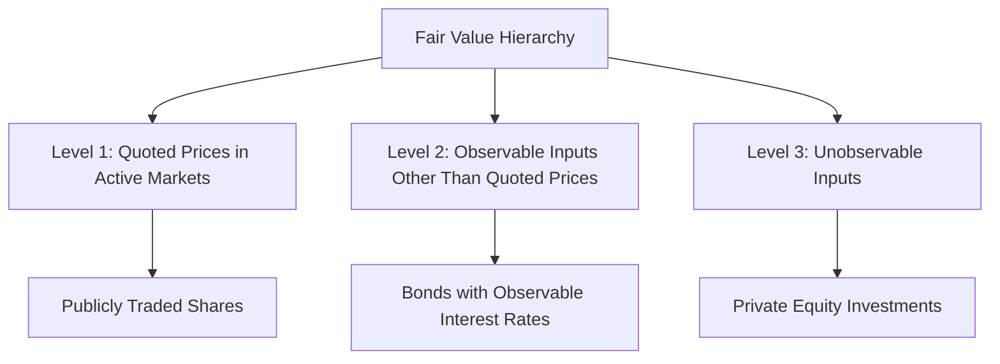

## 16.2 Fair Value Hierarchy

In the realm of business combinations and consolidated financial statements, understanding the fair value hierarchy is crucial. This hierarchy, as outlined in IFRS 13 and ASC 820, provides a framework for measuring fair value and ensures consistency and transparency in financial reporting. This section will delve into the intricacies of the fair value hierarchy, offering insights into its application, challenges, and implications for accounting professionals preparing for Canadian accounting exams.

### Understanding Fair Value

Fair value is a market-based measurement, not an entity-specific measurement. It represents the price that would be received to sell an asset or paid to transfer a liability in an orderly transaction between market participants at the measurement date. The fair value hierarchy categorizes the inputs used in valuation techniques into three levels, reflecting the degree of market observability.

### The Three Levels of Fair Value Hierarchy

#### Level 1: Quoted Prices in Active Markets

Level 1 inputs are the most reliable and objective, consisting of quoted prices in active markets for identical assets or liabilities. These inputs are directly observable and provide the most accurate representation of fair value. Examples include stock prices on major exchanges and commodity prices in active markets.

- **Characteristics of Level 1 Inputs:**
  - Highly liquid and transparent.
  - Little to no adjustment required.
  - Directly observable in active markets.

- **Practical Example:**
  - A company holding publicly traded shares would use the current market price as the fair value measurement.

#### Level 2: Observable Inputs Other Than Quoted Prices

Level 2 inputs are those that are observable either directly or indirectly, but do not qualify as Level 1 inputs. These inputs include quoted prices for similar assets or liabilities in active markets, quoted prices for identical or similar assets in inactive markets, and other market-corroborated inputs.

- **Characteristics of Level 2 Inputs:**
  - Require some adjustments based on observable data.
  - Include interest rates, yield curves, and credit spreads.

- **Practical Example:**
  - Valuing a bond using observable interest rates and yield curves that are not directly quoted in an active market.

#### Level 3: Unobservable Inputs

Level 3 inputs are the least reliable and involve significant management judgment. These inputs are unobservable and are used when observable inputs are not available. They often involve internal data, assumptions, and estimates.

- **Characteristics of Level 3 Inputs:**
  - Based on management's assumptions and estimates.
  - Require significant adjustments and disclosures.
  - Used when there is little or no market activity.

- **Practical Example:**
  - Valuing a private equity investment using discounted cash flow analysis based on projected financial performance.

### Application of Fair Value Hierarchy in Business Combinations

In business combinations, the fair value hierarchy plays a vital role in the allocation of the purchase price to the identifiable assets acquired and liabilities assumed. Accurate fair value measurement ensures that the financial statements reflect the true economic value of the acquired business.

#### Steps in Applying Fair Value Hierarchy:

1. **Identify the Assets and Liabilities:**
   - Determine the assets acquired and liabilities assumed in the business combination.

2. **Determine the Appropriate Level:**
   - Classify each asset and liability into the appropriate level of the fair value hierarchy based on the availability and reliability of inputs.

3. **Select Valuation Techniques:**
   - Choose suitable valuation techniques that align with the level of inputs. Common techniques include market approach, income approach, and cost approach.

4. **Measure Fair Value:**
   - Apply the chosen valuation techniques to measure the fair value of each asset and liability.

5. **Disclose Fair Value Measurements:**
   - Provide comprehensive disclosures about the fair value measurements, including the level of inputs used and any significant assumptions or estimates.

### Challenges and Best Practices

#### Challenges in Fair Value Measurement:

- **Subjectivity in Level 3 Measurements:**
  - High reliance on management's judgment can lead to variability and potential bias.

- **Market Volatility:**
  - Fluctuations in market conditions can impact the reliability of fair value measurements.

- **Complexity of Valuation Techniques:**
  - Selecting and applying appropriate valuation techniques require expertise and understanding of the underlying assumptions.

#### Best Practices for Fair Value Measurement:

- **Enhance Transparency:**
  - Provide detailed disclosures about the inputs and assumptions used in fair value measurements.

- **Regularly Review Assumptions:**
  - Continuously assess and update assumptions to reflect current market conditions.

- **Engage Valuation Experts:**
  - Utilize external valuation specialists to ensure objectivity and accuracy in complex valuations.

### Regulatory Framework and Compliance

#### IFRS 13: Fair Value Measurement

IFRS 13 establishes a single framework for measuring fair value and requires disclosures about fair value measurements. It emphasizes the use of market-based measurements and provides guidance on the application of the fair value hierarchy.

- **Key Requirements:**
  - Use of the highest and best use concept for non-financial assets.
  - Consideration of market participants' perspectives.
  - Comprehensive disclosures about fair value measurements.

#### ASC 820: Fair Value Measurement

ASC 820, similar to IFRS 13, provides a framework for measuring fair value in U.S. GAAP. It defines fair value, establishes a hierarchy of inputs, and requires disclosures to enhance transparency and comparability.

- **Key Requirements:**
  - Emphasis on exit price notion.
  - Use of market-based inputs.
  - Detailed disclosures about valuation techniques and inputs.

### Practical Examples and Case Studies

#### Example 1: Valuation of a Publicly Traded Company

A Canadian company acquires a publicly traded U.S. company. The fair value of the acquired company's shares is determined using Level 1 inputs, as the shares are actively traded on the New York Stock Exchange.

#### Example 2: Valuation of a Private Company

A Canadian firm acquires a private technology startup. The fair value of the startup's intangible assets, such as patents and trademarks, is measured using Level 3 inputs due to the lack of observable market data.

#### Case Study: Impact of Market Volatility on Fair Value Measurements

During an economic downturn, a Canadian manufacturing company faces challenges in valuing its inventory and fixed assets. The company must adjust its fair value measurements to reflect the current market conditions, using Level 2 and Level 3 inputs where necessary.

### Diagrams and Visual Aids

To enhance understanding, the following diagram illustrates the fair value hierarchy and its application in business combinations:

### Conclusion

The fair value hierarchy is a fundamental concept in business combinations and consolidated financial statements. By understanding and applying the hierarchy, accounting professionals can ensure accurate and transparent financial reporting. As you prepare for Canadian accounting exams, focus on mastering the fair value hierarchy, its application, and the associated challenges and best practices.

### References and Further Reading

- **IFRS 13: Fair Value Measurement**
- **ASC 820: Fair Value Measurement**
- **CPA Canada Handbook**
- **International Valuation Standards Council (IVSC)**
- **Financial Accounting Standards Board (FASB)**

### Ready to Test Your Knowledge?



### What is the primary characteristic of Level 1 inputs in the fair value hierarchy?

- [x] Quoted prices in active markets for identical assets or liabilities
- [ ] Observable inputs other than quoted prices
- [ ] Unobservable inputs
- [ ] Management assumptions and estimates

> **Explanation:** Level 1 inputs are characterized by quoted prices in active markets for identical assets or liabilities, providing the most reliable fair value measurements.

### Which level of the fair value hierarchy involves significant management judgment?

- [ ] Level 1
- [ ] Level 2
- [x] Level 3
- [ ] None of the above

> **Explanation:** Level 3 inputs involve significant management judgment as they are unobservable and require assumptions and estimates.

### What is a common valuation technique used for Level 2 inputs?

- [ ] Discounted cash flow analysis
- [x] Market approach using observable interest rates
- [ ] Quoted prices in active markets
- [ ] Internal data and assumptions

> **Explanation:** Level 2 inputs often use the market approach, utilizing observable interest rates and yield curves.

### How does IFRS 13 define fair value?

- [x] The price received to sell an asset or paid to transfer a liability in an orderly transaction between market participants
- [ ] The historical cost of an asset or liability
- [ ] The book value of an asset or liability
- [ ] The replacement cost of an asset

> **Explanation:** IFRS 13 defines fair value as the price received to sell an asset or paid to transfer a liability in an orderly transaction between market participants.

### What is the main focus of ASC 820 in fair value measurement?

- [ ] Historical cost
- [x] Exit price notion
- [ ] Replacement cost
- [ ] Book value

> **Explanation:** ASC 820 focuses on the exit price notion, emphasizing market-based inputs for fair value measurement.

### Which level of inputs would be used to value a private equity investment?

- [ ] Level 1
- [ ] Level 2
- [x] Level 3
- [ ] None of the above

> **Explanation:** Private equity investments are typically valued using Level 3 inputs due to the lack of observable market data.

### What is a key challenge in using Level 3 inputs?

- [ ] High liquidity
- [ ] Direct observability
- [x] Subjectivity and potential bias
- [ ] Transparency

> **Explanation:** Level 3 inputs are subjective and can lead to potential bias due to reliance on management's assumptions.

### What does the fair value hierarchy aim to enhance in financial reporting?

- [ ] Complexity
- [x] Consistency and transparency
- [ ] Subjectivity
- [ ] Historical cost

> **Explanation:** The fair value hierarchy aims to enhance consistency and transparency in financial reporting by categorizing inputs based on observability.

### Which of the following is a Level 2 input example?

- [ ] Publicly traded stock prices
- [x] Quoted prices for similar assets in inactive markets
- [ ] Management estimates
- [ ] Internal data

> **Explanation:** Level 2 inputs include quoted prices for similar assets in inactive markets, requiring some adjustments.

### True or False: Fair value is an entity-specific measurement.

- [ ] True
- [x] False

> **Explanation:** Fair value is a market-based measurement, not an entity-specific measurement, reflecting the price in an orderly transaction between market participants.


