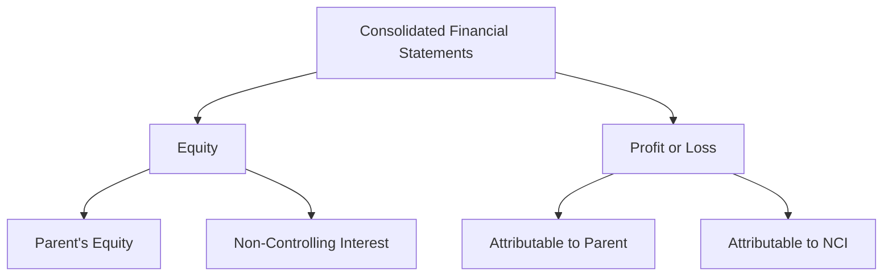

## 18.2 Business Combination with Non-Controlling Interest

Business combinations often involve acquiring a controlling interest in another entity, which may result in the presence of non-controlling interests (NCI). This section delves into the complexities of accounting for NCIs, focusing on their measurement, presentation, and the implications for consolidated financial statements. Understanding these concepts is crucial for Canadian accounting exams and professional practice.

### Understanding Non-Controlling Interest

**Non-Controlling Interest (NCI)** represents the equity in a subsidiary not attributable to the parent company. In a business combination, the parent acquires control over the subsidiary, but not necessarily 100% ownership. The remaining equity interest held by other shareholders is classified as NCI.

#### Key Concepts:
- **Control**: The ability to direct the relevant activities of the subsidiary, typically achieved through ownership of more than 50% of the voting shares.
- **Equity**: The residual interest in the assets of the subsidiary after deducting liabilities, which includes both the parent’s interest and NCI.
- **Consolidation**: The process of combining the financial statements of the parent and its subsidiaries into a single set of financial statements.

### Measurement of Non-Controlling Interest

The measurement of NCI is a critical aspect of preparing consolidated financial statements. Under IFRS, there are two primary methods for measuring NCI at the acquisition date:

1. **Fair Value Method**: NCI is measured at its fair value, which reflects the market value of the NCI at the acquisition date.
2. **Proportionate Share of Net Assets Method**: NCI is measured as the proportionate share of the subsidiary’s identifiable net assets.

#### Example:
Consider a scenario where a parent company acquires 80% of a subsidiary. The identifiable net assets of the subsidiary are valued at $1,000,000. The NCI can be measured as follows:

- **Fair Value Method**: If the fair value of the NCI is determined to be $250,000, this amount is recorded as NCI.
- **Proportionate Share Method**: NCI is 20% of the identifiable net assets, i.e., $200,000.

### Presentation of Non-Controlling Interest in Financial Statements

NCI is presented in the consolidated financial statements as a separate component of equity. The presentation includes:

- **Consolidated Statement of Financial Position**: NCI is shown within equity, distinct from the equity attributable to the parent.
- **Consolidated Statement of Profit or Loss**: The share of profit or loss attributable to NCI is presented separately from the profit or loss attributable to the parent.

#### Diagram: Presentation of NCI in Consolidated Financial Statements

### Case Study: Business Combination with Non-Controlling Interest

#### Background:
Company A acquires 75% of Company B, a manufacturing firm, for $3,000,000. The fair value of Company B’s identifiable net assets is $3,600,000. The fair value of the NCI is determined to be $1,200,000.

#### Steps in Accounting for the Business Combination:

1. **Identify the Acquirer**: Company A is the acquirer as it gains control over Company B.
2. **Determine the Acquisition Date**: The date on which Company A obtains control over Company B.
3. **Measure the Consideration Transferred**: $3,000,000 paid by Company A.
4. **Recognize and Measure Identifiable Assets and Liabilities**: Company B’s net assets are valued at $3,600,000.
5. **Measure Non-Controlling Interest**: Using the fair value method, NCI is $1,200,000.
6. **Calculate Goodwill**: 
   - Total consideration = $3,000,000 (paid) + $1,200,000 (NCI) = $4,200,000
   - Goodwill = Total consideration - Fair value of net assets = $4,200,000 - $3,600,000 = $600,000

#### Journal Entries:
- **Record the Acquisition**:
  - Dr. Identifiable Net Assets $3,600,000
  - Dr. Goodwill $600,000
  - Cr. Cash $3,000,000
  - Cr. Non-Controlling Interest $1,200,000

### Implications for Financial Reporting

The presence of NCI affects several aspects of financial reporting:

- **Equity Section**: NCI is reported separately within equity, affecting the overall equity structure.
- **Profit Allocation**: Profits and losses are allocated between the parent and NCI, impacting the reported earnings attributable to the parent.
- **Disclosures**: Additional disclosures are required to provide information about the NCI, including its share of profits, dividends, and any changes in ownership interests.

### Challenges and Best Practices

#### Common Challenges:
- **Valuation of NCI**: Determining the fair value of NCI can be complex, requiring professional judgment and market analysis.
- **Profit Allocation**: Accurately allocating profits and losses between the parent and NCI can be challenging, especially in complex group structures.
- **Regulatory Compliance**: Ensuring compliance with IFRS and Canadian GAAP standards requires thorough understanding and application of the relevant guidelines.

#### Best Practices:
- **Use of Valuation Experts**: Engage valuation experts to accurately assess the fair value of NCI.
- **Regular Review and Adjustment**: Periodically review and adjust the allocation of profits and losses to reflect changes in ownership interests.
- **Comprehensive Disclosures**: Provide detailed disclosures to enhance transparency and meet regulatory requirements.

### Practical Examples and Scenarios

#### Example 1: Changes in Ownership Interests
Company A initially acquires 60% of Company B. Later, it acquires an additional 20%, increasing its ownership to 80%. The NCI is adjusted to reflect the new ownership structure.

#### Example 2: Losses Attributable to NCI
In a year where the subsidiary incurs a loss, the loss is allocated between the parent and NCI based on their respective ownership interests. This allocation affects the equity attributable to both parties.

### Exam Preparation Tips

- **Understand Key Concepts**: Focus on understanding the concepts of control, NCI measurement, and profit allocation.
- **Practice Calculations**: Work through examples and practice problems to master the calculation of NCI and goodwill.
- **Review Standards**: Familiarize yourself with the relevant IFRS and Canadian GAAP standards, focusing on sections related to business combinations and NCI.

### Conclusion

Accounting for business combinations with non-controlling interests is a complex but essential aspect of financial reporting. By understanding the measurement and presentation of NCI, you can accurately prepare consolidated financial statements and comply with Canadian accounting standards. This knowledge is not only crucial for exam success but also for professional practice in the field of accounting.

## **Ready to Test Your Knowledge?**



### What is Non-Controlling Interest (NCI)?

- [x] The equity in a subsidiary not attributable to the parent company.
- [ ] The total equity of the parent company.
- [ ] The liabilities of the subsidiary.
- [ ] The assets of the parent company.

> **Explanation:** NCI represents the portion of equity in a subsidiary that is not owned by the parent company.

### How is NCI measured under the Fair Value Method?

- [x] At its fair value at the acquisition date.
- [ ] As the book value of the subsidiary's net assets.
- [ ] As the historical cost of the subsidiary's assets.
- [ ] As the market value of the parent company's shares.

> **Explanation:** The Fair Value Method measures NCI at its fair value at the acquisition date, reflecting the market value.

### Where is NCI presented in the consolidated financial statements?

- [x] As a separate component of equity.
- [ ] As a liability.
- [ ] As an asset.
- [ ] As part of the parent company's equity.

> **Explanation:** NCI is presented as a separate component of equity in the consolidated financial statements.

### What is the purpose of allocating profit or loss to NCI?

- [x] To reflect the share of profit or loss attributable to the non-controlling shareholders.
- [ ] To increase the parent company's profit.
- [ ] To reduce the subsidiary's liabilities.
- [ ] To adjust the parent company's assets.

> **Explanation:** Allocating profit or loss to NCI ensures that the financial statements accurately reflect the share of profit or loss attributable to non-controlling shareholders.

### Which method measures NCI as the proportionate share of the subsidiary’s net assets?

- [x] Proportionate Share of Net Assets Method
- [ ] Fair Value Method
- [ ] Historical Cost Method
- [ ] Equity Method

> **Explanation:** The Proportionate Share of Net Assets Method measures NCI as the proportionate share of the subsidiary’s identifiable net assets.

### What is the impact of NCI on the equity section of the consolidated statement of financial position?

- [x] NCI is reported separately within equity.
- [ ] NCI is combined with liabilities.
- [ ] NCI is deducted from assets.
- [ ] NCI is included in the parent company's equity.

> **Explanation:** NCI is reported separately within equity, affecting the overall equity structure of the consolidated statement of financial position.

### How are losses allocated between the parent and NCI?

- [x] Based on their respective ownership interests.
- [ ] Equally between the parent and NCI.
- [ ] Entirely to the parent company.
- [ ] Entirely to the NCI.

> **Explanation:** Losses are allocated between the parent and NCI based on their respective ownership interests.

### What is a common challenge in accounting for NCI?

- [x] Valuation of NCI
- [ ] Recording liabilities
- [ ] Calculating depreciation
- [ ] Determining tax rates

> **Explanation:** Valuation of NCI can be complex and requires professional judgment and market analysis.

### Which IFRS standard is primarily concerned with business combinations and NCI?

- [x] IFRS 3
- [ ] IFRS 9
- [ ] IFRS 15
- [ ] IFRS 16

> **Explanation:** IFRS 3 is the standard that deals with business combinations and the accounting for NCI.

### True or False: NCI is always measured at fair value.

- [ ] True
- [x] False

> **Explanation:** NCI can be measured at fair value or as the proportionate share of the subsidiary’s net assets, depending on the method chosen.


