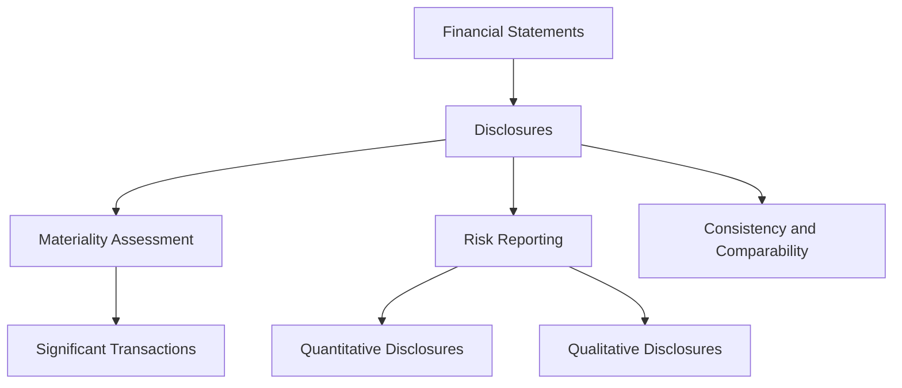

## 19.5 Inadequate Disclosures in Consolidated Financial Statements

In the realm of consolidated financial statements and business combinations, disclosures play a pivotal role in ensuring transparency, compliance, and the provision of useful information to stakeholders. Inadequate disclosures can lead to significant risks, including regulatory penalties, loss of investor confidence, and potential legal ramifications. This section delves into the intricacies of financial statement disclosures, focusing on the Canadian context, and highlights best practices to avoid common pitfalls.

### Understanding Financial Statement Disclosures

Financial statement disclosures are supplementary notes that accompany the primary financial statements. They provide additional context, detail, and explanation of the figures presented, ensuring that users of the financial statements have a comprehensive understanding of the company's financial position and performance.

#### Key Objectives of Disclosures

1. **Transparency:** Disclosures aim to provide a clear and complete picture of the company's financial health, enabling stakeholders to make informed decisions.
2. **Compliance:** Adherence to accounting standards such as IFRS and GAAP is crucial. Disclosures ensure that the financial statements meet the regulatory requirements.
3. **Risk Management:** By providing detailed information, disclosures help in identifying and managing potential risks associated with the company's operations and financial dealings.

### Regulatory Framework for Disclosures

In Canada, financial statement disclosures must comply with the International Financial Reporting Standards (IFRS) as adopted by the Canadian Accounting Standards Board (AcSB). The IFRS framework emphasizes the importance of providing relevant, reliable, and comparable information to users.

#### Key IFRS Standards for Disclosures

- **IFRS 3: Business Combinations** - Requires disclosures about the nature and financial effects of business combinations.
- **IFRS 10: Consolidated Financial Statements** - Mandates disclosures related to the basis of consolidation and the nature of the relationship between the parent and subsidiaries.
- **IAS 1: Presentation of Financial Statements** - Outlines the overall requirements for financial statement presentation, including disclosures.

### Common Pitfalls in Disclosures

1. **Omission of Material Information:** Failing to disclose significant transactions or events can mislead stakeholders and result in non-compliance with regulatory standards.
2. **Lack of Clarity:** Disclosures that are overly complex or vague can confuse users, reducing the usefulness of the financial statements.
3. **Inconsistency:** Discrepancies between the disclosures and the primary financial statements can raise red flags for auditors and regulators.
4. **Inadequate Risk Disclosure:** Not providing sufficient information about financial risks, such as credit risk, liquidity risk, and market risk, can leave stakeholders unprepared for potential adverse outcomes.

### Best Practices for Effective Disclosures

1. **Materiality Assessment:** Evaluate the significance of financial information to determine what should be disclosed. Materiality is context-specific and should be assessed from the perspective of the financial statement users.
   
2. **Clear and Concise Language:** Use straightforward language to explain complex financial information. Avoid jargon unless it is defined and necessary for understanding.

3. **Consistency and Comparability:** Ensure that disclosures are consistent with the financial statements and comparable across reporting periods.

4. **Comprehensive Risk Reporting:** Provide detailed information on financial risks, including quantitative and qualitative disclosures, to give stakeholders a complete understanding of the company's risk profile.

5. **Regular Updates and Reviews:** Continuously review and update disclosures to reflect changes in accounting standards, business operations, and economic conditions.

### Practical Examples and Case Studies

#### Case Study: Inadequate Disclosure in a Business Combination

Consider a scenario where Company A acquires Company B. The acquisition involves complex financial instruments and contingent liabilities. Company A's initial disclosures fail to adequately explain the valuation methods used for these instruments and the potential impact of the contingent liabilities. As a result, stakeholders are left with an incomplete understanding of the acquisition's financial implications.

**Solution:** Company A revises its disclosures to include detailed explanations of the valuation techniques, assumptions used, and the potential financial impact of the contingent liabilities. This enhances transparency and compliance with IFRS 3 requirements.

### Real-World Applications and Regulatory Scenarios

In practice, inadequate disclosures can lead to significant regulatory scrutiny. The Canadian Securities Administrators (CSA) regularly review financial statements for compliance with disclosure requirements. Companies found to have inadequate disclosures may face penalties, restatement of financial statements, and damage to their reputation.

#### Example: CSA Review and Recommendations

The CSA conducted a review of financial statements and found that many companies failed to adequately disclose the impact of COVID-19 on their financial performance and position. The CSA recommended that companies provide more detailed disclosures on the assumptions and estimates used in preparing the financial statements, as well as the potential impact of the pandemic on future operations.

### Step-by-Step Guidance for Preparing Disclosures

1. **Identify Disclosure Requirements:** Review relevant accounting standards and regulatory guidelines to determine the specific disclosure requirements for your financial statements.

2. **Gather and Analyze Data:** Collect the necessary financial and non-financial information to support the disclosures. This may involve collaboration with various departments within the organization.

3. **Draft Disclosures:** Prepare draft disclosures that clearly and concisely present the required information. Ensure that the language is accessible to all users of the financial statements.

4. **Review and Revise:** Conduct a thorough review of the draft disclosures to ensure accuracy, completeness, and compliance with regulatory standards. Make revisions as necessary.

5. **Obtain Approval:** Seek approval from senior management and the board of directors for the final disclosures. This step ensures that all stakeholders are aligned on the information presented.

6. **Publish and Communicate:** Include the approved disclosures in the financial statements and communicate them to stakeholders through appropriate channels.

### Diagrams and Visual Aids

To enhance understanding, consider using diagrams and tables to illustrate complex disclosure requirements and the relationships between different financial statement elements.

### Common Challenges and Strategies to Overcome Them

- **Challenge:** Keeping up with changes in accounting standards and regulatory requirements.
  - **Strategy:** Establish a dedicated team to monitor and implement changes in accounting standards and regulations. Regularly train staff on new requirements.

- **Challenge:** Ensuring consistency across multiple reporting entities in a consolidated group.
  - **Strategy:** Develop standardized templates and guidelines for disclosures to ensure consistency across all entities.

### References and Additional Resources

- **CPA Canada:** Provides resources and guidance on financial reporting and disclosures.
- **IFRS Foundation:** Offers comprehensive information on IFRS standards and updates.
- **Canadian Securities Administrators (CSA):** Publishes guidelines and reviews on financial statement disclosures.

### Encouragement and Exam Preparation Tips

Preparing for the Canadian Accounting Exams requires a thorough understanding of disclosure requirements and the ability to apply them in practice. Focus on understanding the principles behind disclosures, practice drafting disclosures for various scenarios, and stay updated on changes in accounting standards.

### Summary and Key Points

- Inadequate disclosures can lead to significant risks, including regulatory penalties and loss of stakeholder trust.
- Effective disclosures are clear, concise, consistent, and compliant with regulatory standards.
- Regularly review and update disclosures to reflect changes in accounting standards and business operations.
- Use practical examples and case studies to illustrate key points and enhance understanding.

## **Ready to Test Your Knowledge?**



### What is the primary objective of financial statement disclosures?

- [x] To provide transparency and additional context to the financial statements
- [ ] To reduce the length of financial statements
- [ ] To replace the primary financial statements
- [ ] To confuse stakeholders

> **Explanation:** The primary objective of financial statement disclosures is to provide transparency and additional context, ensuring stakeholders have a comprehensive understanding of the company's financial position and performance.

### Which IFRS standard specifically addresses disclosures related to business combinations?

- [x] IFRS 3
- [ ] IFRS 10
- [ ] IAS 1
- [ ] IFRS 15

> **Explanation:** IFRS 3 specifically addresses disclosures related to business combinations, including the nature and financial effects of such transactions.

### What is a common pitfall in financial statement disclosures?

- [x] Omission of material information
- [ ] Over-disclosure of irrelevant details
- [ ] Consistency across reporting periods
- [ ] Use of clear and concise language

> **Explanation:** A common pitfall in financial statement disclosures is the omission of material information, which can mislead stakeholders and result in non-compliance with regulatory standards.

### How can companies ensure consistency in their disclosures?

- [x] By using standardized templates and guidelines
- [ ] By frequently changing disclosure formats
- [ ] By avoiding the use of templates
- [ ] By not reviewing disclosures regularly

> **Explanation:** Companies can ensure consistency in their disclosures by using standardized templates and guidelines, which help maintain uniformity across reporting periods and entities.

### What is the role of materiality in financial statement disclosures?

- [x] To determine the significance of information to be disclosed
- [ ] To increase the volume of disclosures
- [ ] To eliminate the need for disclosures
- [ ] To reduce the importance of disclosures

> **Explanation:** Materiality plays a crucial role in determining the significance of information to be disclosed, ensuring that only relevant and important information is included in the financial statements.

### Why is it important to provide comprehensive risk reporting in disclosures?

- [x] To give stakeholders a complete understanding of the company's risk profile
- [ ] To reduce the length of the financial statements
- [ ] To avoid regulatory compliance
- [ ] To confuse stakeholders

> **Explanation:** Comprehensive risk reporting in disclosures is important to give stakeholders a complete understanding of the company's risk profile, helping them make informed decisions.

### What should companies do to keep up with changes in accounting standards?

- [x] Establish a dedicated team to monitor and implement changes
- [ ] Ignore changes in accounting standards
- [ ] Rely solely on external auditors
- [ ] Avoid training staff on new requirements

> **Explanation:** Companies should establish a dedicated team to monitor and implement changes in accounting standards, ensuring compliance and up-to-date financial reporting.

### What is the consequence of inadequate disclosures in financial statements?

- [x] Regulatory penalties and loss of stakeholder trust
- [ ] Increased investor confidence
- [ ] Improved financial performance
- [ ] Enhanced reputation

> **Explanation:** Inadequate disclosures can lead to regulatory penalties and loss of stakeholder trust, as they may result in non-compliance and mislead stakeholders.

### How can companies enhance the clarity of their disclosures?

- [x] By using straightforward language and avoiding jargon
- [ ] By using complex and technical language
- [ ] By omitting explanations
- [ ] By increasing the volume of disclosures

> **Explanation:** Companies can enhance the clarity of their disclosures by using straightforward language and avoiding jargon, making the information accessible to all users.

### True or False: Disclosures are supplementary notes that replace the primary financial statements.

- [ ] True
- [x] False

> **Explanation:** False. Disclosures are supplementary notes that accompany the primary financial statements, providing additional context and explanation, but they do not replace the primary financial statements.



