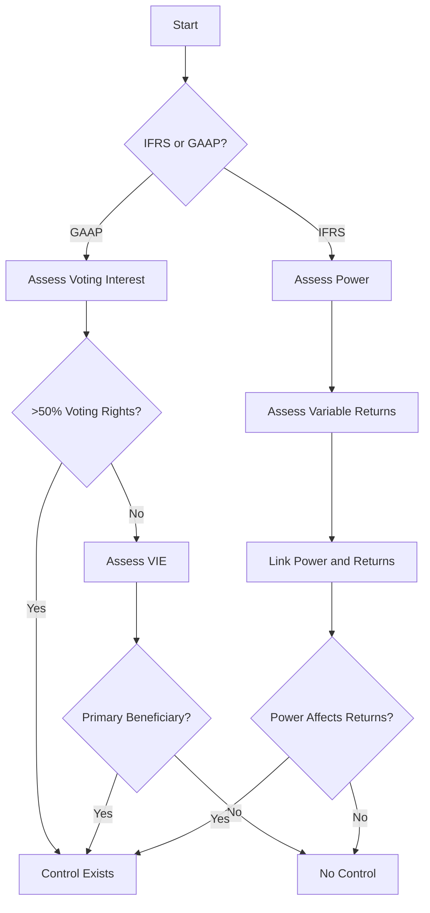

## 3.4 Definition of Control under IFRS and GAAP

Understanding the concept of control is pivotal in the preparation of consolidated financial statements, as it determines which entities are included in the consolidation. Both the International Financial Reporting Standards (IFRS) and the Generally Accepted Accounting Principles (GAAP) provide frameworks for defining control, but they approach it differently. This section will delve into the intricacies of how control is defined under both IFRS and GAAP, highlighting key differences, practical implications, and examples to aid your understanding.

### Understanding Control in Consolidation

Control is a fundamental concept in consolidation accounting, as it dictates whether a parent company should consolidate a subsidiary. The definition of control affects the scope of consolidated financial statements and has significant implications for financial reporting.

### Control under IFRS

#### IFRS 10: Consolidated Financial Statements

Under IFRS, the concept of control is primarily governed by IFRS 10, "Consolidated Financial Statements." IFRS 10 establishes a single control model that applies to all entities, including special purpose entities. According to IFRS 10, an investor controls an investee when it is exposed, or has rights, to variable returns from its involvement with the investee and has the ability to affect those returns through its power over the investee.

#### Key Elements of Control under IFRS

1. **Power over the Investee**: The investor must have existing rights that give it the current ability to direct the relevant activities of the investee. Relevant activities are those that significantly affect the investee's returns.

2. **Exposure or Rights to Variable Returns**: The investor must be exposed, or have rights, to variable returns from its involvement with the investee. Variable returns can be positive, negative, or both.

3. **Ability to Use Power to Affect Returns**: The investor must have the ability to use its power to affect the amount of the investor's returns. This involves a linkage between power and returns.

#### Practical Example

Consider a scenario where Company A holds a 40% interest in Company B. Despite not having a majority stake, Company A has the right to appoint the majority of the board of directors of Company B, which directs the relevant activities. Additionally, Company A is exposed to variable returns through dividends and potential capital appreciation. In this case, under IFRS 10, Company A would likely be considered to have control over Company B and would need to consolidate Company B in its financial statements.

### Control under GAAP

#### ASC Topic 810: Consolidation

In the United States, GAAP defines control primarily through ASC Topic 810, "Consolidation." The concept of control under GAAP is more rule-based compared to the principle-based approach of IFRS. Under GAAP, control is generally presumed when a company owns more than 50% of the voting rights of another entity. However, there are exceptions, particularly concerning variable interest entities (VIEs).

#### Key Elements of Control under GAAP

1. **Voting Interest Model**: Control is typically established through ownership of more than 50% of the voting rights. This model is straightforward and applies to most entities.

2. **Variable Interest Entity (VIE) Model**: For entities that do not have typical voting structures, control is determined based on the primary beneficiary of the VIE. The primary beneficiary is the party with the power to direct the activities that most significantly impact the VIE's economic performance and the obligation to absorb losses or the right to receive benefits.

#### Practical Example

Imagine Company X owns 60% of the voting shares of Company Y. Under the voting interest model of GAAP, Company X would consolidate Company Y because it has control through its majority voting interest. Alternatively, if Company X has a significant influence over a VIE, it would need to assess whether it is the primary beneficiary to determine if consolidation is required.

### Comparing IFRS and GAAP

While both IFRS and GAAP aim to identify control for consolidation purposes, their approaches differ significantly:

- **Principle vs. Rule-Based**: IFRS adopts a principle-based approach, focusing on the substance of control through power, returns, and the ability to affect returns. GAAP, on the other hand, is more rule-based, with clear thresholds for voting interest and specific guidelines for VIEs.

- **Flexibility and Judgment**: IFRS requires more judgment and analysis to determine control, as it considers the broader context of power and returns. GAAP provides more explicit criteria, which can reduce the need for judgment but may not capture all scenarios where control exists.

- **Application to Special Entities**: Both frameworks address special entities like VIEs, but the criteria and processes for determining control differ, reflecting the underlying philosophies of each standard.

### Real-World Applications and Implications

Understanding the definition of control under IFRS and GAAP is crucial for accountants and financial professionals, especially those involved in mergers and acquisitions, financial reporting, and auditing. The determination of control affects not only the scope of consolidation but also the presentation and disclosure of financial information.

#### Case Study: Cross-Border Acquisition

Consider a Canadian company acquiring a foreign entity. The Canadian company must assess control under IFRS, considering its power over the foreign entity's relevant activities, its exposure to variable returns, and its ability to affect those returns. If the foreign entity operates in a jurisdiction that follows GAAP, the Canadian company must also understand the GAAP criteria for control to ensure compliance with local reporting requirements.

### Diagrams and Visual Aids

To further illustrate the concept of control under IFRS and GAAP, consider the following diagram that outlines the decision-making process for determining control under each framework:

### Best Practices and Common Pitfalls

- **Best Practices**: Regularly review and update control assessments, especially when there are changes in ownership, governance, or the economic environment. Ensure thorough documentation of the decision-making process and the rationale for control determinations.

- **Common Pitfalls**: Misjudging the link between power and returns under IFRS, overlooking potential VIEs under GAAP, and failing to reassess control in response to changes in circumstances.

### Conclusion

The definition of control is a cornerstone of consolidation accounting, with significant implications for financial reporting. By understanding the nuances of control under IFRS and GAAP, you can ensure accurate and compliant financial statements. As you prepare for the Canadian Accounting Exams, focus on the principles and criteria outlined in this guide, and practice applying them to various scenarios.

## **Ready to Test Your Knowledge?**



### Which standard governs the definition of control under IFRS?

- [x] IFRS 10
- [ ] IFRS 9
- [ ] IFRS 15
- [ ] IFRS 16

> **Explanation:** IFRS 10, "Consolidated Financial Statements," governs the definition of control under IFRS.

### Under GAAP, control is generally presumed when a company owns more than what percentage of voting rights?

- [ ] 40%
- [x] 50%
- [ ] 60%
- [ ] 70%

> **Explanation:** Under GAAP, control is generally presumed when a company owns more than 50% of the voting rights.

### What is the primary focus of IFRS in determining control?

- [ ] Voting rights
- [x] Power, returns, and ability to affect returns
- [ ] Financial performance
- [ ] Market share

> **Explanation:** IFRS focuses on power, returns, and the ability to affect returns in determining control.

### Which model under GAAP applies to entities without typical voting structures?

- [ ] Voting Interest Model
- [x] Variable Interest Entity Model
- [ ] Equity Method
- [ ] Cost Method

> **Explanation:** The Variable Interest Entity (VIE) Model under GAAP applies to entities without typical voting structures.

### What is a key difference between IFRS and GAAP in defining control?

- [x] Principle-based vs. rule-based approach
- [ ] Focus on financial performance
- [ ] Use of historical cost
- [ ] Emphasis on market conditions

> **Explanation:** IFRS uses a principle-based approach, while GAAP uses a rule-based approach in defining control.

### In the context of IFRS, what are relevant activities?

- [x] Activities that significantly affect the investee's returns
- [ ] Activities that are routine and operational
- [ ] Activities related to financing
- [ ] Activities concerning compliance

> **Explanation:** Relevant activities are those that significantly affect the investee's returns under IFRS.

### What is the role of the primary beneficiary in a VIE under GAAP?

- [x] Directs activities impacting economic performance and absorbs losses or receives benefits
- [ ] Provides financial support
- [ ] Oversees operational management
- [ ] Conducts audits

> **Explanation:** The primary beneficiary directs activities impacting economic performance and absorbs losses or receives benefits in a VIE under GAAP.

### How does IFRS require control to be assessed?

- [ ] Based on historical financial data
- [x] Through judgment and analysis of power and returns
- [ ] By evaluating market trends
- [ ] Using standardized metrics

> **Explanation:** IFRS requires control to be assessed through judgment and analysis of power and returns.

### What is a common pitfall in determining control under IFRS?

- [x] Misjudging the link between power and returns
- [ ] Overestimating market share
- [ ] Ignoring financial statements
- [ ] Misinterpreting tax regulations

> **Explanation:** A common pitfall is misjudging the link between power and returns under IFRS.

### True or False: GAAP provides more explicit criteria for determining control compared to IFRS.

- [x] True
- [ ] False

> **Explanation:** GAAP provides more explicit criteria for determining control compared to the principle-based approach of IFRS.


