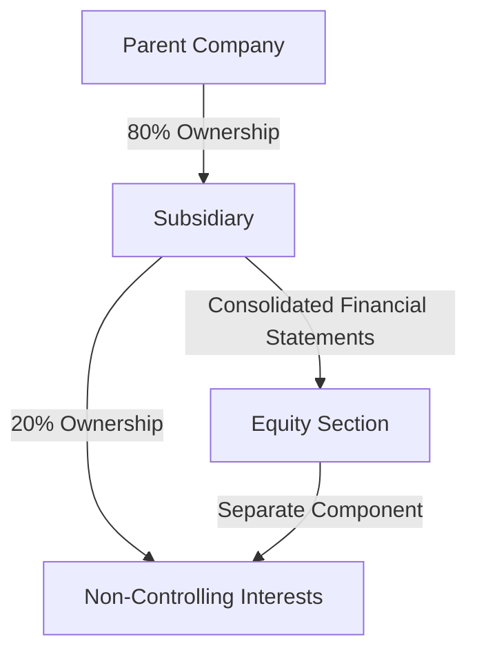

## 3.5 Differences in Accounting for Non-Controlling Interests

In the realm of consolidated financial statements, non-controlling interests (NCI) represent the equity in a subsidiary not attributable directly or indirectly to a parent company. Understanding the differences in accounting for NCI under International Financial Reporting Standards (IFRS) and Generally Accepted Accounting Principles (GAAP) is crucial for accountants, especially those preparing for Canadian accounting exams. This section delves into the variances in measurement, presentation, and disclosure of NCI between these two major accounting frameworks.

### Understanding Non-Controlling Interests

Before diving into the differences, it's essential to grasp what non-controlling interests entail. NCI, also known as minority interests, arise when a parent company owns less than 100% of a subsidiary. In consolidated financial statements, NCI represents the portion of equity in the subsidiary not owned by the parent company. This equity interest is crucial for accurately reflecting the financial position and performance of the entire group.

### IFRS vs. GAAP: Key Differences

#### Measurement of Non-Controlling Interests

**IFRS Approach:**

Under IFRS, specifically IFRS 10, NCI can be measured using either the fair value method or the proportionate share of the subsidiary's net identifiable assets. The choice between these methods allows for flexibility, but it also requires careful judgment to ensure that the financial statements reflect the true economic interest of the non-controlling shareholders.

- **Fair Value Method:** This method involves measuring NCI at the fair value of the subsidiary's identifiable net assets at the acquisition date. It provides a comprehensive view of the subsidiary's value, including goodwill attributable to NCI.
- **Proportionate Share Method:** Here, NCI is measured based on the proportionate share of the subsidiary's net identifiable assets. This method excludes any goodwill attributable to the NCI, potentially leading to a lower valuation of NCI compared to the fair value method.

**GAAP Approach:**

Under U.S. GAAP, as outlined in ASC Topic 810, NCI is measured at fair value. This approach aligns with the fair value method under IFRS, ensuring that NCI reflects the market value of the subsidiary's net assets. However, unlike IFRS, GAAP does not offer the option to measure NCI using the proportionate share method, leading to a more standardized approach across entities.

#### Presentation of Non-Controlling Interests

**IFRS Presentation:**

In IFRS financial statements, NCI is presented as a separate component of equity in the consolidated balance sheet. This presentation highlights the distinction between the equity attributable to the parent and that attributable to non-controlling shareholders. Additionally, the share of profit or loss attributable to NCI is presented separately in the consolidated income statement, ensuring transparency in the distribution of earnings.

**GAAP Presentation:**

Similarly, under GAAP, NCI is presented as a separate component of equity in the consolidated balance sheet. The share of net income attributable to NCI is also separately disclosed in the consolidated income statement. This consistency in presentation between IFRS and GAAP facilitates comparability for users of financial statements.

#### Disclosure Requirements

**IFRS Disclosures:**

IFRS requires comprehensive disclosures related to NCI, including the nature and extent of significant restrictions on the ability of subsidiaries to transfer funds to the parent. Additionally, IFRS mandates disclosure of the proportion of ownership interests held by NCI and the accumulated balances of NCI at the end of the reporting period. These disclosures provide users with insights into the financial relationships within the group.

**GAAP Disclosures:**

GAAP also emphasizes the importance of disclosures related to NCI. Entities must disclose the amount of consolidated net income attributable to NCI and the accumulated balances of NCI at the end of the reporting period. Furthermore, GAAP requires disclosure of any restrictions on the ability of subsidiaries to transfer funds to the parent, ensuring transparency in financial reporting.

### Practical Examples and Case Studies

To illustrate these differences, consider a hypothetical scenario where a Canadian parent company acquires an 80% interest in a subsidiary. Under IFRS, the company can choose to measure NCI using either the fair value method or the proportionate share method. If the fair value method is chosen, NCI will include the fair value of the subsidiary's identifiable net assets, including goodwill attributable to NCI. Conversely, under GAAP, the company must measure NCI at fair value, aligning with the IFRS fair value method.

### Real-World Applications and Regulatory Scenarios

In practice, the choice of measurement method under IFRS can significantly impact the reported financial position and performance of the group. For instance, using the proportionate share method may result in lower reported NCI, affecting key financial ratios and potentially influencing stakeholder perceptions. Therefore, accountants must carefully consider the implications of their chosen method and ensure compliance with applicable standards.

### Step-by-Step Guidance for Accounting Procedures

1. **Identify the Subsidiary and Determine Ownership Percentage:** Begin by identifying the subsidiary and calculating the percentage of ownership held by the parent company. This step is crucial for determining the extent of NCI.

2. **Choose the Measurement Method (IFRS Only):** If reporting under IFRS, decide whether to measure NCI using the fair value method or the proportionate share method. Consider the implications of each method on the financial statements.

3. **Measure NCI at Acquisition Date:** Calculate NCI at the acquisition date using the chosen method. Ensure that the measurement reflects the fair value of the subsidiary's net assets, including any attributable goodwill.

4. **Present NCI in Financial Statements:** Present NCI as a separate component of equity in the consolidated balance sheet. Disclose the share of profit or loss attributable to NCI in the consolidated income statement.

5. **Provide Comprehensive Disclosures:** Ensure that all required disclosures related to NCI are included in the financial statements. This includes information on ownership interests, restrictions on fund transfers, and accumulated balances of NCI.

### Diagrams and Visual Aids

To enhance understanding, consider the following diagram illustrating the presentation of NCI in consolidated financial statements:

### Best Practices, Common Pitfalls, and Strategies

- **Best Practices:** Ensure consistency in the measurement and presentation of NCI across reporting periods. Regularly review and update disclosures to reflect changes in ownership interests or restrictions on fund transfers.

- **Common Pitfalls:** Avoid inconsistencies in the measurement of NCI, particularly when transitioning between IFRS and GAAP. Ensure that all required disclosures are included to prevent potential compliance issues.

- **Strategies:** Develop a comprehensive understanding of the differences between IFRS and GAAP to ensure accurate and compliant financial reporting. Consider the implications of each measurement method on key financial metrics and stakeholder perceptions.

### References and Additional Resources

For further exploration of NCI accounting, consider the following resources:

- IFRS 10: Consolidated Financial Statements
- ASC Topic 810: Consolidation
- CPA Canada Handbook – Accounting
- Deloitte’s IFRS and US GAAP: A Pocket Comparison
- KPMG’s Guide to Consolidation

### Summary and Key Points

In summary, understanding the differences in accounting for non-controlling interests under IFRS and GAAP is crucial for accurate and compliant financial reporting. Key differences include the measurement methods available under IFRS, the presentation of NCI in financial statements, and the comprehensive disclosure requirements under both frameworks. By mastering these differences, accountants can ensure that their financial statements accurately reflect the economic interests of non-controlling shareholders.

---

## **Ready to Test Your Knowledge?**



### Which method is NOT available under IFRS for measuring non-controlling interests?

- [ ] Fair value method
- [ ] Proportionate share method
- [x] Historical cost method
- [ ] Full goodwill method

> **Explanation:** IFRS allows the use of the fair value method and the proportionate share method for measuring non-controlling interests, but not the historical cost method.

### Under GAAP, non-controlling interests are measured at:

- [x] Fair value
- [ ] Proportionate share
- [ ] Historical cost
- [ ] Book value

> **Explanation:** GAAP requires non-controlling interests to be measured at fair value, aligning with the fair value method under IFRS.

### How are non-controlling interests presented in the consolidated balance sheet under IFRS?

- [x] As a separate component of equity
- [ ] As a liability
- [ ] As an asset
- [ ] As part of retained earnings

> **Explanation:** Under IFRS, non-controlling interests are presented as a separate component of equity in the consolidated balance sheet.

### What is a key disclosure requirement for non-controlling interests under both IFRS and GAAP?

- [x] Restrictions on fund transfers
- [ ] Historical cost of assets
- [ ] Future cash flows
- [ ] Market value of shares

> **Explanation:** Both IFRS and GAAP require disclosure of any restrictions on the ability of subsidiaries to transfer funds to the parent.

### Which of the following is NOT a common pitfall in accounting for non-controlling interests?

- [ ] Inconsistent measurement
- [ ] Incomplete disclosures
- [x] Overstating liabilities
- [ ] Misclassification in financial statements

> **Explanation:** Common pitfalls include inconsistent measurement and incomplete disclosures, but overstating liabilities is not specific to non-controlling interests.

### What is the impact of choosing the proportionate share method under IFRS?

- [ ] Higher reported NCI
- [x] Lower reported NCI
- [ ] No impact on NCI
- [ ] Increases liabilities

> **Explanation:** The proportionate share method may result in lower reported NCI as it excludes goodwill attributable to NCI.

### Which standard outlines the requirements for non-controlling interests under GAAP?

- [ ] IFRS 10
- [ ] IAS 27
- [x] ASC Topic 810
- [ ] FASB 133

> **Explanation:** ASC Topic 810 outlines the requirements for non-controlling interests under GAAP.

### What is the primary benefit of using the fair value method for measuring NCI?

- [x] Comprehensive view of subsidiary's value
- [ ] Simplicity in calculation
- [ ] Consistency with historical cost
- [ ] Avoids goodwill recognition

> **Explanation:** The fair value method provides a comprehensive view of the subsidiary's value, including goodwill attributable to NCI.

### True or False: Under IFRS, companies must always use the fair value method to measure non-controlling interests.

- [ ] True
- [x] False

> **Explanation:** Under IFRS, companies have the option to use either the fair value method or the proportionate share method to measure non-controlling interests.

### Which of the following is a strategy to ensure accurate reporting of non-controlling interests?

- [x] Regularly review disclosures
- [ ] Ignore changes in ownership interests
- [ ] Use historical cost for measurement
- [ ] Minimize equity presentation

> **Explanation:** Regularly reviewing disclosures ensures that all required information is included and reflects any changes in ownership interests or restrictions.


