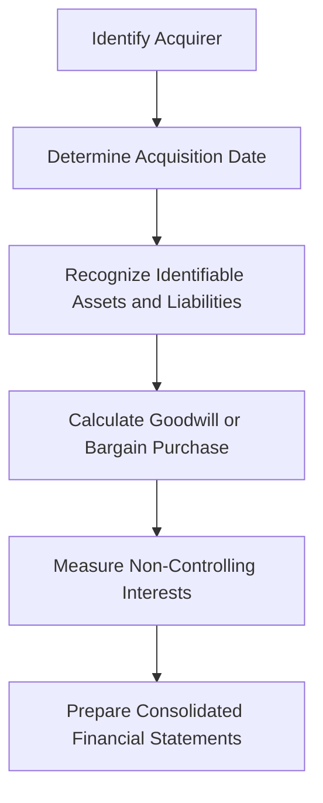

## 4.1 Overview of the Acquisition Method

The acquisition method is the cornerstone of accounting for business combinations, providing a structured approach to recognizing and measuring the assets acquired, liabilities assumed, and any non-controlling interest in the acquired entity. This method is mandated by both International Financial Reporting Standards (IFRS) and Generally Accepted Accounting Principles (GAAP) in Canada, ensuring consistency and transparency in financial reporting.

### **Understanding the Acquisition Method**

The acquisition method is designed to reflect the economic reality of a business combination by recognizing the fair value of the acquired entity's assets and liabilities at the acquisition date. This approach ensures that the financial statements of the acquiring company accurately represent the economic resources and obligations resulting from the transaction.

#### **Key Components of the Acquisition Method**

1. **Identification of the Acquirer**: The first step in applying the acquisition method is identifying the acquiring entity. The acquirer is typically the entity that obtains control over the acquiree. Control is defined as having the power to direct the relevant activities of the acquiree, which significantly affects its returns.

2. **Determination of the Acquisition Date**: The acquisition date is the date on which the acquirer obtains control of the acquiree. This date is crucial as it determines the point at which the assets acquired and liabilities assumed are measured at fair value.

3. **Recognition and Measurement of Identifiable Assets and Liabilities**: At the acquisition date, the acquirer must recognize the identifiable assets acquired and liabilities assumed at their fair values. This includes tangible and intangible assets, as well as any contingent liabilities.

4. **Recognition of Goodwill or Bargain Purchase**: Goodwill arises when the consideration transferred exceeds the net identifiable assets acquired. Conversely, a bargain purchase occurs when the net identifiable assets exceed the consideration transferred, resulting in negative goodwill.

5. **Non-Controlling Interests**: The acquirer must also recognize any non-controlling interest in the acquiree, which represents the portion of equity not attributable to the acquirer. This interest can be measured at either fair value or the non-controlling interest's proportionate share of the acquiree's identifiable net assets.

### **Practical Examples and Case Studies**

#### **Example 1: Acquisition of a Technology Company**

Consider a scenario where Company A acquires Company B, a technology firm, for $10 million. At the acquisition date, Company B's identifiable assets are valued at $8 million, and its liabilities are $2 million. The acquisition results in goodwill of $4 million, calculated as follows:

- Consideration Transferred: $10 million
- Fair Value of Identifiable Net Assets: $8 million - $2 million = $6 million
- Goodwill: $10 million - $6 million = $4 million

This example illustrates the recognition of goodwill, highlighting the premium paid by Company A for strategic advantages such as intellectual property and market presence.

#### **Example 2: Bargain Purchase Scenario**

In another scenario, Company C acquires Company D for $5 million. At the acquisition date, Company D's identifiable assets are valued at $7 million, and its liabilities are $1 million. This results in a bargain purchase gain of $1 million, calculated as follows:

- Consideration Transferred: $5 million
- Fair Value of Identifiable Net Assets: $7 million - $1 million = $6 million
- Bargain Purchase Gain: $6 million - $5 million = $1 million

This example demonstrates a situation where the acquirer gains a favorable purchase, often due to distressed sales or strategic negotiations.

### **Regulatory Insights and Compliance**

#### **IFRS 3 and ASC 805**

The acquisition method is governed by IFRS 3, "Business Combinations," and ASC 805 under GAAP. Both standards emphasize the fair value measurement of assets and liabilities at the acquisition date, ensuring that financial statements reflect the true economic impact of the business combination.

#### **Key Differences Between IFRS and GAAP**

While IFRS and GAAP share similar principles in applying the acquisition method, there are notable differences:

- **Measurement of Non-Controlling Interests**: IFRS allows the choice between fair value and the proportionate share of net assets, whereas GAAP mandates fair value measurement.
- **Contingent Consideration**: Under IFRS, contingent consideration is recognized at fair value at the acquisition date, with subsequent changes recognized in profit or loss. GAAP requires remeasurement at fair value, with changes recognized in earnings.

### **Challenges and Best Practices**

#### **Common Challenges**

1. **Fair Value Measurement**: Accurately determining the fair value of acquired assets and liabilities can be complex, particularly for intangible assets and contingent liabilities.
2. **Integration of Acquired Entities**: Post-acquisition integration poses challenges in aligning financial reporting processes and systems.
3. **Regulatory Compliance**: Ensuring compliance with evolving accounting standards and regulatory requirements is critical for accurate financial reporting.

#### **Best Practices**

1. **Thorough Due Diligence**: Conduct comprehensive due diligence to identify all assets and liabilities, including potential contingencies and off-balance-sheet items.
2. **Engage Valuation Experts**: Utilize valuation experts to ensure accurate fair value measurements, particularly for complex assets and liabilities.
3. **Effective Integration Planning**: Develop a detailed integration plan to align financial reporting processes and systems, ensuring seamless consolidation.

### **Real-World Applications**

#### **Case Study: Acquisition of a Retail Chain**

In a real-world example, a large retail conglomerate acquired a smaller chain to expand its market presence. The acquisition method was applied to recognize the fair value of the acquired chain's assets, including inventory, property, and brand value. The transaction resulted in significant goodwill, reflecting the strategic value of the acquired brand and customer base.

### **Step-by-Step Guidance**

1. **Identify the Acquirer**: Determine the entity that gains control over the acquiree.
2. **Determine the Acquisition Date**: Establish the date when control is obtained.
3. **Recognize Identifiable Assets and Liabilities**: Measure at fair value as of the acquisition date.
4. **Calculate Goodwill or Bargain Purchase**: Compare the consideration transferred with the net identifiable assets.
5. **Measure Non-Controlling Interests**: Choose between fair value or proportionate share of net assets.
6. **Prepare Consolidated Financial Statements**: Integrate the acquiree's financials into the acquirer's statements.

### **Diagrams and Visual Aids**

Below is a diagram illustrating the acquisition method process:

### **Conclusion**

The acquisition method is a vital tool for accurately reflecting the economic impact of business combinations in financial statements. By adhering to the principles outlined in IFRS and GAAP, companies can ensure transparency and consistency in reporting, providing stakeholders with a clear view of the financial implications of acquisitions.

### **References and Further Reading**

- **IFRS 3: Business Combinations** - International Accounting Standards Board
- **ASC 805: Business Combinations** - Financial Accounting Standards Board
- **CPA Canada Handbook** - Accounting Standards for Private Enterprises (ASPE)

### **Ready to Test Your Knowledge?**



### What is the primary purpose of the acquisition method in accounting for business combinations?

- [x] To reflect the economic reality of a business combination by recognizing the fair value of acquired assets and liabilities.
- [ ] To eliminate intercompany transactions between the acquirer and acquiree.
- [ ] To measure the historical cost of acquired assets and liabilities.
- [ ] To determine the tax implications of the acquisition.

> **Explanation:** The acquisition method aims to reflect the economic reality of a business combination by recognizing the fair value of acquired assets and liabilities at the acquisition date.

### Which of the following is NOT a key component of the acquisition method?

- [ ] Identification of the acquirer
- [ ] Determination of the acquisition date
- [x] Elimination of intercompany transactions
- [ ] Recognition of goodwill or bargain purchase

> **Explanation:** Elimination of intercompany transactions is not a component of the acquisition method; it is part of the consolidation process.

### How is goodwill calculated in the acquisition method?

- [ ] Fair value of identifiable net assets minus consideration transferred
- [x] Consideration transferred minus fair value of identifiable net assets
- [ ] Fair value of non-controlling interest minus consideration transferred
- [ ] Consideration transferred plus fair value of identifiable net assets

> **Explanation:** Goodwill is calculated as the consideration transferred minus the fair value of identifiable net assets acquired.

### Under IFRS, how can non-controlling interests be measured?

- [x] At fair value or the proportionate share of net assets
- [ ] Only at fair value
- [ ] Only at historical cost
- [ ] At the book value of net assets

> **Explanation:** IFRS allows non-controlling interests to be measured at either fair value or the proportionate share of net assets.

### What is a bargain purchase in the context of the acquisition method?

- [ ] When the consideration transferred equals the fair value of net assets
- [x] When the fair value of net assets exceeds the consideration transferred
- [ ] When goodwill is recognized
- [ ] When the acquisition date is not determined

> **Explanation:** A bargain purchase occurs when the fair value of net assets exceeds the consideration transferred, resulting in negative goodwill.

### Which accounting standard governs the acquisition method under IFRS?

- [x] IFRS 3
- [ ] IFRS 10
- [ ] ASC 805
- [ ] ASPE 1582

> **Explanation:** IFRS 3 governs the acquisition method under International Financial Reporting Standards.

### What is the role of valuation experts in the acquisition method?

- [x] To ensure accurate fair value measurements of complex assets and liabilities
- [ ] To eliminate intercompany transactions
- [ ] To determine the acquisition date
- [ ] To prepare consolidated financial statements

> **Explanation:** Valuation experts are engaged to ensure accurate fair value measurements of complex assets and liabilities in the acquisition method.

### What is the acquisition date in the context of the acquisition method?

- [ ] The date the purchase agreement is signed
- [x] The date the acquirer obtains control of the acquiree
- [ ] The date the financial statements are prepared
- [ ] The date the consideration is paid

> **Explanation:** The acquisition date is the date on which the acquirer obtains control of the acquiree.

### Which of the following is a challenge associated with the acquisition method?

- [x] Fair value measurement of acquired assets and liabilities
- [ ] Determining the acquisition date
- [ ] Identifying the acquirer
- [ ] Preparing consolidated financial statements

> **Explanation:** Fair value measurement of acquired assets and liabilities is a common challenge in applying the acquisition method.

### True or False: Under GAAP, non-controlling interests must be measured at fair value.

- [x] True
- [ ] False

> **Explanation:** Under GAAP, non-controlling interests must be measured at fair value.


