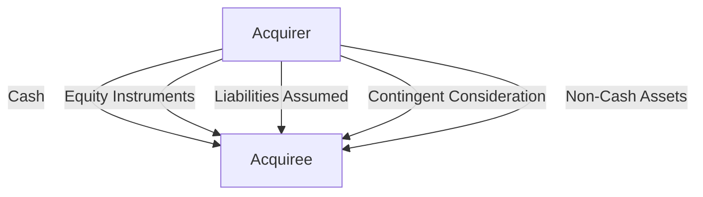

## 4.3 Measurement of Consideration Transferred

In the realm of business combinations, the measurement of consideration transferred is a pivotal aspect that can significantly impact the financial statements of the acquiring entity. Understanding how to accurately measure the fair value of consideration paid is crucial for accountants and financial professionals, especially those preparing for Canadian accounting exams. This section delves into the principles, methodologies, and practical applications of measuring consideration transferred, offering a comprehensive guide to mastering this complex topic.

### Understanding Consideration Transferred

**Consideration Transferred** refers to the aggregate of all assets given, liabilities incurred, and equity interests issued by the acquirer in exchange for control of the acquiree. The measurement of this consideration is essential for determining the cost of the business combination and subsequently affects the recognition and measurement of goodwill or a bargain purchase gain.

#### Key Components of Consideration Transferred

1. **Cash and Cash Equivalents**: The most straightforward form of consideration, involving direct payment to the acquiree's shareholders.

2. **Equity Instruments**: Shares or other equity interests issued by the acquirer as part of the transaction. These must be measured at fair value at the acquisition date.

3. **Liabilities Assumed**: Any obligations the acquirer takes on as part of the transaction, such as debt or contingent liabilities.

4. **Contingent Consideration**: Additional payments contingent on future events or performance metrics. These require careful estimation and can be complex to measure.

5. **Non-Cash Assets**: Assets other than cash or cash equivalents transferred as part of the consideration, such as property or equipment.

### Fair Value Measurement

The fair value of consideration transferred is determined at the acquisition date and is a critical component of the acquisition method. Fair value is defined as the price that would be received to sell an asset or paid to transfer a liability in an orderly transaction between market participants at the measurement date.

#### Fair Value Hierarchy

The fair value measurement process involves a hierarchy of inputs, categorized into three levels:

- **Level 1**: Quoted prices in active markets for identical assets or liabilities.
- **Level 2**: Observable inputs other than quoted prices, such as interest rates or yield curves.
- **Level 3**: Unobservable inputs, relying on the entity's own assumptions.

#### Valuation Techniques

To measure the fair value of consideration transferred, several valuation techniques can be employed:

- **Market Approach**: Uses prices and other relevant information generated by market transactions involving identical or comparable assets or liabilities.
  
- **Income Approach**: Converts future amounts (e.g., cash flows or income and expenses) to a single present value amount, reflecting current market expectations.

- **Cost Approach**: Reflects the amount that would be required currently to replace the service capacity of an asset.

### Practical Examples and Case Studies

#### Example 1: Cash and Equity Instruments

Consider a scenario where Company A acquires Company B for $10 million in cash and issues 500,000 shares valued at $20 per share. The total consideration transferred is calculated as follows:

- Cash: $10,000,000
- Equity Instruments: 500,000 shares x $20 = $10,000,000

**Total Consideration Transferred**: $20,000,000

#### Example 2: Contingent Consideration

Company C agrees to pay an additional $5 million to the shareholders of Company D if certain revenue targets are met within two years. The fair value of this contingent consideration at the acquisition date is estimated to be $3 million, based on probability-weighted outcomes and discounting future payments.

**Total Consideration Transferred**: Initial payment + Fair value of contingent consideration

### Regulatory Insights and Standards

#### IFRS 3 and ASC 805

Both IFRS 3 (International Financial Reporting Standards) and ASC 805 (Accounting Standards Codification) provide guidance on business combinations, emphasizing the importance of fair value measurement of consideration transferred.

- **IFRS 3**: Requires the acquirer to measure the fair value of consideration transferred at the acquisition date, including any contingent consideration.

- **ASC 805**: Aligns closely with IFRS 3, with specific guidance on measuring contingent consideration and the use of fair value.

#### Canadian Context

In Canada, the adoption of IFRS means that the principles outlined in IFRS 3 are applicable to public companies. Private enterprises may follow Accounting Standards for Private Enterprises (ASPE), which also provides guidance on business combinations but may differ in certain respects.

### Challenges and Best Practices

#### Common Pitfalls

1. **Misvaluation of Contingent Consideration**: Estimating the fair value of contingent consideration can be challenging due to the inherent uncertainty and reliance on future events.

2. **Incorrect Measurement of Equity Instruments**: Failing to accurately measure the fair value of equity instruments issued can lead to significant discrepancies in financial reporting.

3. **Overlooking Non-Cash Assets**: Non-cash assets transferred as consideration must be carefully evaluated to ensure they are measured at fair value.

#### Strategies to Overcome Challenges

- **Use of Professional Valuators**: Engaging valuation experts can provide more accurate and reliable fair value measurements, particularly for complex instruments.

- **Regular Review and Adjustment**: Continuously reviewing and adjusting estimates for contingent consideration as new information becomes available can help maintain accuracy.

- **Comprehensive Documentation**: Maintaining detailed documentation of assumptions, methodologies, and inputs used in fair value measurements supports transparency and compliance.

### Step-by-Step Guidance

#### Step 1: Identify Components of Consideration

Begin by identifying all components of consideration transferred, including cash, equity instruments, liabilities, and any contingent consideration.

#### Step 2: Determine Fair Value

Apply appropriate valuation techniques to measure the fair value of each component. Consider using the fair value hierarchy to guide the selection of inputs.

#### Step 3: Aggregate Consideration

Sum the fair values of all components to determine the total consideration transferred.

#### Step 4: Record and Disclose

Record the consideration transferred in the financial statements and provide necessary disclosures, including the valuation techniques and assumptions used.

### Diagrams and Visuals

To enhance understanding, consider the following diagram illustrating the flow of consideration transferred in a business combination:

### Conclusion

The measurement of consideration transferred is a fundamental aspect of accounting for business combinations. By understanding the principles of fair value measurement and applying appropriate valuation techniques, accountants can ensure accurate and compliant financial reporting. This knowledge is not only crucial for passing Canadian accounting exams but also for succeeding in professional practice.

### References and Further Reading

- **IFRS 3 - Business Combinations**: [IFRS Foundation](https://www.ifrs.org/issued-standards/list-of-standards/ifrs-3-business-combinations/)
- **ASC 805 - Business Combinations**: [FASB](https://www.fasb.org/jsp/FASB/Page/SectionPage&cid=1218220137031)
- **CPA Canada Handbook**: [CPA Canada](https://www.cpacanada.ca/en/business-and-accounting-resources/financial-and-non-financial-reporting/international-financial-reporting-standards-ifrs)

### **Ready to Test Your Knowledge?**



### What is the primary purpose of measuring the consideration transferred in a business combination?

- [x] To determine the cost of the business combination and recognize goodwill or a bargain purchase gain
- [ ] To assess the financial health of the acquiree
- [ ] To evaluate the market position of the acquirer
- [ ] To calculate the tax liabilities of the acquirer

> **Explanation:** Measuring the consideration transferred helps determine the cost of the business combination, which is crucial for recognizing goodwill or a bargain purchase gain.

### Which of the following is NOT a component of consideration transferred?

- [ ] Cash and cash equivalents
- [ ] Equity instruments
- [ ] Liabilities assumed
- [x] Future revenue projections

> **Explanation:** Future revenue projections are not part of the consideration transferred; they may influence contingent consideration but are not transferred directly.

### What is the fair value hierarchy used for?

- [x] To categorize inputs used in fair value measurement
- [ ] To determine the acquisition date
- [ ] To identify the acquirer
- [ ] To allocate goodwill

> **Explanation:** The fair value hierarchy categorizes inputs into levels based on their observability, guiding the fair value measurement process.

### Which valuation technique converts future amounts to a single present value?

- [ ] Market Approach
- [x] Income Approach
- [ ] Cost Approach
- [ ] Equity Method

> **Explanation:** The income approach converts future amounts, such as cash flows, to a single present value, reflecting current market expectations.

### How should contingent consideration be measured?

- [x] At fair value at the acquisition date
- [ ] Based on historical costs
- [ ] At nominal value
- [ ] Using book value

> **Explanation:** Contingent consideration should be measured at fair value at the acquisition date, considering probability-weighted outcomes and discounting future payments.

### What is a common challenge in measuring consideration transferred?

- [x] Misvaluation of contingent consideration
- [ ] Overestimating cash payments
- [ ] Underestimating equity instruments
- [ ] Ignoring liabilities

> **Explanation:** Misvaluation of contingent consideration is a common challenge due to its reliance on future events and inherent uncertainty.

### Which standard provides guidance on business combinations in Canada?

- [x] IFRS 3
- [ ] ASC 805
- [ ] ASPE 1000
- [ ] CPA 200

> **Explanation:** IFRS 3 provides guidance on business combinations in Canada, applicable to public companies following IFRS.

### What is the first step in measuring consideration transferred?

- [x] Identify all components of consideration
- [ ] Determine fair value
- [ ] Aggregate consideration
- [ ] Record and disclose

> **Explanation:** The first step is to identify all components of consideration, including cash, equity instruments, liabilities, and contingent consideration.

### Which approach reflects the amount required to replace the service capacity of an asset?

- [ ] Market Approach
- [ ] Income Approach
- [x] Cost Approach
- [ ] Equity Method

> **Explanation:** The cost approach reflects the amount that would be required currently to replace the service capacity of an asset.

### True or False: The fair value of equity instruments issued is measured at the book value at the acquisition date.

- [ ] True
- [x] False

> **Explanation:** The fair value of equity instruments issued is measured at fair value, not book value, at the acquisition date.


