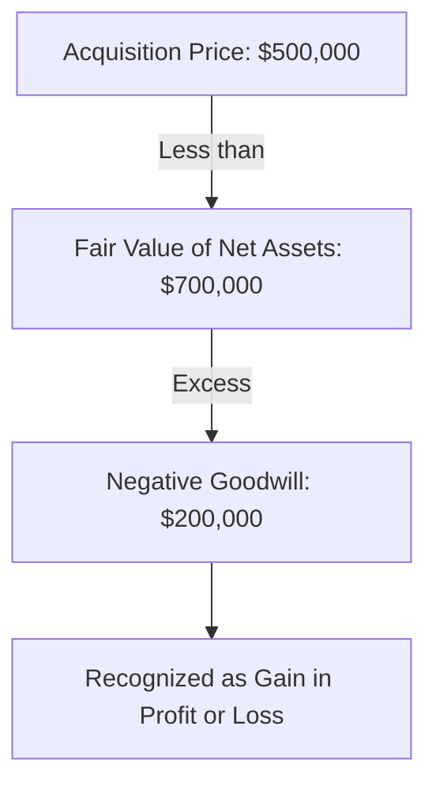

## 4.6 Bargain Purchases (Negative Goodwill)

In the realm of business combinations, a **bargain purchase** occurs when the acquirer pays less than the fair value of the net identifiable assets acquired. This situation results in what is known as **negative goodwill**. While less common than transactions resulting in positive goodwill, bargain purchases present unique challenges and opportunities in accounting. This section will delve into the accounting treatment of bargain purchases, offering insights into recognition, measurement, and disclosure, as well as practical examples relevant to Canadian accounting standards.

### Understanding Bargain Purchases

A bargain purchase arises when the total consideration transferred by the acquirer is less than the fair value of the net identifiable assets acquired. This discrepancy can occur due to various reasons, such as a distressed sale, a strategic decision by the seller, or errors in valuation. In accounting terms, this results in negative goodwill, which must be recognized and accounted for according to specific standards.

### Accounting Standards Governing Bargain Purchases

#### IFRS and ASPE

Under **International Financial Reporting Standards (IFRS)**, specifically IFRS 3, and **Accounting Standards for Private Enterprises (ASPE)** in Canada, the accounting treatment for bargain purchases is clearly outlined. Both frameworks require that any excess of the fair value of the net identifiable assets over the consideration transferred should be recognized immediately in profit or loss as a gain from a bargain purchase.

#### GAAP

In the United States, **Generally Accepted Accounting Principles (GAAP)** also provide guidance on bargain purchases under ASC Topic 805. Similar to IFRS, the excess is recognized as a gain in the income statement.

### Recognition and Measurement

#### Steps in Recognizing a Bargain Purchase

1. **Identify the Acquirer**: Determine which entity has obtained control over the acquiree.
2. **Determine the Acquisition Date**: Establish the date on which the acquirer gains control.
3. **Measure the Consideration Transferred**: Calculate the total consideration paid, including cash, equity instruments, and any contingent consideration.
4. **Identify and Measure the Fair Value of Net Assets Acquired**: Assess the fair value of all identifiable assets and liabilities acquired.
5. **Calculate the Difference**: Subtract the consideration transferred from the fair value of net identifiable assets.
6. **Recognize the Gain**: If the result is positive, recognize the gain immediately in profit or loss.

#### Fair Value Measurement

The fair value measurement of net identifiable assets is crucial in determining whether a bargain purchase has occurred. This involves:

- **Valuation Techniques**: Utilize market, income, or cost approaches to determine fair values.
- **Fair Value Hierarchy**: Prioritize observable inputs over unobservable inputs to enhance reliability.
- **Non-Observable Inputs**: Use judgment and estimation techniques for assets and liabilities with no active market.

### Practical Example

Consider a scenario where Company A acquires Company B, a distressed entity, for $500,000. The fair value of Company B's net identifiable assets is $700,000. The excess of $200,000 ($700,000 - $500,000) represents negative goodwill, which Company A must recognize as a gain in its income statement.

### Disclosure Requirements

Both IFRS and ASPE mandate specific disclosures for bargain purchases to ensure transparency and provide users of financial statements with relevant information. These disclosures typically include:

- **Description of the Bargain Purchase**: Explain the circumstances leading to the bargain purchase.
- **Amount of Gain Recognized**: Clearly state the amount of gain recognized in the financial statements.
- **Impact on Financial Position**: Discuss how the gain affects the financial position and performance of the acquirer.

### Challenges and Considerations

#### Valuation Challenges

Accurately valuing the net identifiable assets is often challenging, particularly in distressed sales where market conditions may not reflect true asset values. It is essential to apply rigorous valuation techniques and consider all available information to ensure fair value measurements are reliable.

#### Regulatory Scrutiny

Bargain purchases may attract regulatory scrutiny, as they can indicate potential manipulation or errors in valuation. It is crucial for entities to maintain thorough documentation and justification for their valuations and the resulting gain recognition.

#### Strategic Implications

From a strategic perspective, bargain purchases can offer significant opportunities for acquirers to enhance their financial position. However, they also require careful consideration of integration challenges and potential risks associated with acquiring distressed or undervalued assets.

### Best Practices for Accounting for Bargain Purchases

1. **Conduct Comprehensive Due Diligence**: Ensure thorough investigation and analysis of the acquiree's financial position and asset valuations.
2. **Engage Valuation Experts**: Utilize external valuation experts to enhance the reliability of fair value measurements.
3. **Document Assumptions and Judgments**: Maintain detailed records of all assumptions and judgments used in the valuation process.
4. **Ensure Compliance with Standards**: Adhere strictly to the relevant accounting standards and disclosure requirements.
5. **Monitor Post-Acquisition Performance**: Regularly assess the performance of acquired assets to identify any potential impairment or integration issues.

### Common Pitfalls and How to Avoid Them

- **Misvaluation of Assets**: Ensure accurate and reliable valuation techniques are employed to avoid misvaluation.
- **Inadequate Documentation**: Maintain comprehensive documentation to support valuations and gain recognition.
- **Failure to Recognize Gain**: Ensure timely recognition of the gain in accordance with accounting standards.
- **Overlooking Disclosure Requirements**: Provide all necessary disclosures to comply with regulatory requirements and enhance transparency.

### Exam Focus

For Canadian accounting exams, understanding the intricacies of bargain purchases is crucial. Candidates should be familiar with:

- **Recognition and Measurement**: Know the steps and calculations involved in recognizing a bargain purchase.
- **Disclosure Requirements**: Understand the necessary disclosures and their importance.
- **Practical Application**: Be able to apply knowledge to practical scenarios and case studies.
- **Regulatory Compliance**: Recognize the importance of adhering to accounting standards and regulations.

### Conclusion

Bargain purchases, while less common, offer unique opportunities and challenges in the context of business combinations. By understanding the accounting treatment, recognition, and disclosure requirements, you can effectively navigate these transactions and ensure compliance with Canadian accounting standards. As you prepare for your exams, focus on mastering the concepts and applying them to practical scenarios to enhance your understanding and confidence.

## **Ready to Test Your Knowledge?**



### What is a bargain purchase?

- [x] When the purchase price is less than the fair value of net assets acquired
- [ ] When the purchase price is equal to the fair value of net assets acquired
- [ ] When the purchase price is more than the fair value of net assets acquired
- [ ] When the purchase price is unknown

> **Explanation:** A bargain purchase occurs when the acquirer pays less than the fair value of the net identifiable assets acquired, resulting in negative goodwill.

### How is negative goodwill recognized in financial statements?

- [x] As a gain in profit or loss
- [ ] As a liability
- [ ] As an asset
- [ ] As equity

> **Explanation:** Negative goodwill is recognized as a gain in profit or loss according to IFRS and ASPE standards.

### Which accounting standard governs bargain purchases under IFRS?

- [x] IFRS 3
- [ ] IFRS 10
- [ ] IFRS 15
- [ ] IFRS 9

> **Explanation:** IFRS 3 provides the guidance for accounting for business combinations, including bargain purchases.

### What is the first step in recognizing a bargain purchase?

- [x] Identify the acquirer
- [ ] Measure the consideration transferred
- [ ] Calculate the difference
- [ ] Recognize the gain

> **Explanation:** The first step is to identify the acquirer, which is the entity that obtains control over the acquiree.

### What is a common challenge in accounting for bargain purchases?

- [x] Valuation of net identifiable assets
- [ ] Recognizing goodwill
- [ ] Measuring liabilities
- [ ] Calculating taxes

> **Explanation:** Accurately valuing the net identifiable assets is often challenging, particularly in distressed sales.

### How should the gain from a bargain purchase be disclosed?

- [x] In the notes to the financial statements
- [ ] On the balance sheet
- [ ] In the cash flow statement
- [ ] In the management report

> **Explanation:** Disclosure of the gain should be made in the notes to the financial statements, explaining the circumstances and impact.

### What is a strategic implication of a bargain purchase?

- [x] Opportunity to enhance financial position
- [ ] Increase in liabilities
- [ ] Decrease in equity
- [ ] Reduction in cash flow

> **Explanation:** Bargain purchases can offer significant opportunities for acquirers to enhance their financial position.

### What should be done to ensure compliance with accounting standards?

- [x] Adhere strictly to relevant standards and disclosure requirements
- [ ] Ignore valuation techniques
- [ ] Delay recognition of gains
- [ ] Avoid documentation

> **Explanation:** Compliance with accounting standards and disclosure requirements is crucial for accurate financial reporting.

### Which of the following is a best practice for accounting for bargain purchases?

- [x] Engage valuation experts
- [ ] Avoid due diligence
- [ ] Ignore post-acquisition performance
- [ ] Delay gain recognition

> **Explanation:** Engaging valuation experts can enhance the reliability of fair value measurements and ensure accurate accounting.

### True or False: Bargain purchases are more common than transactions resulting in positive goodwill.

- [ ] True
- [x] False

> **Explanation:** Bargain purchases are less common than transactions resulting in positive goodwill.


