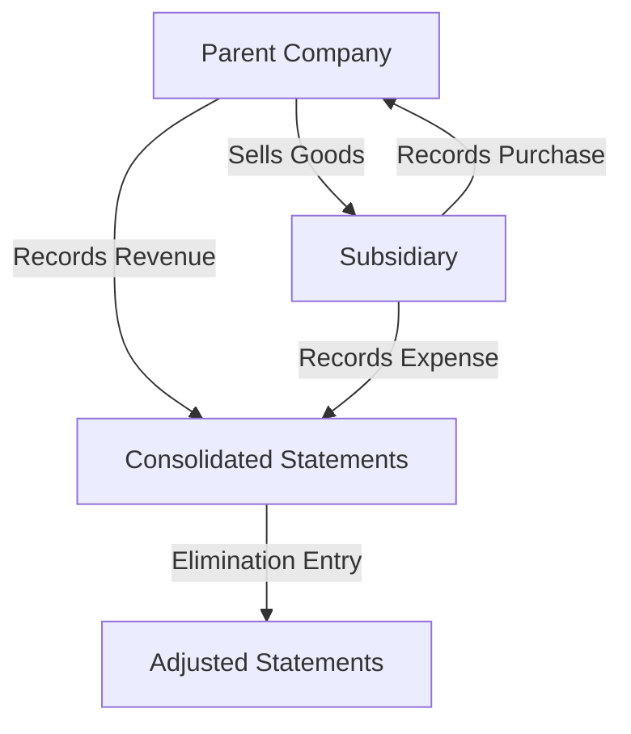

## 6.2 Elimination of Intercompany Transactions

In the realm of consolidated financial statements, the elimination of intercompany transactions is a critical process that ensures the financial reports of a parent company and its subsidiaries reflect the economic reality of the group as a single economic entity. This section delves into the principles, procedures, and practical applications of eliminating intercompany transactions, a topic of paramount importance for Canadian accounting exams and professional practice.

### Understanding Intercompany Transactions

Intercompany transactions occur between entities within the same corporate group. These transactions can include sales of goods and services, loans, dividends, and other financial arrangements. While these transactions are legitimate and often necessary for operational efficiency, they can distort the financial position and performance of the group if not properly eliminated during consolidation.

#### Types of Intercompany Transactions

1. **Sales and Purchases:** Transactions involving the sale of goods or services between group entities.
2. **Loans and Advances:** Financial transactions where one entity lends money to another within the group.
3. **Dividends:** Distribution of profits from a subsidiary to its parent company.
4. **Interest and Royalties:** Payments for the use of intellectual property or borrowed funds.
5. **Asset Transfers:** Transfers of fixed assets between group entities.

### The Need for Elimination

The primary objective of eliminating intercompany transactions is to avoid double counting and ensure that the consolidated financial statements present a true and fair view of the group's financial position. Intercompany transactions can inflate revenues, expenses, assets, and liabilities, leading to misleading financial information if not eliminated.

#### Key Principles

- **Avoid Double Counting:** Ensure that revenues and expenses are not overstated.
- **Reflect Economic Reality:** Present the group as a single economic entity.
- **Compliance with Standards:** Adhere to IFRS and GAAP requirements for consolidation.

### Consolidation Process and Elimination Entries

The consolidation process involves combining the financial statements of the parent and its subsidiaries. Elimination entries are adjustments made to remove the effects of intercompany transactions. These entries are crucial for achieving accurate consolidated financial statements.

#### Steps in the Elimination Process

1. **Identify Intercompany Transactions:** Review the financial statements of each entity to identify intercompany transactions.
2. **Record Elimination Entries:** Make journal entries to eliminate the effects of these transactions.
3. **Adjust Consolidated Financial Statements:** Ensure that the consolidated statements reflect the elimination entries.

#### Example of Elimination Entries

Consider a scenario where a parent company sells goods to its subsidiary. The sale is recorded as revenue by the parent and as an expense by the subsidiary. To eliminate this transaction, the following entries are made:

- **Debit:** Sales Revenue (Parent)
- **Credit:** Cost of Goods Sold (Subsidiary)

This entry removes the intercompany sale from the consolidated income statement, ensuring that the revenue and expense are not double-counted.

### Practical Examples and Case Studies

#### Example 1: Intercompany Sales

Company A (parent) sells inventory to Company B (subsidiary) for $100,000. The cost of the inventory to Company A was $70,000. In the consolidated financial statements, the intercompany sale and the corresponding cost of goods sold must be eliminated.

**Elimination Entry:**

- Debit: Sales Revenue $100,000
- Credit: Cost of Goods Sold $70,000
- Credit: Inventory $30,000 (to adjust inventory to its original cost)

#### Example 2: Intercompany Loans

Company X (parent) provides a loan of $500,000 to Company Y (subsidiary). The interest on the loan is $25,000. In the consolidated financial statements, both the loan and the interest must be eliminated.

**Elimination Entry:**

- Debit: Interest Income $25,000
- Credit: Interest Expense $25,000
- Debit: Loan Payable $500,000
- Credit: Loan Receivable $500,000

### Challenges and Best Practices

#### Common Challenges

1. **Complex Transactions:** Large groups may have numerous and complex intercompany transactions.
2. **Currency Differences:** Transactions in different currencies require careful handling.
3. **Timing Differences:** Transactions recorded in different periods can complicate elimination.

#### Best Practices

- **Regular Reconciliation:** Conduct regular reconciliations of intercompany accounts.
- **Clear Documentation:** Maintain clear documentation of all intercompany transactions.
- **Use of Technology:** Leverage accounting software to automate and track intercompany transactions.

### Regulatory Framework and Standards

#### IFRS and GAAP Requirements

Both IFRS and GAAP provide guidelines for the elimination of intercompany transactions. IFRS 10 and ASC Topic 810 outline the requirements for consolidated financial statements, emphasizing the need for elimination entries.

#### Compliance Considerations

- **IFRS 10:** Requires the elimination of all intercompany transactions and balances.
- **ASC Topic 810:** Similar requirements under U.S. GAAP, with specific guidance on the treatment of non-controlling interests.

### Diagrams and Visual Aids

To aid understanding, the following diagram illustrates the flow of intercompany transactions and their elimination in the consolidation process:

### Conclusion

The elimination of intercompany transactions is a fundamental aspect of preparing consolidated financial statements. By understanding and applying the principles and procedures outlined in this section, you will be well-equipped to handle this critical area of accounting, both in your exams and in professional practice.

### References and Further Reading

- **IFRS 10: Consolidated Financial Statements**
- **ASC Topic 810: Consolidation**
- **CPA Canada Handbook**
- **Accounting Standards for Private Enterprises (ASPE)**

### Practice Questions and Exercises

To reinforce your understanding, attempt the following practice questions and exercises. These will help you apply the concepts and techniques discussed in this section.

## **Ready to Test Your Knowledge?**



### What is the primary objective of eliminating intercompany transactions in consolidated financial statements?

- [x] To avoid double counting and present a true and fair view of the group's financial position.
- [ ] To increase the revenue of the parent company.
- [ ] To decrease the expenses of the subsidiary.
- [ ] To enhance the profitability of the group.

> **Explanation:** The elimination of intercompany transactions ensures that revenues, expenses, assets, and liabilities are not overstated, presenting a true and fair view of the group's financial position.

### Which of the following is NOT a type of intercompany transaction?

- [ ] Sales and Purchases
- [ ] Loans and Advances
- [ ] Dividends
- [x] External Sales

> **Explanation:** External sales involve transactions with parties outside the corporate group and are not considered intercompany transactions.

### In the elimination process, what is the first step?

- [x] Identify intercompany transactions.
- [ ] Record elimination entries.
- [ ] Adjust consolidated financial statements.
- [ ] Prepare financial statements.

> **Explanation:** The first step in the elimination process is to identify intercompany transactions within the group.

### What is the elimination entry for intercompany sales of $100,000 with a cost of goods sold of $70,000?

- [x] Debit: Sales Revenue $100,000; Credit: Cost of Goods Sold $70,000; Credit: Inventory $30,000
- [ ] Debit: Sales Revenue $70,000; Credit: Cost of Goods Sold $100,000
- [ ] Debit: Inventory $100,000; Credit: Sales Revenue $70,000
- [ ] Debit: Cost of Goods Sold $30,000; Credit: Sales Revenue $100,000

> **Explanation:** The elimination entry removes the intercompany sale from the consolidated income statement and adjusts the inventory to its original cost.

### Which accounting standard provides guidelines for the elimination of intercompany transactions under IFRS?

- [x] IFRS 10
- [ ] IFRS 15
- [ ] ASC Topic 810
- [ ] ASPE

> **Explanation:** IFRS 10 provides guidelines for the preparation of consolidated financial statements, including the elimination of intercompany transactions.

### True or False: Intercompany loans must be eliminated in the consolidated financial statements.

- [x] True
- [ ] False

> **Explanation:** Intercompany loans must be eliminated to avoid double counting and ensure accurate representation of the group's financial position.

### What is a common challenge in eliminating intercompany transactions?

- [x] Complex Transactions
- [ ] Lack of Transactions
- [ ] External Audits
- [ ] Increased Revenue

> **Explanation:** Complex transactions, especially in large groups, can pose challenges in the elimination process.

### Which of the following is a best practice for managing intercompany transactions?

- [x] Regular Reconciliation
- [ ] Ignoring Documentation
- [ ] Delaying Elimination Entries
- [ ] Increasing Intercompany Loans

> **Explanation:** Regular reconciliation helps ensure that intercompany accounts are accurate and up-to-date.

### What is the elimination entry for intercompany interest income of $25,000?

- [x] Debit: Interest Income $25,000; Credit: Interest Expense $25,000
- [ ] Debit: Interest Expense $25,000; Credit: Interest Income $25,000
- [ ] Debit: Loan Payable $25,000; Credit: Loan Receivable $25,000
- [ ] Debit: Sales Revenue $25,000; Credit: Cost of Goods Sold $25,000

> **Explanation:** The elimination entry removes the intercompany interest income and expense from the consolidated financial statements.

### True or False: Currency differences are not a concern in the elimination of intercompany transactions.

- [ ] True
- [x] False

> **Explanation:** Currency differences can complicate the elimination process and must be carefully managed.


