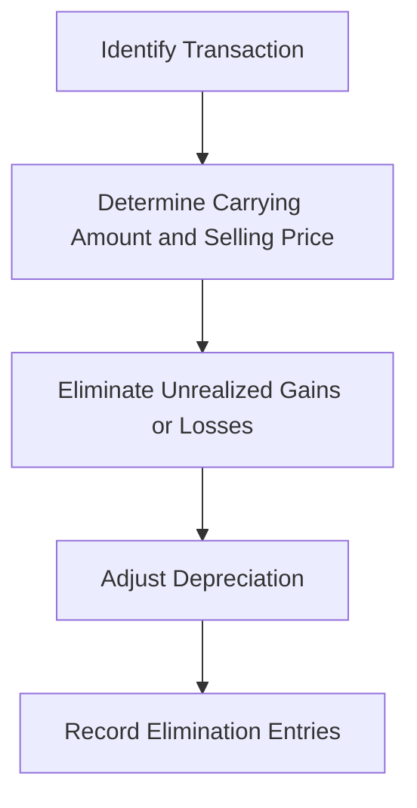

## 6.5 Intercompany Fixed Asset Transactions

Intercompany fixed asset transactions are a critical aspect of consolidated financial statements, especially when dealing with property, plant, and equipment (PPE). These transactions occur when one entity within a corporate group sells or transfers fixed assets to another entity within the same group. Understanding how to account for these transactions is essential for ensuring accurate financial reporting and compliance with accounting standards such as IFRS and GAAP.

### Understanding Intercompany Fixed Asset Transactions

When a fixed asset is transferred between entities within a group, it can lead to complexities in accounting, particularly in the context of consolidated financial statements. The primary objective is to eliminate any unrealized gains or losses that arise from these transactions to prevent distortion of the financial position and performance of the group as a whole.

#### Key Concepts

- **Unrealized Gains and Losses**: These occur when the selling price of the asset differs from its carrying amount. In consolidated financial statements, these gains or losses must be eliminated to reflect the asset's original cost to the group.
- **Depreciation Adjustments**: After the transfer, the asset's depreciation must be recalculated based on its original cost to the group and its remaining useful life.
- **Elimination Entries**: These are necessary to remove the effects of intercompany transactions from consolidated financial statements.

### Accounting Standards and Regulatory Framework

In Canada, accounting for intercompany fixed asset transactions is governed by International Financial Reporting Standards (IFRS) as adopted in Canada, and Accounting Standards for Private Enterprises (ASPE). The relevant standards include:

- **IFRS 10: Consolidated Financial Statements**: This standard provides guidance on preparing consolidated financial statements, including the elimination of intercompany transactions.
- **IAS 16: Property, Plant, and Equipment**: This standard outlines the accounting treatment for PPE, including depreciation and impairment.
- **ASC Topic 810: Consolidation**: Under U.S. GAAP, this provides guidance on consolidation procedures, including intercompany transactions.

### Steps in Accounting for Intercompany Fixed Asset Transactions

#### 1. Identify the Transaction

The first step is to identify the intercompany transaction involving fixed assets. This includes determining the entities involved, the nature of the asset, and the terms of the transfer.

#### 2. Determine the Carrying Amount and Selling Price

Calculate the carrying amount of the asset on the seller's books and the selling price at which it was transferred to the buyer. The difference between these two amounts represents the unrealized gain or loss.

#### 3. Eliminate Unrealized Gains or Losses

In the consolidated financial statements, eliminate any unrealized gains or losses to ensure that the asset is recorded at its original cost to the group. This involves adjusting the asset's carrying amount and the related depreciation.

#### 4. Adjust Depreciation

Recalculate the depreciation of the transferred asset based on its original cost to the group and its remaining useful life. This ensures that the depreciation expense is accurately reflected in the consolidated financial statements.

#### 5. Record Elimination Entries

Prepare elimination entries to remove the effects of the intercompany transaction from the consolidated financial statements. This includes reversing any intercompany profit or loss and adjusting the asset's carrying amount and depreciation.

### Practical Example

Consider a scenario where Company A sells a piece of machinery to its subsidiary, Company B, for $100,000. The machinery's carrying amount on Company A's books is $80,000. The transaction results in an unrealized gain of $20,000.

**Elimination Entry:**

- Debit: Intercompany Sales $100,000
- Credit: Intercompany Cost of Goods Sold $80,000
- Credit: Unrealized Gain on Sale of Machinery $20,000

**Depreciation Adjustment:**

Assume the machinery has a remaining useful life of 5 years. The annual depreciation expense based on the original cost to the group ($80,000) should be recalculated and adjusted in the consolidated financial statements.

### Challenges and Best Practices

#### Common Challenges

- **Complexity in Calculations**: Determining the correct carrying amount, unrealized gains or losses, and depreciation adjustments can be complex and time-consuming.
- **Compliance with Standards**: Ensuring compliance with IFRS and GAAP requires a thorough understanding of the relevant standards and their application to intercompany transactions.
- **Data Management**: Maintaining accurate records of intercompany transactions and ensuring consistency across entities can be challenging.

#### Best Practices

- **Regular Reconciliation**: Regularly reconcile intercompany accounts to ensure accuracy and consistency in financial reporting.
- **Comprehensive Documentation**: Maintain detailed documentation of intercompany transactions, including agreements, invoices, and calculations, to support the elimination entries and adjustments.
- **Training and Education**: Provide training and resources to accounting staff to ensure they understand the complexities of intercompany transactions and the requirements of relevant accounting standards.

### Real-World Applications

In practice, intercompany fixed asset transactions are common in large corporate groups with multiple subsidiaries. These transactions can occur for various reasons, such as operational efficiency, tax planning, or restructuring. Understanding how to account for these transactions is essential for accurate financial reporting and compliance with accounting standards.

### Regulatory Considerations

In Canada, regulatory bodies such as CPA Canada provide guidance and resources for accounting professionals dealing with intercompany transactions. Staying informed about updates to accounting standards and regulatory requirements is crucial for ensuring compliance and avoiding potential issues.

### Diagrams and Visuals

To enhance understanding, consider using diagrams to illustrate the flow of intercompany transactions and the elimination process in consolidated financial statements. For example, a flowchart can depict the steps involved in identifying, eliminating, and adjusting intercompany fixed asset transactions.

### Summary

Intercompany fixed asset transactions are a critical aspect of consolidated financial statements. Understanding how to account for these transactions, eliminate unrealized gains or losses, and adjust depreciation is essential for accurate financial reporting and compliance with accounting standards. By following best practices and staying informed about regulatory requirements, accounting professionals can effectively manage intercompany transactions and ensure the integrity of consolidated financial statements.

### References

- CPA Canada: [Consolidation and Intercompany Transactions](https://www.cpacanada.ca/en)
- IFRS Foundation: [IFRS 10 Consolidated Financial Statements](https://www.ifrs.org/issued-standards/list-of-standards/ifrs-10-consolidated-financial-statements/)
- Financial Accounting Standards Board (FASB): [ASC Topic 810 Consolidation](https://www.fasb.org/)

## **Ready to Test Your Knowledge?**



### What is the primary objective of eliminating unrealized gains or losses in intercompany fixed asset transactions?

- [x] To reflect the asset's original cost to the group
- [ ] To increase the group's net income
- [ ] To comply with tax regulations
- [ ] To enhance the asset's market value

> **Explanation:** The primary objective is to reflect the asset's original cost to the group, ensuring accurate financial reporting in consolidated financial statements.

### Which accounting standard provides guidance on consolidated financial statements in Canada?

- [x] IFRS 10
- [ ] IAS 16
- [ ] ASC Topic 810
- [ ] ASPE Section 3061

> **Explanation:** IFRS 10 provides guidance on preparing consolidated financial statements, including the elimination of intercompany transactions.

### What is the first step in accounting for intercompany fixed asset transactions?

- [x] Identify the transaction
- [ ] Determine the carrying amount
- [ ] Eliminate unrealized gains
- [ ] Adjust depreciation

> **Explanation:** The first step is to identify the intercompany transaction involving fixed assets.

### How is depreciation adjusted after an intercompany fixed asset transfer?

- [x] Based on the asset's original cost to the group and remaining useful life
- [ ] Based on the asset's selling price
- [ ] Based on the asset's market value
- [ ] Based on the asset's replacement cost

> **Explanation:** Depreciation is adjusted based on the asset's original cost to the group and its remaining useful life.

### What is a common challenge in accounting for intercompany fixed asset transactions?

- [x] Complexity in calculations
- [ ] Lack of documentation
- [ ] Insufficient training
- [ ] Inconsistent standards

> **Explanation:** Complexity in calculations, such as determining carrying amounts and depreciation adjustments, is a common challenge.

### Which of the following is a best practice for managing intercompany transactions?

- [x] Regular reconciliation
- [ ] Ignoring unrealized gains
- [ ] Using market value for depreciation
- [ ] Avoiding documentation

> **Explanation:** Regular reconciliation of intercompany accounts ensures accuracy and consistency in financial reporting.

### What is the purpose of maintaining comprehensive documentation of intercompany transactions?

- [x] To support elimination entries and adjustments
- [ ] To comply with tax regulations
- [ ] To enhance asset valuation
- [ ] To simplify financial reporting

> **Explanation:** Comprehensive documentation supports elimination entries and adjustments, ensuring accurate financial reporting.

### Which regulatory body provides guidance for accounting professionals in Canada?

- [x] CPA Canada
- [ ] IFRS Foundation
- [ ] FASB
- [ ] SEC

> **Explanation:** CPA Canada provides guidance and resources for accounting professionals dealing with intercompany transactions.

### What is the result of failing to eliminate unrealized gains in consolidated financial statements?

- [x] Distorted financial position and performance
- [ ] Increased tax liability
- [ ] Enhanced asset valuation
- [ ] Simplified reporting process

> **Explanation:** Failing to eliminate unrealized gains can distort the financial position and performance of the group.

### True or False: Intercompany fixed asset transactions can occur for tax planning purposes.

- [x] True
- [ ] False

> **Explanation:** Intercompany fixed asset transactions can occur for various reasons, including tax planning.


