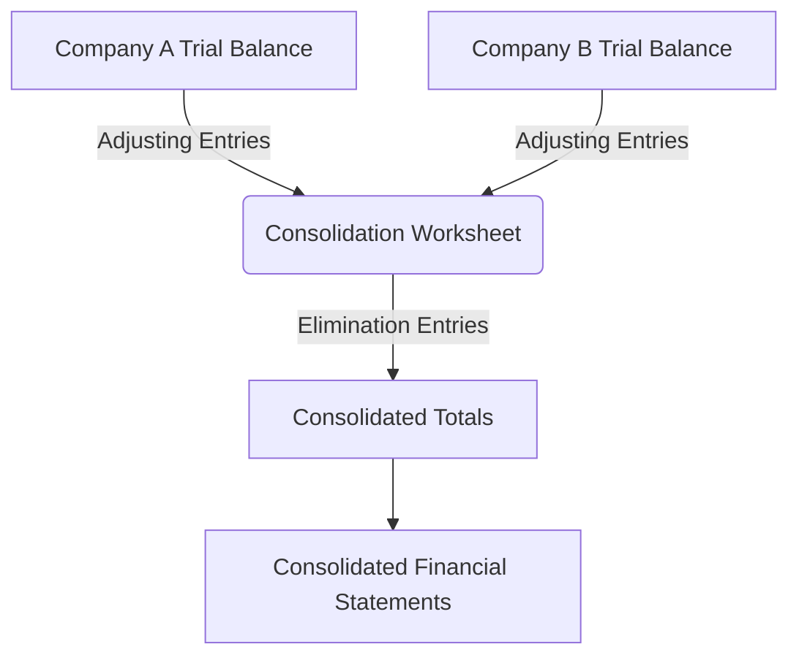

## 7.2 Preparing Consolidation Worksheets

In the realm of accounting, preparing consolidated financial statements is a critical task that requires meticulous attention to detail and a deep understanding of financial data integration. Consolidation worksheets are indispensable tools that facilitate this process by organizing and adjusting financial data from multiple entities into a single, cohesive set of financial statements. This section aims to provide a comprehensive guide to preparing consolidation worksheets, focusing on the principles, procedures, and practical applications relevant to Canadian accounting exams and professional practice.

### Understanding Consolidation Worksheets

Consolidation worksheets serve as a bridge between the individual financial statements of a parent company and its subsidiaries and the consolidated financial statements. They are used to adjust and eliminate intercompany transactions and balances, ensuring that the consolidated financial statements present a true and fair view of the financial position and performance of the group as a whole.

#### Key Components of Consolidation Worksheets

1. **Trial Balances**: The starting point for any consolidation worksheet is the trial balances of the parent and subsidiary companies. These balances include all the accounts that will be consolidated.

2. **Adjusting Entries**: These are necessary to eliminate intercompany transactions and balances, such as intercompany sales, loans, and dividends.

3. **Elimination Entries**: These entries remove the effects of intercompany transactions to prevent double counting in the consolidated financial statements.

4. **Consolidated Totals**: After adjustments and eliminations, the worksheet will show the consolidated totals for each account, which are then used to prepare the consolidated financial statements.

### Steps in Preparing Consolidation Worksheets

#### Step 1: Gather Financial Information

The first step in preparing a consolidation worksheet is to gather the financial statements of the parent and subsidiary companies. This includes the balance sheet, income statement, and statement of cash flows. Ensure that all financial statements are prepared using the same accounting policies and reporting currency.

#### Step 2: Align Accounting Policies

Before consolidation, it's crucial to align the accounting policies of the parent and subsidiary companies. This may involve adjusting the subsidiary's financial statements to conform to the parent company's accounting policies.

#### Step 3: Prepare Initial Trial Balances

Create a trial balance for each entity involved in the consolidation. This includes listing all accounts and their respective balances. The trial balance serves as the foundation for the consolidation worksheet.

#### Step 4: Identify and Record Adjusting Entries

Adjusting entries are made to account for differences in accounting policies, currency translations, and other necessary adjustments. These entries ensure that the financial statements of the parent and subsidiary are comparable.

#### Step 5: Eliminate Intercompany Transactions

Intercompany transactions, such as sales, loans, and dividends, must be eliminated to avoid double counting. This involves making elimination entries in the consolidation worksheet. Common elimination entries include:

- **Intercompany Sales and Purchases**: Eliminate sales made by the parent to the subsidiary and vice versa.
- **Intercompany Loans and Interest**: Eliminate loans and interest between the parent and subsidiary.
- **Intercompany Dividends**: Eliminate dividends declared by the subsidiary to the parent.

#### Step 6: Calculate Non-Controlling Interest (NCI)

If the parent company does not own 100% of the subsidiary, calculate the non-controlling interest. This represents the portion of the subsidiary's equity not owned by the parent and must be reflected in the consolidated financial statements.

#### Step 7: Prepare Consolidated Totals

After all adjustments and eliminations, calculate the consolidated totals for each account. These totals will form the basis of the consolidated financial statements.

#### Step 8: Review and Finalize the Worksheet

Review the consolidation worksheet for accuracy and completeness. Ensure that all intercompany transactions have been eliminated and that the consolidated totals are correct.

### Practical Example: Consolidation Worksheet Preparation

Let's consider a practical example to illustrate the preparation of a consolidation worksheet. Assume that Company A is the parent company and owns 80% of Company B, a subsidiary. The following steps outline the preparation of the consolidation worksheet:

#### Step 1: Gather Financial Information

- **Company A**: Total assets of $500,000, total liabilities of $300,000, and equity of $200,000.
- **Company B**: Total assets of $200,000, total liabilities of $100,000, and equity of $100,000.

#### Step 2: Align Accounting Policies

Both companies use the same accounting policies, so no adjustments are needed.

#### Step 3: Prepare Initial Trial Balances

| Account       | Company A | Company B |
|---------------|-----------|-----------|
| Assets        | $500,000  | $200,000  |
| Liabilities   | $300,000  | $100,000  |
| Equity        | $200,000  | $100,000  |

#### Step 4: Identify and Record Adjusting Entries

No adjusting entries are required as both companies use the same accounting policies.

#### Step 5: Eliminate Intercompany Transactions

Assume Company A sold goods worth $50,000 to Company B. The elimination entry would be:

- **Debit**: Sales (Company A) $50,000
- **Credit**: Cost of Goods Sold (Company B) $50,000

#### Step 6: Calculate Non-Controlling Interest (NCI)

NCI is calculated as 20% of Company B's equity:

- NCI = 20% x $100,000 = $20,000

#### Step 7: Prepare Consolidated Totals

| Account       | Consolidated Total |
|---------------|--------------------|
| Assets        | $650,000           |
| Liabilities   | $400,000           |
| Equity        | $230,000           |

#### Step 8: Review and Finalize the Worksheet

Ensure that all intercompany transactions have been eliminated and that the consolidated totals are accurate.

### Visualizing the Consolidation Process

To aid understanding, the following diagram illustrates the flow of information in a consolidation worksheet:

### Best Practices for Preparing Consolidation Worksheets

1. **Consistency**: Ensure consistency in accounting policies and reporting currency across all entities.
2. **Accuracy**: Double-check all entries and calculations for accuracy.
3. **Documentation**: Maintain thorough documentation of all adjustments and eliminations.
4. **Review**: Regularly review the consolidation worksheet for completeness and accuracy.

### Common Pitfalls and How to Avoid Them

1. **Overlooking Intercompany Transactions**: Ensure all intercompany transactions are identified and eliminated.
2. **Inconsistent Accounting Policies**: Align accounting policies before consolidation to avoid discrepancies.
3. **Incorrect NCI Calculation**: Double-check the calculation of non-controlling interest to ensure accuracy.
4. **Incomplete Documentation**: Maintain comprehensive documentation to support all adjustments and eliminations.

### References and Further Reading

- **International Financial Reporting Standards (IFRS)**: Refer to IFRS 10 for guidance on consolidated financial statements.
- **CPA Canada**: Explore resources and guidelines provided by CPA Canada for consolidation accounting.
- **Accounting Standards for Private Enterprises (ASPE)**: Review ASPE Section 1591 for consolidation standards applicable to private enterprises.

### Conclusion

Preparing consolidation worksheets is a critical skill for accountants involved in the preparation of consolidated financial statements. By following the steps outlined in this guide, you can ensure that your consolidation worksheets are accurate, complete, and compliant with accounting standards. Practice these skills regularly to build confidence and proficiency, both for the Canadian accounting exams and professional practice.

## **Ready to Test Your Knowledge?**



### What is the primary purpose of a consolidation worksheet?

- [x] To organize and adjust financial data for consolidation
- [ ] To prepare individual financial statements
- [ ] To calculate tax liabilities
- [ ] To audit financial statements

> **Explanation:** A consolidation worksheet is used to organize and adjust financial data from multiple entities to prepare consolidated financial statements.

### Which entry is used to eliminate intercompany sales?

- [x] Debit Sales, Credit Cost of Goods Sold
- [ ] Debit Cost of Goods Sold, Credit Sales
- [ ] Debit Inventory, Credit Sales
- [ ] Debit Sales, Credit Inventory

> **Explanation:** To eliminate intercompany sales, you debit Sales and credit Cost of Goods Sold to remove the effects from the consolidated statements.

### How is Non-Controlling Interest (NCI) calculated?

- [x] As a percentage of the subsidiary's equity not owned by the parent
- [ ] As a percentage of the parent company's equity
- [ ] As a percentage of total consolidated equity
- [ ] As a percentage of the subsidiary's liabilities

> **Explanation:** NCI is calculated as the percentage of the subsidiary's equity that is not owned by the parent company.

### What is the first step in preparing a consolidation worksheet?

- [x] Gather financial information from all entities
- [ ] Calculate non-controlling interest
- [ ] Eliminate intercompany transactions
- [ ] Prepare consolidated totals

> **Explanation:** The first step is to gather financial information from all entities involved in the consolidation.

### Which of the following is a common pitfall in preparing consolidation worksheets?

- [x] Overlooking intercompany transactions
- [ ] Consistent accounting policies
- [ ] Accurate NCI calculation
- [ ] Thorough documentation

> **Explanation:** Overlooking intercompany transactions is a common pitfall that can lead to inaccuracies in the consolidated financial statements.

### What should be done before consolidation if the parent and subsidiary have different accounting policies?

- [x] Align the accounting policies
- [ ] Prepare separate financial statements
- [ ] Calculate NCI
- [ ] Eliminate intercompany transactions

> **Explanation:** Aligning accounting policies ensures that the financial statements of the parent and subsidiary are comparable.

### In the consolidation worksheet, what is the purpose of elimination entries?

- [x] To remove the effects of intercompany transactions
- [ ] To adjust for currency differences
- [ ] To calculate tax liabilities
- [ ] To prepare individual financial statements

> **Explanation:** Elimination entries are used to remove the effects of intercompany transactions to prevent double counting.

### What is the role of adjusting entries in a consolidation worksheet?

- [x] To account for differences in accounting policies and other necessary adjustments
- [ ] To eliminate intercompany transactions
- [ ] To calculate non-controlling interest
- [ ] To prepare consolidated totals

> **Explanation:** Adjusting entries account for differences in accounting policies and other necessary adjustments to ensure comparability.

### Which document serves as the foundation for the consolidation worksheet?

- [x] Trial balance
- [ ] Income statement
- [ ] Balance sheet
- [ ] Statement of cash flows

> **Explanation:** The trial balance serves as the foundation for the consolidation worksheet, listing all accounts and their respective balances.

### True or False: Consolidation worksheets are only used for preparing consolidated income statements.

- [ ] True
- [x] False

> **Explanation:** Consolidation worksheets are used for preparing all consolidated financial statements, including the balance sheet, income statement, and statement of cash flows.


