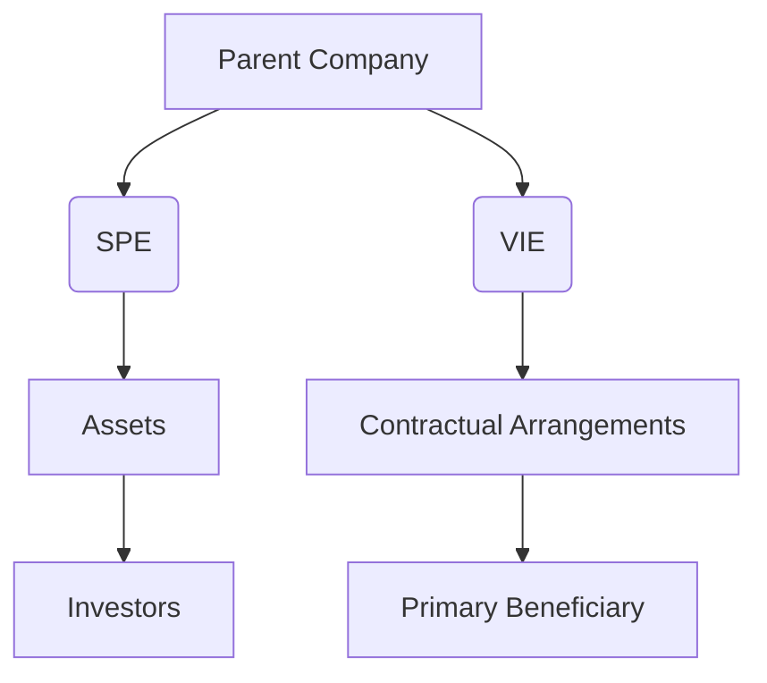

## 9.1 Understanding Special Purpose Entities (SPEs) and Variable Interest Entities (VIEs)

In the realm of consolidated financial statements and business combinations, understanding the concepts of Special Purpose Entities (SPEs) and Variable Interest Entities (VIEs) is crucial. These entities play significant roles in corporate structures, often used for specific purposes such as risk management, asset securitization, and financial engineering. This section delves into the definitions, roles, and implications of SPEs and VIEs, providing a comprehensive guide for those preparing for Canadian accounting exams.

### What are Special Purpose Entities (SPEs)?

Special Purpose Entities (SPEs) are legal entities created for a specific, narrow purpose. They are often used to isolate financial risk, manage assets, or facilitate complex financial transactions. SPEs can take various forms, including corporations, partnerships, or trusts, and are typically structured to achieve a particular financial or operational objective.

#### Characteristics of SPEs

- **Limited Purpose:** SPEs are designed for a specific task, such as holding assets, managing liabilities, or conducting a particular transaction.
- **Separate Legal Entity:** SPEs are legally distinct from the parent company, providing a layer of protection against financial risk.
- **Off-Balance Sheet Financing:** SPEs can be used to keep certain assets or liabilities off the parent company's balance sheet, which can improve financial ratios and leverage.

#### Common Uses of SPEs

- **Securitization of Assets:** SPEs are often used in asset-backed securities transactions, where financial assets are pooled and sold to investors.
- **Project Financing:** SPEs can be used to finance large projects, such as infrastructure or real estate developments, by isolating the project's risks and liabilities.
- **Risk Management:** Companies use SPEs to manage financial risks, such as interest rate or currency risk, by creating separate entities to handle specific exposures.

### What are Variable Interest Entities (VIEs)?

Variable Interest Entities (VIEs) are entities in which the investor holds a controlling interest that is not based on the majority of voting rights. Instead, control is determined by contractual or other financial interests. VIEs are a key concept in consolidation accounting, as they require special consideration under both IFRS and GAAP.

#### Characteristics of VIEs

- **Lack of Voting Control:** VIEs are controlled through contractual arrangements rather than voting rights.
- **Primary Beneficiary:** The entity that absorbs the majority of the VIE's risks or receives the majority of its rewards is considered the primary beneficiary and must consolidate the VIE.
- **Complex Structures:** VIEs often involve complex financial arrangements and require careful analysis to determine the controlling interest.

#### Identifying a VIE

To determine whether an entity is a VIE, accountants must assess several factors, including:

- **Equity Investment at Risk:** If the equity investment is insufficient to finance the entity's activities without additional financial support, it may be a VIE.
- **Decision-Making Power:** If decision-making power is concentrated in a few hands or controlled by contractual arrangements, the entity may be a VIE.
- **Obligation to Absorb Losses or Receive Benefits:** Entities that are obligated to absorb losses or receive benefits from the VIE are likely to be considered VIEs.

### Accounting for SPEs and VIEs

The accounting treatment for SPEs and VIEs can significantly impact a company's financial statements. Under both IFRS and GAAP, specific guidelines dictate when these entities must be consolidated.

#### Consolidation of SPEs

Under IFRS, SPEs are consolidated if the parent company has control over the entity, which is determined by the power to govern the financial and operating policies. In contrast, GAAP requires consolidation if the parent company is the primary beneficiary of the SPE's activities.

#### Consolidation of VIEs

VIEs are consolidated by the primary beneficiary, which is the entity that absorbs the majority of the VIE's expected losses or receives the majority of its expected residual returns. This determination requires a thorough analysis of the VIE's structure and financial arrangements.

### Practical Examples and Case Studies

To illustrate the application of SPEs and VIEs in real-world scenarios, consider the following examples:

#### Example 1: Asset Securitization

A bank creates an SPE to securitize a portfolio of mortgages. The SPE issues mortgage-backed securities to investors, using the proceeds to purchase the mortgages from the bank. The bank retains some risk and rewards through a residual interest in the SPE, requiring consolidation under IFRS and GAAP.

#### Example 2: Project Financing

A construction company establishes an SPE to finance a new infrastructure project. The SPE raises funds through debt and equity, isolating the project's risks from the parent company. If the construction company retains control over the SPE's operations, it must consolidate the SPE in its financial statements.

### Regulatory Considerations

In Canada, the accounting treatment for SPEs and VIEs is governed by IFRS as adopted by the Canadian Accounting Standards Board (AcSB). The AcSB provides guidance on the application of IFRS 10, which outlines the principles for consolidating SPEs and VIEs.

#### IFRS 10: Consolidated Financial Statements

IFRS 10 establishes the principles for presenting consolidated financial statements when an entity controls one or more other entities. It requires entities to consolidate SPEs and VIEs when control is established, even if the control is not based on voting rights.

#### CPA Canada Guidelines

CPA Canada offers additional resources and guidelines for understanding and applying the principles of SPEs and VIEs in financial reporting. These resources can be invaluable for exam preparation and professional practice.

### Challenges and Best Practices

Accounting for SPEs and VIEs presents several challenges, including:

- **Complexity of Structures:** The intricate nature of SPEs and VIEs can make it difficult to determine control and consolidation requirements.
- **Regulatory Compliance:** Ensuring compliance with IFRS and GAAP standards requires a thorough understanding of the relevant guidelines.
- **Disclosure Requirements:** Properly disclosing the nature and impact of SPEs and VIEs in financial statements is crucial for transparency and compliance.

To overcome these challenges, consider the following best practices:

- **Thorough Analysis:** Conduct a detailed analysis of the entity's structure, financial arrangements, and contractual obligations to determine control.
- **Regular Review:** Continuously review and update the assessment of SPEs and VIEs to ensure compliance with evolving standards and regulations.
- **Clear Documentation:** Maintain clear and comprehensive documentation of the analysis and conclusions regarding the consolidation of SPEs and VIEs.

### Diagram: SPE and VIE Structure

To better understand the structure and relationships of SPEs and VIEs, consider the following diagram:

### Conclusion

Understanding SPEs and VIEs is essential for preparing consolidated financial statements and navigating the complexities of business combinations. By mastering the principles and guidelines for these entities, you can enhance your financial reporting skills and excel in Canadian accounting exams.

### Additional Resources

- **IFRS 10: Consolidated Financial Statements**
- **CPA Canada Handbook**
- **Canadian Accounting Standards Board (AcSB) Publications**

## **Ready to Test Your Knowledge?**



### What is a Special Purpose Entity (SPE)?

- [x] A legal entity created for a specific, narrow purpose
- [ ] A company that operates in multiple industries
- [ ] An entity with significant voting rights
- [ ] A subsidiary with majority ownership

> **Explanation:** An SPE is a legal entity created for a specific, narrow purpose, often used to isolate financial risk or manage assets.

### What defines a Variable Interest Entity (VIE)?

- [x] An entity controlled through contractual arrangements
- [ ] An entity with majority voting rights
- [ ] A publicly traded company
- [ ] A wholly-owned subsidiary

> **Explanation:** A VIE is controlled through contractual arrangements rather than voting rights, requiring special consideration in consolidation.

### What is the primary purpose of an SPE?

- [x] To isolate financial risk
- [ ] To expand business operations
- [ ] To increase market share
- [ ] To acquire new technology

> **Explanation:** SPEs are often used to isolate financial risk, manage assets, or facilitate complex financial transactions.

### How is the primary beneficiary of a VIE determined?

- [x] By assessing who absorbs the majority of the VIE's risks or rewards
- [ ] By identifying the entity with the most voting rights
- [ ] By evaluating the largest shareholder
- [ ] By determining the entity with the highest revenue

> **Explanation:** The primary beneficiary is the entity that absorbs the majority of the VIE's risks or receives the majority of its rewards.

### What is a common use of SPEs?

- [x] Securitization of assets
- [ ] Mergers and acquisitions
- [ ] Research and development
- [ ] Marketing and advertising

> **Explanation:** SPEs are commonly used in asset-backed securities transactions, where financial assets are pooled and sold to investors.

### What is a key characteristic of a VIE?

- [x] Lack of voting control
- [ ] High market capitalization
- [ ] Strong brand recognition
- [ ] Large employee base

> **Explanation:** VIEs are characterized by a lack of voting control, with control determined by contractual or other financial interests.

### How are SPEs typically structured?

- [x] As separate legal entities
- [ ] As divisions within a company
- [ ] As joint ventures
- [ ] As franchises

> **Explanation:** SPEs are structured as separate legal entities, providing a layer of protection against financial risk.

### What is the role of IFRS 10 in accounting for SPEs and VIEs?

- [x] It establishes principles for consolidating entities when control is established
- [ ] It provides guidelines for tax reporting
- [ ] It outlines marketing strategies
- [ ] It defines employee compensation plans

> **Explanation:** IFRS 10 establishes the principles for presenting consolidated financial statements when an entity controls one or more other entities.

### What is a challenge in accounting for SPEs and VIEs?

- [x] Complexity of structures
- [ ] High employee turnover
- [ ] Low market demand
- [ ] Limited product offerings

> **Explanation:** The intricate nature of SPEs and VIEs can make it difficult to determine control and consolidation requirements.

### True or False: SPEs can be used for off-balance sheet financing.

- [x] True
- [ ] False

> **Explanation:** SPEs can be used to keep certain assets or liabilities off the parent company's balance sheet, which can improve financial ratios and leverage.


