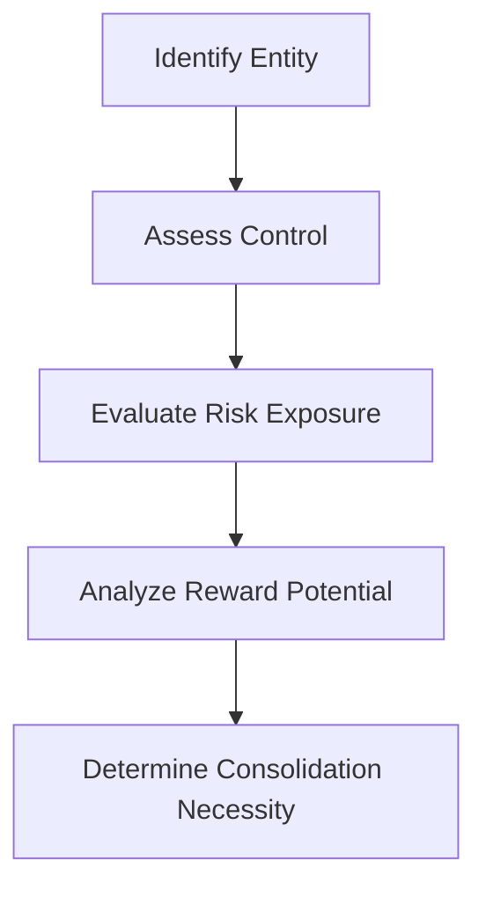

## 9.4 Risks and Rewards Analysis

In the realm of consolidated financial statements and business combinations, understanding the risks and rewards associated with Special Purpose Entities (SPEs) and Variable Interest Entities (VIEs) is crucial. This analysis determines the necessity of consolidation and ensures that financial statements accurately reflect the economic reality of a business's operations. This section delves into the complexities of risks and rewards analysis, providing you with the knowledge and tools needed to navigate this essential aspect of accounting.

### Understanding Special Purpose Entities (SPEs) and Variable Interest Entities (VIEs)

Special Purpose Entities (SPEs) and Variable Interest Entities (VIEs) are entities created for a specific, narrow purpose, often to isolate financial risk. These entities can be used for a variety of purposes, such as securitization of assets, joint ventures, or project financing. The primary concern with SPEs and VIEs is whether they should be consolidated into the financial statements of the sponsoring company.

#### Key Characteristics of SPEs and VIEs

- **Legal Separation:** SPEs and VIEs are legally separate from the sponsoring company, which can shield the sponsor from certain liabilities.
- **Limited Activities:** These entities typically engage in limited activities, often related to financing or asset management.
- **Variable Interests:** VIEs are characterized by variable interests, which are contractual, ownership, or other pecuniary interests that change with the entity's performance.

### The Role of Risks and Rewards Analysis

The risks and rewards analysis is a critical component in determining whether an SPE or VIE should be consolidated. This analysis involves assessing who bears the majority of the risks and who stands to gain the majority of the rewards from the entity's activities. The entity that bears the most significant risks and rewards is typically required to consolidate the SPE or VIE.

#### Key Considerations in Risks and Rewards Analysis

1. **Economic Substance Over Legal Form:** The analysis focuses on the economic substance of transactions rather than their legal form. This ensures that the financial statements reflect the true economic impact of the entity's activities.

2. **Control Assessment:** Determining control is central to consolidation decisions. Control is established when an entity has the power to direct the activities that significantly affect the entity's returns.

3. **Risk Exposure:** Assessing the extent of risk exposure involves evaluating potential losses and liabilities associated with the entity's operations.

4. **Reward Potential:** This involves analyzing the potential for financial gain, including profits, cash flows, and other economic benefits.

### Accounting Standards and Regulatory Framework

#### IFRS and GAAP Perspectives

Both the International Financial Reporting Standards (IFRS) and Generally Accepted Accounting Principles (GAAP) provide guidelines for the consolidation of SPEs and VIEs. However, there are differences in how these standards approach the risks and rewards analysis.

- **IFRS 10:** Under IFRS, control is the primary criterion for consolidation. An entity controls another entity when it is exposed to, or has rights to, variable returns from its involvement and has the ability to affect those returns through its power over the entity.

- **ASC 810:** Under U.S. GAAP, the focus is on the primary beneficiary of a VIE. The primary beneficiary is the entity that has both the power to direct the activities of the VIE and the obligation to absorb losses or receive benefits that could potentially be significant to the VIE.

#### Recent Updates and Convergence Efforts

Recent updates in accounting standards have aimed at converging IFRS and GAAP to provide a more unified approach to consolidation. These efforts focus on enhancing transparency and comparability in financial reporting.

### Practical Examples and Case Studies

To illustrate the application of risks and rewards analysis, consider the following scenarios:

#### Example 1: Securitization of Assets

A company creates an SPE to securitize its receivables. The SPE issues debt securities to investors, and the cash flows from the receivables are used to pay the investors. In this case, the company must assess whether it retains control over the SPE and whether it bears the majority of the risks and rewards associated with the receivables.

#### Example 2: Joint Venture

Two companies form a joint venture to develop a new product. Each company contributes assets and expertise to the venture. The risks and rewards analysis will determine which company, if any, should consolidate the joint venture based on control and exposure to variable returns.

### Step-by-Step Guidance for Conducting Risks and Rewards Analysis

1. **Identify the Entity:** Determine whether the entity in question is an SPE or VIE.

2. **Assess Control:** Evaluate whether the reporting entity has control over the SPE or VIE. This involves analyzing voting rights, contractual arrangements, and other factors that may confer control.

3. **Evaluate Risk Exposure:** Identify the risks associated with the entity's activities, including financial, operational, and legal risks.

4. **Analyze Reward Potential:** Consider the potential economic benefits, such as profits, cash flows, and other returns.

5. **Determine Consolidation Necessity:** Based on the analysis, decide whether the entity should be consolidated into the financial statements of the reporting entity.

### Best Practices and Common Pitfalls

#### Best Practices

- **Comprehensive Documentation:** Maintain thorough documentation of the risks and rewards analysis to support consolidation decisions.
- **Regular Review:** Periodically review the analysis to account for changes in circumstances or new information.
- **Collaboration with Experts:** Engage with accounting and legal experts to ensure a robust analysis.

#### Common Pitfalls

- **Overlooking Control Indicators:** Failing to recognize indicators of control can lead to incorrect consolidation decisions.
- **Inadequate Risk Assessment:** Underestimating the risks associated with an entity can result in financial misstatements.
- **Ignoring Changes in Circumstances:** Not updating the analysis for changes in the entity's operations or environment can lead to outdated conclusions.

### Real-World Applications and Regulatory Scenarios

In practice, risks and rewards analysis is applied in various contexts, such as mergers and acquisitions, project financing, and asset securitization. Regulatory bodies, such as the Canadian Securities Administrators (CSA), provide guidance on the disclosure requirements for consolidated financial statements, emphasizing the importance of transparency and accuracy.

### Diagrams and Visual Aids

To enhance understanding, consider the following diagram illustrating the risks and rewards analysis process:

### Summary and Key Takeaways

- **Risks and Rewards Analysis:** This analysis is essential for determining the necessity of consolidating SPEs and VIEs.
- **Control and Exposure:** The primary factors in consolidation decisions are control over the entity and exposure to its risks and rewards.
- **Regulatory Compliance:** Adhering to IFRS and GAAP standards ensures accurate and transparent financial reporting.

### References and Further Reading

- **IFRS 10: Consolidated Financial Statements**
- **ASC 810: Consolidation**
- **CPA Canada Handbook**
- **Canadian Securities Administrators (CSA) Guidelines**

### Encouragement for Further Study

Understanding risks and rewards analysis is crucial for success in Canadian accounting exams and professional practice. Engage with additional resources, practice problems, and case studies to deepen your understanding and enhance your exam preparation.

## **Ready to Test Your Knowledge?**



### What is the primary focus of risks and rewards analysis in consolidation?

- [x] Determining control and exposure to risks and rewards
- [ ] Legal ownership of the entity
- [ ] Historical financial performance
- [ ] Tax implications

> **Explanation:** Risks and rewards analysis focuses on determining who has control over the entity and who is exposed to its risks and rewards.

### Which accounting standard emphasizes control as the primary criterion for consolidation?

- [x] IFRS 10
- [ ] ASC 810
- [ ] ASPE
- [ ] CSA Guidelines

> **Explanation:** IFRS 10 emphasizes control as the primary criterion for consolidation decisions.

### What is a key characteristic of a Variable Interest Entity (VIE)?

- [x] It has variable interests that change with the entity's performance.
- [ ] It is always owned by a single entity.
- [ ] It operates independently of its sponsor.
- [ ] It is only used for securitization.

> **Explanation:** A VIE is characterized by variable interests that change with the entity's performance.

### What is the role of economic substance in risks and rewards analysis?

- [x] It ensures financial statements reflect the true economic impact of transactions.
- [ ] It determines the legal ownership of assets.
- [ ] It focuses on historical cost accounting.
- [ ] It prioritizes tax efficiency.

> **Explanation:** Economic substance ensures that financial statements reflect the true economic impact of transactions, rather than just their legal form.

### How often should risks and rewards analysis be reviewed?

- [x] Regularly, to account for changes in circumstances
- [ ] Only at the end of the fiscal year
- [ ] Once every five years
- [ ] When requested by auditors

> **Explanation:** Regular review of risks and rewards analysis is necessary to account for changes in circumstances or new information.

### What is a common pitfall in conducting risks and rewards analysis?

- [x] Overlooking control indicators
- [ ] Overestimating tax benefits
- [ ] Focusing solely on legal form
- [ ] Ignoring historical performance

> **Explanation:** Overlooking control indicators can lead to incorrect consolidation decisions.

### In which scenario is risks and rewards analysis particularly important?

- [x] Mergers and acquisitions
- [ ] Routine financial reporting
- [ ] Payroll processing
- [ ] Inventory management

> **Explanation:** Risks and rewards analysis is particularly important in mergers and acquisitions to determine consolidation necessity.

### What is the primary benefit of engaging with experts during risks and rewards analysis?

- [x] Ensuring a robust and accurate analysis
- [ ] Reducing audit fees
- [ ] Increasing tax deductions
- [ ] Simplifying financial statements

> **Explanation:** Engaging with experts ensures a robust and accurate risks and rewards analysis.

### What is the significance of the primary beneficiary in U.S. GAAP?

- [x] It determines who consolidates a VIE.
- [ ] It identifies the legal owner of the entity.
- [ ] It sets tax rates for the entity.
- [ ] It establishes the entity's functional currency.

> **Explanation:** The primary beneficiary under U.S. GAAP determines who consolidates a VIE.

### True or False: Risks and rewards analysis only considers financial risks.

- [ ] True
- [x] False

> **Explanation:** Risks and rewards analysis considers both financial and non-financial risks, as well as potential rewards.


