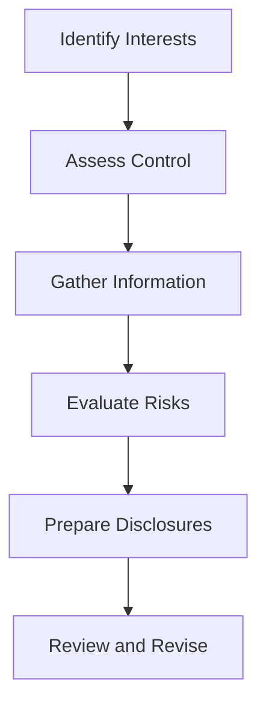

## 9.6 Disclosure of Interests in Other Entities

In the realm of consolidated financial statements and business combinations, understanding the disclosure requirements for interests in other entities, particularly Variable Interest Entities (VIEs) and Special Purpose Entities (SPEs), is crucial. This section provides an in-depth exploration of these requirements, tailored for those preparing for Canadian accounting exams. We will delve into the intricacies of disclosure standards, the rationale behind them, and how they apply within the Canadian context, guided by International Financial Reporting Standards (IFRS) and Generally Accepted Accounting Principles (GAAP).

### Understanding VIEs and SPEs

Before diving into disclosure requirements, it's essential to grasp what VIEs and SPEs are. 

- **Variable Interest Entities (VIEs):** These are entities in which an investor holds a controlling interest that is not based on the majority of voting rights. Instead, control is determined by contractual or other arrangements. VIEs are often used to isolate financial risk.

- **Special Purpose Entities (SPEs):** These are legal entities created for a specific, narrow purpose, often to facilitate a particular transaction or series of transactions. SPEs can be used for securitization, leasing, or other financial activities.

### Importance of Disclosure

Disclosures related to VIEs and SPEs are critical for several reasons:

1. **Transparency:** They provide stakeholders with a clear understanding of the risks and financial implications associated with these entities.

2. **Risk Assessment:** Investors and analysts can better assess the financial health and risk profile of a company.

3. **Regulatory Compliance:** Ensures that companies adhere to accounting standards and regulatory requirements, reducing the risk of legal issues.

### Disclosure Requirements under IFRS and GAAP

#### IFRS Requirements

Under IFRS, particularly IFRS 12, entities are required to disclose information that enables users of financial statements to evaluate:

- The nature and extent of its interests in other entities.
- The risks associated with those interests.
- The effects of those interests on its financial position, financial performance, and cash flows.

Key disclosures include:

- **Significant Judgments and Assumptions:** Entities must disclose the judgments and assumptions made in determining whether they have control, joint control, or significant influence over another entity.

- **Nature of Interests:** Information about the nature of the interests in other entities, including the name, nature, and purpose of the entity.

- **Risks Associated with Interests:** Details about the risks associated with interests in unconsolidated structured entities, including maximum exposure to loss.

- **Financial Effects:** The financial effects of interests in subsidiaries, joint arrangements, associates, and unconsolidated structured entities.

#### GAAP Requirements

Under U.S. GAAP, particularly ASC 810, the focus is on the consolidation of VIEs. Key disclosure requirements include:

- **Nature of Involvement:** Description of the nature of the involvement with the VIE and the purpose of the VIE.

- **Significant Judgments and Assumptions:** Similar to IFRS, entities must disclose significant judgments and assumptions in determining whether they are the primary beneficiary of a VIE.

- **Financial Impact:** Information about the financial impact of the VIE on the reporting entity, including the carrying amounts and classification of consolidated assets that are collateral for the VIE’s obligations.

- **Risk Exposure:** Details about the risk exposure from the VIE, including the maximum exposure to loss.

### Practical Examples and Case Studies

To illustrate these concepts, let's explore a few practical examples:

#### Example 1: Consolidation of a VIE

A Canadian company, ABC Corp, has a significant interest in a VIE that is used for securitizing its receivables. Under IFRS 12, ABC Corp must disclose:

- The nature of its involvement with the VIE.
- The purpose and activities of the VIE.
- The financial impact on its consolidated financial statements.
- The risks associated with its involvement, including maximum exposure to loss.

#### Example 2: SPE Used for Leasing

XYZ Ltd., a Canadian firm, uses an SPE for leasing purposes. The SPE is not consolidated under IFRS 10 because XYZ does not control it. However, under IFRS 12, XYZ must disclose:

- The nature of its interest in the SPE.
- The financial impact of the SPE on XYZ’s financial statements.
- Any risks associated with its interest in the SPE.

### Real-World Applications and Regulatory Scenarios

In practice, disclosures about interests in other entities can vary widely based on the nature of the entity and the industry. For instance, financial institutions often have complex structures involving numerous VIEs and SPEs, requiring detailed disclosures to meet regulatory requirements.

#### Regulatory Scenarios

1. **Banking Sector:** Banks often use SPEs for securitization. They must provide detailed disclosures about these entities to comply with both IFRS and local regulatory requirements.

2. **Real Estate Investment Trusts (REITs):** These entities frequently use SPEs for property acquisitions and financing. Disclosures must cover the nature of these entities, their financial impact, and associated risks.

### Step-by-Step Guidance on Preparing Disclosures

Preparing disclosures for VIEs and SPEs involves several steps:

1. **Identify Interests:** Determine all interests in other entities, including VIEs and SPEs.

2. **Assess Control:** Evaluate whether the entity has control, joint control, or significant influence over these entities.

3. **Gather Information:** Collect detailed information about the nature, purpose, and activities of the entities.

4. **Evaluate Risks:** Assess the risks associated with these interests, including maximum exposure to loss.

5. **Prepare Disclosures:** Draft disclosures that meet the requirements of IFRS 12 or ASC 810, ensuring clarity and completeness.

6. **Review and Revise:** Regularly review and update disclosures to reflect changes in circumstances or regulatory requirements.

### Diagrams and Visual Aids

To enhance understanding, let's use a diagram to illustrate the disclosure process for VIEs and SPEs:

### Best Practices and Common Pitfalls

#### Best Practices

- **Comprehensive Documentation:** Maintain detailed documentation of all judgments and assumptions made in assessing control and preparing disclosures.

- **Regular Updates:** Regularly update disclosures to reflect changes in the nature of interests or associated risks.

- **Clear Communication:** Ensure disclosures are clear and concise, providing stakeholders with a comprehensive understanding of the entity's interests and associated risks.

#### Common Pitfalls

- **Incomplete Disclosures:** Failing to provide all required information can lead to regulatory non-compliance and misinform stakeholders.

- **Inconsistent Information:** Inconsistencies between disclosures and other financial statement elements can undermine credibility.

- **Overlooking Risks:** Neglecting to disclose significant risks associated with interests in other entities can mislead stakeholders.

### References and Additional Resources

For further exploration, refer to the following authoritative resources:

- **IFRS 12:** Disclosure of Interests in Other Entities
- **ASC 810:** Consolidation
- **CPA Canada:** Guidance on Consolidation and Disclosure Requirements
- **International Accounting Standards Board (IASB):** Publications and updates on IFRS standards

### Encouragement and Exam Preparation Tips

As you prepare for your Canadian accounting exams, remember that understanding the disclosure requirements for interests in other entities is crucial. Focus on:

- **Mastering Key Concepts:** Ensure you understand the principles behind VIEs and SPEs and their disclosure requirements.

- **Practical Application:** Practice preparing disclosures using real-world scenarios and case studies.

- **Regular Review:** Regularly review and test your knowledge to reinforce learning and build confidence.

### Summary

In summary, disclosures of interests in other entities, particularly VIEs and SPEs, are vital for transparency and risk assessment in financial reporting. By understanding the requirements under IFRS and GAAP, and applying best practices, you can effectively prepare for your exams and future professional practice.

## **Ready to Test Your Knowledge?**



### What is the primary purpose of disclosing interests in VIEs and SPEs?

- [x] To provide transparency and assess risks
- [ ] To increase company profits
- [ ] To comply with tax regulations
- [ ] To enhance marketing strategies

> **Explanation:** Disclosures provide transparency and help assess the risks associated with VIEs and SPEs.

### Which IFRS standard specifically addresses disclosure of interests in other entities?

- [ ] IFRS 10
- [x] IFRS 12
- [ ] IFRS 15
- [ ] IFRS 16

> **Explanation:** IFRS 12 focuses on the disclosure of interests in other entities.

### Under U.S. GAAP, which ASC topic addresses consolidation of VIEs?

- [ ] ASC 805
- [x] ASC 810
- [ ] ASC 820
- [ ] ASC 830

> **Explanation:** ASC 810 deals with the consolidation of VIEs.

### What is a key component of disclosures under IFRS 12?

- [ ] Marketing strategies
- [ ] Tax liabilities
- [x] Significant judgments and assumptions
- [ ] Employee benefits

> **Explanation:** Significant judgments and assumptions are crucial components of IFRS 12 disclosures.

### Which of the following is a common pitfall in preparing disclosures?

- [ ] Over-disclosing information
- [x] Incomplete disclosures
- [ ] Using too many visuals
- [ ] Providing too much detail

> **Explanation:** Incomplete disclosures can lead to regulatory non-compliance and misinform stakeholders.

### What should be regularly updated in disclosures?

- [ ] Company logos
- [ ] Employee salaries
- [x] Changes in the nature of interests or associated risks
- [ ] Marketing materials

> **Explanation:** Disclosures should be updated to reflect changes in interests or associated risks.

### What is the role of SPEs in financial reporting?

- [ ] To increase tax liabilities
- [x] To facilitate specific transactions
- [ ] To enhance employee benefits
- [ ] To reduce marketing costs

> **Explanation:** SPEs are used to facilitate specific transactions, such as securitization or leasing.

### What is a best practice for preparing disclosures?

- [ ] Using complex language
- [ ] Providing minimal information
- [ ] Avoiding visuals
- [x] Maintaining comprehensive documentation

> **Explanation:** Comprehensive documentation supports the preparation of accurate and complete disclosures.

### Which sector often uses SPEs for securitization?

- [ ] Retail
- [x] Banking
- [ ] Manufacturing
- [ ] Hospitality

> **Explanation:** The banking sector frequently uses SPEs for securitization purposes.

### True or False: Disclosures about interests in other entities are optional under IFRS.

- [ ] True
- [x] False

> **Explanation:** Disclosures are mandatory under IFRS to ensure transparency and risk assessment.


