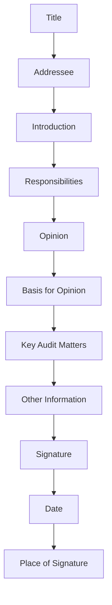
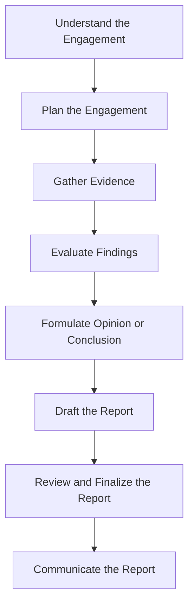

## 10.2.2 Reporting Standards

In the realm of assurance engagements, reporting standards are pivotal in ensuring that the results are communicated effectively and accurately. As a CPA candidate, understanding these standards is crucial not only for passing your exams but also for your future career in the accounting profession. This section will delve into the various aspects of reporting standards, providing you with a comprehensive understanding of how to communicate the results of assurance engagements.

### Understanding Assurance Engagements

Assurance engagements are professional services provided by CPAs to improve the quality of information for decision-makers. These engagements can range from audits of financial statements to reviews and other assurance services. The primary objective is to enhance the degree of confidence of intended users in the information provided.

### Key Reporting Standards in Assurance Engagements

The reporting standards for assurance engagements are governed by several key principles and guidelines. These standards ensure that the reports are clear, concise, and provide the necessary information for stakeholders to make informed decisions.

#### 1. **International Standards on Auditing (ISA)**

The International Standards on Auditing (ISA) are a set of professional standards for the performance of financial audit engagements. They are issued by the International Auditing and Assurance Standards Board (IAASB) and are widely adopted globally, including in Canada. Key ISAs relevant to reporting include:

- **ISA 700: Forming an Opinion and Reporting on Financial Statements**: This standard provides guidelines on how auditors should form an opinion on financial statements and the structure and content of the auditor's report.

- **ISA 701: Communicating Key Audit Matters in the Independent Auditor's Report**: This standard requires auditors to communicate key audit matters in their reports, enhancing transparency and providing insights into the audit process.

- **ISA 705: Modifications to the Opinion in the Independent Auditor's Report**: This standard outlines the circumstances under which an auditor may modify their opinion on financial statements and the appropriate wording for such modifications.

- **ISA 706: Emphasis of Matter Paragraphs and Other Matter Paragraphs in the Independent Auditor's Report**: This standard provides guidance on including additional information in the auditor's report to draw attention to certain matters.

#### 2. **Canadian Auditing Standards (CAS)**

In Canada, the Canadian Auditing Standards (CAS) are aligned with the ISAs, with some modifications to reflect Canadian legal and regulatory requirements. The CAS provides a framework for auditors to follow when conducting audits and reporting their findings.

#### 3. **Assurance and Related Services Standards (AuRSS)**

The Assurance and Related Services Standards (AuRSS) are issued by CPA Canada and provide guidance on a wide range of assurance engagements beyond traditional audits. These standards cover reviews, compilations, and other assurance services.

### Structure of an Assurance Report

An assurance report typically follows a structured format to ensure clarity and consistency. The key components of an assurance report include:

1. **Title**: The report should have a clear title indicating the type of engagement and the subject matter.

2. **Addressee**: The report should be addressed to the appropriate party, usually the entity's management or those charged with governance.

3. **Introduction**: This section provides an overview of the engagement, including the scope and objectives.

4. **Responsibilities**: The report should outline the responsibilities of both the practitioner and the entity's management.

5. **Opinion**: The practitioner's opinion is the core of the report, stating whether the subject matter is presented fairly in accordance with the applicable criteria.

6. **Basis for Opinion**: This section provides the rationale for the practitioner's opinion, including any significant findings or issues encountered during the engagement.

7. **Key Audit Matters (if applicable)**: For audits, key audit matters are communicated to provide insights into the most significant aspects of the audit.

8. **Other Information**: Any additional information that is relevant to the engagement or the practitioner's opinion.

9. **Signature**: The report should be signed by the practitioner or the firm responsible for the engagement.

10. **Date**: The date of the report is crucial as it indicates the completion of the engagement.

11. **Place of Signature**: The location where the report is signed.

### Practical Examples and Case Studies

To illustrate the application of reporting standards, let's consider a few practical examples and case studies.

#### Example 1: Audit of a Manufacturing Company

In this scenario, a CPA firm is engaged to audit the financial statements of a manufacturing company. During the audit, the firm identifies a significant issue with inventory valuation. The firm decides to include a Key Audit Matter (KAM) in the auditor's report to highlight this issue. The KAM section provides a detailed explanation of the issue, the procedures performed, and the conclusions reached.

#### Example 2: Review Engagement for a Non-Profit Organization

A CPA is engaged to perform a review engagement for a non-profit organization. The review report includes a conclusion stating that nothing has come to the practitioner's attention that causes them to believe the financial statements are not prepared, in all material respects, in accordance with the applicable financial reporting framework.

#### Example 3: Compilation Engagement for a Small Business

In a compilation engagement, a CPA assists a small business in preparing its financial statements. The compilation report includes a disclaimer of opinion, indicating that the CPA has not audited or reviewed the financial statements and, therefore, does not express an opinion or provide any assurance.

### Real-World Applications and Regulatory Scenarios

Understanding reporting standards is not only crucial for passing the CPA exams but also for real-world applications. CPAs must navigate various regulatory scenarios and ensure compliance with applicable standards.

#### Regulatory Compliance

CPAs must ensure that their reports comply with relevant regulatory requirements. This includes adhering to the standards set by CPA Canada, the Canadian Securities Administrators (CSA), and other regulatory bodies.

#### Ethical Considerations

Ethical considerations play a significant role in assurance engagements. CPAs must maintain independence, objectivity, and professional skepticism throughout the engagement. This is particularly important when forming an opinion and reporting on financial statements.

### Step-by-Step Guidance for Preparing Assurance Reports

Preparing an assurance report involves several key steps. Here is a step-by-step guide to help you navigate the process:

1. **Understand the Engagement**: Begin by thoroughly understanding the nature and scope of the engagement. This includes identifying the subject matter, criteria, and intended users.

2. **Plan the Engagement**: Develop a detailed plan outlining the procedures to be performed and the timeline for the engagement.

3. **Gather Evidence**: Collect sufficient and appropriate evidence to support the practitioner's opinion or conclusion.

4. **Evaluate Findings**: Analyze the evidence gathered and evaluate the findings in the context of the applicable criteria.

5. **Formulate an Opinion or Conclusion**: Based on the evaluation of findings, formulate an opinion or conclusion on the subject matter.

6. **Draft the Report**: Prepare a draft report following the structured format outlined earlier. Ensure that the report is clear, concise, and free from ambiguity.

7. **Review and Finalize the Report**: Review the draft report for accuracy and completeness. Make any necessary revisions before finalizing the report.

8. **Communicate the Report**: Communicate the final report to the intended users, ensuring that it is delivered in a timely manner.

### Diagrams and Visual Aids

To enhance your understanding of reporting standards, let's explore a few diagrams and visual aids.

#### Diagram 1: Structure of an Assurance Report

#### Diagram 2: Assurance Engagement Process

### Best Practices and Common Pitfalls

When preparing assurance reports, it's essential to follow best practices and be aware of common pitfalls.

#### Best Practices

- **Maintain Clarity and Conciseness**: Ensure that the report is clear and concise, avoiding unnecessary jargon or technical language.

- **Adhere to Standards**: Follow the applicable reporting standards and guidelines to ensure compliance and consistency.

- **Communicate Key Matters**: Highlight any significant issues or findings in the report to provide valuable insights to stakeholders.

#### Common Pitfalls

- **Lack of Clarity**: Avoid ambiguity or vague language that may confuse the intended users.

- **Failure to Communicate Key Matters**: Ensure that any significant issues or findings are clearly communicated in the report.

- **Non-Compliance with Standards**: Adhere to the applicable reporting standards to avoid regulatory issues or challenges.

### References and Additional Resources

For further exploration of reporting standards, consider the following resources:

- **CPA Canada Handbook**: Provides comprehensive guidance on Canadian Auditing Standards and Assurance and Related Services Standards.

- **International Auditing and Assurance Standards Board (IAASB)**: Offers resources and publications on International Standards on Auditing.

- **Canadian Securities Administrators (CSA)**: Provides information on regulatory requirements for financial reporting in Canada.

- **CPA Canada**: Offers various resources, practice exams, and study materials for CPA candidates.

### Summary and Key Points

In summary, reporting standards are a critical component of assurance engagements, ensuring that the results are communicated effectively and accurately. As a CPA candidate, understanding these standards is essential for your exams and future career. Key points to remember include:

- The importance of adhering to International Standards on Auditing (ISA) and Canadian Auditing Standards (CAS).

- The structured format of an assurance report, including key components such as the opinion, basis for opinion, and key audit matters.

- The significance of ethical considerations and regulatory compliance in assurance engagements.

- Best practices for preparing assurance reports, including maintaining clarity and conciseness and communicating key matters.

### Ready to Test Your Knowledge?

**Practice 10 Essential CPA Exam Questions to Master Your Certification**



### What is the primary objective of assurance engagements?

- [x] To enhance the degree of confidence of intended users in the information provided
- [ ] To provide financial advice to clients
- [ ] To prepare tax returns for individuals
- [ ] To conduct market research for businesses

> **Explanation:** The primary objective of assurance engagements is to enhance the degree of confidence of intended users in the information provided.

### Which standard provides guidelines on forming an opinion and reporting on financial statements?

- [x] ISA 700
- [ ] ISA 701
- [ ] ISA 705
- [ ] ISA 706

> **Explanation:** ISA 700 provides guidelines on forming an opinion and reporting on financial statements.

### What is the purpose of the Key Audit Matters section in an auditor's report?

- [x] To communicate the most significant aspects of the audit
- [ ] To provide a summary of the financial statements
- [ ] To disclose the auditor's fees
- [ ] To list the auditor's qualifications

> **Explanation:** The Key Audit Matters section is used to communicate the most significant aspects of the audit.

### What is included in the Basis for Opinion section of an assurance report?

- [x] The rationale for the practitioner's opinion
- [ ] The financial statements
- [ ] The auditor's qualifications
- [ ] The entity's business strategy

> **Explanation:** The Basis for Opinion section provides the rationale for the practitioner's opinion.

### In a compilation engagement, what type of opinion is typically included in the report?

- [x] Disclaimer of opinion
- [ ] Unqualified opinion
- [ ] Qualified opinion
- [ ] Adverse opinion

> **Explanation:** In a compilation engagement, a disclaimer of opinion is typically included, indicating no assurance is provided.

### Which regulatory body issues the Canadian Auditing Standards (CAS)?

- [x] CPA Canada
- [ ] International Auditing and Assurance Standards Board (IAASB)
- [ ] Canadian Securities Administrators (CSA)
- [ ] Financial Accounting Standards Board (FASB)

> **Explanation:** CPA Canada issues the Canadian Auditing Standards (CAS).

### What is the role of ethical considerations in assurance engagements?

- [x] To maintain independence, objectivity, and professional skepticism
- [ ] To increase the practitioner's fees
- [ ] To simplify the audit process
- [ ] To reduce the scope of the engagement

> **Explanation:** Ethical considerations are crucial for maintaining independence, objectivity, and professional skepticism in assurance engagements.

### What is the significance of the date on an assurance report?

- [x] It indicates the completion of the engagement
- [ ] It shows the start date of the audit
- [ ] It reflects the entity's fiscal year-end
- [ ] It marks the date of the practitioner's certification

> **Explanation:** The date on an assurance report indicates the completion of the engagement.

### Which section of an assurance report outlines the responsibilities of the practitioner and the entity's management?

- [x] Responsibilities
- [ ] Introduction
- [ ] Opinion
- [ ] Other Information

> **Explanation:** The Responsibilities section outlines the responsibilities of the practitioner and the entity's management.

### True or False: The Assurance and Related Services Standards (AuRSS) only cover traditional audits.

- [ ] True
- [x] False

> **Explanation:** False. The Assurance and Related Services Standards (AuRSS) cover a wide range of assurance engagements beyond traditional audits.


