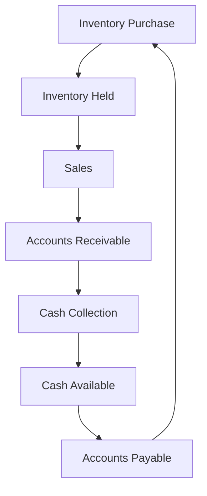

## 11.1.2 Cash Flow Management

Cash flow management is a critical aspect of financial planning and analysis, essential for maintaining the liquidity and operational efficiency of any organization. For Chartered Professional Accountant (CPA) candidates, mastering cash flow management techniques is crucial not only for passing exams but also for ensuring long-term career success in the accounting profession. This section provides an in-depth exploration of cash flow management, covering key concepts, techniques, and real-world applications relevant to the Canadian accounting context.

### Understanding Cash Flow

Cash flow refers to the movement of money into and out of a business. It is a vital indicator of a company's financial health and its ability to sustain operations, invest in growth, and meet its financial obligations. Cash flow is categorized into three main types:

1. **Operating Cash Flow (OCF):** Cash generated from core business operations, excluding capital expenditures and financing activities. It reflects the company's ability to generate sufficient cash to maintain and grow operations.

2. **Investing Cash Flow (ICF):** Cash used for or generated from investments in assets such as property, equipment, or securities. It indicates the company's growth strategy and asset management efficiency.

3. **Financing Cash Flow (FCF):** Cash received from or paid to investors and creditors, including debt issuance, equity financing, and dividend payments. It highlights the company's capital structure and financial strategy.

### Importance of Cash Flow Management

Effective cash flow management ensures that a business has enough liquidity to meet its short-term obligations and invest in long-term growth opportunities. Key benefits include:

- **Liquidity Maintenance:** Ensures the company can cover its immediate expenses and avoid insolvency.
- **Investment Opportunities:** Provides the flexibility to invest in new projects or assets without relying heavily on external financing.
- **Debt Management:** Helps in planning and managing debt repayments, reducing interest costs, and improving creditworthiness.
- **Operational Efficiency:** Enhances decision-making by providing insights into cash availability and financial constraints.

### Techniques for Optimizing Cash Flow

#### 1. Cash Flow Forecasting

Cash flow forecasting involves predicting future cash inflows and outflows to anticipate liquidity needs and plan accordingly. Effective forecasting requires:

- **Historical Analysis:** Reviewing past cash flow statements to identify patterns and trends.
- **Scenario Planning:** Developing multiple scenarios based on different assumptions to assess potential outcomes.
- **Regular Updates:** Continuously updating forecasts to reflect changes in the business environment or operational performance.

#### 2. Working Capital Management

Working capital management focuses on optimizing the components of current assets and liabilities to improve cash flow. Key strategies include:

- **Inventory Management:** Implementing just-in-time (JIT) inventory systems to reduce holding costs and free up cash.
- **Accounts Receivable Management:** Accelerating collections through early payment discounts, efficient invoicing, and credit control policies.
- **Accounts Payable Management:** Negotiating favorable payment terms with suppliers to extend payment periods without incurring penalties.

#### 3. Cash Conversion Cycle (CCC)

The cash conversion cycle measures the time taken to convert inventory and other resources into cash. Reducing the CCC can significantly enhance cash flow. It involves:

- **Shortening Inventory Days:** Reducing the time inventory is held before sale.
- **Reducing Receivables Days:** Decreasing the time taken to collect payments from customers.
- **Extending Payables Days:** Increasing the time taken to pay suppliers without damaging relationships.

#### 4. Cost Control and Reduction

Implementing cost control measures can improve cash flow by reducing unnecessary expenses. Techniques include:

- **Budgeting and Variance Analysis:** Setting budgets and analyzing variances to identify areas for cost savings.
- **Lean Operations:** Streamlining processes to eliminate waste and improve efficiency.
- **Outsourcing Non-Core Activities:** Reducing costs by outsourcing functions that are not central to the business's core operations.

#### 5. Financing Strategies

Strategic financing decisions can enhance cash flow by optimizing the capital structure. Considerations include:

- **Debt vs. Equity Financing:** Balancing debt and equity to minimize costs and maintain financial flexibility.
- **Refinancing Options:** Exploring refinancing opportunities to reduce interest rates and extend repayment terms.
- **Dividend Policies:** Adjusting dividend payouts to retain more cash within the business for reinvestment.

### Practical Examples and Case Studies

#### Example 1: Cash Flow Forecasting in a Retail Business

A Canadian retail company, XYZ Ltd., uses cash flow forecasting to manage seasonal fluctuations in sales. By analyzing historical sales data and incorporating market trends, XYZ Ltd. develops a cash flow forecast that anticipates peak and off-peak periods. This allows the company to adjust inventory levels and staffing requirements, ensuring sufficient cash is available to meet increased demand during peak seasons.

#### Example 2: Working Capital Management in Manufacturing

ABC Manufacturing, a mid-sized Canadian manufacturer, implemented a just-in-time inventory system to reduce holding costs and improve cash flow. By closely collaborating with suppliers and optimizing production schedules, ABC Manufacturing reduced its inventory days from 60 to 30, freeing up significant cash for other operational needs.

#### Example 3: Cost Control in a Service Industry

A Canadian consulting firm, DEF Consultants, conducted a comprehensive cost analysis to identify areas for improvement. By adopting lean management principles and outsourcing non-core activities, DEF Consultants reduced operational costs by 15%, resulting in improved cash flow and profitability.

### Real-World Applications and Regulatory Scenarios

In the Canadian context, cash flow management is influenced by various regulatory and economic factors. CPAs must consider the following:

- **Tax Regulations:** Understanding tax obligations and planning for tax payments to avoid cash flow disruptions.
- **Interest Rate Fluctuations:** Monitoring interest rate changes and their impact on financing costs and cash flow.
- **Economic Conditions:** Adapting cash flow strategies to respond to economic cycles, such as recessions or periods of growth.

### Step-by-Step Guidance for Cash Flow Management

1. **Analyze Current Cash Flow:** Review historical cash flow statements to identify trends and areas for improvement.
2. **Develop a Cash Flow Forecast:** Use historical data and market insights to project future cash flows.
3. **Implement Working Capital Strategies:** Optimize inventory, receivables, and payables to improve liquidity.
4. **Monitor and Adjust:** Regularly review cash flow performance and adjust strategies as needed to address changes in the business environment.

### Diagrams and Visual Aids

To enhance understanding, the following diagram illustrates the cash conversion cycle and its components:

### Best Practices and Common Pitfalls

**Best Practices:**

- **Regular Monitoring:** Continuously monitor cash flow to identify issues early and take corrective action.
- **Diversified Revenue Streams:** Develop multiple revenue sources to reduce dependency on a single income stream.
- **Strong Supplier Relationships:** Maintain good relationships with suppliers to negotiate favorable payment terms.

**Common Pitfalls:**

- **Over-Reliance on Credit:** Excessive use of credit can lead to high interest costs and cash flow strain.
- **Ignoring Economic Indicators:** Failing to consider economic trends can result in inaccurate cash flow forecasts.
- **Inadequate Contingency Planning:** Lack of contingency plans can leave a business vulnerable to unexpected cash flow disruptions.

### References and Additional Resources

- **CPA Canada:** Offers resources and guidelines on cash flow management and financial planning.
- **International Financial Reporting Standards (IFRS):** Provides standards for financial reporting and cash flow statement preparation.
- **Accounting Standards for Private Enterprises (ASPE):** Offers guidance on cash flow management for private companies in Canada.

### Summary and Key Takeaways

Effective cash flow management is essential for maintaining financial stability and supporting business growth. By understanding and applying the techniques outlined in this section, CPA candidates can enhance their financial analysis skills and contribute to the success of their organizations. Regular monitoring, strategic planning, and proactive management are key to optimizing cash flow and achieving long-term financial health.

## **Ready to Test Your Knowledge?**

**Practice 10 Essential CPA Exam Questions to Master Your Certification**



### What is the primary purpose of cash flow management?

- [x] To ensure liquidity and operational efficiency
- [ ] To maximize profits at all costs
- [ ] To minimize tax liabilities
- [ ] To increase market share

> **Explanation:** Cash flow management focuses on maintaining liquidity and operational efficiency, ensuring the business can meet its obligations and invest in growth opportunities.

### Which of the following is NOT a component of the cash conversion cycle?

- [ ] Inventory Days
- [ ] Receivables Days
- [ ] Payables Days
- [x] Dividend Days

> **Explanation:** The cash conversion cycle includes Inventory Days, Receivables Days, and Payables Days, but not Dividend Days.

### What is a key benefit of effective working capital management?

- [x] Improved liquidity
- [ ] Increased debt levels
- [ ] Higher tax liabilities
- [ ] Reduced sales

> **Explanation:** Effective working capital management improves liquidity by optimizing current assets and liabilities.

### Which strategy can help reduce the cash conversion cycle?

- [x] Implementing just-in-time inventory systems
- [ ] Increasing dividend payouts
- [ ] Extending customer credit terms
- [ ] Delaying supplier payments indefinitely

> **Explanation:** Just-in-time inventory systems reduce holding costs and shorten the cash conversion cycle.

### How can a company improve its accounts receivable management?

- [x] Offering early payment discounts
- [ ] Extending credit terms indefinitely
- [ ] Increasing inventory levels
- [ ] Reducing sales efforts

> **Explanation:** Offering early payment discounts encourages faster payment from customers, improving accounts receivable management.

### What is the impact of high interest rates on cash flow?

- [x] Increased financing costs
- [ ] Reduced tax liabilities
- [ ] Improved cash flow
- [ ] Decreased operational expenses

> **Explanation:** High interest rates increase financing costs, which can negatively impact cash flow.

### Which of the following is a common pitfall in cash flow management?

- [x] Over-reliance on credit
- [ ] Diversified revenue streams
- [ ] Strong supplier relationships
- [ ] Regular cash flow monitoring

> **Explanation:** Over-reliance on credit can lead to high interest costs and cash flow strain.

### What is a benefit of cash flow forecasting?

- [x] Anticipating liquidity needs
- [ ] Eliminating all financial risks
- [ ] Guaranteeing profit growth
- [ ] Avoiding all tax obligations

> **Explanation:** Cash flow forecasting helps anticipate liquidity needs and plan accordingly.

### True or False: Cash flow management is only important for large corporations.

- [ ] True
- [x] False

> **Explanation:** Cash flow management is important for businesses of all sizes to maintain liquidity and operational efficiency.

### Which of the following is a technique for cost control?

- [x] Lean operations
- [ ] Increasing inventory levels
- [ ] Extending credit terms
- [ ] Delaying tax payments

> **Explanation:** Lean operations streamline processes to eliminate waste and improve efficiency, aiding in cost control.


