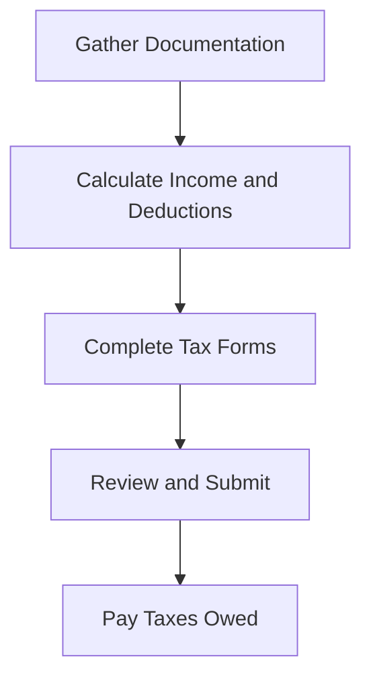

## 12.4.1 Filing Requirements

Navigating the complexities of tax filing requirements is a critical skill for any aspiring Chartered Professional Accountant (CPA) in Canada. Understanding these obligations not only ensures compliance with the Canada Revenue Agency (CRA) but also equips you with the knowledge to advise clients effectively. This section provides a comprehensive overview of the filing requirements for Canadian tax compliance, focusing on the obligations for filing tax returns and reporting income.

### Understanding Canadian Tax Filing Obligations

In Canada, tax filing requirements are governed by the Income Tax Act (ITA), which mandates that individuals, corporations, and other entities report their income and pay taxes accordingly. The CRA is responsible for administering tax laws and ensuring compliance. As a CPA, you must be familiar with the various filing requirements to guide clients through the process.

#### Key Filing Obligations

1. **Individuals**: Every individual resident in Canada must file an income tax return if they owe taxes, want to claim a refund, or receive benefits such as the Canada Child Benefit. Non-residents may also have filing obligations if they earn income from Canadian sources.

2. **Corporations**: All resident corporations must file a T2 Corporation Income Tax Return, regardless of whether they have taxable income. Non-resident corporations may also need to file if they conduct business in Canada or dispose of taxable Canadian property.

3. **Trusts and Estates**: Trusts and estates must file a T3 Trust Income Tax and Information Return to report income earned during the year.

4. **Partnerships**: While partnerships themselves do not pay taxes, they must file a T5013 Partnership Information Return to report income, deductions, and other relevant information.

5. **Self-Employed Individuals**: Those who are self-employed must report their business income on their personal tax return using Form T2125, Statement of Business or Professional Activities.

### Filing Deadlines and Penalties

Understanding the deadlines for filing tax returns is crucial to avoid penalties and interest charges. Here are the key deadlines:

- **Individuals**: The deadline for filing personal income tax returns is April 30th of the following year. Self-employed individuals have until June 15th, but any taxes owed must be paid by April 30th.

- **Corporations**: Corporate tax returns are due six months after the end of the corporation's fiscal year. However, any taxes owed must be paid within two months (or three months for certain eligible corporations) after the fiscal year-end.

- **Trusts and Estates**: The filing deadline for trusts and estates is 90 days after the end of the tax year.

- **Partnerships**: The T5013 Partnership Information Return is due by March 31st of the following year.

Failure to file by these deadlines can result in penalties, which are typically 5% of the balance owing, plus 1% for each full month the return is late, up to a maximum of 12 months. Repeated failures can lead to higher penalties.

### Reporting Income Accurately

Accurate income reporting is essential for compliance and avoiding audits. Here are some key considerations:

#### Types of Income

1. **Employment Income**: Includes wages, salaries, bonuses, and other compensation. Employers issue T4 slips to report this income.

2. **Business Income**: Self-employed individuals must report income from their business activities, including sales, services, and other revenue.

3. **Investment Income**: Includes interest, dividends, and capital gains. T5 slips report interest and dividends, while T5008 slips report securities transactions.

4. **Rental Income**: Income from renting property must be reported, and expenses related to the rental property can be deducted.

5. **Foreign Income**: Canadian residents must report worldwide income, including foreign employment, business, and investment income.

#### Deductions and Credits

Understanding available deductions and credits can significantly impact tax liability. Common deductions include:

- **RRSP Contributions**: Contributions to a Registered Retirement Savings Plan (RRSP) can be deducted from taxable income.

- **Business Expenses**: Self-employed individuals can deduct expenses related to their business, such as office supplies, travel, and advertising.

- **Home Office Expenses**: If you work from home, you may be able to deduct a portion of your home expenses.

- **Childcare Expenses**: Costs for childcare services can be deducted, reducing taxable income.

Tax credits, such as the Canada Child Benefit and the GST/HST credit, can also reduce the amount of tax owed.

### Practical Examples and Scenarios

To illustrate the filing requirements, consider the following scenarios:

#### Scenario 1: Self-Employed Consultant

Maria is a self-employed consultant who earned $80,000 in revenue last year. She incurred $20,000 in business expenses, including office supplies, travel, and marketing. Maria must report her net business income of $60,000 on her personal tax return using Form T2125. She can also contribute to her RRSP to reduce her taxable income further.

#### Scenario 2: Corporate Tax Filing

XYZ Corp., a Canadian-controlled private corporation, has a fiscal year-end of December 31st. The corporation earned $500,000 in revenue and incurred $300,000 in expenses. XYZ Corp. must file a T2 Corporation Income Tax Return by June 30th and pay any taxes owed by February 28th. The corporation can also claim the small business deduction to reduce its tax liability.

#### Scenario 3: Reporting Foreign Income

John, a Canadian resident, worked in the United States for part of the year and earned $30,000. He must report this foreign income on his Canadian tax return and may be eligible for a foreign tax credit to avoid double taxation.

### Real-World Applications and Regulatory Scenarios

Understanding filing requirements is not only crucial for compliance but also for strategic tax planning. CPAs play a vital role in advising clients on how to optimize their tax positions while adhering to regulatory requirements.

#### Case Study: Tax Planning for a Growing Business

Consider a small business that is expanding rapidly. As the business grows, it may need to consider incorporating to take advantage of tax benefits such as the small business deduction and income splitting. A CPA can help the business owner understand the filing requirements and develop a tax strategy that aligns with their growth objectives.

#### Regulatory Changes and Updates

Tax laws and regulations are subject to change, and staying informed is essential for compliance. CPAs must keep up-to-date with changes to the Income Tax Act, CRA guidelines, and other relevant legislation. This knowledge allows them to provide accurate advice and ensure clients meet their filing obligations.

### Step-by-Step Guidance for Filing

To assist you in understanding the filing process, here is a step-by-step guide:

1. **Gather Documentation**: Collect all necessary documents, including T4 slips, receipts for deductions, and records of foreign income.

2. **Calculate Income and Deductions**: Determine your total income and eligible deductions to calculate your taxable income.

3. **Complete the Appropriate Forms**: Use the correct tax forms, such as the T1 General for individuals or the T2 for corporations.

4. **Review and Submit**: Double-check your calculations and ensure all information is accurate before submitting your return to the CRA.

5. **Pay Any Taxes Owed**: Ensure any taxes owed are paid by the deadline to avoid interest and penalties.

### Diagrams and Visual Aids

To enhance understanding, consider the following diagram illustrating the tax filing process for individuals:

### Best Practices and Common Pitfalls

- **Best Practices**: Keep detailed records of all income and expenses, stay informed about tax law changes, and seek professional advice when needed.

- **Common Pitfalls**: Missing deadlines, underreporting income, and failing to claim eligible deductions can lead to penalties and audits.

### References and Additional Resources

For further exploration, consider the following resources:

- **Canada Revenue Agency (CRA)**: The CRA website provides comprehensive information on tax filing requirements and forms.

- **CPA Canada**: Offers resources and courses on tax compliance and planning.

- **Income Tax Act**: The full text of the ITA is available online for reference.

### Summary and Key Points

- Understand the filing requirements for individuals, corporations, trusts, and partnerships.
- Be aware of filing deadlines and penalties for late submissions.
- Accurately report all types of income and claim eligible deductions and credits.
- Stay informed about regulatory changes and seek professional advice when necessary.

### Practice Questions

## **Ready to Test Your Knowledge?**

**Practice 10 Essential CPA Exam Questions to Master Your Certification**



### What is the deadline for filing personal income tax returns for most individuals in Canada?

- [x] April 30th
- [ ] June 15th
- [ ] March 31st
- [ ] December 31st

> **Explanation:** The deadline for filing personal income tax returns for most individuals in Canada is April 30th of the following year.

### Which form is used by self-employed individuals to report their business income?

- [x] Form T2125
- [ ] Form T4
- [ ] Form T2
- [ ] Form T3

> **Explanation:** Self-employed individuals report their business income using Form T2125, Statement of Business or Professional Activities.

### What is the penalty for failing to file a tax return by the deadline?

- [x] 5% of the balance owing, plus 1% for each full month late
- [ ] 10% of the balance owing, plus 2% for each full month late
- [ ] 3% of the balance owing, plus 0.5% for each full month late
- [ ] No penalty if taxes are paid

> **Explanation:** The penalty for failing to file a tax return by the deadline is 5% of the balance owing, plus 1% for each full month the return is late, up to a maximum of 12 months.

### Which type of income must Canadian residents report on their tax returns?

- [x] Worldwide income
- [ ] Only Canadian income
- [ ] Only employment income
- [ ] Only investment income

> **Explanation:** Canadian residents must report worldwide income, including foreign employment, business, and investment income.

### What is the filing deadline for corporate tax returns in Canada?

- [x] Six months after the end of the fiscal year
- [ ] Three months after the end of the fiscal year
- [ ] Nine months after the end of the fiscal year
- [ ] December 31st of the following year

> **Explanation:** Corporate tax returns are due six months after the end of the corporation's fiscal year.

### What is the purpose of the T5013 Partnership Information Return?

- [x] To report income, deductions, and other relevant information for partnerships
- [ ] To report corporate income
- [ ] To report individual income
- [ ] To report trust income

> **Explanation:** The T5013 Partnership Information Return is used to report income, deductions, and other relevant information for partnerships.

### Which of the following is a common deduction for self-employed individuals?

- [x] Business expenses
- [ ] Employment income
- [ ] Investment income
- [ ] Rental income

> **Explanation:** Self-employed individuals can deduct business expenses related to their business activities.

### What is the filing deadline for trusts and estates?

- [x] 90 days after the end of the tax year
- [ ] April 30th
- [ ] June 15th
- [ ] December 31st

> **Explanation:** The filing deadline for trusts and estates is 90 days after the end of the tax year.

### Which of the following is a tax credit that can reduce the amount of tax owed?

- [x] Canada Child Benefit
- [ ] Business expenses
- [ ] Employment income
- [ ] Rental income

> **Explanation:** The Canada Child Benefit is a tax credit that can reduce the amount of tax owed.

### True or False: Non-resident corporations do not need to file a tax return if they conduct business in Canada.

- [ ] True
- [x] False

> **Explanation:** Non-resident corporations may need to file a tax return if they conduct business in Canada or dispose of taxable Canadian property.


