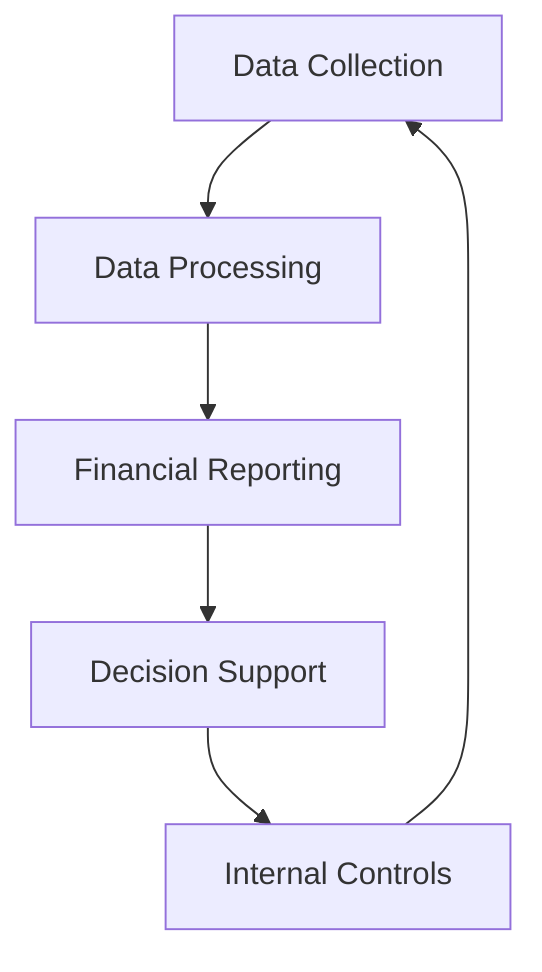

## 14.1.1 Accounting Information Systems

### Introduction to Accounting Information Systems (AIS)

Accounting Information Systems (AIS) are integral to modern accounting practices, serving as the backbone for collecting, storing, and processing financial and accounting data. These systems are designed to support the accounting functions of an organization, ensuring accuracy, efficiency, and compliance with regulatory standards. For CPA candidates, understanding AIS is crucial, as it forms a significant part of the CPA Professional Education Program (CPA PEP) and the Common Final Examination (CFE).

### Components of Accounting Information Systems

An AIS typically comprises several key components, each playing a vital role in the system's overall functionality:

1. **People**: Users who interact with the system, including accountants, managers, and IT professionals.
2. **Procedures and Instructions**: Methods for collecting, processing, and storing data.
3. **Data**: Financial information relevant to the organization's operations.
4. **Software**: Programs and applications that process data.
5. **Information Technology Infrastructure**: Hardware and networks that support the system.
6. **Internal Controls and Security Measures**: Protocols to protect data integrity and prevent unauthorized access.

### Functions of Accounting Information Systems

AIS perform several critical functions that enhance the efficiency and effectiveness of accounting processes:

- **Data Collection and Processing**: AIS automate the collection and processing of financial data, reducing manual errors and increasing speed.
- **Financial Reporting**: These systems generate financial statements and reports, ensuring compliance with standards such as IFRS and ASPE.
- **Budgeting and Forecasting**: AIS support financial planning by providing tools for budgeting and forecasting.
- **Internal Controls**: AIS enhance internal controls by providing audit trails and ensuring data accuracy.
- **Decision Support**: By providing timely and accurate information, AIS assist management in making informed decisions.

### Importance of AIS in the Canadian Accounting Context

In Canada, AIS are essential for compliance with national and international accounting standards. They facilitate the preparation of financial statements in accordance with the International Financial Reporting Standards (IFRS) and the Accounting Standards for Private Enterprises (ASPE). Moreover, AIS support the implementation of Public Sector Accounting Standards (PSAS) for government entities.

### Real-World Applications and Case Studies

#### Case Study: Implementation of AIS in a Canadian Corporation

Consider a Canadian manufacturing company that implemented an AIS to streamline its accounting processes. Prior to the implementation, the company faced challenges with manual data entry errors and delayed financial reporting. By adopting an AIS, the company automated its data collection and processing, resulting in more accurate financial statements and timely reports. This case highlights the transformative impact of AIS on organizational efficiency and compliance.

### Regulatory Considerations and Compliance

AIS must adhere to various regulatory requirements to ensure data security and integrity. In Canada, organizations must comply with the Personal Information Protection and Electronic Documents Act (PIPEDA) to protect personal data. Additionally, AIS should align with the guidelines set by CPA Canada to ensure compliance with accounting standards.

### Best Practices for Implementing AIS

1. **Needs Assessment**: Conduct a thorough assessment of the organization's accounting needs to select the appropriate AIS.
2. **Customization**: Tailor the AIS to fit the specific requirements of the organization.
3. **Training**: Provide comprehensive training to users to maximize the system's effectiveness.
4. **Data Security**: Implement robust security measures to protect sensitive financial data.
5. **Continuous Monitoring and Evaluation**: Regularly assess the system's performance and make necessary adjustments.

### Challenges and Solutions in AIS Implementation

Implementing an AIS can present several challenges, including resistance to change, data migration issues, and integration with existing systems. To overcome these challenges, organizations should:

- **Engage Stakeholders**: Involve all relevant stakeholders in the implementation process to gain buy-in and support.
- **Plan Data Migration Carefully**: Develop a detailed plan for migrating data from legacy systems to the new AIS.
- **Ensure System Compatibility**: Verify that the AIS is compatible with existing IT infrastructure.

### Emerging Trends in Accounting Information Systems

The field of AIS is continually evolving, with emerging technologies such as blockchain, artificial intelligence (AI), and data analytics playing an increasingly significant role. These technologies offer new opportunities for enhancing the functionality and efficiency of AIS:

- **Blockchain**: Provides a secure and transparent way to record transactions, reducing the risk of fraud.
- **Artificial Intelligence**: Automates routine accounting tasks, allowing accountants to focus on more strategic activities.
- **Data Analytics**: Enables organizations to gain insights from large volumes of financial data, supporting better decision-making.

### Diagram: AIS Workflow

Below is a diagram illustrating the typical workflow of an Accounting Information System:

### Conclusion

Accounting Information Systems are indispensable tools for modern accountants, providing the infrastructure necessary for efficient and accurate financial management. For CPA candidates, mastering the concepts and applications of AIS is essential for success in the CPA PEP and CFE. By understanding the components, functions, and regulatory considerations of AIS, candidates can enhance their exam preparation and future career prospects.

## **Ready to Test Your Knowledge?**

**Practice 10 Essential CPA Exam Questions to Master Your Certification**



### What is the primary purpose of an Accounting Information System (AIS)?

- [x] To collect, store, and process financial and accounting data
- [ ] To manage human resources
- [ ] To develop marketing strategies
- [ ] To design IT infrastructure

> **Explanation:** The primary purpose of an AIS is to collect, store, and process financial and accounting data, supporting the accounting functions of an organization.

### Which component of AIS involves users such as accountants and managers?

- [x] People
- [ ] Software
- [ ] Data
- [ ] IT Infrastructure

> **Explanation:** The "People" component of AIS involves users who interact with the system, including accountants, managers, and IT professionals.

### What is a key function of AIS in financial reporting?

- [x] Generating financial statements and reports
- [ ] Conducting market research
- [ ] Managing supply chains
- [ ] Developing new products

> **Explanation:** AIS generate financial statements and reports, ensuring compliance with accounting standards such as IFRS and ASPE.

### How do AIS enhance internal controls?

- [x] By providing audit trails and ensuring data accuracy
- [ ] By increasing marketing reach
- [ ] By reducing production costs
- [ ] By expanding customer base

> **Explanation:** AIS enhance internal controls by providing audit trails and ensuring data accuracy, which helps in maintaining the integrity of financial information.

### What is a common challenge in AIS implementation?

- [x] Resistance to change
- [ ] Increased marketing costs
- [ ] Decreased product quality
- [ ] Reduced customer satisfaction

> **Explanation:** Resistance to change is a common challenge in AIS implementation, as employees may be hesitant to adopt new systems and processes.

### Which emerging technology offers a secure way to record transactions in AIS?

- [x] Blockchain
- [ ] Virtual Reality
- [ ] Augmented Reality
- [ ] 3D Printing

> **Explanation:** Blockchain provides a secure and transparent way to record transactions, reducing the risk of fraud in AIS.

### What regulatory act must Canadian AIS comply with to protect personal data?

- [x] Personal Information Protection and Electronic Documents Act (PIPEDA)
- [ ] Sarbanes-Oxley Act
- [ ] Dodd-Frank Act
- [ ] Gramm-Leach-Bliley Act

> **Explanation:** Canadian AIS must comply with the Personal Information Protection and Electronic Documents Act (PIPEDA) to protect personal data.

### What is a benefit of using AI in AIS?

- [x] Automating routine accounting tasks
- [ ] Increasing manual data entry
- [ ] Reducing data accuracy
- [ ] Limiting financial reporting

> **Explanation:** AI automates routine accounting tasks, allowing accountants to focus on more strategic activities and improving overall efficiency.

### Which AIS component involves methods for collecting and processing data?

- [x] Procedures and Instructions
- [ ] People
- [ ] Software
- [ ] Data

> **Explanation:** Procedures and Instructions involve methods for collecting, processing, and storing data within an AIS.

### True or False: AIS are only used for financial reporting.

- [ ] True
- [x] False

> **Explanation:** False. AIS are used for various functions, including data collection, financial reporting, budgeting, forecasting, internal controls, and decision support.


