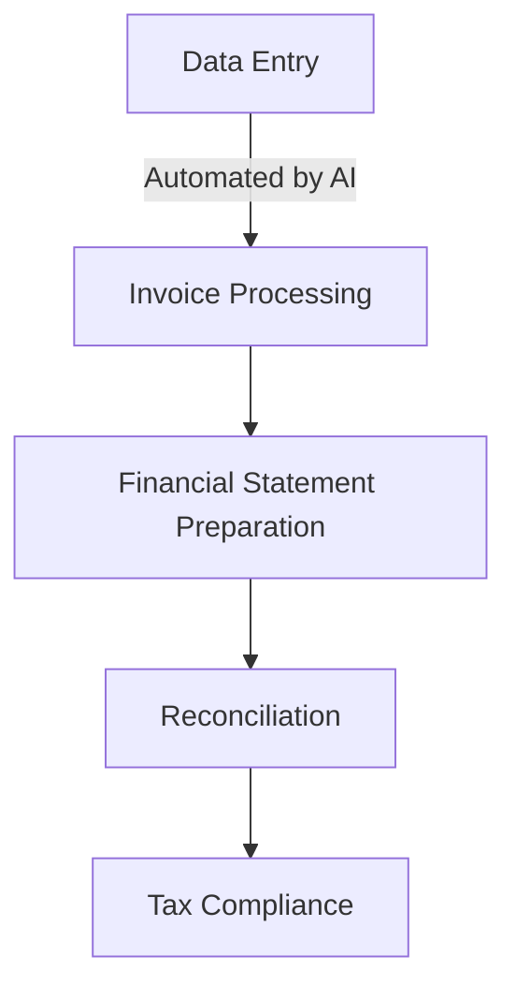
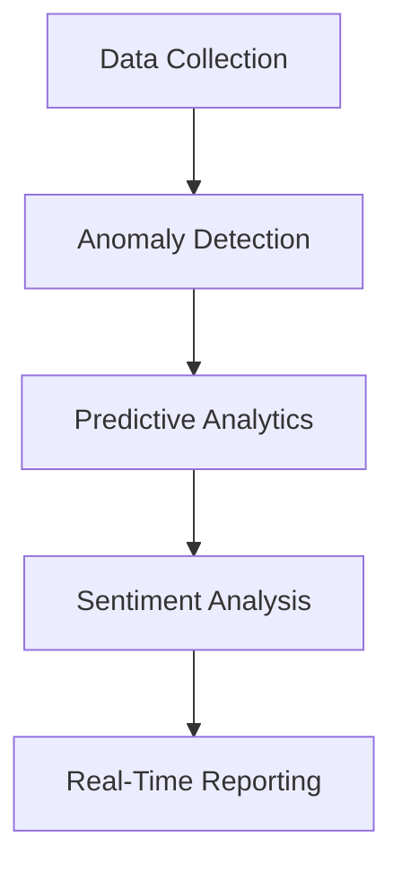

## 14.3.2 Artificial Intelligence

Artificial Intelligence (AI) is transforming the accounting profession, offering unprecedented opportunities to enhance efficiency, accuracy, and strategic decision-making. As a future Chartered Professional Accountant (CPA) in Canada, understanding AI's role in automating accounting processes and data analysis is crucial. This section explores AI applications in accounting, providing insights into how these technologies can be leveraged to improve practice and meet the evolving demands of the profession.

### Introduction to Artificial Intelligence in Accounting

Artificial Intelligence refers to the simulation of human intelligence processes by machines, particularly computer systems. These processes include learning, reasoning, problem-solving, perception, and language understanding. In accounting, AI is primarily used to automate repetitive tasks, analyze large datasets, and provide insights that drive strategic decisions.

#### Key Concepts of AI in Accounting

1. **Automation**: AI automates routine tasks such as data entry, invoice processing, and reconciliation, freeing accountants to focus on more strategic activities.
2. **Data Analysis**: AI algorithms can analyze vast amounts of data quickly and accurately, identifying trends and anomalies that may not be immediately apparent to human analysts.
3. **Predictive Analytics**: AI uses historical data to predict future trends, helping businesses make informed decisions.
4. **Natural Language Processing (NLP)**: This AI capability allows machines to understand and interpret human language, facilitating tasks such as document review and customer interaction.

### AI Applications in Automating Accounting Processes

AI is revolutionizing traditional accounting processes by automating tasks that were once time-consuming and prone to human error. Here are some key areas where AI is making a significant impact:

#### 1. Invoice Processing and Accounts Payable

AI systems can automatically extract data from invoices, match them with purchase orders, and process payments. This reduces the time spent on manual data entry and minimizes errors. For example, AI-powered tools like OCR (Optical Character Recognition) can scan and interpret invoice data, streamlining the accounts payable process.

#### 2. Financial Statement Preparation

AI can automate the preparation of financial statements by aggregating data from various sources, ensuring accuracy and compliance with accounting standards. This automation allows CPAs to focus on analyzing the financial health of an organization rather than compiling data.

#### 3. Reconciliation

AI tools can reconcile accounts by matching transactions across different systems and identifying discrepancies. This automation reduces the time spent on manual reconciliation and improves accuracy.

#### 4. Tax Compliance

AI can assist in tax preparation by analyzing financial data, identifying applicable deductions, and ensuring compliance with tax regulations. This not only speeds up the tax filing process but also reduces the risk of errors and audits.

### AI in Data Analysis for Accountants

AI's ability to analyze large datasets quickly and accurately is transforming how accountants approach data analysis. Here are some ways AI is enhancing data analysis in accounting:

#### 1. Anomaly Detection

AI algorithms can detect unusual patterns or anomalies in financial data, which may indicate fraud or errors. This capability is particularly valuable in audit processes, where identifying discrepancies is crucial.

#### 2. Predictive Analytics

AI can analyze historical data to predict future trends, such as cash flow projections or sales forecasts. This predictive capability helps businesses make informed decisions and plan for the future.

#### 3. Sentiment Analysis

AI can analyze customer feedback and social media data to gauge public sentiment about a company. This information can be valuable for strategic decision-making and risk management.

#### 4. Real-Time Reporting

AI enables real-time financial reporting by continuously analyzing data and updating reports. This allows businesses to make timely decisions based on the most current information.

### Practical Examples and Case Studies

To illustrate the impact of AI in accounting, let's explore some practical examples and case studies:

#### Case Study 1: Automating Invoice Processing

A Canadian manufacturing company implemented an AI-powered invoice processing system. The system automatically extracted data from invoices, matched them with purchase orders, and processed payments. As a result, the company reduced its invoice processing time by 70% and decreased errors by 90%.

#### Case Study 2: AI in Audit Processes

A large accounting firm used AI to enhance its audit processes. The AI system analyzed financial data to identify anomalies and potential fraud. This allowed auditors to focus on high-risk areas, improving the efficiency and effectiveness of the audit.

#### Case Study 3: Predictive Analytics for Financial Planning

A retail company used AI-driven predictive analytics to forecast sales and optimize inventory levels. By analyzing historical sales data and market trends, the company improved its sales forecasts by 30% and reduced inventory costs by 15%.

### Real-World Applications and Regulatory Scenarios

AI's integration into accounting practices is not without challenges, particularly regarding regulatory compliance and ethical considerations. Here are some real-world applications and regulatory scenarios to consider:

#### 1. Compliance with Accounting Standards

AI systems must comply with Canadian accounting standards, such as IFRS and ASPE. Ensuring that AI-generated financial reports adhere to these standards is crucial for maintaining accuracy and credibility.

#### 2. Data Privacy and Security

AI systems often handle sensitive financial data, making data privacy and security a top priority. Compliance with regulations such as PIPEDA is essential to protect client information and maintain trust.

#### 3. Ethical Considerations

AI's ability to automate decision-making raises ethical concerns, particularly regarding transparency and accountability. CPAs must ensure that AI systems are used ethically and that decisions are transparent and justifiable.

### Step-by-Step Guidance for Implementing AI in Accounting

Implementing AI in accounting requires careful planning and execution. Here is a step-by-step guide to help you integrate AI into your accounting practices:

#### Step 1: Identify Opportunities for Automation

Evaluate your current accounting processes to identify tasks that can be automated using AI. Focus on repetitive, time-consuming tasks that are prone to errors.

#### Step 2: Choose the Right AI Tools

Select AI tools that align with your business needs and objectives. Consider factors such as ease of use, integration capabilities, and cost.

#### Step 3: Train Your Team

Provide training to your accounting team to ensure they understand how to use AI tools effectively. This may involve workshops, online courses, or hands-on training sessions.

#### Step 4: Monitor and Evaluate

Continuously monitor the performance of AI systems and evaluate their impact on your accounting processes. Make adjustments as needed to optimize efficiency and effectiveness.

#### Step 5: Ensure Compliance

Ensure that AI systems comply with relevant accounting standards and regulations. Regularly review and update your compliance policies to reflect changes in regulations.

### Diagrams and Visuals

To enhance your understanding of AI in accounting, let's explore some diagrams and visuals:

#### AI in Accounting Processes

#### AI in Data Analysis

### Best Practices and Common Pitfalls

When implementing AI in accounting, it's important to follow best practices and avoid common pitfalls:

#### Best Practices

- **Start Small**: Begin with small-scale AI projects to test their effectiveness before scaling up.
- **Focus on Quality Data**: Ensure that the data used by AI systems is accurate and reliable.
- **Collaborate with IT**: Work closely with your IT department to ensure seamless integration of AI tools.

#### Common Pitfalls

- **Overreliance on AI**: Avoid relying solely on AI for decision-making. Human judgment is still essential.
- **Ignoring Compliance**: Ensure that AI systems comply with accounting standards and regulations.
- **Neglecting Training**: Provide adequate training to your team to ensure they can use AI tools effectively.

### References and Additional Resources

For further exploration of AI in accounting, consider the following resources:

- **CPA Canada**: Offers resources and guidance on integrating AI into accounting practices.
- **IFRS and ASPE Standards**: Ensure compliance with Canadian accounting standards.
- **Online Courses**: Platforms like Coursera and Udemy offer courses on AI and data analysis.

### Conclusion

Artificial Intelligence is revolutionizing the accounting profession, offering CPAs in Canada the opportunity to enhance efficiency, accuracy, and strategic decision-making. By understanding AI's role in automating accounting processes and data analysis, you can leverage these technologies to improve your practice and meet the evolving demands of the profession.

## **Ready to Test Your Knowledge?**

**Practice 10 Essential CPA Exam Questions to Master Your Certification**



### What is one of the primary benefits of using AI in accounting?

- [x] Automating repetitive tasks
- [ ] Increasing manual data entry
- [ ] Reducing the need for compliance
- [ ] Eliminating the need for human oversight

> **Explanation:** AI automates repetitive tasks, freeing accountants to focus on strategic activities.

### How does AI assist in financial statement preparation?

- [x] By aggregating data from various sources
- [ ] By manually entering data
- [ ] By ignoring accounting standards
- [ ] By eliminating the need for audits

> **Explanation:** AI automates the preparation of financial statements by aggregating data, ensuring accuracy and compliance.

### What is a key application of AI in data analysis for accountants?

- [x] Anomaly detection
- [ ] Manual reconciliation
- [ ] Increasing data entry errors
- [ ] Reducing data analysis

> **Explanation:** AI algorithms detect unusual patterns or anomalies in financial data, which may indicate fraud or errors.

### Which AI capability allows machines to understand human language?

- [x] Natural Language Processing (NLP)
- [ ] Optical Character Recognition (OCR)
- [ ] Predictive Analytics
- [ ] Data Mining

> **Explanation:** NLP allows machines to understand and interpret human language, facilitating tasks such as document review.

### What is a common pitfall when implementing AI in accounting?

- [x] Overreliance on AI
- [ ] Ensuring compliance
- [ ] Providing adequate training
- [ ] Collaborating with IT

> **Explanation:** Overreliance on AI can lead to neglecting human judgment, which is still essential in decision-making.

### How can AI enhance tax compliance?

- [x] By analyzing financial data and identifying deductions
- [ ] By ignoring tax regulations
- [ ] By increasing manual tax filing
- [ ] By eliminating the need for audits

> **Explanation:** AI assists in tax preparation by analyzing data, identifying deductions, and ensuring compliance with regulations.

### What is a best practice when implementing AI in accounting?

- [x] Start small with AI projects
- [ ] Ignore data quality
- [ ] Rely solely on AI for decisions
- [ ] Neglect training

> **Explanation:** Starting with small-scale AI projects allows testing effectiveness before scaling up.

### Which AI application helps in predicting future trends?

- [x] Predictive Analytics
- [ ] Data Entry
- [ ] Manual Reconciliation
- [ ] Invoice Processing

> **Explanation:** Predictive analytics uses historical data to predict future trends, aiding in decision-making.

### What is a key consideration for AI systems handling financial data?

- [x] Data privacy and security
- [ ] Increasing data entry errors
- [ ] Reducing compliance
- [ ] Eliminating human oversight

> **Explanation:** Data privacy and security are crucial for AI systems handling sensitive financial data.

### True or False: AI can replace human judgment entirely in accounting.

- [ ] True
- [x] False

> **Explanation:** While AI enhances efficiency, human judgment is still essential in decision-making and ethical considerations.


