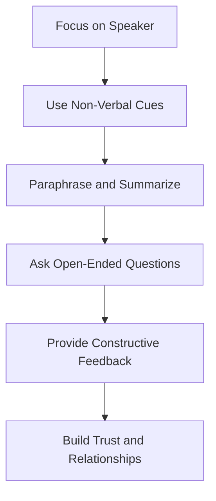

## 16.2.2 Active Listening

Active listening is a critical skill for Chartered Professional Accountants (CPAs) as it enhances communication, fosters better relationships, and ensures accurate understanding of complex financial information. In the accounting profession, where precision and clarity are paramount, active listening can significantly impact your effectiveness and success. This section will delve into the strategies and techniques of active listening, providing practical examples and scenarios relevant to the Canadian accounting profession.

### Understanding Active Listening

Active listening goes beyond merely hearing words; it involves fully engaging with the speaker, understanding their message, and responding thoughtfully. This process requires concentration, empathy, and a willingness to set aside personal biases and distractions. Active listening is essential for CPAs as it aids in gathering accurate information, understanding client needs, and making informed decisions.

#### Key Components of Active Listening

1. **Paying Attention**: Focus entirely on the speaker, avoiding distractions and maintaining eye contact. This shows respect and interest in their message.

2. **Showing That You're Listening**: Use verbal and non-verbal cues such as nodding, smiling, and appropriate facial expressions to indicate engagement.

3. **Providing Feedback**: Reflect on what has been said by paraphrasing or summarizing the speaker's points. This helps clarify understanding and shows that you are actively processing the information.

4. **Deferring Judgment**: Avoid forming opinions or interrupting while the speaker is talking. Allow them to express their thoughts fully before responding.

5. **Responding Appropriately**: Offer considered responses that reflect an understanding of the speaker's message. This may involve asking questions, providing insights, or offering solutions.

### The Importance of Active Listening in Accounting

In the accounting field, active listening is crucial for several reasons:

- **Accurate Information Gathering**: CPAs often deal with complex financial data and client instructions. Active listening ensures that you accurately capture and interpret this information.

- **Building Trust and Relationships**: Clients and colleagues value being heard and understood. Active listening fosters trust and strengthens professional relationships.

- **Effective Problem Solving**: By fully understanding the issues at hand, CPAs can develop more effective solutions and strategies.

- **Enhanced Collaboration**: In team settings, active listening promotes better collaboration and idea sharing, leading to more innovative outcomes.

### Strategies for Effective Active Listening

#### 1. **Prepare Mentally and Physically**

Before engaging in a conversation, prepare yourself mentally by clearing your mind of distractions and focusing on the upcoming interaction. Physically, ensure you are in a comfortable position that allows you to maintain eye contact and engage with the speaker.

#### 2. **Use Open-Ended Questions**

Encourage the speaker to elaborate on their points by asking open-ended questions. This not only demonstrates your interest but also provides more comprehensive information.

#### 3. **Paraphrase and Summarize**

Periodically paraphrase or summarize what the speaker has said to confirm your understanding. This technique also allows the speaker to correct any misunderstandings immediately.

#### 4. **Practice Empathy**

Put yourself in the speaker's shoes to better understand their perspective and emotions. Empathy enhances your ability to connect with others and respond appropriately.

#### 5. **Manage Your Reactions**

Be aware of your emotional responses and manage them effectively. Avoid letting personal biases or emotions interfere with your ability to listen objectively.

#### 6. **Provide Constructive Feedback**

When responding, offer feedback that is constructive and relevant to the speaker's message. Avoid criticism or judgment, focusing instead on solutions and support.

### Practical Examples and Scenarios

#### Example 1: Client Consultation

During a client consultation, a CPA must actively listen to understand the client's financial goals and concerns. By using active listening techniques, the CPA can accurately assess the client's needs and provide tailored advice.

#### Example 2: Team Meetings

In team meetings, active listening ensures that all members' ideas are heard and considered. This fosters a collaborative environment where innovative solutions can emerge.

#### Example 3: Conflict Resolution

Active listening is vital in resolving conflicts, as it allows CPAs to understand all parties' perspectives and mediate effectively. By acknowledging each person's viewpoint, a CPA can facilitate a resolution that satisfies everyone involved.

### Real-World Applications and Regulatory Scenarios

Active listening is not only a soft skill but also a critical component in regulatory compliance and ethical decision-making. For instance, when dealing with regulatory bodies or auditors, CPAs must listen actively to understand compliance requirements and address any concerns effectively.

#### Regulatory Scenario: Audit Engagement

During an audit engagement, a CPA must actively listen to the client's explanations and justifications for financial discrepancies. This ensures that the CPA gathers all necessary information to make informed audit decisions and maintain compliance with auditing standards.

### Step-by-Step Guidance for Active Listening

1. **Set the Stage**: Choose a conducive environment for the conversation, free from distractions and interruptions.

2. **Engage Fully**: Focus on the speaker, maintaining eye contact and using body language to show engagement.

3. **Listen for Understanding**: Pay attention to both verbal and non-verbal cues to fully grasp the speaker's message.

4. **Reflect and Clarify**: Use paraphrasing and summarizing to confirm understanding and clarify any ambiguities.

5. **Respond Thoughtfully**: Provide responses that are relevant, supportive, and constructive, addressing the speaker's needs and concerns.

### Diagrams and Visual Aids

To enhance understanding, consider the following diagram illustrating the active listening process:

### Best Practices, Common Pitfalls, and Strategies

#### Best Practices

- **Be Present**: Fully engage with the speaker, setting aside distractions and focusing on their message.
- **Practice Patience**: Allow the speaker to express their thoughts without interruption.
- **Show Empathy**: Understand and acknowledge the speaker's emotions and perspectives.

#### Common Pitfalls

- **Interrupting the Speaker**: Avoid cutting off the speaker, as this can disrupt their train of thought and hinder communication.
- **Assuming Understanding**: Do not assume you understand the speaker's message without verifying through paraphrasing or summarizing.
- **Letting Biases Interfere**: Be aware of personal biases that may affect your ability to listen objectively.

#### Strategies to Overcome Challenges

- **Mindfulness Techniques**: Practice mindfulness to enhance focus and reduce distractions during conversations.
- **Active Listening Exercises**: Engage in exercises that improve listening skills, such as role-playing scenarios or listening to audio recordings and summarizing them.

### References and Additional Resources

- **CPA Canada Resources**: Access CPA Canada's materials on communication skills and professional development.
- **International Financial Reporting Standards (IFRS)**: Familiarize yourself with IFRS guidelines to enhance your understanding of financial reporting.
- **Professional Development Workshops**: Attend workshops and seminars focused on active listening and communication skills.

### Summary and Key Points

Active listening is an essential skill for CPAs, enabling effective communication, accurate information gathering, and strong professional relationships. By mastering active listening techniques, you can enhance your effectiveness as a CPA and succeed in your career.

### Practice Questions and Exercises

To reinforce your understanding of active listening, consider the following practice questions and exercises:

1. **Role-Playing Scenarios**: Engage in role-playing exercises with colleagues to practice active listening in various professional contexts.

2. **Listening Journals**: Keep a journal of your listening experiences, noting challenges and strategies for improvement.

3. **Feedback Sessions**: Seek feedback from peers on your listening skills and areas for development.

## **Ready to Test Your Knowledge?**

**Practice 10 Essential CPA Exam Questions to Master Your Certification**



### What is the primary goal of active listening in a professional setting?

- [x] To fully understand and accurately interpret the speaker's message
- [ ] To respond quickly to the speaker
- [ ] To dominate the conversation
- [ ] To impress the speaker with your knowledge

> **Explanation:** The primary goal of active listening is to fully understand and accurately interpret the speaker's message, ensuring effective communication.

### Which of the following is a key component of active listening?

- [x] Providing feedback
- [ ] Interrupting the speaker
- [ ] Multitasking during the conversation
- [ ] Assuming you understand the speaker

> **Explanation:** Providing feedback is a key component of active listening, as it helps confirm understanding and shows engagement.

### How can a CPA demonstrate active listening during a client meeting?

- [x] By paraphrasing the client's concerns
- [ ] By focusing on their own agenda
- [ ] By interrupting the client to offer solutions
- [ ] By checking their phone during the meeting

> **Explanation:** Paraphrasing the client's concerns demonstrates active listening and ensures accurate understanding.

### What is a common pitfall in active listening?

- [x] Interrupting the speaker
- [ ] Asking open-ended questions
- [ ] Providing constructive feedback
- [ ] Using non-verbal cues

> **Explanation:** Interrupting the speaker is a common pitfall in active listening, as it disrupts the flow of communication.

### Which strategy can enhance active listening skills?

- [x] Practicing mindfulness techniques
- [ ] Multitasking during conversations
- [ ] Assuming you know what the speaker will say
- [ ] Focusing on your own response

> **Explanation:** Practicing mindfulness techniques can enhance focus and improve active listening skills.

### What role does empathy play in active listening?

- [x] It helps understand the speaker's perspective and emotions
- [ ] It allows you to dominate the conversation
- [ ] It encourages you to interrupt the speaker
- [ ] It focuses on your own needs

> **Explanation:** Empathy helps understand the speaker's perspective and emotions, enhancing the connection and communication.

### How can a CPA manage their reactions during a conversation?

- [x] By being aware of their emotional responses
- [ ] By interrupting the speaker
- [ ] By focusing on their own agenda
- [ ] By ignoring the speaker's emotions

> **Explanation:** Being aware of emotional responses helps manage reactions and maintain objectivity during conversations.

### What is the benefit of using open-ended questions in active listening?

- [x] They encourage the speaker to elaborate on their points
- [ ] They allow you to dominate the conversation
- [ ] They focus on your own needs
- [ ] They limit the speaker's responses

> **Explanation:** Open-ended questions encourage the speaker to elaborate on their points, providing more comprehensive information.

### Which of the following is a best practice in active listening?

- [x] Being present and fully engaged
- [ ] Interrupting the speaker
- [ ] Assuming you understand the speaker
- [ ] Letting biases interfere

> **Explanation:** Being present and fully engaged is a best practice in active listening, ensuring effective communication.

### True or False: Active listening is only important in personal relationships, not in professional settings.

- [ ] True
- [x] False

> **Explanation:** False. Active listening is crucial in both personal and professional settings, enhancing communication and understanding.



By mastering active listening, you can significantly enhance your communication skills, build stronger relationships, and excel in your career as a Chartered Professional Accountant.
