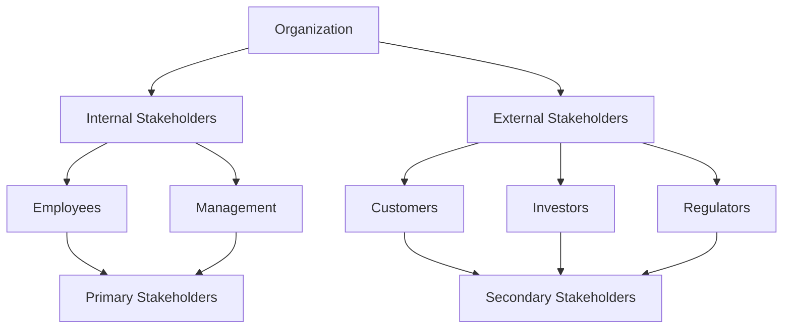

## 16.3.1 Understanding Stakeholders

In the realm of accounting, understanding stakeholders is crucial for effective communication and successful professional practice. Stakeholders are individuals or groups with an interest in the activities and outcomes of an organization. They can influence or be influenced by the organization's decisions, policies, and practices. As a Chartered Professional Accountant (CPA), you will interact with a diverse array of stakeholders, each with unique needs, expectations, and communication preferences. This section will guide you through the process of identifying, analyzing, and effectively communicating with stakeholders to enhance your professional relationships and career success.

### The Importance of Stakeholder Understanding

Understanding stakeholders is essential for several reasons:

1. **Effective Communication**: Tailoring your communication style to meet the needs of different stakeholders ensures that your message is understood and well-received.

2. **Building Trust**: By understanding stakeholders' perspectives and concerns, you can build trust and credibility, which are vital for long-term professional relationships.

3. **Informed Decision-Making**: Stakeholders provide valuable insights and feedback that can inform decision-making processes and improve organizational outcomes.

4. **Conflict Resolution**: Recognizing and addressing stakeholder concerns can help prevent and resolve conflicts, fostering a collaborative work environment.

5. **Enhancing Reputation**: Positive stakeholder relationships contribute to a strong professional reputation, which can open doors to new opportunities and career advancement.

### Identifying Stakeholders

The first step in understanding stakeholders is identifying who they are. Stakeholders can be categorized into several groups:

- **Internal Stakeholders**: These include employees, management, and board members who are directly involved in the organization's operations.

- **External Stakeholders**: These are individuals or groups outside the organization, such as customers, suppliers, investors, regulators, and the community.

- **Primary Stakeholders**: Those who have a direct interest in the organization's activities, such as shareholders and employees.

- **Secondary Stakeholders**: Those who have an indirect interest, such as the media and special interest groups.

#### Example: Stakeholder Identification in a CPA Firm

Consider a CPA firm preparing to implement a new accounting software system. The stakeholders might include:

- **Internal Stakeholders**: Accountants, IT staff, and management who will use and support the system.

- **External Stakeholders**: Clients who will receive reports generated by the system, and software vendors providing the technology.

- **Primary Stakeholders**: The firm's partners who have invested in the software.

- **Secondary Stakeholders**: Industry regulators interested in the firm's compliance with accounting standards.

### Analyzing Stakeholder Needs and Expectations

Once stakeholders are identified, the next step is to analyze their needs and expectations. This involves understanding what each stakeholder group values and how they define success. Key considerations include:

- **Interests**: What are the stakeholders' primary concerns and objectives?

- **Influence**: How much power do stakeholders have to affect the organization's decisions?

- **Impact**: How are stakeholders affected by the organization's actions?

- **Communication Preferences**: What are the preferred channels and styles of communication for each stakeholder group?

#### Case Study: Analyzing Stakeholder Needs in a Financial Audit

In a financial audit, stakeholders such as company management, shareholders, and regulatory bodies have different needs:

- **Management**: Interested in accurate and timely financial reporting to make informed business decisions.

- **Shareholders**: Focused on the financial health and profitability of the company to assess investment returns.

- **Regulatory Bodies**: Concerned with compliance with accounting standards and regulations to ensure transparency and accountability.

### Tailoring Communication to Stakeholders

Effective communication with stakeholders requires adapting your message to suit their needs and preferences. This involves:

1. **Understanding the Audience**: Consider the stakeholder's background, knowledge level, and interests.

2. **Choosing the Right Medium**: Select the appropriate communication channel, such as email, meetings, reports, or presentations.

3. **Crafting the Message**: Use clear and concise language, avoiding jargon unless it is understood by the audience.

4. **Engaging the Audience**: Use storytelling, visuals, and examples to make the message relatable and engaging.

5. **Seeking Feedback**: Encourage stakeholders to provide feedback and ask questions to ensure understanding.

#### Practical Example: Tailoring Communication in a Budget Presentation

When presenting a budget to different stakeholders, a CPA might:

- **For Management**: Focus on strategic goals, cost-saving measures, and return on investment.

- **For Employees**: Highlight how the budget impacts their roles, resources available, and potential benefits.

- **For Investors**: Emphasize financial performance, growth projections, and risk management strategies.

### Real-World Applications and Regulatory Scenarios

Understanding stakeholders is not only crucial for effective communication but also for navigating regulatory environments and ensuring compliance. CPAs must be aware of the regulatory landscape and how it affects stakeholder relationships.

#### Regulatory Scenario: Engaging with Regulators

In Canada, CPAs must comply with regulations set by bodies such as the Canadian Securities Administrators (CSA) and the Financial Transactions and Reports Analysis Centre of Canada (FINTRAC). Engaging with these regulators involves:

- **Understanding Regulatory Requirements**: Stay informed about changes in regulations and how they impact stakeholders.

- **Communicating Compliance Efforts**: Clearly articulate how the organization meets regulatory standards and addresses stakeholder concerns.

- **Building Collaborative Relationships**: Foster open communication with regulators to address issues proactively and avoid potential conflicts.

### Best Practices for Stakeholder Engagement

To effectively engage with stakeholders, CPAs should adopt the following best practices:

1. **Regular Communication**: Maintain consistent and open lines of communication with stakeholders to keep them informed and engaged.

2. **Active Listening**: Pay attention to stakeholder feedback and concerns, demonstrating empathy and understanding.

3. **Transparency**: Be honest and transparent in all communications, building trust and credibility.

4. **Flexibility**: Be willing to adapt communication strategies to meet changing stakeholder needs and expectations.

5. **Continuous Improvement**: Regularly assess and refine communication approaches to enhance stakeholder engagement.

### Common Pitfalls and Challenges

While understanding stakeholders is crucial, it is not without challenges. Common pitfalls include:

- **Assuming Homogeneity**: Treating all stakeholders as a single group without recognizing their unique needs and preferences.

- **Overlooking Indirect Stakeholders**: Focusing solely on primary stakeholders and neglecting those with indirect interests.

- **Ineffective Communication**: Using inappropriate communication channels or failing to tailor messages to the audience.

- **Resistance to Change**: Encountering stakeholder resistance when implementing new initiatives or changes.

### Strategies to Overcome Challenges

To overcome these challenges, CPAs can employ the following strategies:

- **Stakeholder Mapping**: Create a visual representation of stakeholders, their interests, and influence to guide communication efforts.

- **Feedback Mechanisms**: Implement systems for stakeholders to provide feedback and voice concerns, such as surveys or focus groups.

- **Training and Development**: Invest in communication skills training to enhance stakeholder engagement capabilities.

- **Change Management**: Develop a change management plan to address stakeholder resistance and facilitate smooth transitions.

### Diagrams and Visual Aids

To enhance understanding, the following Mermaid.js diagram illustrates a stakeholder mapping process:

### Conclusion

Understanding stakeholders is a fundamental skill for CPAs, enabling effective communication, informed decision-making, and successful professional relationships. By identifying stakeholders, analyzing their needs, and tailoring communication strategies, CPAs can enhance their impact and contribute to organizational success. Remember to engage stakeholders regularly, listen actively, and adapt to their evolving needs to build trust and credibility.

### References and Further Reading

- CPA Canada. (2023). "The CPA Competency Map: Understanding the Skills You Need to Succeed."
- International Financial Reporting Standards (IFRS) as adopted in Canada.
- Canadian Securities Administrators (CSA) guidelines.
- Financial Transactions and Reports Analysis Centre of Canada (FINTRAC) compliance requirements.

## **Ready to Test Your Knowledge?**

**Practice 10 Essential CPA Exam Questions to Master Your Certification**



### Who are considered internal stakeholders in an organization?

- [x] Employees and management
- [ ] Customers and suppliers
- [ ] Investors and regulators
- [ ] Media and special interest groups

> **Explanation:** Internal stakeholders are those directly involved in the organization's operations, such as employees and management.

### What is a primary stakeholder?

- [x] An individual with a direct interest in the organization's activities
- [ ] Someone with an indirect interest in the organization
- [ ] A person who has no influence on the organization
- [ ] A stakeholder who is external to the organization

> **Explanation:** Primary stakeholders have a direct interest in the organization's activities, such as shareholders and employees.

### Why is it important to tailor communication to stakeholders?

- [x] To ensure the message is understood and well-received
- [ ] To make the communication process longer
- [ ] To confuse stakeholders with complex language
- [ ] To avoid engaging with stakeholders

> **Explanation:** Tailoring communication ensures that the message is clear and meets the needs of different stakeholders, enhancing understanding and engagement.

### What is a common pitfall in stakeholder engagement?

- [x] Assuming all stakeholders have the same needs
- [ ] Regularly communicating with stakeholders
- [ ] Actively listening to stakeholder feedback
- [ ] Being transparent in communications

> **Explanation:** A common pitfall is assuming all stakeholders have the same needs, which can lead to ineffective communication.

### Which of the following is a strategy to overcome stakeholder engagement challenges?

- [x] Stakeholder mapping
- [ ] Ignoring feedback
- [ ] Using a single communication channel
- [ ] Avoiding change management

> **Explanation:** Stakeholder mapping helps identify and understand stakeholders' interests and influence, guiding effective communication strategies.

### What is the role of feedback mechanisms in stakeholder engagement?

- [x] To allow stakeholders to provide feedback and voice concerns
- [ ] To limit stakeholder interaction
- [ ] To confuse stakeholders
- [ ] To avoid addressing stakeholder concerns

> **Explanation:** Feedback mechanisms enable stakeholders to provide input and express concerns, facilitating better engagement and communication.

### How can CPAs build trust with stakeholders?

- [x] By being transparent and honest in communications
- [ ] By withholding information
- [ ] By using complex jargon
- [ ] By ignoring stakeholder concerns

> **Explanation:** Transparency and honesty in communications build trust and credibility with stakeholders.

### What is the purpose of stakeholder analysis?

- [x] To understand stakeholders' needs, influence, and impact
- [ ] To ignore stakeholder interests
- [ ] To create confusion among stakeholders
- [ ] To avoid engaging with stakeholders

> **Explanation:** Stakeholder analysis helps understand their needs, influence, and impact, guiding effective communication and engagement strategies.

### Which of the following is an example of an external stakeholder?

- [x] Customers
- [ ] Employees
- [ ] Management
- [ ] Board members

> **Explanation:** External stakeholders are individuals or groups outside the organization, such as customers.

### True or False: Stakeholder engagement is only important for external stakeholders.

- [ ] True
- [x] False

> **Explanation:** Stakeholder engagement is important for both internal and external stakeholders to ensure effective communication and collaboration.


