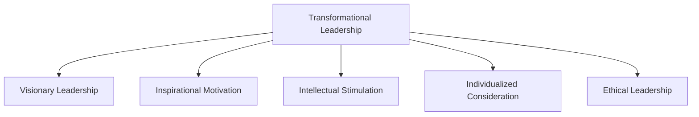

## 18.2.1 Transformational Leadership

### Introduction to Transformational Leadership

Transformational leadership is a dynamic and influential leadership style that emphasizes inspiring and motivating team members to achieve collective goals. In the context of the accounting profession, transformational leadership can play a pivotal role in driving innovation, fostering a positive organizational culture, and achieving strategic objectives. This section explores the core principles of transformational leadership, its application in the accounting field, and how Chartered Professional Accountants (CPAs) can harness this leadership style to excel in their careers.

### Core Principles of Transformational Leadership

Transformational leadership is characterized by several key principles that distinguish it from other leadership styles. These principles include:

1. **Visionary Leadership**: Transformational leaders possess a clear and compelling vision for the future. They articulate this vision to their team members, inspiring them to work towards a common goal. In accounting, this might involve envisioning a more efficient financial reporting process or pioneering new approaches to audit and assurance.

2. **Inspirational Motivation**: Transformational leaders motivate and inspire their teams by communicating high expectations and demonstrating commitment to organizational goals. They foster an environment where team members feel valued and empowered to contribute their best efforts.

3. **Intellectual Stimulation**: Transformational leaders encourage creativity and innovation by challenging the status quo and promoting critical thinking. They create a culture where team members are encouraged to explore new ideas and approaches, which can lead to breakthroughs in accounting practices.

4. **Individualized Consideration**: Transformational leaders recognize and appreciate the unique strengths and needs of each team member. They provide personalized support and mentorship, helping individuals develop their skills and achieve their professional goals.

5. **Ethical Leadership**: Transformational leaders uphold high ethical standards and lead by example. They prioritize integrity and transparency, fostering trust and credibility within their teams and organizations.

### The Role of Transformational Leadership in Accounting

In the accounting profession, transformational leadership can have a profound impact on organizational success and employee satisfaction. Here are some ways in which transformational leadership can be applied in accounting:

- **Driving Change and Innovation**: Transformational leaders in accounting are adept at driving change and innovation. They encourage their teams to embrace new technologies, such as blockchain and artificial intelligence, to enhance financial reporting and analysis.

- **Enhancing Team Performance**: By fostering a culture of collaboration and continuous improvement, transformational leaders can enhance team performance. They motivate team members to exceed expectations and achieve excellence in their work.

- **Building a Positive Organizational Culture**: Transformational leaders create a positive organizational culture by promoting values such as trust, respect, and inclusivity. This culture attracts and retains top talent, contributing to the long-term success of the organization.

- **Navigating Complex Challenges**: The accounting profession often involves navigating complex regulatory and financial challenges. Transformational leaders are skilled at guiding their teams through these challenges, providing strategic direction and support.

### Practical Examples of Transformational Leadership in Accounting

To illustrate the application of transformational leadership in accounting, consider the following scenarios:

#### Scenario 1: Implementing a New Financial Reporting System

A CPA firm is transitioning to a new financial reporting system that promises to streamline processes and improve accuracy. The transformational leader in charge of this project communicates a clear vision of the benefits of the new system and inspires the team to embrace the change. They provide training and support to ensure a smooth transition and encourage team members to share feedback and ideas for improvement.

#### Scenario 2: Fostering Innovation in Audit Practices

An audit team is tasked with developing innovative audit practices to enhance efficiency and effectiveness. The transformational leader encourages team members to think creatively and explore new methodologies. They facilitate brainstorming sessions and provide resources for research and development. As a result, the team develops a groundbreaking audit approach that sets a new standard in the industry.

#### Scenario 3: Promoting Ethical Standards in Financial Reporting

A transformational leader in a corporate accounting department emphasizes the importance of ethical standards in financial reporting. They lead by example, demonstrating transparency and integrity in their work. They also provide training on ethical decision-making and create a safe environment for team members to raise concerns. This commitment to ethics enhances the organization's reputation and builds trust with stakeholders.

### Developing Transformational Leadership Skills

For CPAs aspiring to become transformational leaders, developing the following skills is essential:

- **Visionary Thinking**: Cultivate the ability to envision the future and articulate a compelling vision for your team and organization.

- **Effective Communication**: Hone your communication skills to inspire and motivate others. Practice active listening and provide constructive feedback.

- **Emotional Intelligence**: Develop emotional intelligence to understand and respond to the needs and emotions of your team members. Build strong relationships based on empathy and trust.

- **Adaptability and Resilience**: Embrace change and demonstrate resilience in the face of challenges. Encourage your team to adapt to new circumstances and learn from setbacks.

- **Ethical Decision-Making**: Uphold high ethical standards and lead by example. Encourage your team to prioritize integrity and transparency in their work.

### Real-World Applications and Regulatory Scenarios

Transformational leadership is not only applicable in theoretical contexts but also in real-world scenarios that CPAs may encounter. Consider the following applications:

- **Regulatory Compliance**: Transformational leaders can guide their teams in navigating complex regulatory environments by fostering a culture of compliance and continuous learning. They ensure that team members are well-informed about changes in regulations and encourage proactive measures to maintain compliance.

- **Crisis Management**: In times of crisis, such as financial downturns or regulatory investigations, transformational leaders provide stability and direction. They communicate openly with stakeholders, maintain transparency, and inspire confidence in their teams.

- **Sustainability Initiatives**: Transformational leaders can drive sustainability initiatives within their organizations by promoting environmental, social, and governance (ESG) considerations. They encourage innovative solutions to reduce environmental impact and enhance social responsibility.

### Step-by-Step Guidance for Implementing Transformational Leadership

To implement transformational leadership effectively, follow these steps:

1. **Define Your Vision**: Clearly articulate your vision for the future and communicate it to your team. Ensure that your vision aligns with organizational goals and values.

2. **Inspire and Motivate**: Use inspirational communication to motivate your team. Set high expectations and demonstrate your commitment to achieving collective goals.

3. **Encourage Innovation**: Foster a culture of innovation by encouraging team members to explore new ideas and approaches. Provide resources and support for research and development.

4. **Provide Individualized Support**: Recognize the unique strengths and needs of each team member. Offer personalized mentorship and support to help them achieve their professional goals.

5. **Lead by Example**: Uphold high ethical standards and demonstrate integrity in your actions. Build trust and credibility by leading by example.

6. **Foster Collaboration**: Promote collaboration and teamwork by creating an inclusive and supportive environment. Encourage open communication and the sharing of ideas.

7. **Evaluate and Adapt**: Continuously evaluate the effectiveness of your leadership approach and make adjustments as needed. Seek feedback from your team and be open to change.

### Diagrams and Visuals

To enhance understanding, consider the following diagram illustrating the key components of transformational leadership:

### Best Practices and Common Pitfalls

**Best Practices:**

- **Communicate Clearly**: Ensure that your vision and goals are communicated clearly and consistently to your team.

- **Foster a Growth Mindset**: Encourage a growth mindset by promoting continuous learning and development.

- **Celebrate Success**: Recognize and celebrate the achievements of your team members to boost morale and motivation.

**Common Pitfalls:**

- **Lack of Clarity**: Failing to articulate a clear vision can lead to confusion and lack of direction.

- **Resistance to Change**: Overcoming resistance to change requires patience and persistence. Address concerns and provide support to ease the transition.

- **Neglecting Individual Needs**: Focusing solely on organizational goals without considering individual needs can lead to disengagement and burnout.

### References and Additional Resources

For further exploration of transformational leadership in accounting, consider the following resources:

- **CPA Canada**: Explore resources and publications on leadership and professional development for CPAs.

- **International Financial Reporting Standards (IFRS)**: Stay informed about changes in accounting standards and their implications for leadership.

- **Leadership Books and Articles**: Read books and articles on transformational leadership to gain insights and inspiration.

### Conclusion

Transformational leadership is a powerful approach that can drive success and innovation in the accounting profession. By inspiring and motivating their teams, CPAs can achieve collective goals and make a positive impact on their organizations. By developing the skills and principles outlined in this section, aspiring transformational leaders can excel in their careers and contribute to the advancement of the accounting profession.

## **Ready to Test Your Knowledge?**

**Practice 10 Essential CPA Exam Questions to Master Your Certification**



### What is a key characteristic of transformational leadership?

- [x] Visionary leadership
- [ ] Micromanagement
- [ ] Transactional focus
- [ ] Autocratic decision-making

> **Explanation:** Transformational leadership is characterized by visionary leadership, where leaders articulate a clear and compelling vision for the future.

### Which principle of transformational leadership involves encouraging creativity and innovation?

- [ ] Inspirational motivation
- [x] Intellectual stimulation
- [ ] Individualized consideration
- [ ] Ethical leadership

> **Explanation:** Intellectual stimulation involves encouraging creativity and innovation by challenging the status quo and promoting critical thinking.

### How can transformational leaders enhance team performance?

- [x] By fostering a culture of collaboration and continuous improvement
- [ ] By enforcing strict rules and regulations
- [ ] By focusing solely on individual achievements
- [ ] By avoiding feedback and communication

> **Explanation:** Transformational leaders enhance team performance by fostering a culture of collaboration and continuous improvement, motivating team members to exceed expectations.

### What is an example of transformational leadership in accounting?

- [x] Implementing a new financial reporting system with a clear vision
- [ ] Maintaining the status quo in audit practices
- [ ] Focusing solely on compliance without innovation
- [ ] Avoiding change and innovation

> **Explanation:** Implementing a new financial reporting system with a clear vision is an example of transformational leadership, as it involves inspiring and motivating the team to embrace change.

### Which skill is essential for CPAs aspiring to become transformational leaders?

- [x] Visionary thinking
- [ ] Micromanagement
- [ ] Transactional focus
- [ ] Autocratic decision-making

> **Explanation:** Visionary thinking is essential for CPAs aspiring to become transformational leaders, as it involves envisioning the future and articulating a compelling vision.

### How can transformational leaders navigate complex regulatory environments?

- [x] By fostering a culture of compliance and continuous learning
- [ ] By ignoring regulatory changes
- [ ] By focusing solely on short-term goals
- [ ] By avoiding communication with stakeholders

> **Explanation:** Transformational leaders navigate complex regulatory environments by fostering a culture of compliance and continuous learning, ensuring that team members are well-informed about changes.

### What is a common pitfall of transformational leadership?

- [x] Lack of clarity in vision
- [ ] Over-communication
- [ ] Excessive focus on individual needs
- [ ] Avoiding change

> **Explanation:** A common pitfall of transformational leadership is a lack of clarity in vision, which can lead to confusion and lack of direction.

### How can transformational leaders promote ethical standards in financial reporting?

- [x] By leading by example and demonstrating transparency
- [ ] By ignoring ethical concerns
- [ ] By focusing solely on financial performance
- [ ] By avoiding communication with stakeholders

> **Explanation:** Transformational leaders promote ethical standards in financial reporting by leading by example and demonstrating transparency, building trust and credibility.

### What is the role of emotional intelligence in transformational leadership?

- [x] Understanding and responding to the needs and emotions of team members
- [ ] Ignoring team members' emotions
- [ ] Focusing solely on technical skills
- [ ] Avoiding interpersonal interactions

> **Explanation:** Emotional intelligence plays a crucial role in transformational leadership by enabling leaders to understand and respond to the needs and emotions of team members.

### True or False: Transformational leadership is solely focused on achieving organizational goals without considering individual needs.

- [ ] True
- [x] False

> **Explanation:** False. Transformational leadership involves individualized consideration, recognizing and appreciating the unique strengths and needs of each team member.


