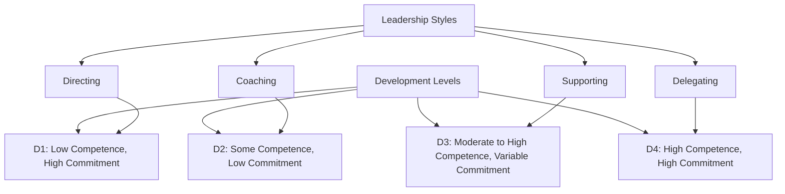

## 18.2.2 Situational Leadership

In the dynamic world of accounting, where the landscape is constantly evolving due to regulatory changes, technological advancements, and economic fluctuations, effective leadership is crucial. The situational leadership model, developed by Paul Hersey and Ken Blanchard, offers a flexible approach that empowers leaders to adapt their style to the specific needs of their team and the task at hand. This adaptability is particularly valuable for Chartered Professional Accountants (CPAs), who often lead diverse teams and manage complex projects.

### Understanding Situational Leadership

Situational leadership is a theory that suggests there is no single "best" style of leadership. Instead, effective leadership is contingent upon various factors, including the maturity and competence of team members, the nature of the task, and the organizational environment. The model emphasizes the importance of leaders being able to adjust their style to fit the development level of their followers.

#### Key Components of Situational Leadership

1. **Leadership Styles**: The situational leadership model identifies four primary leadership styles:
   - **Directing (Telling)**: High directive and low supportive behavior. Leaders provide specific instructions and closely supervise task completion.
   - **Coaching (Selling)**: High directive and high supportive behavior. Leaders provide guidance and encouragement, explaining decisions and soliciting suggestions.
   - **Supporting (Participating)**: Low directive and high supportive behavior. Leaders facilitate and support team members' efforts, sharing decision-making responsibilities.
   - **Delegating**: Low directive and low supportive behavior. Leaders entrust responsibility to team members, providing minimal supervision.

2. **Development Levels**: The model also categorizes team members into four development levels based on their competence and commitment:
   - **D1**: Low competence, high commitment. Team members are enthusiastic but lack the necessary skills.
   - **D2**: Some competence, low commitment. Team members have some skills but lack motivation or confidence.
   - **D3**: Moderate to high competence, variable commitment. Team members are capable but may lack confidence or motivation.
   - **D4**: High competence, high commitment. Team members are skilled and motivated.

#### Applying Situational Leadership in Accounting

For CPAs, applying situational leadership involves assessing the development level of team members and adapting their leadership style accordingly. This approach ensures that team members receive the appropriate level of guidance and support, fostering an environment where they can thrive.

### Practical Examples and Scenarios

#### Example 1: Leading a New Audit Team

Imagine you are a CPA leading a newly formed audit team. The team consists of junior accountants who are eager to learn but lack experience (D1). In this scenario, a **Directing** style is appropriate. You would provide clear instructions, set specific goals, and closely monitor progress to ensure the team understands the audit process and meets deadlines.

#### Example 2: Managing a Tax Planning Project

In another scenario, you are managing a tax planning project with a team of experienced accountants who have successfully completed similar projects in the past (D4). Here, a **Delegating** style is suitable. You can trust the team to take ownership of the project, make decisions, and execute tasks with minimal supervision, allowing you to focus on strategic oversight.

#### Example 3: Transitioning to a New Accounting Software

Consider a situation where your team is transitioning to a new accounting software. The team has some experience with similar systems but is unsure about the new software's features (D2). A **Coaching** style would be effective. You would provide training sessions, encourage questions, and offer support as the team navigates the learning curve.

### Real-World Applications and Regulatory Scenarios

Situational leadership is not only applicable in day-to-day team management but also in navigating regulatory changes and compliance requirements. For instance, when new accounting standards are introduced, CPAs must assess their team's readiness to adapt and provide the necessary support to ensure compliance.

#### Case Study: Implementing IFRS Changes

A CPA firm faced the challenge of implementing changes to the International Financial Reporting Standards (IFRS). The team had varying levels of familiarity with the new standards. The leader adopted a **Supporting** style, facilitating workshops and discussions to help team members understand the changes and apply them effectively in their work.

### Step-by-Step Guidance for CPAs

1. **Assess Team Development Level**: Evaluate the competence and commitment of each team member. Consider their experience, skills, and motivation related to the task.

2. **Select the Appropriate Leadership Style**: Based on the assessment, choose a leadership style that aligns with the team's development level. Be prepared to adjust your approach as the team evolves.

3. **Communicate Clearly**: Regardless of the chosen style, clear communication is essential. Ensure that team members understand their roles, responsibilities, and expectations.

4. **Provide Feedback and Support**: Offer constructive feedback and support to help team members grow. Recognize achievements and address challenges promptly.

5. **Monitor Progress and Adjust**: Continuously monitor the team's progress and be willing to adjust your leadership style as needed. Flexibility is key to maintaining team effectiveness.

### Diagrams and Visuals

To enhance understanding, consider the following diagram illustrating the situational leadership model:

### Best Practices and Common Pitfalls

#### Best Practices

- **Stay Flexible**: Be open to changing your leadership style as the situation demands. Flexibility is crucial for addressing the diverse needs of your team.
- **Foster Open Communication**: Encourage team members to share their thoughts and concerns. Open communication builds trust and enhances collaboration.
- **Invest in Development**: Provide opportunities for team members to develop their skills and advance their careers. This investment benefits both the individual and the organization.

#### Common Pitfalls

- **Over-Reliance on One Style**: Avoid sticking to a single leadership style regardless of the situation. This rigidity can hinder team performance and growth.
- **Ignoring Team Feedback**: Failing to consider team feedback can lead to disengagement and decreased morale. Actively seek and act on feedback to improve leadership effectiveness.
- **Neglecting Individual Needs**: Each team member is unique, with different strengths and weaknesses. Tailor your approach to meet individual needs and maximize their potential.

### Strategies for Exam Preparation

For CPA candidates, understanding situational leadership is essential for both the exam and professional practice. Here are some strategies to help you prepare:

- **Study Real-World Examples**: Analyze case studies and scenarios to see how situational leadership is applied in practice. This will help you understand the nuances of the model.
- **Practice Decision-Making**: Engage in exercises that require you to assess team development levels and choose the appropriate leadership style. This practice will enhance your ability to apply the model effectively.
- **Review Leadership Theories**: Familiarize yourself with other leadership theories and compare them to situational leadership. This broader understanding will enrich your knowledge and exam responses.

### Conclusion

Situational leadership is a powerful tool for CPAs, enabling them to lead effectively in a variety of contexts. By adapting their leadership style to the needs of their team and the task at hand, CPAs can foster a productive and motivated work environment. As you prepare for your CPA exams, focus on understanding the principles of situational leadership and how they apply to real-world accounting scenarios. This knowledge will not only help you succeed in your exams but also enhance your leadership capabilities in your professional career.

## **Ready to Test Your Knowledge?**

**Practice 10 Essential CPA Exam Questions to Master Your Certification**



### Which leadership style is characterized by high directive and low supportive behavior?

- [x] Directing
- [ ] Coaching
- [ ] Supporting
- [ ] Delegating

> **Explanation:** The Directing style involves high directive and low supportive behavior, where leaders provide specific instructions and closely supervise tasks.

### In situational leadership, what development level describes team members with high competence and high commitment?

- [ ] D1
- [ ] D2
- [ ] D3
- [x] D4

> **Explanation:** D4 represents team members with high competence and high commitment, indicating they are skilled and motivated.

### What is the primary focus of the Coaching leadership style?

- [ ] Providing minimal supervision
- [x] Offering guidance and encouragement
- [ ] Sharing decision-making responsibilities
- [ ] Closely monitoring progress

> **Explanation:** The Coaching style involves high directive and high supportive behavior, focusing on offering guidance and encouragement.

### Which leadership style is most appropriate for a team with some competence but low commitment?

- [ ] Directing
- [x] Coaching
- [ ] Supporting
- [ ] Delegating

> **Explanation:** Coaching is suitable for teams with some competence but low commitment, as it provides guidance and motivation.

### What is a common pitfall in situational leadership?

- [x] Over-reliance on one style
- [ ] Encouraging open communication
- [ ] Providing feedback and support
- [ ] Investing in development

> **Explanation:** Over-reliance on one style can hinder team performance and growth, as different situations require different approaches.

### Which development level involves team members who are enthusiastic but lack necessary skills?

- [x] D1
- [ ] D2
- [ ] D3
- [ ] D4

> **Explanation:** D1 describes team members who are enthusiastic but lack the necessary skills, requiring high directive behavior.

### What is a key benefit of situational leadership for CPAs?

- [ ] It provides a single best leadership style
- [x] It allows adaptation to team needs
- [ ] It focuses solely on task completion
- [ ] It minimizes the need for communication

> **Explanation:** Situational leadership allows CPAs to adapt their style to meet the specific needs of their team and task, enhancing effectiveness.

### In the Supporting leadership style, what is the leader's primary role?

- [ ] Providing specific instructions
- [ ] Making all decisions
- [x] Facilitating and supporting efforts
- [ ] Closely supervising tasks

> **Explanation:** In the Supporting style, leaders facilitate and support team members' efforts, sharing decision-making responsibilities.

### True or False: Situational leadership requires leaders to remain rigid in their approach.

- [ ] True
- [x] False

> **Explanation:** False. Situational leadership requires flexibility, allowing leaders to adapt their style to the needs of the team and situation.

### What is the first step in applying situational leadership?

- [x] Assess team development level
- [ ] Select a leadership style
- [ ] Communicate clearly
- [ ] Provide feedback and support

> **Explanation:** The first step is to assess the team's development level to determine the appropriate leadership style.


