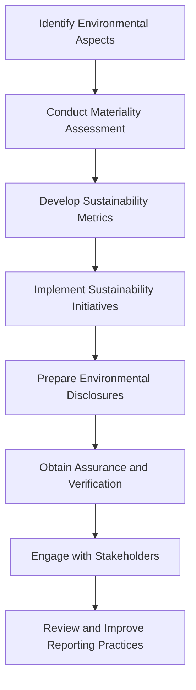

## 19.3.1 Environmental Reporting

Environmental reporting is an essential aspect of corporate transparency and accountability, reflecting a company's commitment to sustainable practices and its impact on the environment. As a Chartered Professional Accountant (CPA) in Canada, understanding the requirements and best practices for environmental reporting is crucial for ensuring compliance and fostering sustainable business practices. This section provides a comprehensive guide to environmental reporting, covering key concepts, regulatory frameworks, and practical applications.

### Understanding Environmental Reporting

Environmental reporting involves the disclosure of information regarding a company's environmental impact and sustainability efforts. It encompasses a wide range of data, including greenhouse gas emissions, energy consumption, waste management, and resource usage. The primary goal of environmental reporting is to provide stakeholders with a clear understanding of a company's environmental performance and its strategies for managing environmental risks.

#### Key Components of Environmental Reporting

1. **Environmental Impact Assessment**: This involves evaluating the potential environmental effects of a company's operations, products, or services. It includes identifying significant environmental aspects and assessing their impact on air, water, land, and biodiversity.

2. **Sustainability Metrics**: These are quantitative measures used to assess a company's environmental performance. Common metrics include carbon footprint, energy efficiency, water usage, and waste reduction.

3. **Sustainability Initiatives**: Companies often implement initiatives to reduce their environmental impact, such as adopting renewable energy sources, improving energy efficiency, and promoting recycling and waste reduction.

4. **Compliance with Environmental Regulations**: Companies must adhere to local, national, and international environmental regulations. This includes reporting requirements set by regulatory bodies such as Environment and Climate Change Canada (ECCC) and the Canadian Securities Administrators (CSA).

5. **Stakeholder Engagement**: Engaging with stakeholders, including investors, customers, employees, and communities, is crucial for understanding their expectations and addressing environmental concerns.

### Regulatory Frameworks for Environmental Reporting

Environmental reporting is governed by various regulatory frameworks and standards, both nationally and internationally. CPAs must be familiar with these frameworks to ensure accurate and compliant reporting.

#### International Financial Reporting Standards (IFRS)

The IFRS provides guidelines for financial reporting, including environmental disclosures. While IFRS does not have a specific standard for environmental reporting, it requires companies to disclose material information about environmental risks and liabilities in their financial statements.

#### Accounting Standards for Private Enterprises (ASPE)

ASPE provides guidelines for private enterprises in Canada. Similar to IFRS, ASPE does not have a specific standard for environmental reporting but requires the disclosure of material environmental liabilities and commitments.

#### Global Reporting Initiative (GRI)

The GRI is an international organization that provides a comprehensive framework for sustainability reporting. The GRI Standards are widely used by companies to report on their environmental, social, and governance (ESG) performance.

#### Task Force on Climate-related Financial Disclosures (TCFD)

The TCFD provides recommendations for climate-related financial disclosures, focusing on governance, strategy, risk management, and metrics and targets. The TCFD framework is increasingly being adopted by companies to enhance transparency and accountability in climate-related reporting.

#### Sustainability Accounting Standards Board (SASB)

The SASB provides industry-specific standards for sustainability reporting, including environmental metrics. The SASB Standards are designed to help companies disclose financially material sustainability information to investors.

### Best Practices for Environmental Reporting

To ensure effective environmental reporting, CPAs should adopt best practices that enhance the quality and credibility of disclosures.

#### Materiality Assessment

Conducting a materiality assessment helps identify the most significant environmental issues that impact a company's operations and stakeholders. This process involves engaging with stakeholders to understand their concerns and expectations.

#### Integrated Reporting

Integrated reporting combines financial and non-financial information, providing a holistic view of a company's performance. This approach helps stakeholders understand the interconnections between environmental, social, and financial factors.

#### Assurance and Verification

Obtaining third-party assurance for environmental reports enhances their credibility and reliability. Assurance providers assess the accuracy and completeness of environmental data and disclosures.

#### Continuous Improvement

Environmental reporting should be a dynamic process that evolves with changing regulations, stakeholder expectations, and business practices. Companies should regularly review and update their reporting practices to ensure they remain relevant and effective.

### Practical Examples and Case Studies

To illustrate the application of environmental reporting, let's explore some practical examples and case studies from Canadian companies.

#### Case Study: Suncor Energy

Suncor Energy, a leading Canadian energy company, has been recognized for its comprehensive sustainability reporting. Suncor's annual sustainability report includes detailed disclosures on greenhouse gas emissions, energy efficiency, water management, and community engagement. The company uses the GRI Standards and TCFD recommendations to guide its reporting practices.

#### Example: Loblaw Companies Limited

Loblaw Companies Limited, a major Canadian retailer, publishes an annual corporate social responsibility (CSR) report that highlights its environmental initiatives. The report includes information on waste reduction, energy conservation, and sustainable sourcing. Loblaw uses the SASB Standards to ensure its disclosures are relevant to investors.

### Challenges and Opportunities in Environmental Reporting

Environmental reporting presents both challenges and opportunities for companies and CPAs.

#### Challenges

1. **Data Collection and Management**: Gathering accurate and comprehensive environmental data can be challenging, especially for large organizations with complex operations.

2. **Regulatory Compliance**: Keeping up with evolving environmental regulations and standards requires continuous monitoring and adaptation.

3. **Stakeholder Expectations**: Meeting the diverse expectations of stakeholders can be difficult, particularly when balancing environmental, social, and financial considerations.

#### Opportunities

1. **Enhanced Transparency and Accountability**: Effective environmental reporting can enhance a company's reputation and build trust with stakeholders.

2. **Risk Management**: Identifying and managing environmental risks can lead to improved operational efficiency and reduced costs.

3. **Competitive Advantage**: Companies that demonstrate strong environmental performance can differentiate themselves in the market and attract environmentally conscious consumers and investors.

### Step-by-Step Guidance for Environmental Reporting

To help CPAs navigate the environmental reporting process, here is a step-by-step guide:

1. **Identify Environmental Aspects**: Determine the environmental aspects of your company's operations, products, or services that have a significant impact.

2. **Conduct a Materiality Assessment**: Engage with stakeholders to identify the most significant environmental issues and prioritize them based on their impact and relevance.

3. **Develop Sustainability Metrics**: Establish quantitative measures to assess and track environmental performance over time.

4. **Implement Sustainability Initiatives**: Develop and implement initiatives to reduce environmental impact and improve sustainability performance.

5. **Prepare Environmental Disclosures**: Compile and present environmental data and disclosures in a clear and concise manner, following relevant standards and frameworks.

6. **Obtain Assurance and Verification**: Consider obtaining third-party assurance to enhance the credibility and reliability of your environmental reports.

7. **Engage with Stakeholders**: Communicate your environmental performance and initiatives to stakeholders, addressing their concerns and expectations.

8. **Review and Improve Reporting Practices**: Regularly review and update your environmental reporting practices to ensure they remain relevant and effective.

### Diagrams and Visuals

To enhance understanding, let's include a diagram illustrating the environmental reporting process:

### Conclusion

Environmental reporting is a critical component of corporate transparency and accountability, reflecting a company's commitment to sustainable practices. As a CPA, understanding the requirements and best practices for environmental reporting is essential for ensuring compliance and fostering sustainable business practices. By adopting a structured approach to environmental reporting, companies can enhance their transparency, manage environmental risks, and build trust with stakeholders.

---

## **Ready to Test Your Knowledge?**

**Practice 10 Essential CPA Exam Questions to Master Your Certification**



### What is the primary goal of environmental reporting?

- [x] To provide stakeholders with a clear understanding of a company's environmental performance and strategies for managing environmental risks.
- [ ] To increase a company's profitability.
- [ ] To comply with tax regulations.
- [ ] To reduce operational costs.

> **Explanation:** The primary goal of environmental reporting is to provide stakeholders with a clear understanding of a company's environmental performance and its strategies for managing environmental risks.

### Which framework provides industry-specific standards for sustainability reporting?

- [ ] IFRS
- [ ] ASPE
- [x] SASB
- [ ] TCFD

> **Explanation:** The Sustainability Accounting Standards Board (SASB) provides industry-specific standards for sustainability reporting.

### What is a materiality assessment in environmental reporting?

- [x] A process to identify the most significant environmental issues impacting a company's operations and stakeholders.
- [ ] A financial audit of a company's environmental expenses.
- [ ] A legal requirement for all companies.
- [ ] A method to calculate carbon emissions.

> **Explanation:** A materiality assessment is a process to identify the most significant environmental issues that impact a company's operations and stakeholders.

### Which of the following is a challenge in environmental reporting?

- [ ] Enhanced transparency
- [x] Data collection and management
- [ ] Competitive advantage
- [ ] Risk management

> **Explanation:** Data collection and management is a challenge in environmental reporting, especially for large organizations with complex operations.

### What is the role of third-party assurance in environmental reporting?

- [x] To enhance the credibility and reliability of environmental reports.
- [ ] To increase a company's market share.
- [ ] To reduce environmental impact.
- [ ] To comply with tax regulations.

> **Explanation:** Third-party assurance enhances the credibility and reliability of environmental reports by assessing the accuracy and completeness of environmental data and disclosures.

### Which Canadian company is recognized for its comprehensive sustainability reporting?

- [ ] Loblaw Companies Limited
- [x] Suncor Energy
- [ ] Shopify
- [ ] Tim Hortons

> **Explanation:** Suncor Energy is recognized for its comprehensive sustainability reporting, using the GRI Standards and TCFD recommendations.

### What is the purpose of integrated reporting?

- [x] To combine financial and non-financial information, providing a holistic view of a company's performance.
- [ ] To focus solely on financial performance.
- [ ] To reduce reporting costs.
- [ ] To comply with tax regulations.

> **Explanation:** Integrated reporting combines financial and non-financial information, providing a holistic view of a company's performance.

### Which organization provides a comprehensive framework for sustainability reporting?

- [ ] IFRS
- [x] GRI
- [ ] ASPE
- [ ] CSA

> **Explanation:** The Global Reporting Initiative (GRI) provides a comprehensive framework for sustainability reporting.

### What is the benefit of engaging with stakeholders in environmental reporting?

- [x] To understand their expectations and address environmental concerns.
- [ ] To increase sales.
- [ ] To reduce operational costs.
- [ ] To comply with tax regulations.

> **Explanation:** Engaging with stakeholders helps companies understand their expectations and address environmental concerns.

### True or False: Environmental reporting is only required for public companies.

- [ ] True
- [x] False

> **Explanation:** Environmental reporting is not limited to public companies; it is relevant for any organization seeking to enhance transparency and accountability in its environmental performance.


