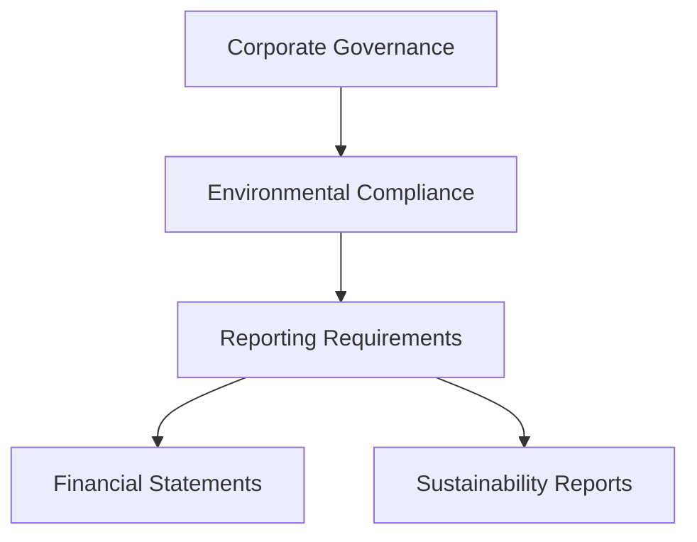

## 19.3.2 Impact on Business Operations

Environmental regulations have become a pivotal aspect of business operations, influencing how organizations conduct their activities and manage their financial resources. As a Chartered Professional Accountant (CPA) in Canada, understanding the impact of these regulations is crucial for advising businesses on compliance, sustainability, and financial planning. This section delves into the multifaceted effects of environmental laws on business operations, providing insights into compliance strategies, financial implications, and the role of CPAs in navigating these challenges.

### Understanding Environmental Regulations

Environmental regulations are legal requirements aimed at protecting the environment by controlling the impact of business activities. These regulations can be national, provincial, or local, and they cover a wide range of areas, including air and water quality, waste management, and emissions control. In Canada, key regulatory bodies include Environment and Climate Change Canada (ECCC) and provincial ministries of the environment.

#### Key Environmental Laws in Canada

1. **Canadian Environmental Protection Act (CEPA):** This act provides the framework for managing toxic substances and pollution prevention.
2. **Fisheries Act:** Protects fish habitats from pollution and other harmful activities.
3. **Species at Risk Act (SARA):** Aims to prevent wildlife species from becoming extinct.
4. **Provincial Regulations:** Each province has its own set of environmental laws, such as Ontario's Environmental Protection Act and British Columbia's Environmental Management Act.

### Impact on Organizational Practices

Environmental regulations necessitate changes in how businesses operate, often requiring the implementation of new processes and technologies. These changes can affect various aspects of business operations, including production, supply chain management, and corporate governance.

#### Production and Process Adjustments

Businesses may need to alter their production processes to reduce emissions and waste. This could involve investing in cleaner technologies or modifying existing equipment to meet regulatory standards. For example, a manufacturing company might install scrubbers to reduce air pollutants or switch to water-based paints to minimize volatile organic compounds (VOCs).

**Example:** A Canadian automotive manufacturer implemented a closed-loop water recycling system to comply with water discharge regulations, resulting in reduced water usage and lower compliance costs.

#### Supply Chain Management

Environmental regulations can also impact supply chain management. Companies may need to source materials from suppliers that adhere to environmental standards or redesign their logistics to minimize carbon footprints. This can lead to increased costs or require renegotiation of supplier contracts.

**Case Study:** A Canadian retailer shifted to suppliers with sustainable practices, which initially increased costs but ultimately enhanced brand reputation and customer loyalty.

#### Corporate Governance and Reporting

Environmental compliance is increasingly becoming a part of corporate governance. Companies are expected to report on their environmental performance and sustainability initiatives. This includes disclosing environmental risks and opportunities in financial statements and sustainability reports.

**Mermaid Diagram:**

### Financial Implications

The financial impact of environmental regulations can be significant, affecting both the costs and revenues of a business. CPAs play a crucial role in helping organizations understand and manage these financial implications.

#### Compliance Costs

Compliance with environmental regulations often involves direct costs, such as investments in new technologies, training for employees, and fees for permits and licenses. These costs can be substantial, particularly for industries with high environmental impacts, such as mining and manufacturing.

**Example:** A mining company in Alberta faced increased costs due to the need for additional environmental assessments and permits under the provincial regulations.

#### Risk Management and Liability

Non-compliance with environmental regulations can lead to fines, legal actions, and reputational damage. Businesses must implement risk management strategies to mitigate these liabilities. CPAs can assist in developing compliance programs and conducting audits to ensure adherence to regulations.

**Scenario:** A chemical company was fined for non-compliance with hazardous waste regulations, highlighting the importance of regular compliance audits and risk assessments.

#### Opportunities for Cost Savings

While compliance can be costly, it also presents opportunities for cost savings. Energy efficiency improvements and waste reduction initiatives can lead to significant savings. Additionally, businesses that adopt sustainable practices may qualify for government incentives and tax credits.

**Example:** A Canadian food processing company reduced energy costs by 20% through the implementation of energy-efficient equipment, benefiting from government rebates.

### Role of CPAs in Environmental Compliance

CPAs are integral to helping businesses navigate the complexities of environmental regulations. Their expertise in financial analysis, risk management, and strategic planning is invaluable in ensuring compliance and optimizing business operations.

#### Advising on Compliance Strategies

CPAs can advise businesses on the most cost-effective compliance strategies, helping them to balance regulatory requirements with financial performance. This includes evaluating the financial impact of different compliance options and recommending the best course of action.

#### Financial Reporting and Disclosure

CPAs ensure that environmental liabilities and risks are accurately reflected in financial statements. They also assist in preparing sustainability reports that communicate a company's environmental performance to stakeholders.

#### Supporting Sustainability Initiatives

CPAs can support businesses in developing and implementing sustainability initiatives that align with regulatory requirements and corporate goals. This includes identifying opportunities for innovation and efficiency improvements.

### Real-World Applications and Case Studies

To illustrate the impact of environmental regulations on business operations, consider the following real-world applications and case studies:

1. **Renewable Energy Adoption:** A Canadian utility company invested in renewable energy sources to comply with emissions regulations, resulting in long-term cost savings and enhanced public image.

2. **Waste Management Innovations:** A manufacturing firm implemented a zero-waste policy, reducing landfill costs and improving compliance with waste disposal regulations.

3. **Sustainable Product Development:** A consumer goods company developed a line of eco-friendly products, capitalizing on consumer demand for sustainable options and differentiating itself in the market.

### Best Practices and Common Pitfalls

To successfully navigate environmental regulations, businesses should adopt best practices and be aware of common pitfalls:

- **Best Practices:**
  - Conduct regular environmental audits to ensure compliance.
  - Engage stakeholders in sustainability initiatives.
  - Leverage technology for efficient compliance management.

- **Common Pitfalls:**
  - Underestimating the cost and complexity of compliance.
  - Failing to integrate environmental considerations into strategic planning.
  - Neglecting to communicate environmental performance to stakeholders.

### Exam Strategies and Practical Tips

For CPA candidates, understanding the impact of environmental regulations on business operations is essential. Here are some strategies and tips to help you prepare for the exam:

- **Focus on Key Regulations:** Familiarize yourself with major Canadian environmental laws and their implications for businesses.
- **Understand Financial Implications:** Be prepared to analyze the financial impact of compliance and non-compliance.
- **Practice Case Studies:** Work through case studies that illustrate the real-world application of environmental regulations.
- **Stay Informed:** Keep up-to-date with changes in environmental regulations and emerging trends in sustainability.

### Summary

Environmental regulations significantly impact business operations, influencing organizational practices, financial performance, and strategic planning. As a CPA, your role in helping businesses navigate these challenges is crucial. By understanding the regulatory landscape and its implications, you can provide valuable insights and support to organizations striving for compliance and sustainability.

## **Ready to Test Your Knowledge?**

**Practice 10 Essential CPA Exam Questions to Master Your Certification**



### Which of the following is a key environmental regulation in Canada that affects business operations?

- [x] Canadian Environmental Protection Act (CEPA)
- [ ] Sarbanes-Oxley Act
- [ ] Dodd-Frank Act
- [ ] Basel III

> **Explanation:** The Canadian Environmental Protection Act (CEPA) is a key regulation that governs pollution prevention and the management of toxic substances in Canada.

### How can environmental regulations impact supply chain management?

- [x] By requiring businesses to source materials from environmentally compliant suppliers
- [ ] By reducing the need for logistics planning
- [ ] By eliminating the need for supplier contracts
- [ ] By increasing the use of non-renewable resources

> **Explanation:** Environmental regulations can require businesses to source materials from suppliers that adhere to environmental standards, impacting supply chain management.

### What is a potential financial implication of non-compliance with environmental regulations?

- [x] Fines and legal actions
- [ ] Increased revenue
- [ ] Reduced operational costs
- [ ] Tax incentives

> **Explanation:** Non-compliance with environmental regulations can lead to fines, legal actions, and reputational damage, impacting a business's financial standing.

### Which of the following is a benefit of adopting sustainable practices in response to environmental regulations?

- [x] Eligibility for government incentives and tax credits
- [ ] Increased waste disposal costs
- [ ] Higher energy consumption
- [ ] Reduced brand reputation

> **Explanation:** Businesses that adopt sustainable practices may qualify for government incentives and tax credits, leading to financial benefits.

### What role do CPAs play in environmental compliance?

- [x] Advising on compliance strategies
- [x] Ensuring accurate financial reporting of environmental liabilities
- [ ] Designing manufacturing processes
- [ ] Developing marketing campaigns

> **Explanation:** CPAs advise on compliance strategies and ensure that environmental liabilities are accurately reflected in financial statements.

### How can businesses reduce compliance costs related to environmental regulations?

- [x] By investing in energy-efficient technologies
- [ ] By ignoring regulatory requirements
- [ ] By increasing waste production
- [ ] By reducing employee training

> **Explanation:** Investing in energy-efficient technologies can help businesses reduce compliance costs and improve sustainability.

### What is a common pitfall businesses face when dealing with environmental regulations?

- [x] Underestimating the cost and complexity of compliance
- [ ] Overestimating the benefits of non-compliance
- [ ] Focusing too much on stakeholder engagement
- [ ] Reducing transparency in reporting

> **Explanation:** A common pitfall is underestimating the cost and complexity of compliance, which can lead to financial and operational challenges.

### Why is it important for businesses to conduct regular environmental audits?

- [x] To ensure compliance with regulations
- [ ] To increase operational costs
- [ ] To reduce transparency
- [ ] To eliminate the need for sustainability initiatives

> **Explanation:** Regular environmental audits help businesses ensure compliance with regulations and identify areas for improvement.

### How can CPAs support sustainability initiatives?

- [x] By identifying opportunities for innovation and efficiency improvements
- [ ] By reducing financial transparency
- [ ] By eliminating stakeholder engagement
- [ ] By ignoring regulatory changes

> **Explanation:** CPAs can support sustainability initiatives by identifying opportunities for innovation and efficiency improvements that align with regulatory requirements.

### True or False: Environmental regulations only impact the financial reporting of large corporations.

- [ ] True
- [x] False

> **Explanation:** Environmental regulations impact businesses of all sizes, influencing financial reporting, operational practices, and strategic planning.


