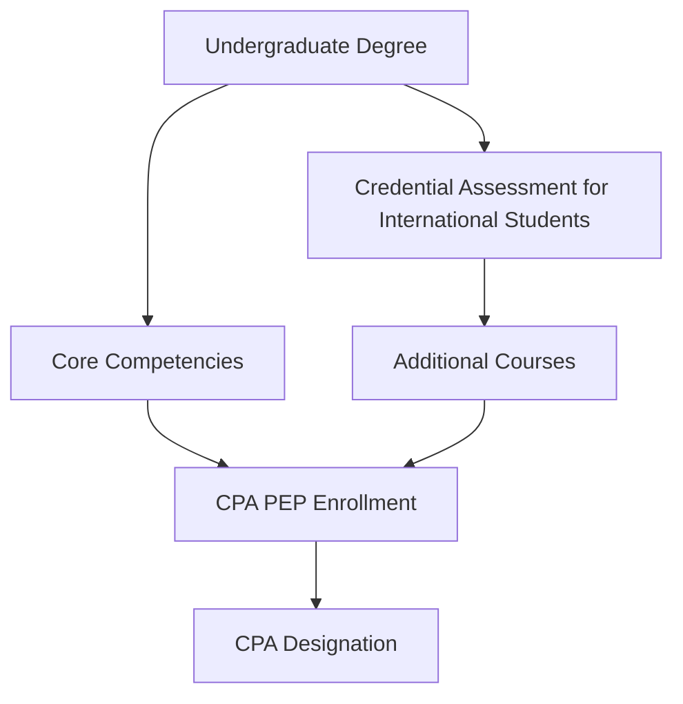

## 2.1.1 Educational Prerequisites

Embarking on the journey to become a Chartered Professional Accountant (CPA) in Canada requires meeting specific educational prerequisites. These prerequisites ensure that candidates possess the foundational knowledge necessary to succeed in the CPA Professional Education Program (CPA PEP) and ultimately in their professional careers. This section provides a comprehensive overview of the academic qualifications required to enter the CPA certification program, including recognized programs, essential courses, and pathways for international students.

### Understanding the CPA Educational Pathway

The CPA educational pathway is designed to equip candidates with the necessary skills and knowledge to excel in the accounting profession. It is structured to ensure that all candidates have a solid grounding in accounting principles, financial reporting, management accounting, taxation, and other essential areas. The pathway typically involves completing a recognized undergraduate degree with specific coursework in accounting and business.

### Recognized Undergraduate Degrees

To be eligible for the CPA PEP, candidates must hold an undergraduate degree from a recognized post-secondary institution. The degree should include coursework that covers the core competencies outlined by CPA Canada. These competencies are essential for developing the technical and enabling skills required for the CPA designation.

#### Core Competencies

The core competencies required for CPA candidates include:

1. **Financial Accounting and Reporting**: Understanding the preparation and analysis of financial statements in accordance with International Financial Reporting Standards (IFRS) and Accounting Standards for Private Enterprises (ASPE).

2. **Management Accounting**: Knowledge of cost management, budgeting, and performance measurement techniques.

3. **Taxation**: Familiarity with Canadian tax principles, including personal and corporate taxation.

4. **Audit and Assurance**: Understanding audit processes, standards, and ethical considerations.

5. **Finance**: Knowledge of financial management, investment analysis, and corporate finance.

6. **Strategy and Governance**: Understanding strategic management and corporate governance principles.

7. **Business Law**: Familiarity with contract law, corporate law, and other legal aspects relevant to business operations.

8. **Information Technology**: Understanding the role of IT in accounting, including data security and information systems.

9. **Ethics and Professionalism**: Knowledge of ethical standards and professional conduct in accounting.

### Essential Courses and Subject Areas

To meet the educational prerequisites, candidates must complete specific courses that align with the CPA competency map. These courses are typically part of an undergraduate accounting program and cover the following subject areas:

- **Introductory Financial Accounting**: Basic principles of financial accounting, including the accounting cycle and preparation of financial statements.

- **Intermediate Financial Accounting**: In-depth study of financial reporting standards and complex accounting issues.

- **Advanced Financial Accounting**: Advanced topics in financial accounting, including consolidations and foreign currency transactions.

- **Cost and Management Accounting**: Techniques for cost analysis, budgeting, and performance evaluation.

- **Taxation**: Comprehensive study of Canadian tax laws and regulations affecting individuals and businesses.

- **Audit and Assurance**: Principles and practices of auditing, including risk assessment and audit planning.

- **Corporate Finance**: Financial decision-making, capital budgeting, and risk management.

- **Business Law**: Legal principles affecting business operations, including contract law and corporate governance.

- **Information Systems**: Role of information technology in accounting, including systems design and data management.

### Recognized Institutions and Programs

CPA Canada recognizes a wide range of post-secondary institutions and programs that offer the necessary coursework for CPA eligibility. These institutions are accredited to ensure that their programs meet the standards set by CPA Canada. Candidates are encouraged to verify that their chosen institution and program are recognized by CPA Canada to ensure their coursework will be accepted.

#### Pathways for International Students

International students who wish to pursue the CPA designation in Canada must also meet the educational prerequisites. This often involves having their foreign credentials assessed to determine equivalency with Canadian standards. CPA Canada provides a credential assessment service to evaluate international degrees and coursework. International students may need to complete additional courses to meet the CPA competency requirements.

### Practical Examples and Case Studies

To illustrate the application of educational prerequisites, consider the following scenarios:

#### Scenario 1: Domestic Student Pathway

Jane is a Canadian student who has completed a Bachelor of Commerce degree with a major in accounting from a recognized Canadian university. Her program included courses in financial accounting, management accounting, taxation, and audit. Jane's degree meets the educational prerequisites for the CPA PEP, and she is eligible to enroll in the program.

#### Scenario 2: International Student Pathway

Raj is an international student who completed a Bachelor of Business Administration degree in India. He has his credentials assessed by CPA Canada, which determines that his degree is equivalent to a Canadian undergraduate degree. However, Raj needs to complete additional courses in Canadian taxation and audit to meet the CPA competency requirements. He enrolls in a recognized Canadian institution to complete these courses before applying to the CPA PEP.

### Real-World Applications and Regulatory Scenarios

Understanding the educational prerequisites is crucial for aspiring CPAs, as it ensures they are well-prepared for the challenges of the CPA PEP and their future careers. The prerequisites also align with regulatory requirements, ensuring that CPAs possess the necessary knowledge to uphold the standards of the profession.

### Step-by-Step Guidance for Meeting Educational Prerequisites

1. **Research Recognized Programs**: Identify post-secondary institutions and programs recognized by CPA Canada that offer the necessary coursework.

2. **Complete Required Courses**: Enroll in and complete courses that cover the core competencies outlined by CPA Canada.

3. **Verify Program Recognition**: Ensure that your chosen program is recognized by CPA Canada to avoid any issues with eligibility.

4. **Credential Assessment for International Students**: If you are an international student, have your credentials assessed by CPA Canada to determine equivalency.

5. **Complete Additional Courses if Necessary**: If your degree does not fully meet the CPA competency requirements, complete additional courses at a recognized institution.

6. **Maintain Academic Performance**: Achieve a satisfactory academic performance in your coursework to ensure eligibility for the CPA PEP.

### Diagrams and Visual Aids

To enhance understanding, the following diagram illustrates the educational pathway to the CPA designation:

### Best Practices and Common Pitfalls

- **Best Practices**: Plan your educational pathway early, ensuring that you select a recognized program and complete the necessary coursework. Stay informed about any changes to CPA Canada’s requirements.

- **Common Pitfalls**: Failing to verify program recognition or neglecting to complete all required courses can delay your eligibility for the CPA PEP. International students should ensure timely credential assessment to avoid delays.

### References and Additional Resources

- **CPA Canada**: Visit the CPA Canada website for detailed information on educational prerequisites and recognized programs.

- **International Financial Reporting Standards (IFRS)**: Familiarize yourself with IFRS as it is a key component of the CPA competency map.

- **Accounting Standards for Private Enterprises (ASPE)**: Understand the differences between ASPE and IFRS, particularly if you plan to work with private enterprises.

- **Canadian Tax Principles**: Study Canadian tax laws and regulations, as taxation is a critical area of the CPA competency map.

### Encouragement and Motivation

Meeting the educational prerequisites is a significant step towards achieving your CPA designation. By fulfilling these requirements, you are laying a strong foundation for your future career as a Chartered Professional Accountant. Stay focused, plan your educational pathway carefully, and take advantage of the resources available to you. Remember, the journey to becoming a CPA is challenging but rewarding, and your efforts will open doors to a wide range of career opportunities in the accounting profession.

## **Ready to Test Your Knowledge?**

**Practice 10 Essential CPA Exam Questions to Master Your Certification**



### What is the primary purpose of the educational prerequisites for the CPA certification program?

- [x] To ensure candidates have foundational knowledge in accounting principles
- [ ] To limit the number of candidates entering the program
- [ ] To provide a competitive advantage to certain institutions
- [ ] To increase the complexity of the CPA certification process

> **Explanation:** The educational prerequisites are designed to ensure that candidates possess the foundational knowledge necessary to succeed in the CPA Professional Education Program (CPA PEP) and their professional careers.

### Which of the following is NOT a core competency required for CPA candidates?

- [ ] Financial Accounting and Reporting
- [ ] Management Accounting
- [x] Marketing Strategies
- [ ] Taxation

> **Explanation:** Marketing Strategies is not a core competency required for CPA candidates. The core competencies focus on accounting, finance, taxation, and related areas.

### What should international students do to meet the educational prerequisites for the CPA program in Canada?

- [ ] Enroll directly in the CPA PEP
- [x] Have their credentials assessed by CPA Canada
- [ ] Complete a Canadian high school diploma
- [ ] Apply for a work visa

> **Explanation:** International students must have their credentials assessed by CPA Canada to determine equivalency with Canadian standards and identify any additional coursework needed.

### Which of the following courses is typically part of the educational prerequisites for the CPA program?

- [x] Introductory Financial Accounting
- [ ] Advanced Marketing Techniques
- [ ] Human Resource Management
- [ ] Organizational Behavior

> **Explanation:** Introductory Financial Accounting is a typical course required as part of the educational prerequisites for the CPA program.

### What is the role of recognized institutions in the CPA educational pathway?

- [x] To offer programs that meet CPA Canada’s standards
- [ ] To provide employment opportunities for CPA candidates
- [ ] To conduct the CPA exams
- [ ] To offer scholarships to CPA candidates

> **Explanation:** Recognized institutions offer programs that meet CPA Canada’s standards, ensuring that candidates complete the necessary coursework for CPA eligibility.

### What is the significance of the CPA competency map?

- [x] It outlines the core competencies required for CPA candidates
- [ ] It provides a list of CPA exam questions
- [ ] It details the job responsibilities of a CPA
- [ ] It offers a directory of CPA firms

> **Explanation:** The CPA competency map outlines the core competencies required for CPA candidates, guiding the educational prerequisites and program structure.

### Which of the following is a common pitfall for CPA candidates regarding educational prerequisites?

- [x] Failing to verify program recognition
- [ ] Completing additional courses
- [ ] Achieving high academic performance
- [ ] Enrolling in a recognized institution

> **Explanation:** Failing to verify program recognition can delay eligibility for the CPA PEP, as candidates must ensure their program is recognized by CPA Canada.

### What is the purpose of the credential assessment for international students?

- [x] To determine equivalency with Canadian educational standards
- [ ] To provide a scholarship for international students
- [ ] To guarantee admission to the CPA PEP
- [ ] To assess language proficiency

> **Explanation:** The credential assessment for international students determines equivalency with Canadian educational standards and identifies any additional coursework needed.

### True or False: Completing a recognized undergraduate degree is sufficient for CPA PEP eligibility without any additional requirements.

- [ ] True
- [x] False

> **Explanation:** While completing a recognized undergraduate degree is necessary, candidates must also ensure they have completed the required coursework that aligns with the CPA competency map.

### What is a key benefit of meeting the educational prerequisites for the CPA program?

- [x] Laying a strong foundation for a successful accounting career
- [ ] Guaranteeing a high salary upon certification
- [ ] Immediate entry into the CPA profession
- [ ] Exemption from CPA exams

> **Explanation:** Meeting the educational prerequisites lays a strong foundation for a successful accounting career by ensuring candidates possess the necessary knowledge and skills.


