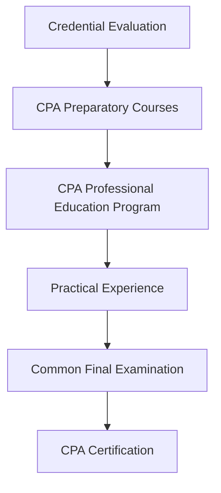

## 2.1.3 International Student Pathways

Embarking on the journey to become a Chartered Professional Accountant (CPA) in Canada as an international student is both an exciting and challenging endeavor. This section provides a comprehensive guide to help international students navigate the pathways to CPA certification in Canada, covering entry requirements, application processes, and practical tips for success.

### Understanding the CPA Certification Pathway

The CPA certification pathway in Canada is designed to ensure that all candidates, regardless of their origin, meet the rigorous standards required to practice as professional accountants. For international students, this involves understanding the specific requirements and processes that apply to them.

#### Key Components of the CPA Pathway

1. **Educational Prerequisites**: International students must have their educational credentials assessed to determine equivalency to Canadian standards. This often involves obtaining a credential evaluation from a recognized agency.

2. **CPA Preparatory Courses**: These courses are designed to bridge any gaps in knowledge and ensure that all candidates have a solid foundation in accounting principles and practices.

3. **CPA Professional Education Program (CPA PEP)**: This is the core educational component of the CPA pathway, consisting of core, elective, and capstone modules.

4. **Practical Experience Requirements**: International students must gain relevant work experience in Canada, which can be achieved through pre-approved programs or experience verification routes.

5. **Common Final Examination (CFE)**: This is the final assessment that tests the competencies and skills acquired throughout the CPA program.

### Educational Prerequisites for International Students

International students must ensure that their educational background meets the entry requirements for the CPA program. This typically involves the following steps:

#### Credential Evaluation

- **Recognized Agencies**: International students must have their academic credentials evaluated by agencies such as World Education Services (WES) or International Qualifications Assessment Service (IQAS). These agencies assess the equivalency of international degrees to Canadian standards.

- **Assessment Process**: The evaluation process involves submitting official transcripts and other relevant documents. The agency will then provide a report indicating the Canadian equivalency of the international education.

#### Meeting Canadian Standards

- **Course Equivalency**: The credential evaluation will determine if the international education meets the specific course requirements for the CPA program. If there are deficiencies, students may need to complete additional courses.

- **Language Proficiency**: Proficiency in English or French is essential. International students may need to provide proof of language proficiency through tests such as IELTS or TOEFL.

### CPA Preparatory Courses

For international students whose educational background does not fully meet the CPA requirements, CPA preparatory courses offer a pathway to bridge these gaps.

#### Purpose and Structure

- **Foundation Building**: These courses cover essential topics such as financial accounting, management accounting, taxation, and audit. They ensure that all candidates have a consistent level of knowledge before entering the CPA PEP.

- **Flexible Learning**: CPA preparatory courses are offered in various formats, including online and in-person, allowing international students to choose the mode that best suits their needs.

#### Subject Areas Covered

- **Financial Accounting**: Understanding the principles and standards of financial reporting.

- **Management Accounting**: Techniques for budgeting, forecasting, and performance measurement.

- **Taxation**: Canadian tax laws and regulations.

- **Audit and Assurance**: Principles of auditing and assurance engagements.

#### Tips for Success

- **Time Management**: Balancing study with other commitments is crucial. Creating a study schedule can help manage time effectively.

- **Utilizing Resources**: CPA Canada provides various resources, including study guides and practice exams, which can be invaluable for preparation.

### CPA Professional Education Program (CPA PEP)

The CPA PEP is the core educational component of the CPA pathway, designed to develop the competencies required for professional practice.

#### Program Structure and Timeline

- **Core Modules**: These modules cover essential topics such as financial reporting and management accounting.

- **Elective Modules**: International students can choose electives based on their career interests, such as assurance, taxation, or finance.

- **Capstone Modules**: These modules focus on integrating knowledge and preparing for the CFE.

#### Practical Experience Requirements

Gaining practical experience is a critical component of the CPA pathway. International students have two main routes to fulfill this requirement:

1. **Pre-Approved Program Route (PPR)**: This route involves working in positions that are pre-approved by CPA Canada, ensuring that the experience gained meets the required competencies.

2. **Experience Verification Route (EVR)**: This route allows students to gain experience in various roles and industries, with the requirement to document and verify the competencies achieved.

#### Working with Mentors

- **Mentorship**: International students are encouraged to work with mentors who can provide guidance and support throughout the practical experience period.

- **Documenting Experience**: It is essential to maintain detailed records of work experience, including the competencies developed and the duration of each role.

### Preparing for the Common Final Examination (CFE)

The CFE is the final assessment in the CPA pathway, testing the competencies and skills acquired throughout the program.

#### Understanding the CFE

- **Structure and Format**: The CFE is a multi-day examination that includes case studies and objective questions.

- **Assessment Criteria**: The exam assesses technical knowledge, professional skills, and ethical judgment.

#### Study Planning and Exam Strategies

- **Time Management**: Developing a study schedule that allocates time for each subject area is crucial for effective preparation.

- **Practice Exams**: Utilizing practice exams and understanding marker feedback can help identify areas for improvement.

- **Stress Management**: Techniques such as mindfulness and relaxation exercises can help manage exam-related stress.

### Real-World Applications and Regulatory Scenarios

International students must be aware of the regulatory environment in Canada and how it impacts the accounting profession.

#### Canadian Accounting Standards

- **International Financial Reporting Standards (IFRS)**: Understanding how IFRS is applied in Canada is essential for international students.

- **Accounting Standards for Private Enterprises (ASPE)**: These standards apply to private companies in Canada and differ from IFRS in certain areas.

#### Compliance Considerations

- **Taxation and Reporting**: International students must be familiar with Canadian tax laws and financial reporting requirements.

- **Ethical Standards**: Adhering to the CPA Code of Professional Conduct is crucial for maintaining professional integrity.

### Practical Examples and Case Studies

To illustrate key points, consider the following scenarios:

#### Scenario 1: Credential Evaluation

An international student from India with a Bachelor of Commerce degree applies for a credential evaluation. The evaluation report indicates that the degree is equivalent to a Canadian bachelor's degree, but with deficiencies in Canadian taxation and audit. The student enrolls in CPA preparatory courses to address these gaps.

#### Scenario 2: Practical Experience

An international student secures a position in a pre-approved program at a Canadian accounting firm. The student works under the supervision of a CPA mentor, gaining experience in financial reporting and audit. The student documents the competencies developed and submits them for verification.

### Step-by-Step Guidance for International Students

1. **Research and Plan**: Understand the CPA pathway and requirements specific to international students.

2. **Credential Evaluation**: Obtain an evaluation of your educational credentials to determine equivalency.

3. **Enroll in Preparatory Courses**: If necessary, enroll in CPA preparatory courses to address any deficiencies.

4. **Apply for CPA PEP**: Once prerequisites are met, apply for the CPA Professional Education Program.

5. **Gain Practical Experience**: Choose a practical experience route and work towards fulfilling the requirements.

6. **Prepare for the CFE**: Develop a study plan and utilize available resources to prepare for the Common Final Examination.

7. **Stay Informed**: Keep up-to-date with changes in Canadian accounting standards and regulations.

### Diagrams and Visual Aids

To enhance understanding, consider the following diagram illustrating the CPA pathway for international students:

### Best Practices and Common Pitfalls

- **Best Practices**: Engage with the CPA community, attend workshops, and seek mentorship to enhance your learning experience.

- **Common Pitfalls**: Avoid underestimating the time required for study and preparation. Ensure that all documentation is complete and accurate.

### Additional Resources

- **CPA Canada Website**: Provides detailed information on the CPA pathway and resources for international students.

- **Professional Associations**: Joining associations such as the Canadian Association of Professional Accountants can provide networking opportunities and support.

- **Online Forums and Study Groups**: Engaging with peers can provide additional insights and motivation.

### Conclusion

The pathway to becoming a CPA in Canada as an international student is a rewarding journey that requires careful planning and dedication. By understanding the requirements and utilizing available resources, international students can successfully transition into the CPA program and achieve their professional goals.

## **Ready to Test Your Knowledge?**

**Practice 10 Essential CPA Exam Questions to Master Your Certification**



### What is the first step for international students in the CPA pathway?

- [x] Credential Evaluation
- [ ] Enrolling in CPA PEP
- [ ] Gaining Practical Experience
- [ ] Preparing for the CFE

> **Explanation:** International students must first have their educational credentials evaluated to determine equivalency to Canadian standards.

### Which agency is recognized for credential evaluation in Canada?

- [x] World Education Services (WES)
- [ ] Canadian Institute of Chartered Accountants (CICA)
- [ ] International Accounting Standards Board (IASB)
- [ ] Canadian Securities Administrators (CSA)

> **Explanation:** World Education Services (WES) is one of the recognized agencies for evaluating international educational credentials in Canada.

### What is the purpose of CPA preparatory courses?

- [x] To bridge knowledge gaps and ensure a solid foundation in accounting principles
- [ ] To provide practical experience
- [ ] To prepare for the CFE
- [ ] To gain language proficiency

> **Explanation:** CPA preparatory courses are designed to address any deficiencies in accounting knowledge and ensure all candidates have a consistent level of understanding.

### What are the two routes for gaining practical experience in the CPA pathway?

- [x] Pre-Approved Program Route (PPR) and Experience Verification Route (EVR)
- [ ] Core Modules and Elective Modules
- [ ] Credential Evaluation and CPA PEP
- [ ] Taxation and Audit

> **Explanation:** International students can gain practical experience through the Pre-Approved Program Route (PPR) or the Experience Verification Route (EVR).

### What is the final assessment in the CPA pathway?

- [x] Common Final Examination (CFE)
- [ ] CPA PEP
- [ ] Credential Evaluation
- [ ] Practical Experience

> **Explanation:** The Common Final Examination (CFE) is the final assessment that tests the competencies and skills acquired throughout the CPA program.

### Which of the following is a key component of the CPA pathway?

- [x] CPA Professional Education Program (CPA PEP)
- [ ] International Financial Reporting Standards (IFRS)
- [ ] Canadian Securities Course (CSC)
- [ ] Chartered Financial Analyst (CFA)

> **Explanation:** The CPA Professional Education Program (CPA PEP) is a core component of the CPA pathway, consisting of core, elective, and capstone modules.

### What is required for language proficiency in the CPA pathway?

- [x] Proof of proficiency in English or French through tests such as IELTS or TOEFL
- [ ] Completion of a language course in Canada
- [ ] Passing the CFE
- [ ] Enrolling in CPA PEP

> **Explanation:** International students may need to provide proof of language proficiency through tests such as IELTS or TOEFL to meet the CPA pathway requirements.

### Which standards apply to private companies in Canada?

- [x] Accounting Standards for Private Enterprises (ASPE)
- [ ] International Financial Reporting Standards (IFRS)
- [ ] Generally Accepted Accounting Principles (GAAP)
- [ ] Canadian Securities Regulations

> **Explanation:** Accounting Standards for Private Enterprises (ASPE) apply to private companies in Canada and differ from IFRS in certain areas.

### What is the role of a mentor in the CPA pathway?

- [x] To provide guidance and support throughout the practical experience period
- [ ] To evaluate educational credentials
- [ ] To administer the CFE
- [ ] To teach CPA preparatory courses

> **Explanation:** Mentors provide guidance and support to international students during the practical experience period, helping them develop the required competencies.

### True or False: CPA preparatory courses are mandatory for all international students.

- [ ] True
- [x] False

> **Explanation:** CPA preparatory courses are not mandatory for all international students. They are required only if there are deficiencies in the educational background that need to be addressed.


