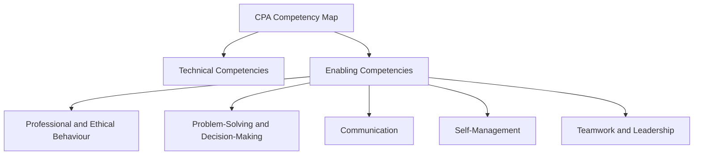

## 2.2.2 Enabling Competencies Overview

Enabling competencies are the cornerstone of the Chartered Professional Accountant (CPA) certification, equipping candidates with the essential professional skills required to excel in the accounting field. These competencies transcend technical knowledge, focusing on the development of leadership, communication, and other interpersonal skills that are critical for effective performance in diverse professional environments. This section provides an in-depth exploration of enabling competencies, highlighting their significance, components, and application in real-world scenarios.

### Understanding Enabling Competencies

Enabling competencies are non-technical skills that complement the technical competencies required of CPAs. They are integral to the CPA Competency Map, which outlines the skills and knowledge necessary for CPA candidates to succeed in their careers. Enabling competencies include:

- **Professional and Ethical Behaviour**
- **Problem-Solving and Decision-Making**
- **Communication**
- **Self-Management**
- **Teamwork and Leadership**

These competencies are essential for CPAs to navigate complex business environments, make informed decisions, and communicate effectively with stakeholders.

### Professional and Ethical Behaviour

#### Upholding Integrity and Objectivity

Integrity and objectivity are fundamental principles for CPAs. Upholding these values ensures that CPAs maintain trust and credibility in their professional relationships. CPAs must avoid conflicts of interest and ensure transparency in their reporting.

**Example:** A CPA working in an audit firm must remain objective and unbiased when evaluating a client's financial statements, even if the client is a long-standing partner of the firm.

#### Confidentiality and Professional Judgment

CPAs are entrusted with sensitive information and must protect client confidentiality. Exercising professional judgment involves making informed decisions based on ethical considerations and professional standards.

**Case Study:** A CPA discovers a potential financial irregularity in a client's records. The CPA must decide whether to report the issue, considering the ethical implications and the potential impact on the client relationship.

### Problem-Solving and Decision-Making

#### Analytical Thinking

Analytical thinking involves critically evaluating information to identify patterns, relationships, and underlying issues. CPAs use analytical skills to interpret financial data and provide insights for decision-making.

**Scenario:** A CPA is tasked with analyzing a company's financial performance to identify areas for cost reduction. By examining financial ratios and trends, the CPA can recommend strategies to improve profitability.

#### Decision-Making Models

CPAs employ various decision-making models, such as cost-benefit analysis and decision trees, to evaluate options and make informed choices. These models help CPAs assess risks and benefits, ensuring sound business decisions.

**Example:** A CPA uses a cost-benefit analysis to determine whether a company should invest in new technology. The analysis considers the potential return on investment and the associated risks.

### Communication

#### Effective Written Communication

Clear and concise written communication is vital for CPAs to convey complex information to diverse audiences. This includes report writing, email correspondence, and documentation.

**Tip:** Use bullet points and headings to organize information in reports, making it easier for readers to understand key points.

#### Verbal and Non-Verbal Communication

CPAs must excel in verbal and non-verbal communication to effectively present ideas and engage with stakeholders. This includes active listening, presentation skills, and understanding body language.

**Practical Application:** During a client meeting, a CPA uses active listening to understand the client's concerns and responds with tailored solutions, demonstrating empathy and professionalism.

### Self-Management

#### Time and Priority Management

Effective time management enables CPAs to balance multiple responsibilities and meet deadlines. Prioritizing tasks and setting goals are essential for maintaining productivity.

**Strategy:** Use productivity tools, such as calendars and task lists, to organize daily activities and track progress toward goals.

#### Continuous Learning and Development

CPAs must commit to lifelong learning to stay current with industry trends and regulatory changes. This involves pursuing professional development opportunities and acquiring new skills.

**Example:** A CPA enrolls in a course on data analytics to enhance their ability to analyze financial data and provide data-driven insights to clients.

### Teamwork and Leadership

#### Dynamics of Effective Teams

CPAs often work in teams, requiring collaboration and coordination to achieve common goals. Understanding team dynamics and roles is crucial for effective teamwork.

**Scenario:** A CPA leads a project team tasked with implementing a new accounting system. By fostering open communication and assigning clear roles, the team successfully completes the project on time.

#### Leadership Styles and Theories

CPAs in leadership roles must adapt their leadership style to suit different situations and team needs. Transformational and situational leadership theories provide frameworks for effective leadership.

**Example:** A CPA manager uses transformational leadership to inspire and motivate their team, fostering a culture of innovation and continuous improvement.

### Real-World Applications and Regulatory Scenarios

Enabling competencies are not only theoretical concepts but also practical skills that CPAs apply in their daily work. Understanding how these competencies manifest in real-world scenarios is crucial for exam preparation and professional practice.

#### Case Study: Ethical Dilemmas in Accounting

Consider a scenario where a CPA encounters an ethical dilemma involving financial reporting. The CPA must navigate the situation by applying ethical decision-making frameworks and professional judgment to resolve the issue while maintaining integrity and compliance with regulatory standards.

#### Practical Example: Communication in a Multicultural Environment

In a globalized business environment, CPAs often interact with stakeholders from diverse cultural backgrounds. Effective communication requires cultural competence and the ability to tailor messages to different audiences. This competency is essential for CPAs working in multinational corporations or with international clients.

### Step-by-Step Guidance for Developing Enabling Competencies

Developing enabling competencies requires deliberate practice and reflection. Here are steps to enhance these skills:

1. **Self-Assessment:** Evaluate your current competencies and identify areas for improvement.
2. **Goal Setting:** Set specific, measurable goals for developing each competency.
3. **Seek Feedback:** Regularly seek feedback from peers, mentors, and supervisors to gain insights into your strengths and areas for growth.
4. **Practice:** Engage in activities that challenge your competencies, such as leading a team project or presenting at a professional conference.
5. **Reflect:** Reflect on your experiences and learn from both successes and challenges.

### Diagrams and Visual Aids

To enhance understanding, consider the following diagram illustrating the relationship between enabling competencies and technical competencies in the CPA Competency Map:

### Best Practices and Common Pitfalls

#### Best Practices

- **Embrace Lifelong Learning:** Continuously seek opportunities for professional development to enhance your competencies.
- **Cultivate Emotional Intelligence:** Develop self-awareness and empathy to improve interpersonal relationships and communication.
- **Foster a Growth Mindset:** Approach challenges as opportunities for learning and growth.

#### Common Pitfalls

- **Neglecting Soft Skills:** Focusing solely on technical skills can hinder career advancement. Enabling competencies are equally important for success.
- **Resistance to Feedback:** Avoid dismissing feedback as criticism. Constructive feedback is valuable for personal and professional growth.
- **Poor Time Management:** Failing to prioritize tasks can lead to missed deadlines and increased stress. Use time management techniques to stay organized.

### References and Additional Resources

For further exploration of enabling competencies, consider the following resources:

- **CPA Canada Competency Map:** Provides detailed information on the competencies required for CPA certification.
- **International Federation of Accountants (IFAC):** Offers resources on ethical standards and professional conduct.
- **Harvard Business Review:** Articles on leadership, communication, and decision-making in the business context.

### Summary

Enabling competencies are vital for CPA candidates, encompassing a range of skills that support effective performance in the accounting profession. By developing these competencies, candidates enhance their ability to lead, communicate, and make informed decisions, ultimately contributing to their success in the CPA certification process and their future careers.

## **Ready to Test Your Knowledge?**

**Practice 10 Essential CPA Exam Questions to Master Your Certification**



### What are enabling competencies in the CPA Competency Map?

- [x] Non-technical skills that complement technical competencies
- [ ] Technical skills required for financial reporting
- [ ] Skills related to tax calculation
- [ ] Competencies specific to audit procedures

> **Explanation:** Enabling competencies are non-technical skills that complement the technical competencies required of CPAs, such as leadership and communication.

### Which of the following is an example of professional and ethical behaviour?

- [x] Maintaining client confidentiality
- [ ] Maximizing company profits at any cost
- [ ] Avoiding difficult conversations
- [ ] Delegating all responsibilities to others

> **Explanation:** Maintaining client confidentiality is a key aspect of professional and ethical behaviour for CPAs.

### What is the purpose of analytical thinking in problem-solving?

- [x] To critically evaluate information and identify patterns
- [ ] To make decisions based on intuition
- [ ] To avoid complex problems
- [ ] To delegate decision-making to others

> **Explanation:** Analytical thinking involves critically evaluating information to identify patterns and relationships, aiding in problem-solving.

### How can CPAs improve their written communication skills?

- [x] By organizing information with bullet points and headings
- [ ] By using complex jargon to impress readers
- [ ] By avoiding feedback from peers
- [ ] By focusing solely on verbal communication

> **Explanation:** Organizing information with bullet points and headings helps CPAs convey complex information clearly and concisely.

### What is a key component of self-management for CPAs?

- [x] Effective time and priority management
- [ ] Avoiding professional development
- [ ] Delegating all tasks to others
- [ ] Ignoring feedback from supervisors

> **Explanation:** Effective time and priority management is crucial for CPAs to balance responsibilities and meet deadlines.

### Which leadership style involves inspiring and motivating team members?

- [x] Transformational leadership
- [ ] Autocratic leadership
- [ ] Laissez-faire leadership
- [ ] Transactional leadership

> **Explanation:** Transformational leadership involves inspiring and motivating team members to achieve their full potential.

### What is the role of cultural competence in communication?

- [x] To tailor messages to diverse audiences
- [ ] To use the same communication style for all audiences
- [ ] To focus solely on verbal communication
- [ ] To avoid interacting with international clients

> **Explanation:** Cultural competence involves tailoring messages to diverse audiences, essential for effective communication in a globalized environment.

### How can CPAs develop their enabling competencies?

- [x] By setting specific goals and seeking feedback
- [ ] By focusing only on technical skills
- [ ] By avoiding challenging situations
- [ ] By relying solely on past experiences

> **Explanation:** Setting specific goals and seeking feedback are effective strategies for developing enabling competencies.

### True or False: Enabling competencies are less important than technical competencies for CPAs.

- [ ] True
- [x] False

> **Explanation:** Enabling competencies are equally important as technical competencies for CPAs, as they support effective performance in professional environments.

### Which of the following is a common pitfall in developing enabling competencies?

- [x] Neglecting soft skills
- [ ] Embracing lifelong learning
- [ ] Cultivating emotional intelligence
- [ ] Fostering a growth mindset

> **Explanation:** Neglecting soft skills can hinder career advancement, as enabling competencies are crucial for success.


