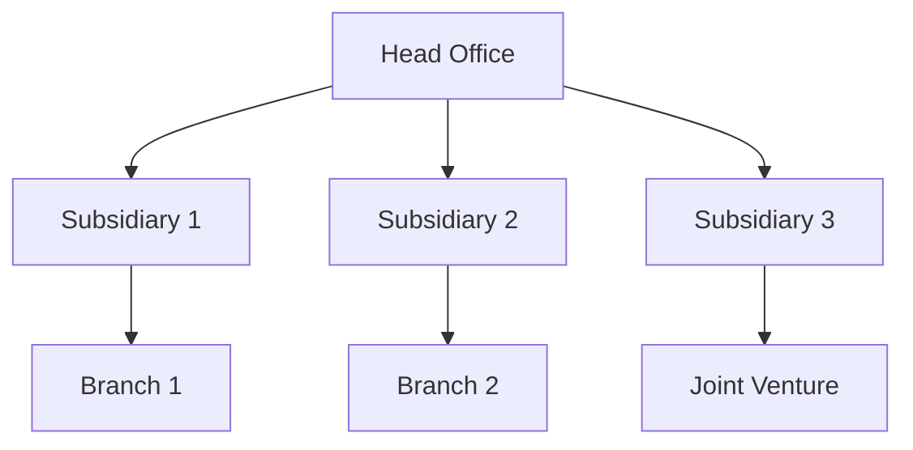

## 20.1.2 Multinational Corporations

### Introduction

Multinational corporations (MNCs) are entities that operate in multiple countries, managing production or delivering services across borders. These corporations face unique accounting challenges due to their global operations, which require compliance with various international and local accounting standards, taxation laws, and regulatory requirements. This section delves into the accounting considerations specific to MNCs, focusing on the Canadian context while integrating global practices.

### Understanding Multinational Corporations

#### Definition and Characteristics

Multinational corporations are businesses that have facilities and assets in at least one country other than their home country. They typically have a centralized head office where they coordinate global management. Key characteristics of MNCs include:

- **Global Presence:** Operations in multiple countries, often with subsidiaries, branches, or joint ventures.
- **Diverse Workforce:** Employees from various cultural and national backgrounds.
- **Complex Supply Chains:** Cross-border supply chains that require efficient logistics and management.
- **Varied Regulatory Environments:** Compliance with different legal and regulatory frameworks in each country of operation.

#### Importance in the Global Economy

MNCs play a crucial role in the global economy by facilitating international trade, investment, and economic integration. They contribute to economic growth, create jobs, and foster innovation through the transfer of technology and expertise.

### Accounting Considerations for Multinational Corporations

#### 1. Financial Reporting Standards

Multinational corporations must navigate different financial reporting standards, primarily the International Financial Reporting Standards (IFRS) and the Generally Accepted Accounting Principles (GAAP) of various countries.

- **IFRS Adoption:** Many MNCs adopt IFRS to ensure consistency and comparability in financial reporting across different jurisdictions. In Canada, publicly accountable enterprises are required to use IFRS.
- **Local GAAP Compliance:** MNCs must also comply with local GAAP in countries where they operate, which may differ significantly from IFRS.

#### 2. Foreign Exchange Management

Foreign exchange fluctuations can significantly impact the financial performance of MNCs. Effective management of foreign exchange risk is crucial for accurate financial reporting and maintaining profitability.

- **Translation of Financial Statements:** MNCs must translate financial statements of foreign subsidiaries into the parent company's reporting currency. This involves using exchange rates at the balance sheet date for assets and liabilities and average rates for income and expenses.
- **Hedging Strategies:** MNCs often use hedging instruments such as forward contracts, options, and swaps to mitigate foreign exchange risk.

#### 3. Transfer Pricing

Transfer pricing refers to the pricing of goods, services, and intangibles transferred between related entities within an MNC. It is a critical area of concern due to its impact on taxation and compliance with international regulations.

- **Arm's Length Principle:** MNCs must set transfer prices based on the arm's length principle, ensuring that transactions between related parties are priced as if they were between unrelated parties.
- **Documentation and Compliance:** MNCs must maintain detailed documentation to justify transfer pricing policies and comply with tax authorities' requirements in different jurisdictions.

#### 4. Taxation and Regulatory Compliance

MNCs face complex taxation issues due to their operations in multiple tax jurisdictions. They must navigate various tax laws, treaties, and compliance requirements.

- **Double Taxation Avoidance:** MNCs often rely on tax treaties to avoid double taxation, where the same income is taxed in more than one country.
- **Tax Planning Strategies:** Effective tax planning is essential to minimize tax liabilities while ensuring compliance with local and international tax laws.

#### 5. Consolidation of Financial Statements

MNCs must consolidate financial statements of all subsidiaries to present a unified financial position and performance.

- **Elimination of Intercompany Transactions:** During consolidation, intercompany transactions and balances must be eliminated to avoid double counting.
- **Minority Interest Accounting:** MNCs must account for minority interests in subsidiaries where they do not own 100% of the equity.

#### 6. Cultural and Ethical Considerations

Operating in diverse cultural environments presents ethical challenges for MNCs. They must uphold ethical standards while respecting local customs and practices.

- **Corporate Social Responsibility (CSR):** MNCs are expected to engage in CSR activities that benefit local communities and contribute to sustainable development.
- **Ethical Leadership:** MNCs must promote ethical behavior and integrity across their global operations.

### Practical Examples and Case Studies

#### Case Study: Transfer Pricing in Action

Consider a Canadian-based MNC with subsidiaries in the United States and Germany. The company manufactures components in Canada, assembles products in the United States, and sells them in Germany. The transfer pricing policy must ensure that the prices charged for components between the Canadian and U.S. subsidiaries reflect market conditions to comply with the arm's length principle.

#### Example: Foreign Exchange Risk Management

A Canadian MNC exporting goods to Europe faces the risk of currency fluctuations between the Canadian dollar (CAD) and the Euro (EUR). To mitigate this risk, the company enters into forward contracts to lock in exchange rates for future transactions, ensuring stable cash flows and predictable financial results.

### Real-World Applications and Regulatory Scenarios

#### Compliance with IFRS and Local GAAP

MNCs must ensure that their financial reporting aligns with IFRS while also adhering to local GAAP in countries where they operate. This dual compliance requires a robust accounting system capable of handling multiple reporting standards.

#### Navigating Taxation Challenges

MNCs must develop comprehensive tax strategies to address issues such as transfer pricing, permanent establishment, and withholding taxes. They must also stay informed about changes in tax laws and regulations in different jurisdictions.

### Step-by-Step Guidance for Accounting Procedures

#### Consolidation Process

1. **Identify Subsidiaries:** Determine which entities are subsidiaries based on control and ownership criteria.
2. **Gather Financial Statements:** Collect financial statements of all subsidiaries, ensuring they are prepared in accordance with the parent company's reporting standards.
3. **Eliminate Intercompany Transactions:** Identify and eliminate intercompany transactions and balances to avoid double counting.
4. **Adjust for Minority Interests:** Account for minority interests in subsidiaries where the parent does not own 100% of the equity.
5. **Prepare Consolidated Financial Statements:** Combine the adjusted financial statements to present a unified financial position and performance.

#### Transfer Pricing Documentation

1. **Conduct Functional Analysis:** Analyze the functions performed, assets used, and risks assumed by each entity involved in intercompany transactions.
2. **Select Transfer Pricing Method:** Choose an appropriate transfer pricing method, such as the Comparable Uncontrolled Price (CUP) method or the Transactional Net Margin Method (TNMM).
3. **Prepare Documentation:** Maintain detailed documentation to support the transfer pricing policy, including economic analyses and benchmarking studies.
4. **Monitor Compliance:** Regularly review and update transfer pricing policies to ensure compliance with changing regulations.

### Diagrams and Visuals

#### Organizational Structure of a Multinational Corporation

#### Foreign Exchange Risk Management Process

### Best Practices and Common Pitfalls

#### Best Practices

- **Consistent Application of Standards:** Ensure consistent application of accounting standards across all subsidiaries.
- **Robust Internal Controls:** Implement strong internal controls to manage risks associated with foreign exchange, transfer pricing, and regulatory compliance.
- **Regular Training:** Provide regular training to accounting staff on international accounting standards and regulatory changes.

#### Common Pitfalls

- **Inadequate Documentation:** Failing to maintain comprehensive documentation for transfer pricing can lead to disputes with tax authorities.
- **Overlooking Local Regulations:** Ignoring local accounting and tax regulations can result in non-compliance and financial penalties.

### References and Additional Resources

- **CPA Canada:** Resources and guidelines on international accounting standards and practices.
- **IFRS Foundation:** Official standards and interpretations for IFRS.
- **OECD Transfer Pricing Guidelines:** Comprehensive guidelines on transfer pricing for multinational enterprises.

### Summary

Multinational corporations face unique accounting challenges due to their global operations. By understanding and addressing these challenges, MNCs can ensure compliance with international and local standards, manage risks effectively, and maintain financial integrity. This section has provided an in-depth exploration of the key accounting considerations for MNCs, offering practical examples, real-world applications, and step-by-step guidance to help you succeed in your CPA exams and future career.

## **Ready to Test Your Knowledge?**

**Practice 10 Essential CPA Exam Questions to Master Your Certification**



### What is the primary financial reporting standard used by multinational corporations for consistency across borders?

- [x] International Financial Reporting Standards (IFRS)
- [ ] Generally Accepted Accounting Principles (GAAP)
- [ ] Canadian Accounting Standards for Private Enterprises (ASPE)
- [ ] Public Sector Accounting Standards (PSAS)

> **Explanation:** IFRS is widely adopted by multinational corporations to ensure consistency and comparability in financial reporting across different jurisdictions.

### Which principle must multinational corporations adhere to when setting transfer prices?

- [x] Arm's Length Principle
- [ ] Cost-Plus Principle
- [ ] Market Value Principle
- [ ] Historical Cost Principle

> **Explanation:** The arm's length principle requires that transactions between related parties be priced as if they were between unrelated parties, ensuring fairness and compliance with tax regulations.

### What is a common hedging instrument used by multinational corporations to manage foreign exchange risk?

- [x] Forward Contracts
- [ ] Equity Swaps
- [ ] Credit Default Swaps
- [ ] Interest Rate Swaps

> **Explanation:** Forward contracts are commonly used by multinational corporations to lock in exchange rates for future transactions, mitigating foreign exchange risk.

### What is the purpose of consolidating financial statements for multinational corporations?

- [x] To present a unified financial position and performance
- [ ] To comply with local tax regulations
- [ ] To increase shareholder value
- [ ] To reduce operational costs

> **Explanation:** Consolidating financial statements allows multinational corporations to present a unified financial position and performance, eliminating intercompany transactions and providing a comprehensive view of the entire organization.

### Which of the following is a key characteristic of multinational corporations?

- [x] Operations in multiple countries
- [ ] Focus on domestic markets
- [ ] Limited product offerings
- [ ] Single currency transactions

> **Explanation:** Multinational corporations operate in multiple countries, managing production or delivering services across borders, which is a defining characteristic of their global presence.

### How do multinational corporations avoid double taxation on the same income?

- [x] By relying on tax treaties
- [ ] By using tax shelters
- [ ] By engaging in tax evasion
- [ ] By underreporting income

> **Explanation:** Multinational corporations often rely on tax treaties to avoid double taxation, ensuring that the same income is not taxed in more than one country.

### What is a common challenge faced by multinational corporations in different cultural environments?

- [x] Upholding ethical standards
- [ ] Managing single-currency transactions
- [ ] Reducing product diversity
- [ ] Increasing domestic market share

> **Explanation:** Multinational corporations must uphold ethical standards while respecting local customs and practices, which can be challenging in diverse cultural environments.

### What is the first step in the consolidation process for multinational corporations?

- [x] Identify Subsidiaries
- [ ] Eliminate Intercompany Transactions
- [ ] Prepare Consolidated Financial Statements
- [ ] Adjust for Minority Interests

> **Explanation:** The first step in the consolidation process is to identify subsidiaries based on control and ownership criteria, which sets the foundation for further consolidation activities.

### True or False: Multinational corporations must comply with both IFRS and local GAAP in countries where they operate.

- [x] True
- [ ] False

> **Explanation:** Multinational corporations must ensure their financial reporting aligns with IFRS while also adhering to local GAAP in countries where they operate, requiring dual compliance.

### Which of the following is a best practice for multinational corporations to manage accounting challenges?

- [x] Implementing strong internal controls
- [ ] Ignoring local regulations
- [ ] Reducing financial transparency
- [ ] Centralizing all operations

> **Explanation:** Implementing strong internal controls helps multinational corporations manage risks associated with foreign exchange, transfer pricing, and regulatory compliance, ensuring accurate and reliable financial reporting.


