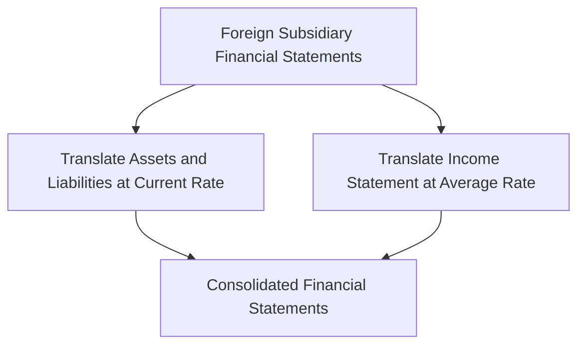

## 20.2.1 Foreign Exchange

Foreign exchange is a critical component of international business and global accounting, particularly for Canadian Chartered Professional Accountants (CPAs) who must navigate the complexities of currency translation and exchange rate fluctuations. This section provides a comprehensive guide to understanding and applying foreign exchange principles, essential for CPA exam success and professional practice.

### Understanding Foreign Exchange

Foreign exchange (FX) refers to the conversion of one currency into another, a process that is vital for international trade and investment. The foreign exchange market is the largest and most liquid financial market in the world, where currencies are traded 24/7. Understanding how foreign exchange works is crucial for accountants dealing with cross-border transactions.

#### Key Concepts in Foreign Exchange

1. **Exchange Rate**: The price of one currency in terms of another. Exchange rates can be quoted in two ways:
   - **Direct Quote**: The domestic currency is the base currency (e.g., CAD/USD).
   - **Indirect Quote**: The foreign currency is the base currency (e.g., USD/CAD).

2. **Spot Rate**: The current exchange rate at which a currency can be bought or sold for immediate delivery.

3. **Forward Rate**: The agreed-upon exchange rate for a currency transaction that will occur at a future date.

4. **Currency Pair**: Two currencies involved in a foreign exchange transaction, such as EUR/USD.

5. **Appreciation and Depreciation**: Appreciation refers to an increase in the value of a currency relative to another, while depreciation is a decrease in value.

### Currency Translation in Accounting

Currency translation is the process of converting financial statements of foreign subsidiaries into the parent company's reporting currency. This is essential for multinational corporations that operate in multiple countries with different currencies.

#### Translation Methods

1. **Current Rate Method**: All assets and liabilities are translated at the current exchange rate at the balance sheet date. Income statement items are translated at the average exchange rate for the period.

2. **Temporal Method**: Monetary items are translated at the current rate, while non-monetary items are translated at historical rates. Income statement items are translated at the average rate, except for those related to non-monetary items, which are translated at historical rates.

#### Accounting Standards for Currency Translation

- **International Financial Reporting Standards (IFRS)**: Under IFRS, IAS 21 "The Effects of Changes in Foreign Exchange Rates" provides guidance on how to account for foreign currency transactions and translation.

- **Accounting Standards for Private Enterprises (ASPE)**: ASPE Section 1651 outlines the requirements for translating foreign currency transactions and financial statements.

### Exchange Rate Fluctuations

Exchange rate fluctuations can significantly impact the financial performance of companies engaged in international business. Accountants must understand how to manage and report these fluctuations.

#### Impact on Financial Statements

1. **Transaction Exposure**: Arises from the effect of exchange rate changes on the value of a company's foreign currency transactions.

2. **Translation Exposure**: The impact of exchange rate changes on the reported financial statements of a company with foreign operations.

3. **Economic Exposure**: The effect of exchange rate changes on a company's future cash flows and market value.

#### Managing Exchange Rate Risk

1. **Hedging**: Companies can use financial instruments such as forward contracts, options, and swaps to hedge against exchange rate risk.

2. **Natural Hedging**: Involves structuring operations to offset foreign currency exposures, such as matching foreign currency revenues with expenses.

3. **Diversification**: Spreading investments across different currencies to reduce risk.

### Practical Examples and Case Studies

#### Example 1: Currency Translation

A Canadian company, Maple Inc., has a subsidiary in the United States. At the end of the fiscal year, Maple Inc. needs to translate the subsidiary's financial statements from USD to CAD. Using the current rate method, Maple Inc. translates all assets and liabilities at the year-end exchange rate, while income statement items are translated at the average rate for the year.

#### Example 2: Managing Exchange Rate Risk

A Canadian exporter, Northern Goods, sells products to European customers in euros. To manage exchange rate risk, Northern Goods enters into a forward contract to lock in the exchange rate for future euro receipts. This hedging strategy protects the company from adverse currency movements.

### Real-World Applications and Regulatory Scenarios

#### Regulatory Considerations

- **CPA Canada Guidelines**: CPAs must adhere to CPA Canada guidelines and standards when accounting for foreign exchange transactions and translation.

- **Tax Implications**: Exchange rate fluctuations can affect the tax liabilities of companies with international operations. CPAs must consider the tax implications of foreign exchange gains and losses.

#### Compliance and Best Practices

1. **Regular Monitoring**: Companies should regularly monitor exchange rates and assess their impact on financial performance.

2. **Comprehensive Policies**: Establishing comprehensive foreign exchange policies and procedures helps manage risk and ensure compliance with accounting standards.

3. **Training and Education**: Continuous training and education for accounting professionals on foreign exchange issues and developments.

### Diagrams and Visual Aids

Below is a diagram illustrating the currency translation process using the current rate method:

### Common Pitfalls and Challenges

1. **Incorrect Translation Rates**: Using incorrect exchange rates for translation can lead to inaccurate financial statements.

2. **Inadequate Hedging**: Failing to adequately hedge exchange rate risk can result in significant financial losses.

3. **Complexity in Multinational Operations**: Managing foreign exchange in multinational operations can be complex and requires specialized knowledge.

### Exam Strategies and Tips

1. **Understand Key Concepts**: Ensure you have a solid understanding of key foreign exchange concepts and terminology.

2. **Practice Calculations**: Practice currency translation and exchange rate calculations to build confidence and accuracy.

3. **Stay Updated**: Keep up-to-date with changes in accounting standards and regulations related to foreign exchange.

### Additional Resources

- **CPA Canada Resources**: Access CPA Canada resources and publications on foreign exchange accounting.

- **IFRS and ASPE Standards**: Review relevant IFRS and ASPE standards for detailed guidance on currency translation and exchange rate fluctuations.

- **Online Courses and Workshops**: Consider enrolling in online courses and workshops to deepen your understanding of foreign exchange in accounting.

### Summary

Foreign exchange is a vital aspect of international business and global accounting. Understanding currency translation and exchange rate fluctuations is essential for CPAs, both for exam success and professional practice. By mastering these concepts, you can effectively manage foreign exchange risk and ensure compliance with accounting standards.

## **Ready to Test Your Knowledge?**

**Practice 10 Essential CPA Exam Questions to Master Your Certification**



### What is the primary purpose of currency translation in accounting?

- [x] To convert financial statements of foreign subsidiaries into the parent company's reporting currency
- [ ] To calculate the exchange rate for future transactions
- [ ] To determine the value of foreign investments
- [ ] To assess the impact of exchange rate fluctuations on cash flows

> **Explanation:** Currency translation is essential for consolidating financial statements of multinational corporations, ensuring consistency in reporting.

### Which method translates all assets and liabilities at the current exchange rate?

- [x] Current Rate Method
- [ ] Temporal Method
- [ ] Historical Rate Method
- [ ] Average Rate Method

> **Explanation:** The Current Rate Method uses the current exchange rate for translating assets and liabilities, aligning with IFRS guidelines.

### What is transaction exposure?

- [x] The effect of exchange rate changes on the value of a company's foreign currency transactions
- [ ] The impact of exchange rate changes on reported financial statements
- [ ] The effect of exchange rate changes on future cash flows
- [ ] The risk of currency appreciation

> **Explanation:** Transaction exposure arises from the need to settle foreign currency transactions, affecting their value due to exchange rate fluctuations.

### How can companies manage exchange rate risk?

- [x] Hedging with financial instruments
- [ ] Ignoring exchange rate changes
- [ ] Relying solely on natural hedging
- [ ] Avoiding international transactions

> **Explanation:** Hedging with financial instruments like forward contracts helps companies mitigate exchange rate risk effectively.

### Which accounting standard provides guidance on foreign currency transactions under IFRS?

- [x] IAS 21
- [ ] IAS 16
- [ ] IFRS 9
- [ ] IFRS 15

> **Explanation:** IAS 21 "The Effects of Changes in Foreign Exchange Rates" outlines the accounting treatment for foreign currency transactions and translation.

### What is the impact of exchange rate fluctuations on financial statements called?

- [x] Translation Exposure
- [ ] Transaction Exposure
- [ ] Economic Exposure
- [ ] Operational Exposure

> **Explanation:** Translation exposure affects the reported financial statements of companies with foreign operations due to exchange rate changes.

### Which strategy involves structuring operations to offset foreign currency exposures?

- [x] Natural Hedging
- [ ] Financial Hedging
- [ ] Speculative Hedging
- [ ] Currency Swapping

> **Explanation:** Natural hedging involves aligning foreign currency revenues with expenses to reduce exposure.

### What is the agreed-upon exchange rate for a future currency transaction called?

- [x] Forward Rate
- [ ] Spot Rate
- [ ] Historical Rate
- [ ] Average Rate

> **Explanation:** The forward rate is used for transactions that will occur at a future date, providing certainty against exchange rate fluctuations.

### Which of the following is a common pitfall in foreign exchange accounting?

- [x] Using incorrect translation rates
- [ ] Over-hedging currency exposure
- [ ] Ignoring tax implications
- [ ] Relying on historical rates

> **Explanation:** Incorrect translation rates can lead to inaccurate financial statements, highlighting the importance of accuracy in foreign exchange accounting.

### True or False: Exchange rate fluctuations have no impact on a company's tax liabilities.

- [ ] True
- [x] False

> **Explanation:** Exchange rate fluctuations can affect tax liabilities, as foreign exchange gains and losses may have tax implications.



By mastering the principles of foreign exchange, you can confidently tackle CPA exam questions and apply this knowledge in your professional accounting career.
