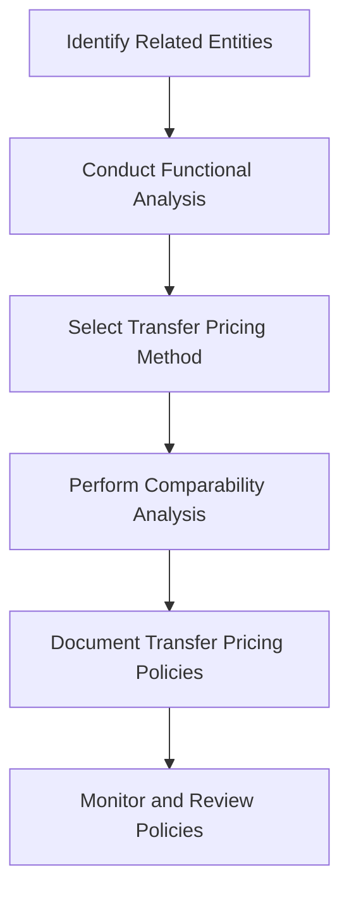

## 20.2.2 Transfer Pricing

Transfer pricing is a pivotal concept in international business and global accounting, particularly relevant for candidates preparing for the Chartered Professional Accountant (CPA) exams in Canada. It involves setting prices for transactions between related entities across borders, impacting financial reporting, tax compliance, and strategic decision-making. This section provides a comprehensive exploration of transfer pricing, equipping you with the knowledge and skills necessary to excel in the CPA exam and your future career.

### Understanding Transfer Pricing

Transfer pricing refers to the pricing of goods, services, and intangibles transferred between related entities within a multinational enterprise (MNE). These transactions can include the sale of products, provision of services, licensing of intellectual property, and financing arrangements. The primary objective of transfer pricing is to allocate income and expenses among different jurisdictions, ensuring that each entity within the MNE is appropriately compensated for its contributions.

#### Key Concepts and Principles

1. **Arm's Length Principle**: The cornerstone of transfer pricing, the arm's length principle requires that transactions between related parties be conducted as if they were between unrelated parties. This ensures that prices reflect market conditions and prevent profit shifting to low-tax jurisdictions.

2. **Comparable Uncontrolled Price (CUP) Method**: This method compares the price charged in a controlled transaction to the price charged in a comparable uncontrolled transaction. It is often used for tangible goods and services.

3. **Resale Price Method**: This method is applicable when a product is purchased from a related party and resold to an independent party. The resale price is reduced by a gross margin to arrive at the arm's length price.

4. **Cost Plus Method**: Used for transactions involving the provision of services or manufacturing, this method adds an appropriate markup to the costs incurred by the supplier.

5. **Transactional Net Margin Method (TNMM)**: This method examines the net profit margin relative to an appropriate base, such as sales or assets, that a taxpayer realizes from a controlled transaction.

6. **Profit Split Method**: This method is used when transactions are highly integrated, and it involves splitting the combined profits among related entities based on their relative contributions.

### Regulatory Framework and Guidelines

Transfer pricing regulations are governed by both domestic laws and international guidelines. In Canada, the Canada Revenue Agency (CRA) enforces transfer pricing rules under the Income Tax Act. Internationally, the Organisation for Economic Co-operation and Development (OECD) provides guidelines that serve as a benchmark for many countries.

#### OECD Transfer Pricing Guidelines

The OECD Transfer Pricing Guidelines for Multinational Enterprises and Tax Administrations provide a comprehensive framework for applying the arm's length principle. Key aspects include:

- **Functional Analysis**: Identifying the functions performed, assets used, and risks assumed by each entity in a transaction.
- **Comparability Analysis**: Assessing the comparability of controlled and uncontrolled transactions based on factors such as characteristics of goods or services, contractual terms, economic circumstances, and business strategies.
- **Documentation Requirements**: Maintaining detailed documentation to support transfer pricing policies and demonstrate compliance with the arm's length principle.

#### Canadian Transfer Pricing Regulations

In Canada, transfer pricing is governed by Section 247 of the Income Tax Act. Key requirements include:

- **Contemporaneous Documentation**: Taxpayers must prepare and maintain documentation that substantiates their transfer pricing policies and demonstrates compliance with the arm's length principle.
- **Penalties for Non-Compliance**: Failure to comply with transfer pricing regulations can result in significant penalties, including adjustments to taxable income and interest charges.

### Practical Examples and Case Studies

To illustrate the application of transfer pricing principles, consider the following scenarios:

#### Example 1: Tangible Goods

A Canadian subsidiary of a multinational corporation purchases raw materials from its U.S. parent company. The transfer price must reflect the arm's length price, determined by comparing similar transactions between unrelated parties. The CUP method is applied, using market data to establish a fair price.

#### Example 2: Intellectual Property Licensing

A Canadian company licenses technology from its European affiliate. The cost plus method is used to determine the appropriate royalty rate, considering the costs incurred by the licensor and an arm's length markup.

#### Case Study: Transfer Pricing Dispute

A Canadian subsidiary of a global tech firm faces a transfer pricing audit by the CRA. The audit focuses on the pricing of intercompany services. The subsidiary successfully defends its pricing strategy by providing comprehensive documentation and demonstrating compliance with the arm's length principle.

### Real-World Applications and Compliance Considerations

Transfer pricing has significant implications for tax compliance, financial reporting, and strategic decision-making. Key considerations include:

- **Tax Planning**: Effective transfer pricing strategies can minimize tax liabilities and optimize the allocation of profits across jurisdictions.
- **Risk Management**: Transfer pricing audits and disputes can result in significant financial and reputational risks. Maintaining robust documentation and compliance procedures is essential.
- **Strategic Decision-Making**: Transfer pricing influences decisions related to supply chain management, market entry, and business restructuring.

### Step-by-Step Guidance for Transfer Pricing Analysis

1. **Conduct a Functional Analysis**: Identify the functions, assets, and risks associated with each entity in the transaction.
2. **Select the Appropriate Transfer Pricing Method**: Choose the method that best reflects the economic reality of the transaction and complies with regulatory requirements.
3. **Perform a Comparability Analysis**: Identify comparable uncontrolled transactions and assess their comparability based on relevant factors.
4. **Document Transfer Pricing Policies**: Prepare detailed documentation to support the chosen transfer pricing method and demonstrate compliance with the arm's length principle.
5. **Monitor and Review Transfer Pricing Policies**: Regularly review and update transfer pricing policies to reflect changes in business operations and market conditions.

### Diagrams and Visuals

To enhance understanding, consider the following diagram illustrating the transfer pricing process:

### Best Practices, Common Pitfalls, and Strategies

**Best Practices**:
- Maintain comprehensive and contemporaneous documentation.
- Regularly review and update transfer pricing policies.
- Engage with tax authorities proactively to resolve potential disputes.

**Common Pitfalls**:
- Inadequate documentation and analysis.
- Failure to consider local regulations and guidelines.
- Over-reliance on a single transfer pricing method.

**Strategies to Overcome Challenges**:
- Develop a robust transfer pricing policy framework.
- Conduct regular training and awareness programs for finance and tax teams.
- Utilize technology and data analytics to enhance transfer pricing analysis.

### References and Additional Resources

- **OECD Transfer Pricing Guidelines**: [OECD Guidelines](https://www.oecd.org/tax/transfer-pricing/)
- **Canada Revenue Agency Transfer Pricing Resources**: [CRA Transfer Pricing](https://www.canada.ca/en/revenue-agency/services/tax/international-non-residents/transfer-pricing.html)
- **CPA Canada Resources**: [CPA Canada](https://www.cpacanada.ca/)

### Summary

Transfer pricing is a critical aspect of international business and global accounting, with significant implications for tax compliance and strategic decision-making. By understanding the principles, regulations, and best practices, you can effectively navigate transfer pricing challenges and excel in the CPA exam.

## **Ready to Test Your Knowledge?**

**Practice 10 Essential CPA Exam Questions to Master Your Certification**



### What is the primary objective of transfer pricing?

- [x] To allocate income and expenses among different jurisdictions
- [ ] To minimize the overall tax liability of a multinational enterprise
- [ ] To ensure compliance with local tax laws
- [ ] To maximize profits for the parent company

> **Explanation:** The primary objective of transfer pricing is to allocate income and expenses among different jurisdictions, ensuring that each entity within a multinational enterprise is appropriately compensated for its contributions.

### Which method compares the price charged in a controlled transaction to the price charged in a comparable uncontrolled transaction?

- [x] Comparable Uncontrolled Price (CUP) Method
- [ ] Resale Price Method
- [ ] Cost Plus Method
- [ ] Transactional Net Margin Method (TNMM)

> **Explanation:** The CUP method compares the price charged in a controlled transaction to the price charged in a comparable uncontrolled transaction, often used for tangible goods and services.

### What is the cornerstone principle of transfer pricing?

- [x] Arm's Length Principle
- [ ] Profit Split Method
- [ ] Cost Plus Method
- [ ] Resale Price Method

> **Explanation:** The arm's length principle is the cornerstone of transfer pricing, requiring that transactions between related parties be conducted as if they were between unrelated parties.

### Which organization provides international guidelines for transfer pricing?

- [x] Organisation for Economic Co-operation and Development (OECD)
- [ ] Canada Revenue Agency (CRA)
- [ ] International Monetary Fund (IMF)
- [ ] World Trade Organization (WTO)

> **Explanation:** The OECD provides international guidelines for transfer pricing, serving as a benchmark for many countries.

### What is the purpose of a functional analysis in transfer pricing?

- [x] To identify the functions performed, assets used, and risks assumed by each entity
- [ ] To determine the appropriate transfer pricing method
- [ ] To assess the comparability of controlled and uncontrolled transactions
- [ ] To document transfer pricing policies

> **Explanation:** A functional analysis identifies the functions performed, assets used, and risks assumed by each entity in a transaction, forming the basis for selecting the appropriate transfer pricing method.

### Which method is used when transactions are highly integrated?

- [x] Profit Split Method
- [ ] Comparable Uncontrolled Price (CUP) Method
- [ ] Resale Price Method
- [ ] Cost Plus Method

> **Explanation:** The profit split method is used when transactions are highly integrated, involving splitting the combined profits among related entities based on their relative contributions.

### What is the role of the Canada Revenue Agency (CRA) in transfer pricing?

- [x] To enforce transfer pricing rules under the Income Tax Act
- [ ] To provide international guidelines for transfer pricing
- [ ] To minimize tax liabilities for Canadian companies
- [ ] To develop transfer pricing methods

> **Explanation:** The CRA enforces transfer pricing rules under the Income Tax Act, ensuring compliance with Canadian regulations.

### What is the consequence of failing to comply with transfer pricing regulations in Canada?

- [x] Significant penalties, including adjustments to taxable income and interest charges
- [ ] Loss of business licenses
- [ ] Increased tax liabilities in other jurisdictions
- [ ] Mandatory audits by international organizations

> **Explanation:** Failure to comply with transfer pricing regulations in Canada can result in significant penalties, including adjustments to taxable income and interest charges.

### Which method adds an appropriate markup to the costs incurred by the supplier?

- [x] Cost Plus Method
- [ ] Resale Price Method
- [ ] Comparable Uncontrolled Price (CUP) Method
- [ ] Transactional Net Margin Method (TNMM)

> **Explanation:** The cost plus method adds an appropriate markup to the costs incurred by the supplier, often used for transactions involving the provision of services or manufacturing.

### True or False: Transfer pricing only affects tax compliance and has no impact on strategic decision-making.

- [ ] True
- [x] False

> **Explanation:** False. Transfer pricing affects both tax compliance and strategic decision-making, influencing decisions related to supply chain management, market entry, and business restructuring.



By mastering the concepts and principles of transfer pricing, you will be well-prepared to tackle related questions on the CPA exam and apply this knowledge in your professional career.
