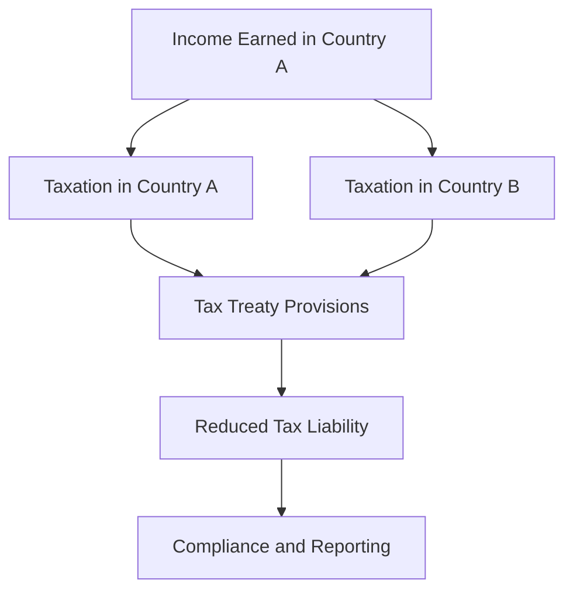

## 20.3.1 Tax Treaties

Tax treaties, also known as double taxation agreements (DTAs), are pivotal in the realm of international taxation. They are bilateral agreements between two countries designed to prevent the same income from being taxed by both jurisdictions. This section aims to provide a comprehensive understanding of tax treaties, their objectives, and their implications for Canadian Chartered Professional Accountants (CPAs) and international business operations.

### Understanding Tax Treaties

#### Objectives of Tax Treaties

The primary objectives of tax treaties are:

1. **Avoidance of Double Taxation**: Tax treaties allocate taxing rights between countries to ensure that income is not taxed twice. This is crucial for individuals and businesses operating across borders, as it reduces the tax burden and encourages international trade and investment.

2. **Prevention of Tax Evasion**: By establishing clear rules and information exchange mechanisms, tax treaties help prevent tax evasion and avoidance. They promote transparency and cooperation between tax authorities.

3. **Promotion of International Trade and Investment**: By providing tax certainty and reducing the risk of double taxation, tax treaties create a favorable environment for cross-border economic activities.

4. **Resolution of Tax Disputes**: Tax treaties include provisions for resolving disputes between countries regarding the interpretation and application of the treaty, often through mutual agreement procedures (MAP).

#### Structure of Tax Treaties

Tax treaties typically follow a standard format, often based on models developed by international organizations such as the Organisation for Economic Co-operation and Development (OECD) and the United Nations (UN). The key components of a tax treaty include:

- **Preamble**: States the purpose of the treaty, emphasizing the prevention of double taxation and tax evasion.
- **Definitions**: Provides definitions for key terms used in the treaty, such as "resident," "permanent establishment," and "dividends."
- **Allocation of Taxing Rights**: Specifies which country has the right to tax various types of income, such as business profits, dividends, interest, and royalties.
- **Elimination of Double Taxation**: Outlines methods for eliminating double taxation, such as the exemption method or the credit method.
- **Exchange of Information**: Establishes procedures for the exchange of tax-related information between countries to combat tax evasion.
- **Mutual Agreement Procedure (MAP)**: Provides a mechanism for resolving disputes arising from the interpretation or application of the treaty.

### Key Concepts in Tax Treaties

#### Residency

Residency is a fundamental concept in tax treaties, as it determines which country has the primary right to tax an individual's or entity's income. Tax treaties typically define residency based on criteria such as domicile, place of management, or habitual abode. In cases where an individual or entity is considered a resident of both countries (dual residency), the treaty provides tie-breaker rules to determine residency for treaty purposes.

#### Permanent Establishment (PE)

The concept of a permanent establishment is crucial in determining a country's right to tax business profits. A PE is generally defined as a fixed place of business through which a non-resident entity conducts business in another country. Common examples include a branch, office, factory, or construction site. Tax treaties specify the conditions under which a PE is deemed to exist and the extent of taxation on profits attributable to the PE.

#### Types of Income Covered

Tax treaties allocate taxing rights over various types of income, including:

- **Business Profits**: Typically taxed in the country where the business has a permanent establishment.
- **Dividends**: Often subject to reduced withholding tax rates in the source country.
- **Interest**: Generally taxed at a reduced rate or exempt in the source country.
- **Royalties**: May be subject to reduced withholding tax rates or exempt in the source country.
- **Capital Gains**: Taxation rights vary depending on the type of asset and the country of residence.

### Practical Examples and Case Studies

#### Example 1: Avoidance of Double Taxation

Consider a Canadian company that earns business profits through a permanent establishment in the United States. Without a tax treaty, the company would be subject to taxation in both Canada and the U.S. on the same income. However, under the Canada-U.S. tax treaty, the profits attributable to the PE are primarily taxed in the U.S., with Canada providing a foreign tax credit to eliminate double taxation.

#### Example 2: Reduced Withholding Tax Rates

A Canadian resident receives dividends from a U.K. company. Under the Canada-U.K. tax treaty, the withholding tax rate on dividends is reduced from the standard rate to a lower treaty rate, benefiting the Canadian taxpayer by reducing the overall tax burden.

#### Case Study: Mutual Agreement Procedure (MAP)

A Canadian multinational corporation faces a tax dispute with the tax authorities in Germany regarding the allocation of profits between its Canadian headquarters and its German subsidiary. The company invokes the MAP provision in the Canada-Germany tax treaty, allowing both countries' tax authorities to negotiate and resolve the dispute, avoiding double taxation.

### Real-World Applications and Regulatory Scenarios

#### Compliance Considerations

For CPAs, understanding tax treaties is essential for advising clients on cross-border transactions and ensuring compliance with international tax obligations. Key compliance considerations include:

- **Determining Residency**: CPAs must assess residency status for individuals and entities to apply the correct treaty provisions.
- **Identifying Permanent Establishments**: CPAs should evaluate business activities to determine the existence of a PE and the associated tax implications.
- **Applying Withholding Tax Rates**: CPAs need to apply the appropriate treaty rates for withholding taxes on dividends, interest, and royalties.
- **Utilizing MAP**: CPAs can assist clients in navigating the MAP process to resolve international tax disputes.

#### Impact on International Business

Tax treaties play a vital role in shaping international business strategies. By reducing the risk of double taxation and providing tax certainty, they encourage foreign investment and facilitate cross-border trade. Businesses can leverage tax treaties to optimize their global tax position and enhance competitiveness.

### Step-by-Step Guidance for Applying Tax Treaties

1. **Identify the Relevant Treaty**: Determine if a tax treaty exists between the countries involved in the transaction.
2. **Determine Residency**: Assess the residency status of the taxpayer under the treaty's definitions and tie-breaker rules.
3. **Evaluate Permanent Establishment**: Analyze business activities to determine if a PE exists and the extent of taxation.
4. **Apply Treaty Provisions**: Identify the applicable treaty provisions for the specific type of income (e.g., dividends, interest, royalties).
5. **Calculate Tax Liability**: Compute the tax liability based on the treaty's allocation of taxing rights and reduced withholding tax rates.
6. **Document Compliance**: Maintain thorough documentation to support treaty claims and compliance with reporting requirements.

### Diagrams and Visuals

To enhance understanding, let's visualize the flow of income and taxation under a tax treaty using a diagram.

### Best Practices and Common Pitfalls

#### Best Practices

- **Stay Informed**: Keep up-to-date with changes in tax treaty provisions and international tax regulations.
- **Seek Professional Advice**: Consult with tax professionals or legal experts when dealing with complex cross-border transactions.
- **Maintain Documentation**: Ensure thorough documentation to support treaty claims and compliance with tax authorities.

#### Common Pitfalls

- **Misinterpreting Residency Rules**: Incorrectly determining residency can lead to improper application of treaty provisions.
- **Overlooking Permanent Establishment**: Failing to recognize a PE can result in unexpected tax liabilities.
- **Ignoring Withholding Tax Rates**: Applying incorrect withholding tax rates can lead to penalties and interest charges.

### References and Additional Resources

- **OECD Model Tax Convention**: A comprehensive guide to the OECD's model tax treaty provisions and commentary.
- **CPA Canada**: Offers resources and guidance on international taxation and tax treaties.
- **Canada Revenue Agency (CRA)**: Provides information on Canada's tax treaties and related compliance requirements.

### Summary

Tax treaties are essential tools for preventing double taxation and promoting international trade and investment. By understanding the objectives, structure, and application of tax treaties, CPAs can effectively advise clients on cross-border transactions and ensure compliance with international tax obligations. This knowledge is crucial for success in the Canadian accounting exams and in professional practice.

## **Ready to Test Your Knowledge?**

**Practice 10 Essential CPA Exam Questions to Master Your Certification**



### What is the primary purpose of tax treaties?

- [x] To prevent double taxation and tax evasion
- [ ] To increase tax revenue for countries
- [ ] To promote domestic trade
- [ ] To regulate international currency exchange

> **Explanation:** Tax treaties are designed to prevent double taxation and tax evasion, facilitating international trade and investment.

### Which organization provides a model for tax treaties?

- [x] OECD
- [ ] IMF
- [ ] World Bank
- [ ] WTO

> **Explanation:** The OECD provides a widely used model for tax treaties, offering guidelines and commentary for countries to follow.

### What is a permanent establishment (PE)?

- [x] A fixed place of business through which a non-resident entity conducts business
- [ ] A temporary office set up for a specific project
- [ ] A subsidiary company in a foreign country
- [ ] A joint venture between two companies

> **Explanation:** A PE is a fixed place of business, such as a branch or office, that allows a country to tax business profits.

### How do tax treaties typically resolve dual residency issues?

- [x] Through tie-breaker rules
- [ ] By allowing both countries to tax the income
- [ ] By exempting the income from taxation
- [ ] By imposing a penalty on the taxpayer

> **Explanation:** Tax treaties use tie-breaker rules to determine residency for treaty purposes when dual residency occurs.

### What is the mutual agreement procedure (MAP)?

- [x] A mechanism for resolving tax disputes between countries
- [ ] A method for calculating tax liabilities
- [ ] A process for filing tax returns
- [ ] A strategy for tax planning

> **Explanation:** MAP is a procedure in tax treaties that allows countries to resolve disputes regarding the treaty's interpretation or application.

### Which type of income is typically subject to reduced withholding tax rates under tax treaties?

- [x] Dividends
- [ ] Employment income
- [ ] Rental income
- [ ] Capital gains

> **Explanation:** Tax treaties often provide for reduced withholding tax rates on dividends to prevent excessive taxation.

### What is the role of the exchange of information provision in tax treaties?

- [x] To facilitate the exchange of tax-related information between countries
- [ ] To set exchange rates for currency conversion
- [ ] To regulate international trade agreements
- [ ] To establish import and export duties

> **Explanation:** The exchange of information provision helps countries combat tax evasion by sharing tax-related information.

### How can CPAs assist clients in utilizing the mutual agreement procedure (MAP)?

- [x] By navigating the MAP process to resolve international tax disputes
- [ ] By preparing annual tax returns
- [ ] By setting up offshore accounts
- [ ] By negotiating tax rates with foreign governments

> **Explanation:** CPAs can guide clients through the MAP process to resolve disputes and avoid double taxation.

### What is a common pitfall when applying tax treaties?

- [x] Misinterpreting residency rules
- [ ] Overestimating tax liabilities
- [ ] Underreporting income
- [ ] Ignoring domestic tax laws

> **Explanation:** Misinterpreting residency rules can lead to incorrect application of treaty provisions and potential tax issues.

### True or False: Tax treaties are only applicable to individuals, not businesses.

- [ ] True
- [x] False

> **Explanation:** Tax treaties apply to both individuals and businesses, addressing various types of income and tax issues.


