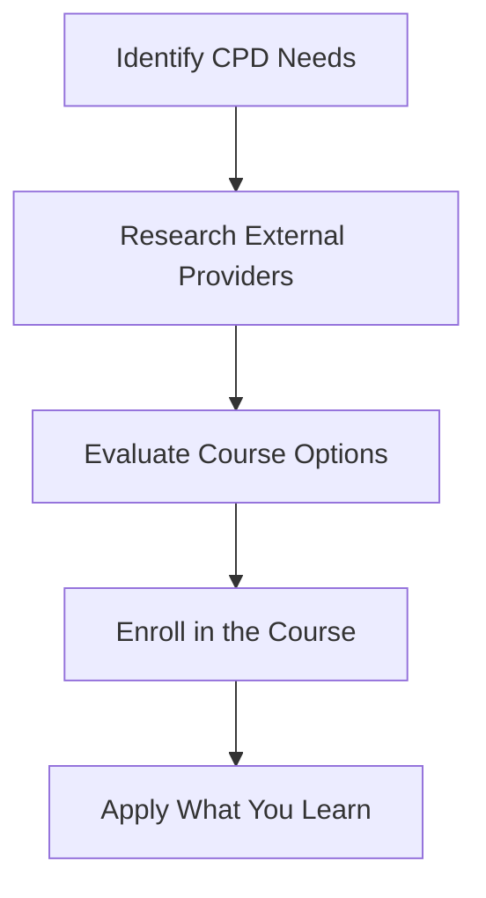

## 23.3.2 External Providers

Continuing Professional Development (CPD) is a critical component of maintaining your Chartered Professional Accountant (CPA) designation. While CPA Canada offers a variety of resources and programs to help you meet your CPD requirements, external providers also play a significant role in offering diverse and specialized learning opportunities. This section explores the various external providers that offer CPD courses, workshops, and seminars, helping you expand your knowledge and skills in the accounting profession.

### Understanding the Role of External Providers

External providers offer a wide range of CPD opportunities that can complement the resources provided by CPA Canada. These providers include universities, professional organizations, private training companies, and online platforms. They offer courses that cover various aspects of accounting, finance, taxation, and business management, providing CPAs with the flexibility to choose programs that align with their career goals and interests.

#### Benefits of Engaging with External Providers

1. **Diverse Learning Opportunities**: External providers offer a broad spectrum of courses that cover niche areas and emerging trends in accounting, allowing CPAs to stay ahead in their field.

2. **Flexibility and Convenience**: Many external courses are available online, providing the flexibility to learn at your own pace and schedule, which is particularly beneficial for busy professionals.

3. **Expert Instructors**: Courses offered by external providers are often taught by industry experts and academics who bring real-world experience and insights into the classroom.

4. **Networking Opportunities**: Engaging with external providers can also provide networking opportunities with peers and industry leaders, fostering professional relationships that can benefit your career.

5. **Specialized Knowledge**: External providers often offer specialized courses that delve into specific areas of accounting and finance, allowing CPAs to gain in-depth knowledge and expertise.

### Types of External Providers

External providers can be categorized into several types, each offering unique advantages and learning experiences:

#### 1. Universities and Colleges

Many universities and colleges offer CPD courses tailored for accounting professionals. These courses can range from short workshops to full certificate programs and are often designed to provide in-depth knowledge in specific areas of accounting and finance.

- **Example**: The University of Toronto's School of Continuing Studies offers a variety of courses in financial analysis, taxation, and business strategy, providing CPAs with the opportunity to enhance their skills and knowledge.

#### 2. Professional Organizations

Professional organizations, such as the Canadian Tax Foundation and the Institute of Internal Auditors, offer CPD courses and seminars that focus on specific areas of accounting and auditing. These organizations are often at the forefront of industry developments and can provide valuable insights into current trends and best practices.

- **Example**: The Canadian Tax Foundation offers seminars and workshops on the latest tax regulations and compliance strategies, helping CPAs stay informed about changes in tax law.

#### 3. Private Training Companies

Private training companies specialize in providing professional development courses for accountants and finance professionals. These companies often offer a wide range of courses, from technical accounting skills to leadership and management training.

- **Example**: KPMG's Learning Academy offers courses on financial reporting, risk management, and data analytics, providing CPAs with the skills needed to excel in today's dynamic business environment.

#### 4. Online Learning Platforms

Online learning platforms, such as Coursera, LinkedIn Learning, and Udemy, offer a vast array of courses that can be accessed from anywhere in the world. These platforms provide flexibility and convenience, allowing CPAs to learn at their own pace and schedule.

- **Example**: Coursera offers courses from top universities and companies, covering topics such as financial accounting, corporate finance, and data analysis, providing CPAs with the opportunity to learn from leading experts in the field.

### Selecting the Right External Provider

When selecting an external provider for your CPD needs, consider the following factors:

1. **Relevance to Your Career Goals**: Choose courses that align with your career objectives and areas of interest. Consider how the course content will enhance your skills and knowledge in your current role or prepare you for future opportunities.

2. **Accreditation and Recognition**: Ensure that the provider and the course are recognized by CPA Canada or your provincial CPA body. Accredited courses are more likely to be accepted for CPD credit.

3. **Quality of Instruction**: Research the instructors' qualifications and experience. Courses taught by industry experts or academics with real-world experience can provide valuable insights and practical knowledge.

4. **Course Format and Delivery**: Consider the format and delivery method of the course. Online courses offer flexibility, while in-person workshops may provide more interactive and hands-on learning experiences.

5. **Cost and Value**: Evaluate the cost of the course in relation to the value it provides. Consider the potential return on investment in terms of career advancement and skill development.

### Practical Examples and Case Studies

To illustrate the benefits of engaging with external providers, consider the following examples:

#### Case Study 1: Enhancing Tax Knowledge

A CPA working in a mid-sized accounting firm wanted to enhance their knowledge of international tax regulations to better serve their clients with global operations. They enrolled in a course offered by the Canadian Tax Foundation, which provided in-depth coverage of international tax treaties and compliance strategies. The course not only improved their technical skills but also positioned them as a valuable resource within their firm.

#### Case Study 2: Developing Leadership Skills

A CPA aspiring to move into a management role sought to develop their leadership and management skills. They enrolled in a leadership development program offered by a private training company, which included workshops on communication, team building, and strategic decision-making. The program helped them build the confidence and skills needed to take on a leadership role within their organization.

### Real-World Applications and Regulatory Scenarios

Engaging with external providers can also help CPAs stay informed about regulatory changes and industry developments. For example, a course on the latest updates to the International Financial Reporting Standards (IFRS) can provide CPAs with the knowledge needed to ensure compliance with new reporting requirements.

#### Example: IFRS Update Course

A CPA working in a publicly traded company needed to stay informed about changes to IFRS to ensure accurate financial reporting. They enrolled in an IFRS update course offered by a professional organization, which covered the latest amendments and interpretations. The course provided practical examples and case studies, helping the CPA apply the new standards in their work.

### Step-by-Step Guidance for Engaging with External Providers

1. **Identify Your CPD Needs**: Assess your current skills and knowledge gaps to determine the areas where you need further development.

2. **Research External Providers**: Explore the various external providers and the courses they offer. Consider factors such as course content, format, and instructor qualifications.

3. **Evaluate Course Options**: Compare the courses offered by different providers to find the one that best meets your needs. Consider the relevance, accreditation, and cost of each course.

4. **Enroll in the Course**: Once you have selected a course, enroll and schedule time to complete the course requirements. Take advantage of any additional resources or networking opportunities offered by the provider.

5. **Apply What You Learn**: After completing the course, apply the knowledge and skills you have gained in your work. Consider how the course content can enhance your performance and contribute to your career goals.

### Diagrams and Visuals

To enhance understanding, consider the following diagram illustrating the process of selecting and engaging with an external provider for CPD:

### Best Practices and Common Pitfalls

#### Best Practices

- **Stay Informed**: Regularly review the latest developments in accounting and finance to identify areas where you need further development.

- **Plan Ahead**: Schedule time for CPD activities in advance to ensure you meet your annual requirements.

- **Engage with Peers**: Participate in discussions and networking opportunities offered by external providers to enhance your learning experience.

#### Common Pitfalls

- **Overlooking Accreditation**: Ensure that the courses you choose are accredited and recognized by CPA Canada or your provincial CPA body.

- **Neglecting Practical Application**: Focus on applying the knowledge and skills you gain from CPD courses in your work to maximize their value.

### References and Additional Resources

- **CPA Canada**: Visit the CPA Canada website for information on CPD requirements and recognized external providers.

- **International Financial Reporting Standards (IFRS)**: Stay informed about the latest updates to IFRS by visiting the IFRS Foundation website.

- **Professional Organizations**: Explore the websites of professional organizations, such as the Canadian Tax Foundation and the Institute of Internal Auditors, for information on CPD courses and seminars.

### Summary

Engaging with external providers for CPD offers CPAs a wealth of opportunities to enhance their skills and knowledge. By selecting the right courses and providers, CPAs can stay informed about industry developments, gain specialized knowledge, and advance their careers. Remember to consider factors such as relevance, accreditation, and quality of instruction when choosing external providers, and apply what you learn to maximize the value of your CPD activities.

## **Ready to Test Your Knowledge?**

**Practice 10 Essential CPA Exam Questions to Master Your Certification**



### Which of the following is a benefit of engaging with external providers for CPD?

- [x] Diverse learning opportunities
- [ ] Limited course selection
- [ ] Inflexible scheduling
- [ ] Lack of expert instructors

> **Explanation:** External providers offer diverse learning opportunities, allowing CPAs to explore various topics and gain specialized knowledge.

### What should you consider when selecting an external provider for CPD?

- [x] Relevance to your career goals
- [x] Accreditation and recognition
- [ ] Proximity to your workplace
- [x] Quality of instruction

> **Explanation:** When selecting an external provider, consider the relevance of the course to your career goals, accreditation, and the quality of instruction.

### Which type of external provider offers courses taught by industry experts and academics?

- [ ] Online learning platforms
- [ ] Private training companies
- [x] Universities and colleges
- [ ] Professional organizations

> **Explanation:** Universities and colleges often offer courses taught by industry experts and academics, providing valuable insights and practical knowledge.

### What is a common pitfall when engaging with external providers for CPD?

- [ ] Overlooking accreditation
- [x] Neglecting practical application
- [ ] Engaging with peers
- [ ] Planning ahead

> **Explanation:** A common pitfall is neglecting to apply the knowledge and skills gained from CPD courses in your work.

### Which of the following is an example of a professional organization offering CPD courses?

- [x] Canadian Tax Foundation
- [ ] University of Toronto
- [ ] Coursera
- [ ] KPMG Learning Academy

> **Explanation:** The Canadian Tax Foundation is a professional organization that offers CPD courses and seminars.

### What is the first step in engaging with an external provider for CPD?

- [ ] Enroll in the course
- [ ] Research external providers
- [x] Identify your CPD needs
- [ ] Evaluate course options

> **Explanation:** The first step is to identify your CPD needs by assessing your current skills and knowledge gaps.

### Which of the following is a benefit of online learning platforms for CPD?

- [x] Flexibility and convenience
- [ ] Limited course availability
- [ ] High cost
- [ ] In-person interaction

> **Explanation:** Online learning platforms offer flexibility and convenience, allowing CPAs to learn at their own pace and schedule.

### What should you do after completing a CPD course?

- [x] Apply what you learn
- [ ] Forget the course content
- [ ] Avoid discussing it with peers
- [ ] Ignore feedback from instructors

> **Explanation:** After completing a CPD course, apply the knowledge and skills you have gained in your work to maximize their value.

### Which diagram illustrates the process of selecting and engaging with an external provider for CPD?

- [x] A flowchart
- [ ] A pie chart
- [ ] A bar graph
- [ ] A scatter plot

> **Explanation:** A flowchart is used to illustrate the process of selecting and engaging with an external provider for CPD.

### True or False: External providers offer CPD courses that are not recognized by CPA Canada.

- [ ] True
- [x] False

> **Explanation:** Many external providers offer CPD courses that are recognized by CPA Canada, ensuring they meet the necessary accreditation standards.


