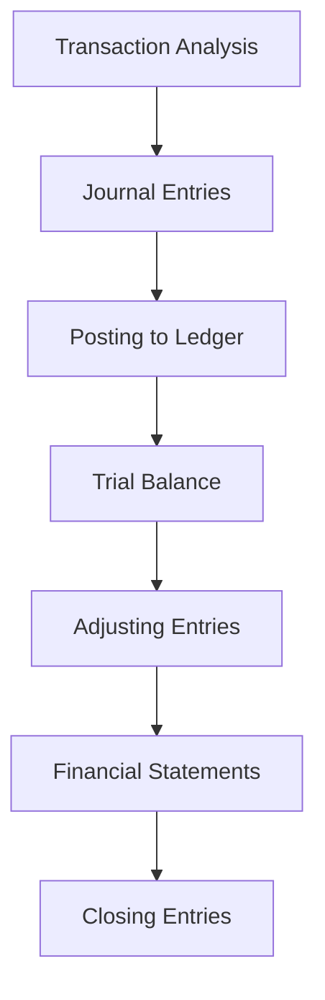

## 3.2.1 Core 1: Financial Accounting and Reporting

Financial accounting and reporting form the backbone of the CPA Professional Education Program (CPA PEP) in Canada. Core 1 is designed to equip you with the knowledge and skills necessary to understand and apply financial reporting standards and practices. This section will guide you through the essential concepts, standards, and applications that are crucial for success in the CPA exam and your future career as a Chartered Professional Accountant.

### Understanding Financial Accounting and Reporting

Financial accounting involves the systematic recording, summarizing, and reporting of financial transactions of a business. It provides stakeholders with essential information about the financial position, performance, and cash flows of an entity. Financial reporting, on the other hand, is the process of preparing financial statements that reflect the financial health of an organization.

#### Key Objectives of Financial Reporting

1. **Provide Useful Information**: Financial reports should provide information that is useful to investors, creditors, and other stakeholders in making informed decisions.
2. **Ensure Transparency**: Financial statements should be transparent and provide a true and fair view of the company's financial performance and position.
3. **Facilitate Accountability**: Financial reporting holds management accountable for the financial stewardship of the company.
4. **Support Economic Decision-Making**: Financial reports aid in making economic decisions by providing relevant financial data.

### Core Financial Statements

The primary financial statements include:

1. **Statement of Financial Position (Balance Sheet)**: Shows the company's assets, liabilities, and equity at a specific point in time.
2. **Statement of Comprehensive Income (Income Statement)**: Reflects the company's revenues, expenses, and profits over a period.
3. **Statement of Changes in Equity**: Details changes in the company's equity during the reporting period.
4. **Statement of Cash Flows**: Provides information about the company's cash inflows and outflows.

### Financial Reporting Standards

In Canada, financial reporting is governed by two main sets of standards:

#### International Financial Reporting Standards (IFRS)

IFRS is used by publicly accountable enterprises in Canada. It provides a global framework for financial reporting, ensuring consistency and comparability across international borders.

- **Framework and Principles**: IFRS is principles-based, focusing on the economic substance of transactions rather than strict rules.
- **Application in Canada**: Canadian public companies are required to prepare their financial statements in accordance with IFRS.

#### Accounting Standards for Private Enterprises (ASPE)

ASPE is designed for private enterprises in Canada, offering a simplified set of standards compared to IFRS.

- **Key Differences from IFRS**: ASPE is less complex and more cost-effective for private companies.
- **When to Apply ASPE**: Private companies can choose to adopt ASPE if they do not have public accountability.

### Key Accounting Principles and Concepts

Understanding fundamental accounting principles is crucial for financial reporting:

1. **Accrual Basis**: Revenues and expenses are recognized when they are earned or incurred, not when cash is received or paid.
2. **Going Concern**: Assumes that the company will continue to operate in the foreseeable future.
3. **Consistency**: Financial statements should be prepared using consistent accounting methods from one period to the next.
4. **Materiality**: Information is material if its omission or misstatement could influence the economic decisions of users.

### The Accounting Cycle

The accounting cycle is a series of steps followed to ensure accurate financial reporting:

1. **Transaction Analysis**: Identifying and analyzing business transactions.
2. **Journal Entries**: Recording transactions in the journal.
3. **Posting to Ledger**: Transferring journal entries to the general ledger.
4. **Trial Balance**: Preparing a trial balance to ensure debits equal credits.
5. **Adjusting Entries**: Making necessary adjustments for accrued and deferred items.
6. **Financial Statements**: Preparing financial statements from the adjusted trial balance.
7. **Closing Entries**: Closing temporary accounts to prepare for the next accounting period.

### Revenue Recognition

Revenue recognition is a critical aspect of financial reporting. It determines when and how revenue is recognized in the financial statements.

- **IFRS 15: Revenue from Contracts with Customers**: Provides a five-step model for revenue recognition:
  1. Identify the contract with a customer.
  2. Identify the performance obligations in the contract.
  3. Determine the transaction price.
  4. Allocate the transaction price to the performance obligations.
  5. Recognize revenue when (or as) the entity satisfies a performance obligation.

### Financial Instruments

Financial instruments are contracts that give rise to a financial asset of one entity and a financial liability or equity instrument of another entity.

- **IFRS 9: Financial Instruments**: Covers the classification, measurement, impairment, and hedge accounting of financial instruments.
- **ASPE Section 3856**: Provides guidance on the recognition, measurement, and disclosure of financial instruments for private enterprises.

### Leases

Leases are contracts that convey the right to use an asset for a period in exchange for consideration.

- **IFRS 16: Leases**: Requires lessees to recognize assets and liabilities for all leases unless the lease term is 12 months or less or the underlying asset is of low value.
- **ASPE Section 3065**: Provides guidance on accounting for leases by private enterprises.

### Consolidations

Consolidation involves combining the financial statements of a parent company and its subsidiaries into a single set of financial statements.

- **IFRS 10: Consolidated Financial Statements**: Establishes principles for the presentation and preparation of consolidated financial statements.
- **ASPE Section 1591**: Provides guidance on consolidation for private enterprises.

### Practical Examples and Case Studies

#### Example 1: Revenue Recognition

A software company enters into a contract to deliver a software license and provide ongoing support for three years. The total contract price is $300,000. Under IFRS 15, the company must identify the performance obligations (software license and support services), determine the transaction price, allocate the price to each obligation, and recognize revenue as each obligation is satisfied.

#### Example 2: Lease Accounting

A retail company leases a store for five years with an annual lease payment of $50,000. Under IFRS 16, the company must recognize a right-of-use asset and a lease liability on the balance sheet, measured at the present value of lease payments.

### Real-World Applications and Regulatory Scenarios

#### Application of IFRS in Canadian Public Companies

Canadian public companies must adhere to IFRS for financial reporting. This ensures transparency and comparability with international peers, attracting global investors.

#### Compliance with ASPE for Private Enterprises

Private enterprises in Canada can choose ASPE for financial reporting, which simplifies compliance and reduces costs while maintaining high-quality financial reporting.

### Best Practices and Common Pitfalls

#### Best Practices

- **Stay Updated**: Regularly update your knowledge of accounting standards and regulations.
- **Use Technology**: Leverage accounting software to streamline financial reporting processes.
- **Seek Professional Advice**: Consult with accounting professionals for complex transactions.

#### Common Pitfalls

- **Misapplication of Standards**: Ensure accurate application of accounting standards to avoid financial misstatements.
- **Inadequate Documentation**: Maintain thorough documentation to support financial transactions and reporting.

### Exam Preparation Tips

- **Understand Key Concepts**: Focus on understanding the principles behind financial reporting standards.
- **Practice Problem-Solving**: Work through practice problems and case studies to apply your knowledge.
- **Review Past Exams**: Analyze past exam questions to identify common themes and areas of focus.

### Summary

Mastering Core 1: Financial Accounting and Reporting is essential for success in the CPA exam and your career as a Chartered Professional Accountant. By understanding financial reporting standards, principles, and practices, you will be well-equipped to provide valuable insights and support to businesses and stakeholders.

## **Ready to Test Your Knowledge?**

**Practice 10 Essential CPA Exam Questions to Master Your Certification**



### What is the primary objective of financial reporting?

- [x] To provide useful information to stakeholders for decision-making
- [ ] To maximize company profits
- [ ] To comply with tax regulations
- [ ] To reduce operational costs

> **Explanation:** The primary objective of financial reporting is to provide useful information to stakeholders for decision-making.

### Which financial statement shows a company's assets, liabilities, and equity?

- [x] Statement of Financial Position
- [ ] Statement of Comprehensive Income
- [ ] Statement of Cash Flows
- [ ] Statement of Changes in Equity

> **Explanation:** The Statement of Financial Position, also known as the Balance Sheet, shows a company's assets, liabilities, and equity.

### Under IFRS 15, what is the first step in the revenue recognition process?

- [x] Identify the contract with a customer
- [ ] Determine the transaction price
- [ ] Recognize revenue
- [ ] Allocate the transaction price

> **Explanation:** The first step under IFRS 15 is to identify the contract with a customer.

### What is the main difference between IFRS and ASPE?

- [x] IFRS is more complex and used by public companies, while ASPE is simpler and used by private enterprises
- [ ] IFRS is used only in Canada, while ASPE is used globally
- [ ] IFRS focuses on tax compliance, while ASPE focuses on financial reporting
- [ ] IFRS is principles-based, while ASPE is rules-based

> **Explanation:** IFRS is more complex and used by public companies, while ASPE is simpler and used by private enterprises.

### Which accounting principle assumes a company will continue to operate in the foreseeable future?

- [x] Going Concern
- [ ] Accrual Basis
- [ ] Consistency
- [ ] Materiality

> **Explanation:** The Going Concern principle assumes a company will continue to operate in the foreseeable future.

### What does IFRS 9 cover?

- [x] Financial Instruments
- [ ] Revenue Recognition
- [ ] Lease Accounting
- [ ] Consolidated Financial Statements

> **Explanation:** IFRS 9 covers the classification, measurement, impairment, and hedge accounting of financial instruments.

### Which financial statement provides information about a company's cash inflows and outflows?

- [x] Statement of Cash Flows
- [ ] Statement of Financial Position
- [ ] Statement of Comprehensive Income
- [ ] Statement of Changes in Equity

> **Explanation:** The Statement of Cash Flows provides information about a company's cash inflows and outflows.

### What is the purpose of adjusting entries in the accounting cycle?

- [x] To update account balances before preparing financial statements
- [ ] To record initial transactions
- [ ] To close temporary accounts
- [ ] To prepare a trial balance

> **Explanation:** Adjusting entries are made to update account balances before preparing financial statements.

### Which standard requires lessees to recognize assets and liabilities for all leases?

- [x] IFRS 16
- [ ] IFRS 15
- [ ] IFRS 9
- [ ] IFRS 10

> **Explanation:** IFRS 16 requires lessees to recognize assets and liabilities for all leases unless the lease term is 12 months or less or the underlying asset is of low value.

### True or False: ASPE is designed for publicly accountable enterprises in Canada.

- [ ] True
- [x] False

> **Explanation:** False. ASPE is designed for private enterprises in Canada, not publicly accountable enterprises.


