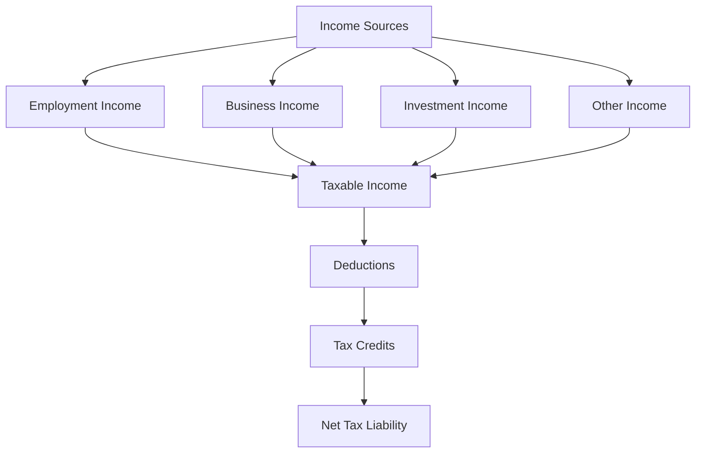

## 3.3.3 Taxation

Understanding taxation is a crucial component of the Chartered Professional Accountant (CPA) designation in Canada. This section provides an in-depth exploration of Canadian tax laws, focusing on both individual and corporate taxation. As a CPA candidate, mastering these concepts is essential for your success in the CPA Professional Education Program (CPA PEP) and your future career.

### Overview of Canadian Taxation

Canadian taxation is governed by the Income Tax Act (ITA), which outlines the rules for calculating taxes owed by individuals and corporations. The Canada Revenue Agency (CRA) administers these laws, ensuring compliance and collecting taxes. The tax system is progressive, meaning that tax rates increase with income levels, and it includes various deductions, credits, and incentives to promote economic and social policies.

#### Key Concepts in Canadian Taxation

- **Progressive Tax System:** Canada employs a progressive tax system where higher income earners pay a higher percentage of their income in taxes. This system aims to distribute the tax burden more equitably across different income levels.
- **Taxable Income:** This is the amount of income subject to tax after deductions and exemptions. Understanding how to calculate taxable income is fundamental for both personal and corporate taxation.
- **Deductions and Credits:** Deductions reduce taxable income, while credits reduce the tax payable. Familiarity with common deductions and credits is essential for effective tax planning.

### Individual Taxation

Individual taxation in Canada involves calculating the tax liability of individuals based on their income, deductions, and credits. The process includes filing an annual tax return with the CRA.

#### Income Sources

Individuals may receive income from various sources, each with specific tax implications:

- **Employment Income:** Wages, salaries, and bonuses are fully taxable. Employers issue T4 slips to report this income.
- **Business and Self-Employment Income:** Individuals running a business must report their net income, which is gross income minus allowable expenses.
- **Investment Income:** Includes interest, dividends, and capital gains. Each type has different tax treatments, with dividends and capital gains often receiving preferential rates.
- **Other Income:** Pensions, rental income, and government benefits are also taxable, with specific rules for each type.

#### Deductions and Credits

- **RRSP Contributions:** Contributions to a Registered Retirement Savings Plan (RRSP) are deductible, reducing taxable income.
- **Childcare Expenses:** Allowable childcare expenses can be deducted, subject to certain limits.
- **Tuition and Education Credits:** Students can claim tuition fees and education amounts as credits against their tax payable.

#### Tax Filing and Compliance

- **Filing Deadline:** The deadline for filing personal tax returns is April 30th of the following year. Self-employed individuals have until June 15th, but any taxes owed must be paid by April 30th.
- **Penalties and Interest:** Late filing or payment results in penalties and interest charges. Understanding these consequences is crucial for compliance.

### Corporate Taxation

Corporate taxation involves the calculation of taxes owed by corporations on their profits. The ITA provides specific rules for determining taxable income and applicable tax rates.

#### Types of Corporations

- **Canadian-Controlled Private Corporation (CCPC):** These corporations benefit from preferential tax rates on the first $500,000 of active business income.
- **Public Corporations:** Subject to standard corporate tax rates without the benefits available to CCPCs.
- **Non-Resident Corporations:** Taxed on income earned in Canada, with specific rules for determining taxable presence.

#### Taxable Income Calculation

- **Revenue Recognition:** Corporations must recognize revenue according to specific accounting standards, impacting taxable income.
- **Deductions:** Common deductions include business expenses, capital cost allowance (CCA), and interest on business loans.
- **Loss Carryovers:** Corporations can carry forward or back losses to offset taxable income in other years, reducing tax liability.

#### Tax Planning Strategies

- **Income Splitting:** Involves distributing income among family members to take advantage of lower tax brackets.
- **Deferral Strategies:** Corporations may defer income recognition to future years to manage tax liability.
- **Tax Incentives:** Utilizing government incentives, such as the Scientific Research and Experimental Development (SR&ED) tax credit, can reduce taxes payable.

### Tax Compliance and Planning

Compliance with Canadian tax laws is critical for both individuals and corporations. Effective tax planning involves understanding the rules and strategically managing income, deductions, and credits to minimize tax liability.

#### Compliance Requirements

- **Record Keeping:** Accurate records must be maintained to support income and deductions claimed on tax returns.
- **Audit and Review:** The CRA may audit or review tax returns to ensure compliance. Understanding the audit process and preparing for potential reviews is essential.

#### Strategic Tax Planning

- **Year-End Planning:** Reviewing income and expenses before year-end can identify opportunities for tax savings.
- **Estate Planning:** Involves structuring assets to minimize taxes upon death, ensuring efficient transfer of wealth.
- **Cross-Border Considerations:** For individuals and corporations with international dealings, understanding tax treaties and foreign tax credits is crucial.

### Practical Examples and Case Studies

#### Example 1: Calculating Personal Tax Liability

Consider an individual with the following income and deductions:

- Employment Income: $80,000
- RRSP Contribution: $5,000
- Tuition Credit: $2,000

To calculate taxable income:

1. **Employment Income:** $80,000
2. **Less RRSP Contribution:** -$5,000
3. **Taxable Income:** $75,000

Apply federal and provincial tax rates to determine tax payable, then subtract the tuition credit to find the net tax liability.

#### Example 2: Corporate Tax Planning

A CCPC with $600,000 in active business income can benefit from the small business deduction on the first $500,000. The remaining $100,000 is taxed at the general corporate rate. By deferring some income to the next fiscal year, the corporation can maximize the use of the small business deduction.

### Diagrams and Visual Aids

### Best Practices and Common Pitfalls

- **Best Practices:**
  - Maintain detailed records to support all income and deductions.
  - Stay informed about changes in tax laws and regulations.
  - Engage in proactive tax planning throughout the year.

- **Common Pitfalls:**
  - Failing to report all sources of income.
  - Missing filing deadlines, resulting in penalties.
  - Overlooking available deductions and credits.

### References and Additional Resources

- **Income Tax Act (ITA):** The primary legislation governing taxation in Canada.
- **Canada Revenue Agency (CRA):** Provides guidance and resources for taxpayers.
- **CPA Canada:** Offers resources and courses for CPA candidates.

### Conclusion

Mastering Canadian taxation is essential for CPA candidates. By understanding the principles of individual and corporate taxation, compliance requirements, and strategic planning, you can excel in your CPA exams and build a successful career in accounting.

## **Ready to Test Your Knowledge?**

**Practice 10 Essential CPA Exam Questions to Master Your Certification**



### What is the deadline for filing personal tax returns in Canada?

- [x] April 30th
- [ ] June 15th
- [ ] March 31st
- [ ] May 1st

> **Explanation:** The deadline for filing personal tax returns in Canada is April 30th of the following year.

### Which type of corporation benefits from the small business deduction in Canada?

- [x] Canadian-Controlled Private Corporation (CCPC)
- [ ] Public Corporation
- [ ] Non-Resident Corporation
- [ ] Foreign Corporation

> **Explanation:** Canadian-Controlled Private Corporations (CCPCs) benefit from the small business deduction on the first $500,000 of active business income.

### What is the primary legislation governing taxation in Canada?

- [x] Income Tax Act (ITA)
- [ ] Canada Revenue Act
- [ ] Taxation and Revenue Act
- [ ] Federal Tax Code

> **Explanation:** The Income Tax Act (ITA) is the primary legislation governing taxation in Canada.

### What is the benefit of contributing to an RRSP?

- [x] Reduces taxable income
- [ ] Increases taxable income
- [ ] Provides a tax credit
- [ ] No tax benefit

> **Explanation:** Contributions to a Registered Retirement Savings Plan (RRSP) reduce taxable income, providing a tax benefit.

### Which of the following is a common deduction for individuals?

- [x] Childcare expenses
- [ ] Mortgage payments
- [ ] Grocery bills
- [ ] Vacation expenses

> **Explanation:** Childcare expenses are a common deduction for individuals, subject to certain limits.

### What is the penalty for late filing of tax returns in Canada?

- [x] Penalties and interest charges
- [ ] No penalty
- [ ] Only interest charges
- [ ] Only a flat fee

> **Explanation:** Late filing of tax returns results in penalties and interest charges.

### What is the purpose of the Scientific Research and Experimental Development (SR&ED) tax credit?

- [x] To encourage research and development
- [ ] To reduce corporate tax rates
- [ ] To increase employment
- [ ] To support small businesses

> **Explanation:** The SR&ED tax credit is designed to encourage research and development activities in Canada.

### What is the main advantage of income splitting?

- [x] Takes advantage of lower tax brackets
- [ ] Increases overall income
- [ ] Reduces business expenses
- [ ] Eliminates tax liability

> **Explanation:** Income splitting involves distributing income among family members to take advantage of lower tax brackets.

### What is the consequence of failing to report all sources of income?

- [x] Penalties and interest
- [ ] No consequence
- [ ] Reduced tax liability
- [ ] Increased deductions

> **Explanation:** Failing to report all sources of income can result in penalties and interest charges.

### True or False: Corporations can carry forward losses to offset taxable income in future years.

- [x] True
- [ ] False

> **Explanation:** Corporations can carry forward losses to offset taxable income in future years, reducing their tax liability.


