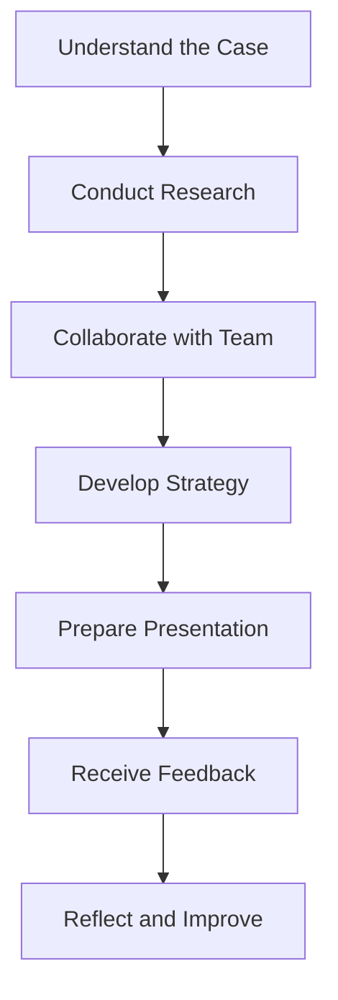

## 3.4.1 Capstone 1: Integrative Module

The Capstone 1: Integrative Module is a pivotal component of the CPA Professional Education Program (CPA PEP), designed to bridge the gap between theoretical knowledge and practical application. This module challenges candidates to apply their accumulated knowledge and skills in a collaborative, team-based environment, simulating real-world business scenarios. It is an essential step in preparing for the Common Final Examination (CFE) and ultimately, a successful career as a Chartered Professional Accountant (CPA).

### Objectives of Capstone 1: Integrative Module

The primary objectives of the Capstone 1: Integrative Module are to:

1. **Enhance Practical Application**: Enable candidates to apply their technical knowledge in accounting, finance, taxation, and other related areas to complex business problems.
2. **Develop Professional Skills**: Foster essential skills such as teamwork, communication, problem-solving, and ethical decision-making.
3. **Simulate Real-World Scenarios**: Provide a realistic business environment where candidates can experience the challenges and dynamics of professional practice.
4. **Prepare for the CFE**: Equip candidates with the necessary skills and confidence to excel in the Common Final Examination.

### Structure of the Capstone 1 Module

The Capstone 1 module is structured around team-based projects that require candidates to work collaboratively to analyze and solve comprehensive business cases. These projects are designed to reflect the complexities and ambiguities of real-world business situations, requiring candidates to integrate their knowledge across various disciplines.

#### Team-Based Projects

- **Formation of Teams**: Candidates are grouped into teams, typically consisting of 4-6 members. The diversity within teams is encouraged to bring different perspectives and expertise to the table.
- **Project Assignments**: Each team is assigned a business case that simulates a real-world scenario. These cases often involve multiple stakeholders, conflicting interests, and require strategic decision-making.
- **Roles and Responsibilities**: Team members are expected to assume different roles, such as project manager, financial analyst, or auditor, to ensure a comprehensive approach to the case.

#### Key Components of the Module

1. **Case Analysis and Research**: Teams must thoroughly analyze the business case, conduct research, and gather relevant data to support their decisions.
2. **Strategic Decision-Making**: Candidates must apply strategic thinking to develop viable solutions that address the case's challenges.
3. **Presentation and Reporting**: Teams are required to present their findings and recommendations to a panel of assessors, simulating a boardroom environment.
4. **Feedback and Reflection**: After the presentation, teams receive feedback from assessors, which is crucial for reflection and improvement.

### Skills Developed in Capstone 1

The Capstone 1 module is designed to develop a wide range of skills that are essential for a successful career as a CPA. These include:

- **Analytical Skills**: Ability to analyze complex data and identify key issues.
- **Communication Skills**: Proficiency in presenting ideas clearly and persuasively, both in writing and orally.
- **Teamwork and Collaboration**: Experience in working effectively within a team, leveraging diverse skills and perspectives.
- **Ethical Judgment**: Understanding of ethical principles and the ability to apply them in decision-making.
- **Leadership and Initiative**: Ability to take initiative, lead projects, and motivate team members.

### Practical Examples and Case Studies

To illustrate the application of knowledge in the Capstone 1 module, consider the following example:

#### Case Study: Strategic Expansion of a Mid-Sized Enterprise

**Scenario**: A mid-sized manufacturing company is considering expanding its operations into a new international market. The company faces challenges such as regulatory compliance, cultural differences, and financial constraints.

**Team Tasks**:
- **Market Analysis**: Conduct a thorough analysis of the target market, including economic conditions, competitive landscape, and potential risks.
- **Financial Projections**: Develop financial projections to assess the feasibility of the expansion, considering factors such as exchange rates, taxation, and financing options.
- **Risk Management**: Identify potential risks and develop strategies to mitigate them, including contingency plans and risk transfer mechanisms.
- **Stakeholder Engagement**: Develop a communication plan to engage with key stakeholders, including investors, employees, and local authorities.

**Outcome**: The team presents a comprehensive expansion strategy to the company's board, highlighting the potential benefits and risks, and providing actionable recommendations.

### Real-World Applications and Regulatory Scenarios

The Capstone 1 module emphasizes the importance of understanding and applying regulatory requirements in real-world scenarios. Candidates are expected to navigate complex regulatory environments and ensure compliance with relevant standards.

#### Example: Compliance with International Financial Reporting Standards (IFRS)

In the context of the strategic expansion case study, candidates must ensure that the company's financial reporting aligns with IFRS as adopted in Canada. This involves:

- **Understanding IFRS Requirements**: Familiarity with key IFRS standards, such as revenue recognition, leases, and financial instruments.
- **Application of Standards**: Applying IFRS standards to the company's financial statements, ensuring accuracy and transparency.
- **Regulatory Compliance**: Ensuring compliance with local regulations in the target market, including tax laws and reporting requirements.

### Step-by-Step Guidance for Success

To succeed in the Capstone 1 module, candidates should follow these steps:

1. **Understand the Case**: Begin by thoroughly understanding the business case, identifying key issues, and setting clear objectives.
2. **Conduct Research**: Gather relevant data and conduct research to support your analysis and recommendations.
3. **Collaborate Effectively**: Work closely with your team, leveraging each member's strengths and expertise.
4. **Develop a Strategy**: Apply strategic thinking to develop a comprehensive solution that addresses the case's challenges.
5. **Prepare for Presentation**: Practice your presentation skills, ensuring clarity and confidence in delivering your findings.
6. **Reflect and Improve**: After receiving feedback, reflect on your performance and identify areas for improvement.

### Diagrams and Visual Aids

To enhance understanding, the following diagram illustrates the flow of activities in the Capstone 1 module:

### Best Practices and Common Pitfalls

#### Best Practices

- **Effective Communication**: Maintain open and clear communication within your team to ensure alignment and collaboration.
- **Time Management**: Allocate sufficient time for each phase of the project, avoiding last-minute rushes.
- **Critical Thinking**: Challenge assumptions and consider alternative perspectives to enhance your analysis.

#### Common Pitfalls

- **Lack of Preparation**: Failing to thoroughly prepare can lead to incomplete analysis and weak recommendations.
- **Poor Team Dynamics**: Ineffective teamwork can hinder progress and lead to suboptimal outcomes.
- **Ignoring Feedback**: Failing to incorporate feedback can limit learning and improvement opportunities.

### References and Additional Resources

For further exploration of the Capstone 1 module, consider the following resources:

- **CPA Canada Resources**: Access study materials, practice exams, and guidelines provided by CPA Canada.
- **IFRS Standards**: Review the International Financial Reporting Standards as adopted in Canada for detailed guidance on financial reporting.
- **Professional Development Workshops**: Attend workshops and seminars to enhance your skills and knowledge.

### Encouragement and Motivation

The Capstone 1: Integrative Module is a challenging yet rewarding experience that prepares you for the Common Final Examination and your future career as a CPA. Embrace the opportunity to apply your knowledge, develop your skills, and collaborate with your peers. Remember, the skills you acquire in this module will serve you well in your professional journey.

### Summary

In summary, the Capstone 1: Integrative Module is a critical component of the CPA PEP, designed to enhance your practical skills and prepare you for the CFE. By engaging in team-based projects, you will gain valuable experience in applying your knowledge to real-world business scenarios, developing essential skills, and navigating complex regulatory environments.

---

## **Ready to Test Your Knowledge?**

**Practice 10 Essential CPA Exam Questions to Master Your Certification**



### What is the primary objective of the Capstone 1: Integrative Module?

- [x] To apply theoretical knowledge in practical, real-world scenarios
- [ ] To memorize accounting standards
- [ ] To focus solely on financial reporting
- [ ] To prepare tax returns

> **Explanation:** The Capstone 1 module is designed to bridge the gap between theoretical knowledge and practical application through real-world scenarios.

### How are teams typically formed in the Capstone 1 module?

- [x] Teams are formed with 4-6 members to encourage diverse perspectives
- [ ] Teams are formed based on individual preferences
- [ ] Teams are formed randomly without considering diversity
- [ ] Teams are formed with only two members

> **Explanation:** Teams are typically composed of 4-6 members to bring diverse perspectives and expertise to the projects.

### What is a key component of the Capstone 1 module?

- [x] Case Analysis and Research
- [ ] Memorization of accounting terms
- [ ] Individual assignments
- [ ] Sole focus on tax calculations

> **Explanation:** Case analysis and research are crucial components of the Capstone 1 module, requiring candidates to gather data and analyze business cases.

### Which skill is NOT emphasized in the Capstone 1 module?

- [ ] Analytical Skills
- [ ] Teamwork and Collaboration
- [x] Memorization Skills
- [ ] Ethical Judgment

> **Explanation:** The Capstone 1 module emphasizes analytical skills, teamwork, and ethical judgment, rather than memorization.

### What is the purpose of the presentation and reporting component in Capstone 1?

- [x] To simulate a boardroom environment and present findings to assessors
- [ ] To test memorization of accounting standards
- [ ] To practice individual speaking skills
- [ ] To focus solely on written communication

> **Explanation:** The presentation and reporting component simulates a boardroom environment, allowing candidates to present their findings and recommendations.

### What should candidates do after receiving feedback in Capstone 1?

- [x] Reflect on performance and identify areas for improvement
- [ ] Ignore the feedback and move on
- [ ] Focus solely on the positive comments
- [ ] Disregard any negative feedback

> **Explanation:** Candidates should reflect on feedback to identify areas for improvement and enhance their skills.

### Which of the following is a common pitfall in Capstone 1?

- [x] Poor Team Dynamics
- [ ] Effective Communication
- [ ] Thorough Preparation
- [ ] Incorporating Feedback

> **Explanation:** Poor team dynamics can hinder progress and lead to suboptimal outcomes in the Capstone 1 module.

### What is a best practice for success in Capstone 1?

- [x] Effective Communication
- [ ] Ignoring team input
- [ ] Focusing solely on individual work
- [ ] Avoiding feedback

> **Explanation:** Effective communication is essential for maintaining alignment and collaboration within the team.

### What is an example of a real-world application in Capstone 1?

- [x] Compliance with IFRS in financial reporting
- [ ] Memorizing tax codes
- [ ] Focusing solely on Canadian tax laws
- [ ] Ignoring international standards

> **Explanation:** Compliance with IFRS is a real-world application that candidates must navigate in the Capstone 1 module.

### True or False: The Capstone 1 module is solely focused on financial accounting.

- [ ] True
- [x] False

> **Explanation:** The Capstone 1 module integrates various disciplines, including finance, taxation, and strategic decision-making, beyond just financial accounting.


