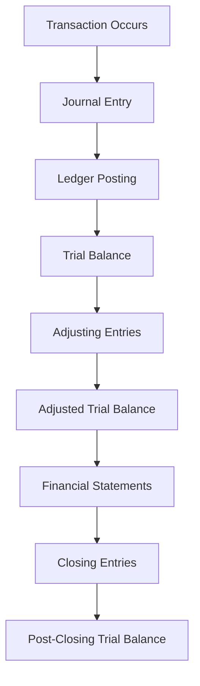

## 3.4.2 Capstone 2: Examination Preparation

The Capstone 2 module is a pivotal component of the Chartered Professional Accountant (CPA) Professional Education Program (PEP) in Canada. It serves as an intensive preparation phase for the Common Final Examination (CFE), which is the culmination of the CPA certification process. This section provides a comprehensive guide to mastering Capstone 2, offering strategies, practical examples, and insights to ensure you are well-prepared for the CFE.

### Understanding the Common Final Examination (CFE)

The CFE is a rigorous, multi-day examination designed to assess your competencies in accounting, finance, and business management. It evaluates your ability to integrate knowledge across various domains and apply it to real-world scenarios. The exam is structured as follows:

- **Day 1:** Focuses on a comprehensive case study that requires strategic analysis and decision-making.
- **Day 2:** Tests depth in specific areas of accounting, with a focus on financial reporting, management accounting, and audit and assurance.
- **Day 3:** Assesses breadth across various competencies, including taxation, finance, and governance.

### Key Objectives of Capstone 2

Capstone 2 aims to:

1. **Enhance Exam Readiness:** Through practice exams and feedback, you will refine your ability to analyze complex scenarios and develop coherent responses.
2. **Develop Strategic Thinking:** The module emphasizes strategic analysis and decision-making skills, crucial for the CFE.
3. **Foster Professional Judgment:** You will learn to apply professional skepticism and ethical considerations in your responses.
4. **Improve Communication Skills:** Effective communication is essential for articulating your analysis and recommendations clearly.

### Strategies for Success in Capstone 2

#### 1. Mastering Case Writing Techniques

Case writing is a critical skill for the CFE. Here are some strategies to excel:

- **Understand the Case Requirements:** Carefully read the case to identify key issues, stakeholders, and objectives.
- **Structure Your Response:** Use a clear and logical structure, such as the Introduction, Analysis, Recommendations, and Conclusion (IARC) format.
- **Prioritize Issues:** Focus on the most significant issues that impact the case objectives.
- **Integrate Knowledge:** Demonstrate your ability to apply knowledge from various domains, such as financial reporting, taxation, and governance.

#### 2. Time Management

Effective time management is crucial during the CFE. Consider the following tips:

- **Allocate Time Wisely:** Divide your time based on the weight of each section. For example, spend more time on areas with higher marks.
- **Practice Under Exam Conditions:** Simulate exam conditions by practicing with timed case studies.
- **Avoid Perfectionism:** Aim for a well-rounded response rather than perfection in one area.

#### 3. Utilizing Feedback

Feedback is a valuable tool for improvement. Here's how to make the most of it:

- **Seek Constructive Criticism:** Actively seek feedback from peers, mentors, and instructors.
- **Reflect on Feedback:** Analyze feedback to identify patterns and areas for improvement.
- **Implement Changes:** Apply feedback to future practice cases to enhance your performance.

#### 4. Leveraging CPA Canada Resources

CPA Canada provides a wealth of resources to aid your preparation:

- **Practice Exams:** Access past CFE exams to familiarize yourself with the format and question types.
- **Study Guides:** Utilize CPA Canada's study guides for comprehensive coverage of exam topics.
- **Webinars and Workshops:** Participate in webinars and workshops for additional insights and tips.

### Practical Examples and Case Studies

To illustrate key concepts, let's explore a sample case study:

**Case Study: Strategic Decision-Making in a Manufacturing Company**

**Scenario:** You are a CPA advising a manufacturing company facing declining profits. The company is considering expanding into a new market to boost revenue.

**Key Issues:**
- Market analysis and potential risks
- Financial implications of expansion
- Impact on existing operations

**Analysis:**
- **Market Analysis:** Conduct a SWOT analysis to evaluate the strengths, weaknesses, opportunities, and threats of entering the new market.
- **Financial Implications:** Prepare a financial forecast to assess the potential return on investment and cash flow impact.
- **Operational Impact:** Analyze how the expansion will affect current operations, including supply chain and production capacity.

**Recommendations:**
- Recommend a phased approach to expansion, starting with a pilot project to test market viability.
- Suggest cost-control measures to mitigate financial risks.
- Propose enhancements to the supply chain to support increased production.

**Conclusion:**
- Summarize the benefits and risks of the proposed expansion, emphasizing the strategic fit with the company's long-term goals.

### Real-World Applications and Regulatory Scenarios

Understanding real-world applications and regulatory scenarios is crucial for the CFE. Here are some examples:

- **Financial Reporting:** Apply International Financial Reporting Standards (IFRS) and Accounting Standards for Private Enterprises (ASPE) to complex accounting issues, such as revenue recognition and lease accounting.
- **Taxation:** Navigate Canadian tax regulations, including the Income Tax Act, to develop tax planning strategies and ensure compliance.
- **Governance:** Evaluate corporate governance practices and their impact on stakeholder management and risk mitigation.

### Step-by-Step Guidance for Key Accounting Procedures

#### Financial Statement Preparation

1. **Gather Financial Data:** Collect relevant financial data, including trial balances and supporting documents.
2. **Adjust Entries:** Make necessary adjustments for accruals, deferrals, and other accounting estimates.
3. **Prepare Financial Statements:** Compile the income statement, balance sheet, and cash flow statement.
4. **Review and Analyze:** Review the statements for accuracy and analyze key financial ratios.

#### Audit Planning and Execution

1. **Risk Assessment:** Identify and assess risks of material misstatement in the financial statements.
2. **Audit Strategy:** Develop an audit strategy that addresses identified risks and outlines the scope of the audit.
3. **Evidence Collection:** Gather sufficient and appropriate audit evidence through testing and verification.
4. **Reporting:** Prepare the audit report, highlighting key findings and recommendations.

### Diagrams and Visual Aids

To enhance understanding, let's use a Mermaid.js diagram to illustrate the flow of the accounting cycle:

### Best Practices and Common Pitfalls

#### Best Practices

- **Stay Organized:** Keep your study materials and notes well-organized for easy reference.
- **Practice Regularly:** Consistent practice is key to mastering case writing and exam techniques.
- **Stay Informed:** Keep up-to-date with changes in accounting standards and regulations.

#### Common Pitfalls

- **Overlooking Details:** Pay attention to details in case scenarios to avoid missing critical information.
- **Poor Time Management:** Avoid spending too much time on one section at the expense of others.
- **Neglecting Feedback:** Failing to incorporate feedback can hinder your progress and improvement.

### References and Additional Resources

- **CPA Canada:** Explore CPA Canada's official resources, including practice exams and study guides.
- **IFRS and ASPE:** Refer to the latest standards and guidelines for financial reporting.
- **Professional Journals:** Read articles and case studies in professional accounting journals for additional insights.

### Encouragement and Motivation

Preparing for the CFE is a challenging yet rewarding journey. Remember to:

- **Stay Positive:** Maintain a positive mindset and believe in your ability to succeed.
- **Seek Support:** Reach out to peers, mentors, and instructors for support and guidance.
- **Celebrate Milestones:** Acknowledge and celebrate your achievements along the way.

### Summary

Capstone 2 is a critical phase in your CPA journey, providing the tools and strategies needed to excel in the CFE. By mastering case writing techniques, managing your time effectively, and leveraging available resources, you can confidently approach the exam and achieve your CPA designation.

## **Ready to Test Your Knowledge?**

**Practice 10 Essential CPA Exam Questions to Master Your Certification**



### What is the primary focus of Day 1 of the CFE?

- [x] Strategic analysis and decision-making
- [ ] Financial reporting and management accounting
- [ ] Taxation and governance
- [ ] Audit and assurance

> **Explanation:** Day 1 of the CFE focuses on strategic analysis and decision-making through a comprehensive case study.

### Which format is recommended for structuring case responses?

- [x] Introduction, Analysis, Recommendations, Conclusion (IARC)
- [ ] Problem, Solution, Evaluation, Summary (PSES)
- [ ] Background, Analysis, Solution, Conclusion (BASC)
- [ ] Introduction, Problem, Solution, Evaluation (IPSE)

> **Explanation:** The IARC format is recommended for structuring case responses to ensure clarity and coherence.

### What is a key strategy for managing time during the CFE?

- [x] Allocate time based on section weight
- [ ] Focus on perfecting one section
- [ ] Spend equal time on all sections
- [ ] Prioritize the easiest sections first

> **Explanation:** Allocating time based on section weight ensures that you spend more time on areas with higher marks.

### How can feedback be effectively utilized in Capstone 2?

- [x] Seek constructive criticism and implement changes
- [ ] Ignore feedback and focus on strengths
- [ ] Use feedback only for final practice exams
- [ ] Seek feedback only from peers

> **Explanation:** Seeking constructive criticism and implementing changes helps improve performance and address weaknesses.

### Which resource is NOT provided by CPA Canada for CFE preparation?

- [ ] Practice exams
- [ ] Study guides
- [ ] Webinars and workshops
- [x] Personal tutoring sessions

> **Explanation:** CPA Canada provides practice exams, study guides, and webinars, but not personal tutoring sessions.

### What is a common pitfall to avoid during the CFE?

- [x] Overlooking details in case scenarios
- [ ] Practicing regularly
- [ ] Staying informed about standards
- [ ] Seeking feedback

> **Explanation:** Overlooking details in case scenarios can lead to missing critical information and negatively impact your response.

### Which accounting standard is applicable for complex accounting issues in Canada?

- [x] International Financial Reporting Standards (IFRS)
- [ ] Generally Accepted Accounting Principles (GAAP)
- [ ] Canadian Auditing Standards (CAS)
- [ ] Public Sector Accounting Standards (PSAS)

> **Explanation:** IFRS is applicable for complex accounting issues in Canada, especially for publicly accountable enterprises.

### What is the purpose of adjusting entries in financial statement preparation?

- [x] To ensure accurate financial reporting
- [ ] To simplify the accounting process
- [ ] To eliminate errors in the trial balance
- [ ] To finalize the closing entries

> **Explanation:** Adjusting entries ensure accurate financial reporting by accounting for accruals, deferrals, and estimates.

### Which diagram best represents the flow of the accounting cycle?

- [x] Transaction Occurs → Journal Entry → Ledger Posting → Trial Balance → Adjusting Entries → Financial Statements
- [ ] Journal Entry → Transaction Occurs → Ledger Posting → Adjusting Entries → Trial Balance → Financial Statements
- [ ] Ledger Posting → Transaction Occurs → Journal Entry → Trial Balance → Financial Statements → Adjusting Entries
- [ ] Financial Statements → Adjusting Entries → Trial Balance → Ledger Posting → Journal Entry → Transaction Occurs

> **Explanation:** The correct flow of the accounting cycle starts with a transaction, followed by journal entry, ledger posting, trial balance, adjusting entries, and financial statements.

### True or False: Capstone 2 focuses solely on technical accounting skills.

- [ ] True
- [x] False

> **Explanation:** False. Capstone 2 focuses on strategic thinking, professional judgment, and communication skills in addition to technical accounting skills.


