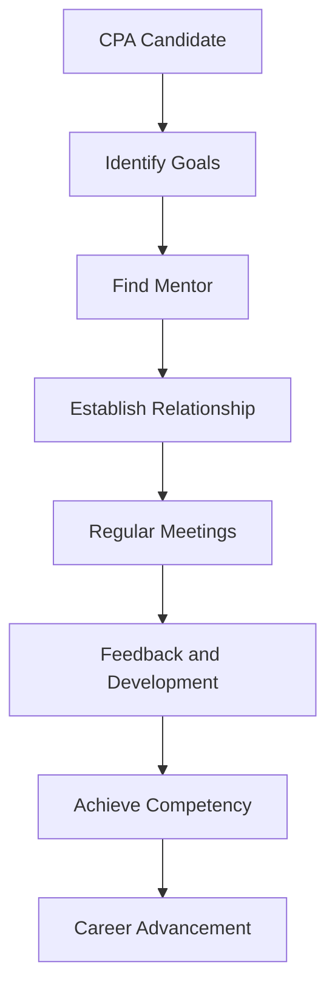

## 4.2.2 Working with Mentors

Mentorship is a cornerstone of professional development, especially in the accounting field. For CPA candidates in Canada, working with a mentor is not just a requirement but a valuable opportunity to gain insights, develop competencies, and prepare for a successful career. This section will explore the importance of mentorship, how to effectively engage with a CPA mentor, and the benefits it brings to your professional journey.

### Understanding the Role of a Mentor

A mentor in the CPA context is an experienced professional who provides guidance, support, and feedback to help you navigate the complexities of the CPA certification process and your career. They play a crucial role in:

- **Providing Industry Insights:** Mentors offer valuable perspectives on the accounting profession, industry trends, and best practices.
- **Enhancing Competency Development:** They help you identify and develop the technical and enabling competencies required for the CPA designation.
- **Offering Career Guidance:** Mentors assist in setting career goals, exploring career paths, and making informed decisions.
- **Facilitating Networking Opportunities:** Through their connections, mentors can introduce you to key industry players and professional networks.

### The Importance of Mentorship in the CPA Journey

Mentorship is integral to the CPA certification process for several reasons:

1. **Competency Development:** Mentors help you understand and apply the CPA Competency Map, which outlines the skills and knowledge required for the CPA designation. They provide feedback on your progress and help you identify areas for improvement.

2. **Practical Experience:** Mentors guide you through the practical experience requirements, ensuring you gain relevant experience and meet the necessary standards.

3. **Ethical Guidance:** Mentors instill a strong sense of professional ethics and integrity, which are essential in the accounting profession.

4. **Exam Preparation:** Mentors can offer tips and strategies for preparing for the Common Final Examination (CFE), sharing their experiences and insights.

5. **Career Development:** Mentors help you navigate career transitions, explore new opportunities, and develop leadership skills.

### How to Find a CPA Mentor

Finding the right mentor is crucial for a successful mentorship experience. Here are some steps to help you find a CPA mentor:

- **Leverage Professional Networks:** Use your existing professional networks, such as colleagues, professors, and industry events, to identify potential mentors.

- **Join Professional Associations:** Organizations like CPA Canada and provincial CPA bodies offer mentorship programs and networking events where you can connect with experienced CPAs.

- **Utilize Online Platforms:** LinkedIn and other professional networking sites can help you find and connect with potential mentors.

- **Seek Recommendations:** Ask for recommendations from peers, supervisors, or career advisors who may know experienced CPAs willing to mentor.

### Building a Successful Mentor-Mentee Relationship

A successful mentor-mentee relationship is built on mutual respect, trust, and open communication. Here are some tips to foster a productive relationship with your mentor:

- **Set Clear Goals:** Define your objectives for the mentorship, such as developing specific competencies, preparing for the CFE, or exploring career paths.

- **Communicate Regularly:** Schedule regular meetings with your mentor to discuss your progress, challenges, and goals. Be open to feedback and willing to ask questions.

- **Be Proactive:** Take initiative in the relationship by preparing for meetings, setting agendas, and following up on action items.

- **Show Appreciation:** Acknowledge your mentor's time and effort by expressing gratitude and providing updates on how their guidance has helped you.

### Practical Examples and Case Studies

To illustrate the impact of mentorship, consider the following scenarios:

#### Case Study 1: Competency Development

**Scenario:** Sarah, a CPA candidate, struggles with management accounting concepts. Her mentor, an experienced management accountant, provides resources, explains complex topics, and offers practical examples from their work experience. As a result, Sarah improves her understanding and performance in this area.

#### Case Study 2: Exam Preparation

**Scenario:** John is preparing for the CFE and feels overwhelmed by the volume of material. His mentor, who recently passed the CFE, shares study strategies, practice exams, and time management tips. John's confidence and exam performance improve significantly.

### Real-World Applications and Regulatory Scenarios

Mentorship also plays a role in understanding real-world applications and regulatory scenarios. For example, mentors can:

- **Guide you through complex accounting standards:** Mentors can help you interpret and apply standards like IFRS and ASPE in practical situations.

- **Discuss regulatory changes:** Mentors keep you informed about changes in accounting regulations and how they impact the profession.

- **Provide insights into industry-specific challenges:** Mentors with experience in specific industries can offer guidance on navigating unique challenges and opportunities.

### Step-by-Step Guidance for Engaging with a Mentor

1. **Identify Your Needs:** Determine what you hope to gain from the mentorship, such as developing specific skills or gaining industry insights.

2. **Research Potential Mentors:** Look for mentors with experience and expertise in areas relevant to your goals.

3. **Initiate Contact:** Reach out to potential mentors with a clear and concise message explaining your interest in mentorship and how you believe they can help.

4. **Establish Expectations:** Discuss and agree on the frequency of meetings, preferred communication methods, and any specific topics you wish to cover.

5. **Prepare for Meetings:** Come to each meeting with an agenda, questions, and updates on your progress.

6. **Follow Up:** After each meeting, summarize key takeaways and action items, and express gratitude for your mentor's guidance.

### Diagrams and Visuals

To enhance understanding, consider the following diagram illustrating the mentor-mentee relationship:

### Best Practices, Common Pitfalls, and Strategies

**Best Practices:**

- **Be Open to Feedback:** Constructive criticism is essential for growth. Embrace feedback and use it to improve your skills.

- **Maintain Professionalism:** Treat your mentor with respect and professionalism, valuing their time and expertise.

**Common Pitfalls:**

- **Lack of Communication:** Infrequent communication can hinder progress. Ensure regular and open dialogue with your mentor.

- **Unclear Goals:** Without clear objectives, the mentorship may lack direction. Set specific, measurable goals from the outset.

**Strategies to Overcome Challenges:**

- **Set Regular Check-Ins:** Schedule consistent meetings to maintain momentum and address any issues promptly.

- **Seek Additional Resources:** If your mentor cannot address certain areas, seek supplementary resources or additional mentors.

### References and Additional Resources

- **CPA Canada Mentorship Program:** [CPA Canada](https://www.cpacanada.ca/en/become-a-cpa/cpa-mentorship-program)
- **International Financial Reporting Standards (IFRS):** [IFRS Foundation](https://www.ifrs.org/)
- **Accounting Standards for Private Enterprises (ASPE):** [CPA Canada ASPE](https://www.cpacanada.ca/en/business-and-accounting-resources/accounting-and-financial-reporting/aspe)

### Summary

Working with a mentor is a vital component of the CPA journey, offering guidance, support, and insights that enhance your professional development. By effectively engaging with a mentor, you can develop the competencies needed for the CPA designation, prepare for the CFE, and advance your career. Remember to set clear goals, communicate regularly, and embrace feedback to make the most of your mentorship experience.

## **Ready to Test Your Knowledge?**

**Practice 10 Essential CPA Exam Questions to Master Your Certification**



### What is the primary role of a CPA mentor?

- [x] To provide guidance and support in competency development
- [ ] To offer financial assistance for exam fees
- [ ] To complete the candidate's practical experience requirements
- [ ] To provide job placement services

> **Explanation:** A CPA mentor's primary role is to provide guidance and support in developing the competencies required for the CPA designation.

### Which of the following is a benefit of having a CPA mentor?

- [x] Gaining industry insights and networking opportunities
- [ ] Receiving guaranteed job offers
- [ ] Exemption from the Common Final Examination (CFE)
- [ ] Automatic completion of practical experience requirements

> **Explanation:** A CPA mentor can offer valuable industry insights and networking opportunities, which are beneficial for career development.

### How can a CPA candidate find a mentor?

- [x] By leveraging professional networks and joining professional associations
- [ ] By applying through government job portals
- [ ] By enrolling in a university degree program
- [ ] By purchasing mentorship services online

> **Explanation:** CPA candidates can find mentors by leveraging their professional networks and joining associations like CPA Canada.

### What is a common pitfall in the mentor-mentee relationship?

- [x] Lack of communication
- [ ] Excessive meetings
- [ ] Over-reliance on written communication
- [ ] Setting too many goals

> **Explanation:** Lack of communication is a common pitfall that can hinder the progress of the mentor-mentee relationship.

### What should a mentee do to prepare for meetings with their mentor?

- [x] Prepare an agenda and questions
- [ ] Bring gifts to every meeting
- [ ] Avoid discussing challenges
- [ ] Only discuss personal issues

> **Explanation:** Mentees should prepare an agenda and questions to make the most of their meetings with their mentor.

### Which of the following is a best practice for working with a mentor?

- [x] Being open to feedback
- [ ] Avoiding feedback
- [ ] Only meeting once a year
- [ ] Focusing solely on personal issues

> **Explanation:** Being open to feedback is a best practice that helps mentees grow and improve their skills.

### What is a key component of a successful mentor-mentee relationship?

- [x] Mutual respect and trust
- [ ] Financial transactions
- [ ] Social media interactions
- [ ] Frequent gift exchanges

> **Explanation:** Mutual respect and trust are key components of a successful mentor-mentee relationship.

### How can mentors assist with exam preparation?

- [x] By sharing study strategies and practice exams
- [ ] By taking the exam on behalf of the mentee
- [ ] By providing financial incentives
- [ ] By offering guaranteed passing scores

> **Explanation:** Mentors can assist with exam preparation by sharing study strategies and practice exams.

### True or False: Mentors can help CPA candidates understand and apply accounting standards like IFRS and ASPE.

- [x] True
- [ ] False

> **Explanation:** Mentors can provide guidance on interpreting and applying accounting standards such as IFRS and ASPE.

### What is the first step in engaging with a mentor?

- [x] Identifying your needs and goals
- [ ] Scheduling a meeting without preparation
- [ ] Requesting financial support
- [ ] Avoiding communication

> **Explanation:** The first step in engaging with a mentor is identifying your needs and goals to ensure a focused and productive relationship.


