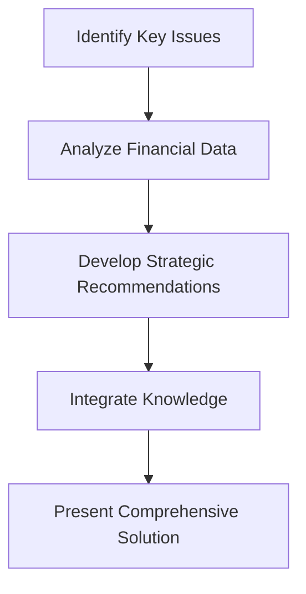

## 5.1.1 Structure and Format

The Common Final Examination (CFE) is a pivotal component of the Chartered Professional Accountant (CPA) certification process in Canada. Understanding its structure and format is crucial for candidates aiming to excel in this rigorous assessment. This section provides a detailed breakdown of the CFE's composition, including question types, timing, and strategic approaches to tackle the exam effectively.

### Overview of the CFE

The CFE is a comprehensive, multi-day examination designed to assess the competencies of aspiring CPAs. It evaluates both technical knowledge and the ability to apply that knowledge in practical scenarios. The exam is structured to test a candidate's proficiency across various domains, including financial reporting, management accounting, audit and assurance, finance, and taxation.

### Exam Structure

The CFE is conducted over three consecutive days, each with a distinct focus and format:

- **Day 1: Capstone 1 Case**
  - **Focus:** Strategic analysis and integration.
  - **Duration:** 4 hours.
  - **Format:** Candidates are required to analyze a pre-released case study, which they have studied during the Capstone 1 module. The case involves a complex business scenario where candidates must demonstrate strategic thinking, problem-solving, and decision-making skills.

- **Day 2: Comprehensive Case**
  - **Focus:** Depth of knowledge in a chosen role.
  - **Duration:** 5 hours.
  - **Format:** Candidates choose one of four roles (Assurance, Performance Management, Taxation, or Finance) and are presented with a comprehensive case. This case requires in-depth analysis and application of technical knowledge specific to the chosen role, along with integration across other competency areas.

- **Day 3: Multi-Subject Cases**
  - **Focus:** Breadth of knowledge across all CPA competencies.
  - **Duration:** 4 hours.
  - **Format:** Candidates face three separate multi-subject cases, each testing a range of competencies. These cases require candidates to demonstrate their ability to integrate and apply knowledge across different areas of accounting.

### Question Types

The CFE includes various question types designed to assess different skills and competencies:

- **Case-Based Questions:** These are the primary format of the CFE, requiring candidates to analyze complex scenarios and provide well-reasoned solutions. Candidates must demonstrate their ability to integrate knowledge across multiple domains and apply it to real-world situations.

- **Objective-Style Questions:** While less common, these questions may appear in the form of multiple-choice or short-answer questions, particularly in the multi-subject cases on Day 3. They test specific technical knowledge and understanding of accounting principles.

### Timing and Time Management

Effective time management is crucial for success in the CFE. Candidates must allocate their time wisely to ensure they can thoroughly analyze each case and provide comprehensive responses. Here are some strategies for managing time during the exam:

- **Day 1:** Spend the initial 30 minutes reviewing the case and planning your response. Allocate the remaining time to writing and revising your analysis.

- **Day 2:** Begin with a quick overview of the case to identify key issues. Spend approximately 1 hour on each major section of the case, leaving time for review and refinement.

- **Day 3:** Divide your time equally among the three cases, ensuring you address all required competencies in each response.

### Practical Examples and Scenarios

To illustrate the application of these strategies, consider the following example:

**Example Scenario:** You are presented with a case involving a manufacturing company facing declining sales and increasing competition. The case requires you to analyze the company's financial statements, identify strategic opportunities, and recommend a course of action.

**Approach:**
1. **Identify Key Issues:** Begin by identifying the main challenges the company faces, such as declining sales and competitive pressures.
2. **Analyze Financial Data:** Examine the financial statements to understand the company's current financial position and performance trends.
3. **Develop Strategic Recommendations:** Based on your analysis, propose strategic initiatives to address the company's challenges, such as cost reduction measures or market expansion strategies.
4. **Integrate Knowledge:** Demonstrate your ability to integrate knowledge from various domains, such as financial reporting, management accounting, and strategic management, to provide a comprehensive solution.

### Real-World Applications and Regulatory Scenarios

The CFE is designed to reflect real-world challenges that CPAs may encounter in their professional practice. Candidates must be familiar with Canadian accounting standards, regulations, and ethical considerations. For example, a case may involve issues related to International Financial Reporting Standards (IFRS) compliance, requiring candidates to apply their understanding of these standards in a practical context.

### Step-by-Step Guidance

To excel in the CFE, candidates should follow a structured approach to case analysis:

1. **Read the Case Thoroughly:** Begin by reading the entire case to understand the context and key issues.
2. **Plan Your Response:** Outline your response, identifying the main points you need to address and the order in which you will present them.
3. **Analyze the Data:** Use the provided data to support your analysis and recommendations. Ensure your analysis is thorough and well-reasoned.
4. **Write Clearly and Concisely:** Present your response in a clear and logical manner, using headings and subheadings to organize your analysis.
5. **Review and Revise:** Allocate time to review your response, ensuring it is comprehensive and free of errors.

### Diagrams and Visual Aids

To enhance understanding, consider using diagrams and visual aids to represent complex concepts. For example, a flowchart can illustrate the decision-making process for a strategic recommendation, while a table can summarize financial data for easy reference.

### Best Practices and Common Pitfalls

To succeed in the CFE, candidates should adhere to best practices and avoid common pitfalls:

- **Best Practices:**
  - Practice case writing regularly to develop your analytical and writing skills.
  - Stay updated on current accounting standards and regulations.
  - Use the CPA Canada resources, such as practice exams and marker feedback, to refine your approach.

- **Common Pitfalls:**
  - Failing to manage time effectively, leading to incomplete responses.
  - Overlooking key issues or data in the case.
  - Providing recommendations without sufficient analysis or justification.

### References and Additional Resources

For further exploration, candidates are encouraged to consult the following resources:

- **CPA Canada Handbook:** Provides comprehensive guidance on Canadian accounting standards and regulations.
- **CPA Canada Practice Exams:** Offers practice exams and case studies to help candidates prepare for the CFE.
- **IFRS and ASPE Standards:** Familiarize yourself with these standards as they apply to Canadian accounting practices.

### Summary

Understanding the structure and format of the CFE is essential for success in the CPA certification process. By mastering the exam's composition, question types, and timing, candidates can approach the CFE with confidence and demonstrate their proficiency in accounting competencies.

---

## **Ready to Test Your Knowledge?**

**Practice 10 Essential CPA Exam Questions to Master Your Certification**



### What is the primary focus of Day 1 of the CFE?

- [x] Strategic analysis and integration
- [ ] Depth of knowledge in a chosen role
- [ ] Breadth of knowledge across all CPA competencies
- [ ] Objective-style questions

> **Explanation:** Day 1 of the CFE focuses on strategic analysis and integration, requiring candidates to analyze a pre-released case study.

### How long is the Day 2 Comprehensive Case?

- [x] 5 hours
- [ ] 4 hours
- [ ] 3 hours
- [ ] 6 hours

> **Explanation:** The Day 2 Comprehensive Case is 5 hours long, allowing candidates to demonstrate depth of knowledge in a chosen role.

### What type of questions are primarily used in the CFE?

- [x] Case-Based Questions
- [ ] Objective-Style Questions
- [ ] True/False Questions
- [ ] Essay Questions

> **Explanation:** The CFE primarily uses case-based questions to assess candidates' ability to analyze complex scenarios and provide solutions.

### What is a common pitfall in the CFE?

- [x] Failing to manage time effectively
- [ ] Over-preparing for the exam
- [ ] Using too many visual aids
- [ ] Writing too concisely

> **Explanation:** A common pitfall in the CFE is failing to manage time effectively, which can lead to incomplete responses.

### Which resource is recommended for understanding Canadian accounting standards?

- [x] CPA Canada Handbook
- [ ] IFRS Global Guide
- [ ] ASPE Manual
- [ ] Financial Times

> **Explanation:** The CPA Canada Handbook provides comprehensive guidance on Canadian accounting standards and regulations.

### What is the focus of Day 3 of the CFE?

- [x] Breadth of knowledge across all CPA competencies
- [ ] Strategic analysis and integration
- [ ] Depth of knowledge in a chosen role
- [ ] Objective-style questions

> **Explanation:** Day 3 focuses on breadth of knowledge across all CPA competencies, with candidates facing multi-subject cases.

### How should candidates approach the Day 2 Comprehensive Case?

- [x] Choose one of four roles and analyze a comprehensive case
- [ ] Focus on strategic analysis and integration
- [ ] Answer multiple-choice questions
- [ ] Write an essay on a given topic

> **Explanation:** Candidates should choose one of four roles and analyze a comprehensive case, demonstrating depth of knowledge in that role.

### What is a best practice for succeeding in the CFE?

- [x] Practice case writing regularly
- [ ] Focus solely on Day 1 preparation
- [ ] Avoid using CPA Canada resources
- [ ] Rely on memorization

> **Explanation:** Practicing case writing regularly helps develop analytical and writing skills, which are crucial for success in the CFE.

### What is the duration of Day 1 of the CFE?

- [x] 4 hours
- [ ] 5 hours
- [ ] 3 hours
- [ ] 6 hours

> **Explanation:** Day 1 of the CFE is 4 hours long, focusing on strategic analysis and integration.

### True or False: The CFE includes multiple-choice questions on Day 2.

- [ ] True
- [x] False

> **Explanation:** The CFE does not include multiple-choice questions on Day 2; it focuses on a comprehensive case requiring in-depth analysis.


