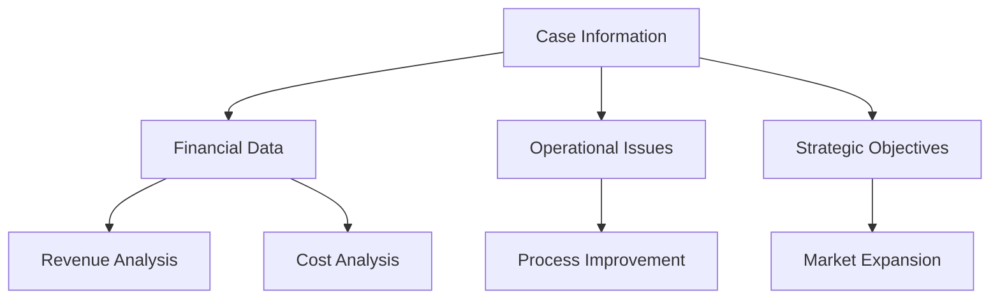

## 5.3.1 Analyzing Case Information

The ability to effectively analyze case information is a critical skill for success in the Chartered Professional Accountant (CPA) Common Final Examination (CFE). This section provides a comprehensive guide to mastering this skill, offering detailed strategies, practical examples, and expert tips to help you excel in your exam preparation and professional practice.

### Understanding the Importance of Case Analysis

Case analysis is a fundamental component of the CPA CFE, as it tests your ability to apply accounting knowledge to real-world scenarios. This involves interpreting complex information, identifying key issues, and developing well-reasoned solutions. The CFE assesses not only your technical competencies but also your ability to think critically and communicate effectively.

### Key Steps in Analyzing Case Information

#### 1. **Initial Reading and Comprehension**

Begin by reading the case thoroughly to gain a general understanding of the scenario. Focus on the following:

- **Identify the Context:** Determine the industry, company, and stakeholders involved. Understanding the context helps you relate the case to real-world situations.
- **Highlight Key Facts:** Note important details such as financial data, operational issues, and strategic objectives. These facts will form the basis of your analysis.
- **Understand the Requirements:** Pay close attention to the specific tasks or questions posed in the case. This will guide your focus and ensure your analysis is relevant.

#### 2. **Organizing Information**

Once you have a general understanding, organize the information systematically:

- **Create a Case Outline:** Structure your notes by categorizing information into sections such as financial analysis, strategic issues, and operational challenges.
- **Use Diagrams and Charts:** Visual aids like flowcharts or tables can help clarify complex relationships and data. Consider using tools like Excel for data analysis.

#### 3. **Identifying Key Issues**

Focus on identifying the core issues that need to be addressed:

- **Prioritize Problems:** Determine which issues have the most significant impact on the organization. Consider both short-term and long-term implications.
- **Analyze Root Causes:** Use techniques like the "5 Whys" to delve deeper into the underlying causes of problems.

#### 4. **Developing Solutions**

Propose actionable solutions based on your analysis:

- **Generate Alternatives:** Brainstorm multiple solutions for each issue. Consider the feasibility, cost, and potential impact of each option.
- **Evaluate Options:** Use decision-making models such as cost-benefit analysis or SWOT analysis to assess the viability of each solution.

#### 5. **Communicating Your Analysis**

Effectively communicate your findings and recommendations:

- **Structure Your Response:** Use a clear and logical structure, such as the Introduction-Body-Conclusion format, to present your analysis.
- **Support with Evidence:** Back up your recommendations with data and examples from the case. Use charts and graphs to illustrate key points.

### Practical Examples and Case Studies

To illustrate these concepts, let's explore a sample case study:

**Case Study: XYZ Corporation**

XYZ Corporation is a mid-sized manufacturing company facing declining profits due to increased competition and rising production costs. The case requires you to analyze the company's financial performance and recommend strategies to improve profitability.

**Step-by-Step Analysis:**

1. **Initial Reading:**
   - Identify the industry (manufacturing) and key stakeholders (management, employees, shareholders).
   - Highlight financial data such as revenue trends, cost structures, and profit margins.

2. **Organizing Information:**
   - Create a table to compare revenue and cost data over the past three years.
   - Use a flowchart to map the production process and identify inefficiencies.

3. **Identifying Key Issues:**
   - Prioritize issues such as high production costs and declining market share.
   - Analyze root causes, such as outdated equipment and lack of innovation.

4. **Developing Solutions:**
   - Propose alternatives like investing in new technology or exploring new markets.
   - Evaluate options using a SWOT analysis to assess strengths, weaknesses, opportunities, and threats.

5. **Communicating Your Analysis:**
   - Structure your response with a clear introduction, detailed analysis, and a concise conclusion.
   - Use charts to illustrate cost savings from proposed technology investments.

### Real-World Applications and Regulatory Scenarios

Understanding how to apply case analysis skills in real-world scenarios is crucial for CPA candidates. Consider the following applications:

- **Financial Reporting:** Analyze financial statements to identify trends and anomalies, ensuring compliance with Canadian accounting standards such as IFRS or ASPE.
- **Audit and Assurance:** Evaluate internal controls and risk management practices to provide assurance on financial accuracy and integrity.
- **Taxation:** Assess tax strategies and compliance with Canadian tax laws, identifying opportunities for optimization and risk mitigation.

### Best Practices and Common Pitfalls

#### Best Practices:

- **Practice Regularly:** Regular practice with diverse case studies enhances your analytical skills and confidence.
- **Stay Updated:** Keep abreast of changes in accounting standards and regulations to ensure your analysis is relevant and accurate.
- **Seek Feedback:** Engage with peers or mentors to gain insights and improve your case analysis techniques.

#### Common Pitfalls:

- **Overlooking Details:** Missing critical information can lead to incomplete or inaccurate analysis. Pay attention to all aspects of the case.
- **Lack of Structure:** A disorganized response can confuse the reader and weaken your argument. Use a clear structure to present your analysis.
- **Ignoring Stakeholder Perspectives:** Consider the impact of your recommendations on all stakeholders to ensure a balanced approach.

### Exam Strategies and Tips

- **Time Management:** Allocate time wisely for reading, analyzing, and writing. Practice under timed conditions to improve efficiency.
- **Focus on Key Issues:** Avoid getting bogged down in minor details. Concentrate on the most significant issues that affect the case outcome.
- **Use Professional Language:** Maintain a formal and professional tone in your responses, demonstrating your understanding of accounting principles and standards.

### Additional Resources and References

For further exploration of case analysis techniques, consider the following resources:

- **CPA Canada Resources:** Access practice exams, case studies, and study materials provided by CPA Canada.
- **Accounting Standards:** Review the International Financial Reporting Standards (IFRS) and Accounting Standards for Private Enterprises (ASPE) for guidance on financial reporting.
- **Professional Development:** Attend workshops or webinars on case analysis and exam preparation offered by professional accounting organizations.

### Conclusion

Mastering the art of analyzing case information is essential for success in the CPA CFE and your future career as a Chartered Professional Accountant. By following the strategies outlined in this guide, you can enhance your analytical skills, develop well-reasoned solutions, and effectively communicate your findings. Remember to practice regularly, seek feedback, and stay updated on industry developments to excel in your exam preparation and professional practice.

## **Ready to Test Your Knowledge?**

**Practice 10 Essential CPA Exam Questions to Master Your Certification**



### What is the first step in analyzing case information for the CPA CFE?

- [x] Initial reading and comprehension
- [ ] Developing solutions
- [ ] Communicating your analysis
- [ ] Organizing information

> **Explanation:** The first step is to thoroughly read and comprehend the case to understand the context and requirements.

### Which tool can help clarify complex relationships and data in case analysis?

- [ ] SWOT analysis
- [x] Diagrams and charts
- [ ] Cost-benefit analysis
- [ ] Decision trees

> **Explanation:** Diagrams and charts are visual aids that help clarify complex relationships and data.

### What should you focus on when identifying key issues in a case?

- [ ] Generating alternatives
- [x] Prioritizing problems
- [ ] Communicating findings
- [ ] Evaluating options

> **Explanation:** Prioritizing problems helps identify the most significant issues that need to be addressed.

### Which decision-making model can be used to assess the viability of solutions?

- [ ] SWOT analysis
- [ ] Initial reading
- [x] Cost-benefit analysis
- [ ] Communicating analysis

> **Explanation:** Cost-benefit analysis is a decision-making model used to evaluate the feasibility and impact of solutions.

### What is a common pitfall in case analysis?

- [ ] Practicing regularly
- [ ] Staying updated
- [x] Overlooking details
- [ ] Seeking feedback

> **Explanation:** Overlooking details can lead to incomplete or inaccurate analysis, which is a common pitfall.

### What is the purpose of creating a case outline?

- [ ] To generate alternatives
- [ ] To evaluate options
- [x] To organize information systematically
- [ ] To communicate findings

> **Explanation:** A case outline helps organize information systematically, making it easier to analyze.

### How can you ensure your analysis is relevant and accurate?

- [ ] Ignore stakeholder perspectives
- [x] Stay updated on accounting standards
- [ ] Overlook details
- [ ] Use informal language

> **Explanation:** Staying updated on accounting standards ensures your analysis is relevant and accurate.

### What should you consider when developing solutions for a case?

- [ ] Initial reading
- [ ] Overlooking details
- [x] Generating alternatives
- [ ] Ignoring stakeholder perspectives

> **Explanation:** Generating alternatives involves brainstorming multiple solutions for each issue.

### Which of the following is a best practice in case analysis?

- [ ] Lack of structure
- [ ] Ignoring stakeholder perspectives
- [x] Practicing regularly
- [ ] Overlooking details

> **Explanation:** Practicing regularly enhances analytical skills and builds confidence.

### True or False: Communicating your analysis involves using informal language.

- [ ] True
- [x] False

> **Explanation:** Communicating your analysis requires maintaining a formal and professional tone.


