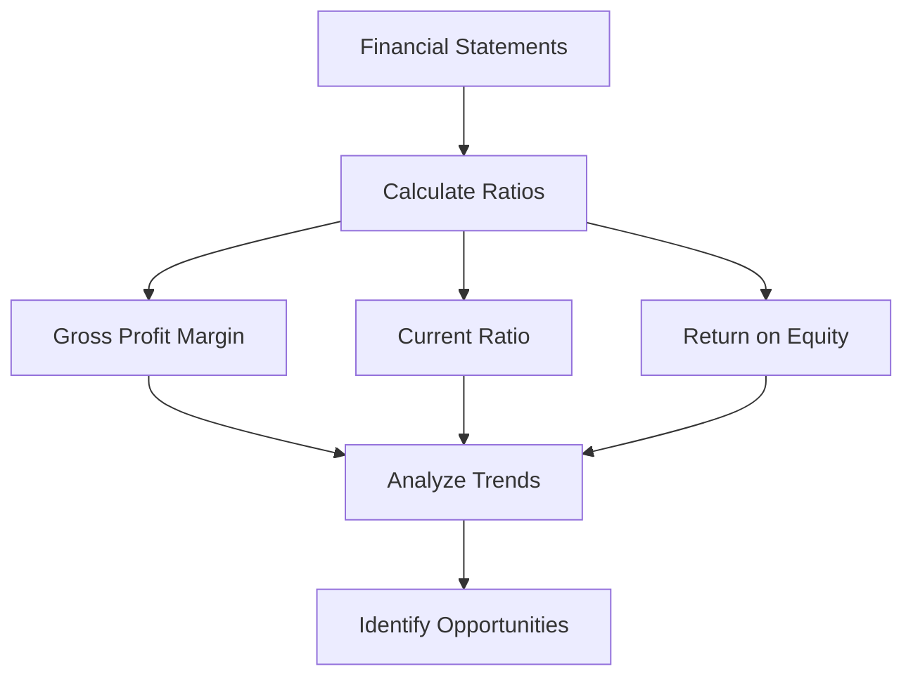
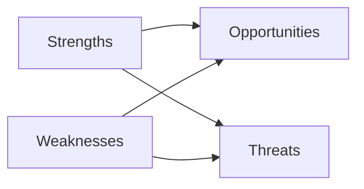

## 5.3.2 Developing Responses

The Common Final Examination (CFE) is a critical component of the CPA certification process in Canada. It requires candidates to demonstrate their ability to apply accounting knowledge and skills in a practical, case-based environment. Developing effective responses to case questions is essential for success in the CFE. This section provides a comprehensive guide to structuring your answers to address required competencies and issues, ensuring that you are well-prepared for the exam.

### Understanding the Case Requirements

Before diving into response development, it is crucial to thoroughly understand the case requirements. Each case in the CFE is designed to test specific competencies, and your response must align with these expectations. Here are some key steps to help you understand the case requirements:

1. **Read the Case Prompt Carefully:** Begin by reading the case prompt and any accompanying instructions. Identify the key issues, stakeholders, and objectives outlined in the case.

2. **Identify the Competencies Being Tested:** CPA Canada has a defined set of competencies that are assessed in the CFE. Familiarize yourself with these competencies and identify which ones are relevant to the case at hand.

3. **Analyze the Case Data:** Examine the financial statements, charts, and other data provided in the case. Look for trends, anomalies, and key figures that will inform your analysis.

4. **Determine the Required Deliverables:** Understand what is being asked of you in the case. Are you required to provide recommendations, perform calculations, or analyze specific scenarios? Clarifying the deliverables will guide your response development.

### Structuring Your Response

A well-structured response is essential for effectively communicating your analysis and recommendations. Here is a suggested structure for organizing your response:

1. **Introduction:**
   - **State the Purpose:** Begin with a clear statement of the purpose of your response. This sets the context for the reader and outlines what you intend to achieve.
   - **Summarize Key Issues:** Briefly summarize the key issues identified in the case. This demonstrates your understanding of the case requirements.

2. **Analysis:**
   - **Apply Relevant Frameworks:** Use appropriate accounting frameworks and models to analyze the case data. For example, you might use a SWOT analysis to evaluate strategic options or a financial ratio analysis to assess financial performance.
   - **Discuss Implications:** Explain the implications of your analysis for the stakeholders involved. Consider the impact on financial performance, compliance, and strategic objectives.

3. **Recommendations:**
   - **Provide Clear Recommendations:** Based on your analysis, provide clear and actionable recommendations. Ensure that your recommendations are aligned with the case objectives and address the key issues identified.
   - **Justify Your Recommendations:** Support your recommendations with evidence from the case data and your analysis. Explain why your proposed solutions are the best course of action.

4. **Conclusion:**
   - **Summarize Key Points:** Conclude your response by summarizing the key points of your analysis and recommendations. Reinforce the importance of your proposed solutions.

5. **Appendices (if applicable):**
   - **Include Supporting Calculations:** If your response involves complex calculations, include them in an appendix. This allows the reader to verify your work without disrupting the flow of your main response.

### Practical Examples and Scenarios

To illustrate the process of developing responses, let's consider a hypothetical case scenario:

**Case Scenario:**

You are a CPA candidate tasked with advising a mid-sized manufacturing company, XYZ Corp, on improving its financial performance. The company has experienced declining profitability over the past three years, and the CEO is seeking recommendations to reverse this trend.

**Developing Your Response:**

1. **Introduction:**
   - State the purpose of your response: "The purpose of this analysis is to provide XYZ Corp with strategic recommendations to enhance its financial performance and address declining profitability."
   - Summarize key issues: "XYZ Corp has experienced a decline in profitability due to increased production costs and decreased sales revenue."

2. **Analysis:**
   - Apply relevant frameworks: Conduct a financial ratio analysis to assess XYZ Corp's profitability, liquidity, and efficiency. Use a SWOT analysis to identify internal strengths and weaknesses, as well as external opportunities and threats.
   - Discuss implications: "The financial ratio analysis reveals that XYZ Corp's gross profit margin has decreased by 5% over the past three years, indicating rising production costs. The SWOT analysis highlights an opportunity to expand into new markets to increase sales revenue."

3. **Recommendations:**
   - Provide clear recommendations: "To improve profitability, XYZ Corp should implement cost reduction strategies, such as optimizing production processes and renegotiating supplier contracts. Additionally, the company should explore market expansion opportunities in emerging economies."
   - Justify your recommendations: "Optimizing production processes can reduce costs by 10%, while market expansion can increase sales revenue by 15% over the next two years."

4. **Conclusion:**
   - Summarize key points: "By implementing cost reduction strategies and pursuing market expansion, XYZ Corp can enhance its financial performance and achieve sustainable profitability."

5. **Appendices:**
   - Include supporting calculations: Provide detailed calculations of cost savings and projected revenue increases in an appendix.

### Real-World Applications and Regulatory Scenarios

In addition to hypothetical scenarios, it is important to consider real-world applications and regulatory scenarios when developing responses. Here are some examples:

1. **Compliance with Canadian Accounting Standards:**
   - Ensure that your recommendations align with Canadian accounting standards, such as IFRS or ASPE. For example, when advising on revenue recognition, reference the relevant sections of IFRS 15 or ASPE 3400.

2. **Tax Implications:**
   - Consider the tax implications of your recommendations. For instance, if you recommend restructuring a company's operations, analyze the potential impact on corporate tax liabilities and compliance with the Income Tax Act.

3. **Ethical Considerations:**
   - Address any ethical considerations related to your recommendations. For example, if cost-cutting measures involve workforce reductions, discuss the ethical implications and propose strategies to mitigate negative impacts on employees.

### Step-by-Step Guidance for Accounting Procedures

Developing responses often involves performing specific accounting procedures. Here is a step-by-step guide to some common procedures:

1. **Financial Ratio Analysis:**
   - **Step 1:** Gather financial statements and relevant data.
   - **Step 2:** Calculate key financial ratios, such as gross profit margin, current ratio, and return on equity.
   - **Step 3:** Analyze the trends and compare them to industry benchmarks.
   - **Step 4:** Identify areas of concern and opportunities for improvement.

2. **Budgeting and Forecasting:**
   - **Step 1:** Review historical financial data and identify key drivers of revenue and expenses.
   - **Step 2:** Develop a detailed budget for the upcoming fiscal year, including revenue projections and expense allocations.
   - **Step 3:** Create a forecast model to project financial performance under different scenarios.
   - **Step 4:** Analyze the forecast results and adjust the budget as needed.

3. **Cost-Benefit Analysis:**
   - **Step 1:** Identify the costs and benefits associated with a proposed project or decision.
   - **Step 2:** Quantify the costs and benefits in monetary terms.
   - **Step 3:** Calculate the net present value (NPV) or return on investment (ROI) to assess the financial viability.
   - **Step 4:** Make a recommendation based on the analysis.

### Diagrams and Visual Aids

Visual aids can enhance understanding and communication of complex concepts. Here are some examples of diagrams that can be used in your responses:

#### Financial Ratio Analysis Diagram

#### SWOT Analysis Diagram

### Best Practices and Common Pitfalls

When developing responses, it is important to be aware of best practices and common pitfalls:

**Best Practices:**
- **Be Concise and Clear:** Use clear and concise language to communicate your analysis and recommendations. Avoid unnecessary jargon and complex sentences.
- **Use Evidence-Based Analysis:** Support your analysis and recommendations with evidence from the case data and relevant accounting standards.
- **Prioritize Issues:** Focus on the most critical issues and competencies being tested in the case. Avoid spending too much time on minor details.

**Common Pitfalls:**
- **Overlooking Key Issues:** Failing to address all the key issues identified in the case can result in incomplete responses.
- **Lack of Structure:** A disorganized response can confuse the reader and obscure your analysis and recommendations.
- **Ignoring Ethical Considerations:** Neglecting to consider ethical implications can undermine the credibility of your recommendations.

### References and Additional Resources

To further enhance your understanding and preparation, consider exploring the following resources:

- **CPA Canada Competency Map:** Familiarize yourself with the competencies assessed in the CFE to ensure your responses align with the exam requirements.
- **International Financial Reporting Standards (IFRS):** Review relevant IFRS standards to support your analysis and recommendations.
- **Accounting Standards for Private Enterprises (ASPE):** Understand the key differences between ASPE and IFRS and when to apply each standard.
- **CPA Canada Practice Exams:** Utilize practice exams to simulate the exam environment and refine your response development skills.

### Encouraging Practice and Application

To reinforce your learning and application of response development techniques, consider the following practice questions:

1. **Case Scenario:** You are advising a retail company on improving its inventory management practices. Develop a response that includes an analysis of current practices, recommendations for improvement, and potential cost savings.

2. **Case Scenario:** A technology company is considering expanding its operations internationally. Develop a response that evaluates the financial and strategic implications of this decision, including potential risks and opportunities.

3. **Case Scenario:** A non-profit organization is facing budget constraints and needs to prioritize its programs. Develop a response that includes a cost-benefit analysis of the programs and recommendations for resource allocation.

### Conclusion

Developing effective responses for the CPA Common Final Examination requires a structured approach, a deep understanding of accounting competencies, and the ability to apply theoretical knowledge to practical scenarios. By following the guidance and strategies outlined in this section, you will be well-equipped to tackle case questions and demonstrate your proficiency as a Chartered Professional Accountant.

## **Ready to Test Your Knowledge?**

**Practice 10 Essential CPA Exam Questions to Master Your Certification**



### Which of the following is the first step in developing a response to a CPA case question?

- [x] Read the case prompt carefully
- [ ] Provide clear recommendations
- [ ] Conduct a financial ratio analysis
- [ ] Summarize key points

> **Explanation:** The first step is to read the case prompt carefully to understand the requirements and objectives.

### What is the purpose of the introduction in a CPA case response?

- [x] To state the purpose and summarize key issues
- [ ] To provide detailed calculations
- [ ] To include supporting evidence
- [ ] To conclude the response

> **Explanation:** The introduction sets the context by stating the purpose and summarizing key issues.

### Which framework is commonly used to evaluate strategic options in a case analysis?

- [x] SWOT analysis
- [ ] Cost-benefit analysis
- [ ] Financial ratio analysis
- [ ] Budgeting and forecasting

> **Explanation:** SWOT analysis is used to evaluate strategic options by identifying strengths, weaknesses, opportunities, and threats.

### What should be included in the appendices of a CPA case response?

- [x] Supporting calculations
- [ ] Recommendations
- [ ] Introduction
- [ ] Conclusion

> **Explanation:** Appendices should include supporting calculations to verify the analysis.

### Why is it important to justify recommendations in a CPA case response?

- [x] To support recommendations with evidence
- [ ] To provide a summary of key points
- [ ] To include ethical considerations
- [ ] To analyze financial ratios

> **Explanation:** Justifying recommendations with evidence strengthens the credibility of the response.

### What is a common pitfall when developing responses for the CPA exam?

- [x] Overlooking key issues
- [ ] Using evidence-based analysis
- [ ] Prioritizing issues
- [ ] Being concise and clear

> **Explanation:** Overlooking key issues can lead to incomplete responses.

### Which of the following is a best practice for developing CPA case responses?

- [x] Use evidence-based analysis
- [ ] Ignore ethical considerations
- [ ] Focus on minor details
- [ ] Use complex sentences

> **Explanation:** Using evidence-based analysis ensures that recommendations are well-supported.

### What is the role of ethical considerations in CPA case responses?

- [x] To address the ethical implications of recommendations
- [ ] To provide detailed calculations
- [ ] To summarize key points
- [ ] To conduct a SWOT analysis

> **Explanation:** Ethical considerations ensure that recommendations are responsible and credible.

### Which accounting standard should be referenced when advising on revenue recognition?

- [x] IFRS 15
- [ ] ASPE 3400
- [ ] Income Tax Act
- [ ] CPA Canada Competency Map

> **Explanation:** IFRS 15 is the relevant standard for revenue recognition.

### True or False: A well-structured response can obscure your analysis and recommendations.

- [ ] True
- [x] False

> **Explanation:** A well-structured response clarifies and enhances the communication of analysis and recommendations.


