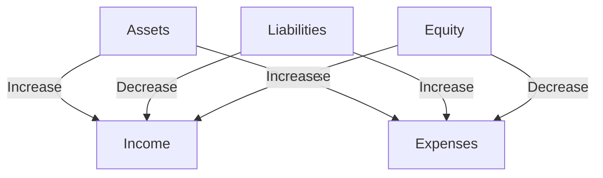

## 7.1.1 Framework and Principles

The International Financial Reporting Standards (IFRS) are a set of accounting standards developed by the International Accounting Standards Board (IASB) that are used globally. In Canada, IFRS is the required framework for publicly accountable enterprises, and understanding its framework and principles is crucial for CPA candidates. This section will delve into the core concepts and principles underlying IFRS, providing you with the knowledge needed to excel in your CPA exams and professional practice.

### Understanding the IFRS Framework

The IFRS framework serves as the foundation for the preparation and presentation of financial statements. It provides the concepts that underlie the preparation and presentation of financial statements for external users. The framework is designed to assist preparers of financial statements in applying IFRS and dealing with topics not yet covered by a specific standard.

#### Objectives of Financial Reporting

The primary objective of financial reporting under IFRS is to provide financial information about the reporting entity that is useful to existing and potential investors, lenders, and other creditors in making decisions about providing resources to the entity. This information should help users assess the prospects for future net cash inflows to the entity and management's stewardship of the entity's resources.

#### Qualitative Characteristics of Financial Information

The qualitative characteristics of financial information are divided into two categories: fundamental and enhancing characteristics.

1. **Fundamental Qualitative Characteristics:**
   - **Relevance:** Financial information is relevant if it is capable of making a difference in the decisions made by users. It should have predictive value, confirmatory value, or both.
   - **Faithful Representation:** Financial reports should represent economic phenomena in words and numbers that are complete, neutral, and free from error.

2. **Enhancing Qualitative Characteristics:**
   - **Comparability:** Users should be able to compare the financial statements of an entity over time and with other entities.
   - **Verifiability:** Different knowledgeable and independent observers should be able to reach consensus that a particular depiction is a faithful representation.
   - **Timeliness:** Information should be available to decision-makers in time to be capable of influencing their decisions.
   - **Understandability:** Financial information should be comprehensible to users with a reasonable knowledge of business and economic activities.

### Key Elements of Financial Statements

The IFRS framework identifies five key elements of financial statements:

1. **Assets:** Resources controlled by the entity as a result of past events and from which future economic benefits are expected to flow to the entity.
2. **Liabilities:** Present obligations of the entity arising from past events, the settlement of which is expected to result in an outflow of resources embodying economic benefits.
3. **Equity:** The residual interest in the assets of the entity after deducting liabilities.
4. **Income:** Increases in economic benefits during the accounting period in the form of inflows or enhancements of assets or decreases of liabilities that result in increases in equity, other than those relating to contributions from equity participants.
5. **Expenses:** Decreases in economic benefits during the accounting period in the form of outflows or depletions of assets or incurrences of liabilities that result in decreases in equity, other than those relating to distributions to equity participants.

### Recognition and Measurement

Recognition and measurement are critical components of the IFRS framework. They determine when and how the elements of financial statements are recognized and measured.

#### Recognition Criteria

An item is recognized in the financial statements when it meets the definition of an element and satisfies the following criteria:

- It is probable that any future economic benefit associated with the item will flow to or from the entity.
- The item's cost or value can be measured reliably.

#### Measurement Bases

IFRS allows for several measurement bases, including:

- **Historical Cost:** Assets and liabilities are recorded at the amount of cash or cash equivalents paid or received or the fair value of the consideration given or received at the time of acquisition.
- **Current Cost:** Assets are carried at the amount of cash or cash equivalents that would have to be paid if the same or an equivalent asset was acquired currently.
- **Realizable (Settlement) Value:** Assets are carried at the amount of cash or cash equivalents that could currently be obtained by selling the asset in an orderly disposal.
- **Present Value:** Assets and liabilities are carried at the present value of the future net cash inflows or outflows that the item is expected to generate.

### Practical Examples and Case Studies

To illustrate the application of IFRS principles, consider the following examples:

#### Example 1: Recognition of Revenue

A company sells goods to a customer with a right of return. Under IFRS 15, "Revenue from Contracts with Customers," revenue is recognized when control of the goods is transferred to the customer, which may be before or after delivery, depending on the terms of the contract. The company must also estimate the amount of returns and recognize a refund liability.

#### Example 2: Measurement of Financial Instruments

A company holds a portfolio of financial assets. Under IFRS 9, "Financial Instruments," these assets are measured at fair value through profit or loss, fair value through other comprehensive income, or amortized cost, depending on the business model for managing the financial assets and the contractual cash flow characteristics.

### Real-World Applications and Regulatory Scenarios

Understanding IFRS is not just about passing exams; it's about applying these principles in real-world scenarios. For instance, Canadian companies listed on stock exchanges must prepare their financial statements in accordance with IFRS. This ensures transparency and comparability for investors and other stakeholders.

#### Regulatory Compliance

In Canada, the Accounting Standards Board (AcSB) is responsible for developing and establishing accounting standards for use by Canadian entities. The AcSB has adopted IFRS for publicly accountable enterprises, and compliance with these standards is mandatory for such entities.

### Step-by-Step Guidance for Applying IFRS

1. **Identify the Transaction or Event:** Determine the nature of the transaction or event that needs to be reported.
2. **Determine the Relevant IFRS Standard:** Identify which IFRS standard applies to the transaction or event.
3. **Apply the Recognition Criteria:** Assess whether the transaction or event meets the recognition criteria for the relevant elements of financial statements.
4. **Measure the Transaction or Event:** Determine the appropriate measurement basis and calculate the amount to be recognized.
5. **Disclose the Information:** Ensure that all necessary disclosures are made in the financial statements to provide users with relevant and reliable information.

### Diagrams and Visual Aids

To enhance understanding, consider the following diagram illustrating the relationship between the elements of financial statements:

### Best Practices and Common Pitfalls

- **Best Practices:**
  - Stay updated with the latest IFRS amendments and interpretations.
  - Use professional judgment and skepticism when applying IFRS standards.
  - Ensure consistency in the application of accounting policies.

- **Common Pitfalls:**
  - Misinterpreting the recognition criteria for assets and liabilities.
  - Failing to adequately disclose significant accounting policies and judgments.
  - Overlooking the impact of changes in accounting estimates.

### References and Additional Resources

- **CPA Canada:** Offers a wealth of resources, including webinars, publications, and practice exams.
- **IFRS Foundation:** Provides access to the full text of IFRS standards and interpretations.
- **Accounting Standards Board (AcSB):** Offers guidance on the application of IFRS in Canada.

### Summary

Understanding the framework and principles of IFRS is essential for CPA candidates in Canada. By mastering these concepts, you will be well-prepared to tackle the financial reporting section of your exams and apply these principles in your professional career. Remember to practice applying these standards through real-world examples and case studies to reinforce your learning.

## **Ready to Test Your Knowledge?**

**Practice 10 Essential CPA Exam Questions to Master Your Certification**



### What is the primary objective of financial reporting under IFRS?

- [x] To provide financial information useful to investors, lenders, and creditors
- [ ] To comply with tax regulations
- [ ] To maximize shareholder value
- [ ] To ensure profitability

> **Explanation:** The primary objective of financial reporting under IFRS is to provide financial information that is useful to investors, lenders, and other creditors in making decisions about providing resources to the entity.

### Which of the following is a fundamental qualitative characteristic of financial information?

- [x] Relevance
- [ ] Comparability
- [ ] Timeliness
- [ ] Understandability

> **Explanation:** Relevance is a fundamental qualitative characteristic, while comparability, timeliness, and understandability are enhancing characteristics.

### What is the definition of an asset according to the IFRS framework?

- [x] A resource controlled by the entity expected to provide future economic benefits
- [ ] An obligation of the entity to transfer resources
- [ ] The residual interest in the assets of the entity after deducting liabilities
- [ ] An increase in economic benefits during the accounting period

> **Explanation:** An asset is defined as a resource controlled by the entity as a result of past events and from which future economic benefits are expected to flow to the entity.

### When is an item recognized in the financial statements?

- [x] When it meets the definition of an element and satisfies recognition criteria
- [ ] When it is probable that future economic benefits will flow to the entity
- [ ] When it can be measured reliably
- [ ] When it is approved by management

> **Explanation:** An item is recognized in the financial statements when it meets the definition of an element and satisfies the recognition criteria, which include probability of future economic benefits and reliable measurement.

### Which measurement basis involves carrying assets at the amount of cash or cash equivalents that would be paid if the same asset was acquired currently?

- [x] Current Cost
- [ ] Historical Cost
- [ ] Realizable Value
- [ ] Present Value

> **Explanation:** Current cost involves carrying assets at the amount of cash or cash equivalents that would have to be paid if the same or an equivalent asset was acquired currently.

### What does the qualitative characteristic of comparability ensure?

- [x] Users can compare financial statements over time and with other entities
- [ ] Information is available in time to influence decisions
- [ ] Information is comprehensible to users
- [ ] Information is free from error

> **Explanation:** Comparability ensures that users can compare the financial statements of an entity over time and with other entities, enhancing the usefulness of financial information.

### Which IFRS standard deals with revenue recognition?

- [x] IFRS 15
- [ ] IFRS 9
- [ ] IFRS 16
- [ ] IFRS 7

> **Explanation:** IFRS 15, "Revenue from Contracts with Customers," deals with revenue recognition.

### What is the role of the Accounting Standards Board (AcSB) in Canada?

- [x] To develop and establish accounting standards for Canadian entities
- [ ] To enforce tax compliance
- [ ] To audit financial statements
- [ ] To provide financial advisory services

> **Explanation:** The AcSB is responsible for developing and establishing accounting standards for use by Canadian entities.

### Which of the following is an enhancing qualitative characteristic of financial information?

- [x] Verifiability
- [ ] Faithful Representation
- [ ] Relevance
- [ ] Neutrality

> **Explanation:** Verifiability is an enhancing qualitative characteristic, while faithful representation and relevance are fundamental characteristics.

### True or False: IFRS is mandatory for all Canadian entities.

- [ ] True
- [x] False

> **Explanation:** IFRS is mandatory for publicly accountable enterprises in Canada, but not for all entities. Private enterprises may use Accounting Standards for Private Enterprises (ASPE).


