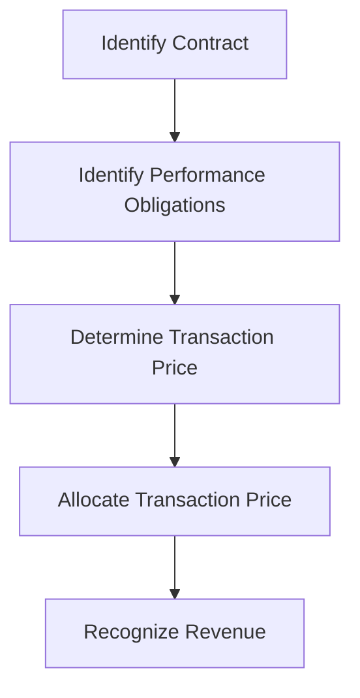

## 7.2.1 Key Differences from IFRS

In the realm of financial reporting, understanding the distinctions between Accounting Standards for Private Enterprises (ASPE) and International Financial Reporting Standards (IFRS) is crucial for Canadian Chartered Professional Accountant (CPA) candidates. This section delves into the key differences between these two sets of standards, providing insights that are essential for both exam preparation and practical application in the accounting profession.

### Introduction to ASPE and IFRS

**ASPE** is a set of accounting standards developed by the Canadian Accounting Standards Board (AcSB) specifically for private enterprises in Canada. These standards are designed to be less complex and more cost-effective for smaller, non-publicly accountable entities.

**IFRS**, on the other hand, is a globally recognized set of accounting standards developed by the International Accounting Standards Board (IASB). IFRS is used by publicly accountable enterprises and is known for its comprehensive and detailed approach to financial reporting.

### Key Differences Between ASPE and IFRS

#### 1. **Purpose and Scope**

- **ASPE** is tailored for private enterprises that do not have public accountability. It focuses on reducing the complexity and cost of financial reporting for smaller businesses.
- **IFRS** is intended for publicly accountable entities, including publicly traded companies and those with fiduciary responsibilities. It aims to provide transparency and comparability across international borders.

#### 2. **Financial Statement Presentation**

- **ASPE** allows more flexibility in financial statement presentation. For example, ASPE does not require a statement of comprehensive income, whereas IFRS does.
- **IFRS** mandates a statement of comprehensive income, which includes all items of income and expense recognized in a period, either in a single statement or in two separate statements.

#### 3. **Revenue Recognition**

- **ASPE** follows a simpler, more principles-based approach to revenue recognition, focusing on the transfer of risks and rewards.
- **IFRS 15** provides a detailed five-step model for revenue recognition, emphasizing the transfer of control and requiring more extensive disclosures.

#### 4. **Measurement of Financial Instruments**

- **ASPE** provides options for measurement at cost or fair value, with less emphasis on fair value measurement compared to IFRS.
- **IFRS 9** requires financial instruments to be measured at fair value through profit or loss, fair value through other comprehensive income, or amortized cost, based on the business model and cash flow characteristics.

#### 5. **Inventory Valuation**

- **ASPE** allows the use of the lower of cost and market value for inventory valuation.
- **IFRS** requires inventory to be measured at the lower of cost and net realizable value, which can lead to different impairment assessments.

#### 6. **Property, Plant, and Equipment (PPE)**

- **ASPE** permits the use of the cost model for PPE, with revaluation not being an option.
- **IFRS** allows for both the cost model and the revaluation model, providing flexibility in reporting the fair value of assets.

#### 7. **Leases**

- **ASPE** classifies leases as either capital or operating leases, with different accounting treatments for each.
- **IFRS 16** requires lessees to recognize almost all leases on the balance sheet, eliminating the distinction between operating and finance leases for lessees.

#### 8. **Impairment of Assets**

- **ASPE** uses a two-step approach for impairment testing, first assessing whether an impairment indicator exists and then measuring the impairment loss.
- **IFRS** employs a one-step approach, directly measuring the recoverable amount and recognizing impairment losses when the carrying amount exceeds the recoverable amount.

#### 9. **Intangible Assets**

- **ASPE** allows for the capitalization of development costs only if certain criteria are met, similar to IFRS.
- **IFRS** requires the capitalization of development costs when specific criteria are met, with more detailed guidance on the recognition and measurement of intangible assets.

#### 10. **Consolidation**

- **ASPE** provides an option to use the cost method, equity method, or consolidation for subsidiaries, depending on the nature of control.
- **IFRS 10** mandates consolidation based on the control model, requiring entities to consolidate all subsidiaries where control is present.

### Practical Examples and Case Studies

To illustrate these differences, consider the following scenarios:

#### Case Study 1: Revenue Recognition

A Canadian private enterprise sells software licenses with ongoing support services. Under **ASPE**, revenue from the sale of licenses and support services can be recognized separately based on the transfer of risks and rewards. However, under **IFRS 15**, the company must apply the five-step model to determine whether the licenses and support services are distinct performance obligations and recognize revenue accordingly.

#### Case Study 2: Lease Accounting

A small manufacturing company leases equipment for its operations. Under **ASPE**, the company classifies the lease as an operating lease, recognizing lease payments as an expense. Under **IFRS 16**, the same lease would be recognized on the balance sheet, with a right-of-use asset and corresponding lease liability.

### Real-World Applications

Understanding these differences is not only crucial for exam success but also for practical application in the accounting field. CPAs working with private enterprises must be adept at applying ASPE, while those in public accounting or multinational firms need to be proficient in IFRS.

### Regulatory Scenarios

In Canada, the choice between ASPE and IFRS can have significant implications for financial reporting, taxation, and regulatory compliance. CPAs must be aware of the regulatory environment and the specific requirements of each standard to ensure accurate and compliant financial reporting.

### Step-by-Step Guidance

For CPA candidates, mastering the differences between ASPE and IFRS involves:

1. **Studying the Standards**: Familiarize yourself with the specific sections of ASPE and IFRS that pertain to your area of practice.
2. **Applying the Standards**: Practice applying the standards to real-world scenarios and case studies.
3. **Reviewing Past Exam Questions**: Analyze past CPA exam questions to understand how these differences are tested.
4. **Engaging in Continuous Learning**: Stay updated with changes in standards and interpretations through CPA Canada resources and professional development courses.

### Diagrams and Visuals

To enhance understanding, consider the following diagram illustrating the decision-making process for revenue recognition under IFRS 15:

### Best Practices and Common Pitfalls

- **Best Practice**: Regularly review and update accounting policies to align with the chosen standards.
- **Common Pitfall**: Failing to recognize the impact of changes in standards on financial reporting and disclosures.

### References and Further Reading

- CPA Canada Handbook – Accounting
- International Financial Reporting Standards (IFRS) as adopted in Canada
- CPA Canada resources and professional development courses

### Summary

Understanding the key differences between ASPE and IFRS is essential for CPA candidates and professionals in Canada. By mastering these distinctions, you can ensure accurate financial reporting and compliance with regulatory requirements.

## **Ready to Test Your Knowledge?**

**Practice 10 Essential CPA Exam Questions to Master Your Certification**



### What is the primary purpose of ASPE?

- [x] To provide simplified accounting standards for private enterprises in Canada
- [ ] To align with international accounting standards
- [ ] To regulate public companies
- [ ] To enforce tax compliance

> **Explanation:** ASPE is designed to offer simplified and cost-effective accounting standards for private enterprises in Canada.

### Which of the following is a key difference between ASPE and IFRS in terms of financial statement presentation?

- [x] ASPE does not require a statement of comprehensive income
- [ ] ASPE requires a statement of cash flows
- [ ] IFRS does not require a balance sheet
- [ ] IFRS requires a statement of changes in equity

> **Explanation:** ASPE allows more flexibility and does not mandate a statement of comprehensive income, unlike IFRS.

### Under ASPE, how are financial instruments typically measured?

- [x] At cost or fair value
- [ ] Only at fair value
- [ ] Only at cost
- [ ] At historical cost

> **Explanation:** ASPE provides options for measuring financial instruments at cost or fair value, with less emphasis on fair value compared to IFRS.

### How does IFRS 16 differ from ASPE in lease accounting?

- [x] IFRS 16 requires almost all leases to be recognized on the balance sheet
- [ ] ASPE requires all leases to be recognized on the balance sheet
- [ ] IFRS 16 does not recognize leases on the balance sheet
- [ ] ASPE and IFRS 16 have identical lease accounting standards

> **Explanation:** IFRS 16 eliminates the distinction between operating and finance leases for lessees, requiring most leases to be recognized on the balance sheet.

### What approach does ASPE use for impairment testing?

- [x] A two-step approach
- [ ] A one-step approach
- [ ] A three-step approach
- [ ] No specific approach

> **Explanation:** ASPE uses a two-step approach for impairment testing, first assessing for indicators and then measuring impairment.

### In terms of consolidation, what option does ASPE provide that IFRS does not?

- [x] The cost method
- [ ] The revaluation method
- [ ] The fair value method
- [ ] The equity method

> **Explanation:** ASPE allows the use of the cost method for subsidiaries, which is not an option under IFRS.

### Which of the following is a requirement under IFRS but not under ASPE?

- [x] Statement of comprehensive income
- [ ] Statement of retained earnings
- [ ] Statement of financial position
- [ ] Statement of cash flows

> **Explanation:** IFRS requires a statement of comprehensive income, which is not mandatory under ASPE.

### What is a common pitfall when transitioning from ASPE to IFRS?

- [x] Underestimating the impact on financial disclosures
- [ ] Overestimating the cost of implementation
- [ ] Ignoring tax implications
- [ ] Focusing too much on qualitative disclosures

> **Explanation:** A common pitfall is underestimating the impact of transitioning on financial disclosures, as IFRS often requires more detailed information.

### Which standard provides more detailed guidance on the recognition and measurement of intangible assets?

- [x] IFRS
- [ ] ASPE
- [ ] Both provide the same level of detail
- [ ] Neither provides detailed guidance

> **Explanation:** IFRS provides more detailed guidance on the recognition and measurement of intangible assets compared to ASPE.

### True or False: ASPE and IFRS have identical standards for revenue recognition.

- [ ] True
- [x] False

> **Explanation:** ASPE and IFRS have different approaches to revenue recognition, with IFRS 15 providing a more detailed five-step model.


