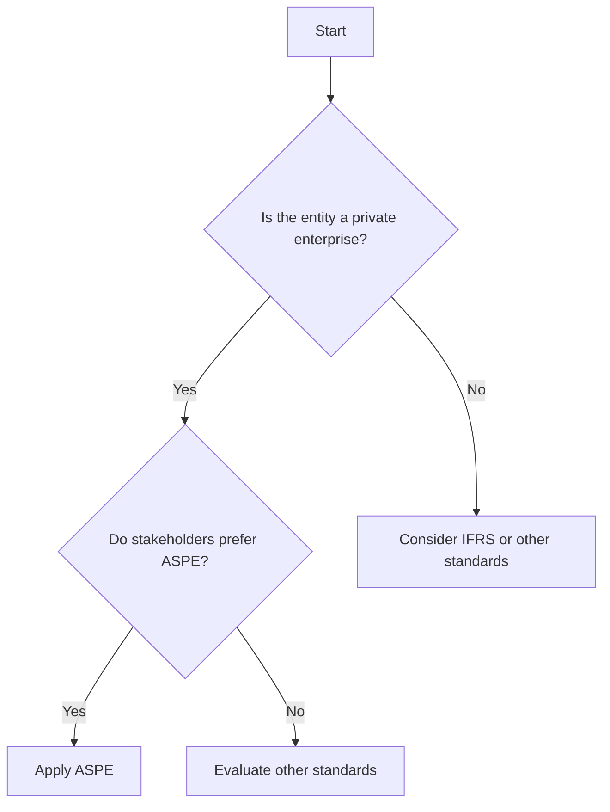

## 7.2.2 When to Apply ASPE

**Description:** Criteria and scenarios for utilizing ASPE in financial reporting.

---

### Introduction to ASPE

Accounting Standards for Private Enterprises (ASPE) are a set of guidelines established by the Canadian Accounting Standards Board (AcSB) specifically for private enterprises in Canada. ASPE provides a framework for financial reporting that is less complex than International Financial Reporting Standards (IFRS), making it more suitable for private companies that do not have the same reporting requirements as public companies. Understanding when to apply ASPE is crucial for CPA candidates and professionals, as it impacts financial reporting, compliance, and decision-making processes.

### Criteria for Applying ASPE

#### 1. **Nature of the Entity**

ASPE is designed for private enterprises, which are defined as entities that do not have public accountability. This means they do not have shares or debt instruments traded in a public market, nor do they hold assets in a fiduciary capacity for a broad group of outsiders as one of their primary businesses. Examples include family-owned businesses, private corporations, and partnerships.

#### 2. **Ownership Structure**

Private enterprises typically have a limited number of shareholders, often involving family members or a small group of investors. The decision to apply ASPE often depends on the needs and preferences of these stakeholders, who may prioritize simplicity and cost-effectiveness in financial reporting.

#### 3. **Regulatory Requirements**

While ASPE is generally applicable to private enterprises, certain industries or jurisdictions may have specific regulatory requirements that dictate the use of different accounting standards. It is essential to consider these regulations when deciding whether to apply ASPE.

#### 4. **Financial Statement Users**

The primary users of financial statements prepared under ASPE are typically internal stakeholders, such as management and owners, as well as external parties like lenders and creditors. These users often require financial information that is straightforward and relevant to decision-making, which ASPE is designed to provide.

### Scenarios for Applying ASPE

#### Scenario 1: **Family-Owned Business**

A family-owned manufacturing company with no intention of going public may choose ASPE for its financial reporting. The owners prioritize ease of understanding and cost savings over the comprehensive disclosures required by IFRS.

#### Scenario 2: **Private Equity-Owned Enterprise**

A private equity firm acquires a mid-sized technology company. The firm prefers ASPE to streamline financial reporting and focus on operational performance metrics that align with their investment strategy.

#### Scenario 3: **Partnerships and Joint Ventures**

A partnership operating a chain of retail stores opts for ASPE to maintain consistency in financial reporting across its various locations, ensuring that financial statements are easily comparable and understandable by all partners.

### Advantages of Using ASPE

#### 1. **Simplicity and Cost-Effectiveness**

ASPE is less complex than IFRS, reducing the time and resources required for financial reporting. This simplicity can lead to cost savings, particularly for smaller enterprises with limited accounting staff.

#### 2. **Relevance to Stakeholders**

The focus on providing relevant information to stakeholders makes ASPE an attractive option for private enterprises. Financial statements prepared under ASPE are often more aligned with the needs of owners, managers, and creditors.

#### 3. **Flexibility in Reporting**

ASPE allows for more flexibility in certain areas of financial reporting, such as the treatment of intangible assets and financial instruments. This flexibility can be advantageous for private enterprises with unique business models or financial structures.

### Challenges and Considerations

#### 1. **Transitioning from IFRS to ASPE**

Enterprises that initially adopted IFRS but later decide to switch to ASPE may face challenges in transitioning. This process requires careful planning and consideration of the differences in accounting policies and disclosures.

#### 2. **Stakeholder Expectations**

While ASPE is designed to meet the needs of private enterprise stakeholders, there may be instances where external parties, such as lenders or investors, require more detailed information than ASPE provides. In such cases, enterprises may need to supplement their financial statements with additional disclosures.

#### 3. **Regulatory Compliance**

Enterprises must ensure that their use of ASPE complies with any applicable regulatory requirements. This may involve consulting with legal and accounting professionals to navigate complex regulatory environments.

### Practical Examples and Case Studies

#### Case Study 1: **Manufacturing Company**

A medium-sized manufacturing company in Ontario, privately owned by a family, decides to apply ASPE. The company benefits from reduced reporting complexity and cost savings, allowing management to focus on strategic growth initiatives.

#### Case Study 2: **Retail Partnership**

A partnership operating a chain of retail stores across Canada chooses ASPE for its financial reporting. The partners appreciate the consistency and comparability of financial statements, which facilitate decision-making and performance evaluation.

#### Case Study 3: **Technology Firm**

A private technology firm, backed by venture capital, opts for ASPE to streamline financial reporting. The firm values the flexibility in accounting for research and development costs, which aligns with its innovation-driven business model.

### Real-World Applications and Regulatory Scenarios

#### Application in Financial Reporting

ASPE is widely used by private enterprises in Canada for preparing financial statements. These statements are often used for internal decision-making, securing financing, and meeting tax compliance requirements.

#### Regulatory Scenarios

While ASPE is generally applicable to private enterprises, certain industries or jurisdictions may have specific regulatory requirements that dictate the use of different accounting standards. It is essential to consider these regulations when deciding whether to apply ASPE.

### Step-by-Step Guidance for Applying ASPE

1. **Assess the Nature of the Entity**

   Determine whether the entity qualifies as a private enterprise by evaluating its ownership structure, public accountability, and regulatory requirements.

2. **Evaluate Stakeholder Needs**

   Consider the needs and preferences of stakeholders, including owners, management, and external parties, when deciding whether to apply ASPE.

3. **Review Regulatory Requirements**

   Ensure compliance with any industry-specific or jurisdictional regulations that may impact the choice of accounting standards.

4. **Transition Planning**

   For enterprises transitioning from IFRS to ASPE, develop a detailed transition plan that addresses differences in accounting policies and disclosures.

5. **Implement ASPE**

   Apply ASPE consistently across all financial reporting processes, ensuring that financial statements are prepared in accordance with the standards.

6. **Monitor and Review**

   Regularly review the application of ASPE to ensure ongoing compliance and relevance to stakeholder needs. Adjust reporting practices as necessary to address changes in the business environment or stakeholder expectations.

### Diagrams and Visuals

To enhance understanding, consider the following diagram illustrating the decision-making process for applying ASPE:

### Best Practices and Common Pitfalls

#### Best Practices

- **Engage Stakeholders:** Involve key stakeholders in the decision-making process to ensure that financial reporting aligns with their needs and expectations.
- **Stay Informed:** Keep up-to-date with changes to ASPE and related regulatory requirements to maintain compliance and relevance.
- **Leverage Professional Expertise:** Consult with accounting professionals to navigate complex reporting scenarios and ensure accurate application of ASPE.

#### Common Pitfalls

- **Overlooking Stakeholder Needs:** Failing to consider the needs of stakeholders can result in financial statements that do not meet their expectations or requirements.
- **Inadequate Transition Planning:** Transitioning from IFRS to ASPE without a detailed plan can lead to inconsistencies and errors in financial reporting.
- **Non-Compliance with Regulations:** Neglecting to consider regulatory requirements can result in non-compliance and potential legal or financial consequences.

### References and Additional Resources

- **CPA Canada:** Offers resources and guidance on applying ASPE, including publications and professional development opportunities.
- **AcSB:** Provides updates and interpretations of ASPE, ensuring that practitioners have access to the latest standards and best practices.
- **Industry-Specific Guidance:** Consult industry associations and regulatory bodies for guidance on applying ASPE in specific sectors.

### Summary

Applying ASPE is a strategic decision for private enterprises in Canada, offering simplicity, cost-effectiveness, and relevance to stakeholders. By understanding the criteria and scenarios for applying ASPE, CPA candidates and professionals can ensure accurate and compliant financial reporting. Regular review and engagement with stakeholders are essential to maintaining the effectiveness of ASPE in meeting the needs of private enterprises.

---

## **Ready to Test Your Knowledge?**

**Practice 10 Essential CPA Exam Questions to Master Your Certification**



### Which of the following entities is most likely to apply ASPE?

- [x] A family-owned manufacturing company
- [ ] A publicly traded corporation
- [ ] A government agency
- [ ] A non-profit organization

> **Explanation:** ASPE is designed for private enterprises, such as family-owned businesses, that do not have public accountability.

### What is a primary advantage of using ASPE for financial reporting?

- [x] Simplicity and cost-effectiveness
- [ ] Comprehensive disclosures
- [ ] Alignment with international standards
- [ ] Enhanced investor relations

> **Explanation:** ASPE offers simplicity and cost-effectiveness, making it suitable for private enterprises with limited reporting requirements.

### When might a private enterprise choose to transition from IFRS to ASPE?

- [x] To reduce complexity and reporting costs
- [ ] To increase international comparability
- [ ] To comply with public market regulations
- [ ] To enhance stakeholder transparency

> **Explanation:** A private enterprise may transition from IFRS to ASPE to simplify financial reporting and reduce associated costs.

### Which stakeholders are the primary users of ASPE financial statements?

- [x] Internal stakeholders and creditors
- [ ] International investors
- [ ] Regulatory agencies
- [ ] Public shareholders

> **Explanation:** ASPE financial statements are primarily used by internal stakeholders, such as management and owners, and external parties like creditors.

### What is a common challenge when transitioning from IFRS to ASPE?

- [x] Differences in accounting policies and disclosures
- [ ] Increased regulatory scrutiny
- [ ] Loss of international comparability
- [ ] Enhanced reporting complexity

> **Explanation:** Transitioning from IFRS to ASPE involves addressing differences in accounting policies and disclosures.

### Which of the following is a key consideration when deciding to apply ASPE?

- [x] Stakeholder needs and preferences
- [ ] Global market trends
- [ ] Public accountability requirements
- [ ] International financial regulations

> **Explanation:** Stakeholder needs and preferences are crucial in deciding whether to apply ASPE for financial reporting.

### What flexibility does ASPE offer in financial reporting?

- [x] Treatment of intangible assets and financial instruments
- [ ] Comprehensive international disclosures
- [ ] Enhanced regulatory compliance
- [ ] Standardized global reporting

> **Explanation:** ASPE provides flexibility in areas such as the treatment of intangible assets and financial instruments.

### How can enterprises ensure compliance when applying ASPE?

- [x] Regularly review regulatory requirements
- [ ] Focus solely on internal stakeholder needs
- [ ] Adopt international accounting standards
- [ ] Limit financial statement disclosures

> **Explanation:** Regularly reviewing regulatory requirements helps ensure compliance when applying ASPE.

### True or False: ASPE is applicable to entities with public accountability.

- [ ] True
- [x] False

> **Explanation:** False. ASPE is designed for private enterprises that do not have public accountability.

### Which of the following best describes a scenario where ASPE is applicable?

- [x] A private equity-owned enterprise focusing on operational performance
- [ ] A multinational corporation with global operations
- [ ] A publicly traded company seeking international investors
- [ ] A government-funded non-profit organization

> **Explanation:** ASPE is applicable to private enterprises, such as a private equity-owned enterprise, focusing on operational performance.


