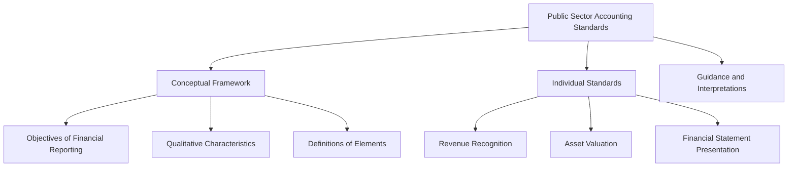

## 7.3.1 Overview of PSAS

Public Sector Accounting Standards (PSAS) are a set of guidelines and principles designed to govern financial reporting in the public sector in Canada. These standards are essential for ensuring transparency, accountability, and comparability in the financial statements of public sector entities, which include federal, provincial, territorial, and local governments, as well as government organizations and agencies. Understanding PSAS is crucial for CPA candidates, as these standards play a significant role in the financial reporting landscape of Canada.

### Introduction to Public Sector Accounting Standards

Public Sector Accounting Standards are developed and maintained by the Public Sector Accounting Board (PSAB), which operates under the auspices of the Chartered Professional Accountants of Canada (CPA Canada). The PSAB's mission is to serve the public interest by establishing high-quality accounting standards for the public sector, thereby enhancing the credibility and reliability of financial reporting.

#### Importance of PSAS

PSAS are vital for several reasons:

1. **Transparency and Accountability**: PSAS ensure that public sector entities provide clear and comprehensive financial information, which is critical for maintaining public trust and accountability.

2. **Comparability**: By standardizing financial reporting, PSAS allow for the comparison of financial statements across different public sector entities, facilitating better decision-making by stakeholders.

3. **Decision-Making**: Accurate and reliable financial information is essential for government officials, policymakers, and the public to make informed decisions regarding resource allocation and policy implementation.

4. **Compliance and Regulation**: Adhering to PSAS helps public sector entities comply with legal and regulatory requirements, reducing the risk of financial mismanagement and fraud.

### Key Features of PSAS

PSAS are designed to address the unique characteristics and needs of the public sector. Some of the key features include:

- **Accrual Basis of Accounting**: PSAS require the use of accrual accounting, which recognizes revenues and expenses when they are incurred, regardless of when cash transactions occur. This approach provides a more accurate picture of an entity's financial position and performance.

- **Budgetary Reporting**: PSAS emphasize the importance of budgetary reporting, reflecting the public sector's focus on accountability for financial resources and adherence to budgetary constraints.

- **Consolidation**: PSAS provide guidance on the consolidation of financial statements for government entities, ensuring that the financial activities of all controlled entities are reflected in the government's financial reports.

- **Non-Financial Performance Reporting**: PSAS encourage the inclusion of non-financial performance information, such as service delivery outcomes, to provide a more comprehensive view of an entity's performance.

### Structure of PSAS

The structure of PSAS is similar to other accounting standards, with a framework that includes:

- **Conceptual Framework**: The conceptual framework provides the foundation for PSAS, outlining the objectives of financial reporting, the qualitative characteristics of useful financial information, and the definitions of key elements such as assets, liabilities, revenues, and expenses.

- **Individual Standards**: PSAS are organized into individual standards, each addressing specific aspects of financial reporting, such as revenue recognition, asset valuation, and financial statement presentation.

- **Guidance and Interpretations**: In addition to the standards themselves, PSAS include guidance and interpretations to assist public sector entities in applying the standards effectively.

### Core Principles of PSAS

Understanding the core principles of PSAS is essential for CPA candidates. These principles include:

1. **Relevance**: Financial information must be relevant to the decision-making needs of users, providing insights into an entity's financial position, performance, and changes in financial position.

2. **Reliability**: Financial information must be reliable, free from material error and bias, and faithfully represent the economic phenomena it purports to represent.

3. **Comparability**: Financial information should be comparable across different entities and periods, enabling users to identify trends and differences.

4. **Understandability**: Financial information should be presented clearly and concisely, making it understandable to users with a reasonable knowledge of accounting and financial reporting.

### Application of PSAS

PSAS apply to a wide range of public sector entities, including:

- **Federal, Provincial, and Territorial Governments**: These entities are required to prepare financial statements in accordance with PSAS, providing a comprehensive view of their financial activities and position.

- **Local Governments**: Municipalities and other local government entities also apply PSAS to ensure consistent and transparent financial reporting.

- **Government Organizations and Agencies**: Entities such as crown corporations, government boards, and commissions are subject to PSAS, ensuring accountability and transparency in their financial reporting.

### Challenges and Considerations

Implementing PSAS can present several challenges for public sector entities, including:

- **Complexity**: The complexity of PSAS can be challenging for entities with limited accounting expertise or resources.

- **Change Management**: Transitioning to PSAS may require significant changes to accounting systems, processes, and policies, necessitating effective change management strategies.

- **Training and Education**: Ensuring that accounting personnel are adequately trained and knowledgeable about PSAS is critical for successful implementation.

### Practical Examples and Case Studies

To illustrate the application of PSAS, consider the following examples:

- **Case Study 1: Revenue Recognition**: A provincial government receives a grant from the federal government for infrastructure development. Under PSAS, the revenue is recognized when the grant conditions are met, rather than when the cash is received.

- **Case Study 2: Asset Valuation**: A local government acquires a new building for administrative purposes. PSAS require the building to be recorded at its fair value at the time of acquisition, with subsequent depreciation recognized over its useful life.

- **Case Study 3: Consolidation**: A territorial government controls a crown corporation that operates a public utility. PSAS require the financial activities of the crown corporation to be consolidated with the government's financial statements, providing a complete picture of the government's financial position.

### Real-World Applications

In practice, PSAS play a crucial role in the financial management and reporting of public sector entities. For example:

- **Budgeting and Financial Planning**: PSAS provide a framework for preparing and presenting budgets, ensuring that financial plans are aligned with strategic objectives and resource constraints.

- **Performance Measurement**: PSAS support the measurement and reporting of financial and non-financial performance, enabling entities to assess the effectiveness and efficiency of their operations.

- **Accountability and Transparency**: By adhering to PSAS, public sector entities demonstrate accountability and transparency to stakeholders, enhancing public trust and confidence.

### Step-by-Step Guidance for Applying PSAS

For CPA candidates, understanding how to apply PSAS in practice is essential. Consider the following steps:

1. **Identify the Applicable Standards**: Determine which PSAS apply to the specific financial transactions or events being reported.

2. **Analyze the Transactions**: Assess the nature and characteristics of the transactions to ensure they are accounted for in accordance with PSAS.

3. **Prepare Financial Statements**: Use PSAS to prepare financial statements that accurately reflect the entity's financial position, performance, and changes in financial position.

4. **Review and Adjust**: Review the financial statements for compliance with PSAS, making any necessary adjustments to ensure accuracy and completeness.

5. **Disclose Relevant Information**: Provide appropriate disclosures in the financial statements to enhance transparency and provide users with relevant information.

### Diagrams and Visual Aids

To enhance understanding, consider the following diagram illustrating the relationship between key elements of PSAS:

### Best Practices and Common Pitfalls

When applying PSAS, consider the following best practices and common pitfalls:

- **Best Practices**:
  - Stay informed about updates and changes to PSAS.
  - Engage in continuous professional development to enhance understanding of PSAS.
  - Collaborate with other public sector entities to share knowledge and experiences.

- **Common Pitfalls**:
  - Failing to fully understand the requirements of PSAS, leading to non-compliance.
  - Overlooking the importance of non-financial performance reporting.
  - Neglecting to provide adequate disclosures in financial statements.

### References and Additional Resources

For further exploration of PSAS, consider the following resources:

- **CPA Canada**: The official website of CPA Canada provides access to PSAS standards, guidance, and educational materials.

- **Public Sector Accounting Board (PSAB)**: The PSAB website offers information on the development and maintenance of PSAS, as well as resources for public sector entities.

- **International Public Sector Accounting Standards Board (IPSASB)**: While PSAS are specific to Canada, the IPSASB provides international perspectives on public sector accounting standards.

### Summary

In summary, Public Sector Accounting Standards (PSAS) are a critical component of financial reporting in the Canadian public sector. By providing a framework for transparency, accountability, and comparability, PSAS enhance the credibility and reliability of financial information, supporting informed decision-making by stakeholders. For CPA candidates, mastering PSAS is essential for success in the Canadian accounting profession.

## **Ready to Test Your Knowledge?**

**Practice 10 Essential CPA Exam Questions to Master Your Certification**



### What is the primary objective of Public Sector Accounting Standards (PSAS)?

- [x] To ensure transparency and accountability in public sector financial reporting
- [ ] To maximize profits for public sector entities
- [ ] To reduce the complexity of financial reporting
- [ ] To align public sector accounting with private sector standards

> **Explanation:** The primary objective of PSAS is to ensure transparency and accountability in public sector financial reporting, providing stakeholders with reliable and comparable financial information.

### Which accounting basis is required by PSAS for public sector entities?

- [x] Accrual basis
- [ ] Cash basis
- [ ] Modified cash basis
- [ ] Hybrid basis

> **Explanation:** PSAS require the use of the accrual basis of accounting, which recognizes revenues and expenses when they are incurred, providing a more accurate picture of an entity's financial position and performance.

### What is a key feature of PSAS that distinguishes it from private sector accounting standards?

- [x] Emphasis on budgetary reporting
- [ ] Focus on profit maximization
- [ ] Simplified financial statement presentation
- [ ] Exclusion of non-financial performance information

> **Explanation:** A key feature of PSAS is the emphasis on budgetary reporting, reflecting the public sector's focus on accountability for financial resources and adherence to budgetary constraints.

### Which entity is responsible for developing and maintaining PSAS in Canada?

- [x] Public Sector Accounting Board (PSAB)
- [ ] International Accounting Standards Board (IASB)
- [ ] Financial Accounting Standards Board (FASB)
- [ ] Canadian Securities Administrators (CSA)

> **Explanation:** The Public Sector Accounting Board (PSAB) is responsible for developing and maintaining PSAS in Canada, operating under the auspices of CPA Canada.

### What is the role of the conceptual framework in PSAS?

- [x] To provide the foundation for PSAS, outlining objectives and qualitative characteristics
- [ ] To dictate specific accounting treatments for transactions
- [ ] To replace individual standards
- [ ] To simplify financial reporting requirements

> **Explanation:** The conceptual framework provides the foundation for PSAS, outlining the objectives of financial reporting, the qualitative characteristics of useful financial information, and the definitions of key elements.

### Which of the following is a common challenge when implementing PSAS?

- [x] Complexity of the standards
- [ ] Lack of interest from stakeholders
- [ ] Overabundance of financial resources
- [ ] Simplicity of accounting systems

> **Explanation:** The complexity of PSAS can be challenging for entities with limited accounting expertise or resources, requiring effective change management and training.

### How do PSAS enhance comparability in financial reporting?

- [x] By standardizing financial reporting across public sector entities
- [ ] By allowing entities to choose their preferred accounting methods
- [ ] By focusing solely on financial performance
- [ ] By excluding non-financial information

> **Explanation:** PSAS enhance comparability by standardizing financial reporting across public sector entities, enabling stakeholders to compare financial statements and make informed decisions.

### What is a common pitfall when applying PSAS?

- [x] Failing to fully understand the requirements of PSAS
- [ ] Overemphasizing non-financial performance
- [ ] Providing excessive disclosures
- [ ] Simplifying financial statements

> **Explanation:** A common pitfall is failing to fully understand the requirements of PSAS, which can lead to non-compliance and inaccurate financial reporting.

### True or False: PSAS apply only to federal and provincial governments in Canada.

- [ ] True
- [x] False

> **Explanation:** False. PSAS apply to a wide range of public sector entities, including federal, provincial, territorial, and local governments, as well as government organizations and agencies.

### Which of the following is an example of a non-financial performance measure encouraged by PSAS?

- [x] Service delivery outcomes
- [ ] Net profit margin
- [ ] Return on investment
- [ ] Earnings per share

> **Explanation:** PSAS encourage the inclusion of non-financial performance information, such as service delivery outcomes, to provide a more comprehensive view of an entity's performance.


