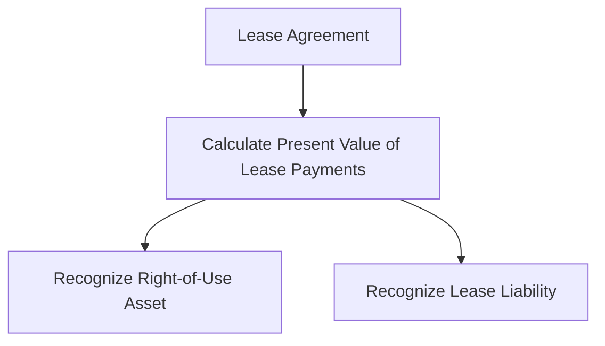
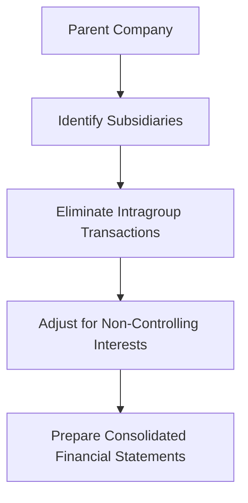

## 7.4.2 Leases and Consolidations

In the realm of financial reporting, leases and consolidations represent complex accounting issues that are crucial for Chartered Professional Accountants (CPAs) to master. This section delves into the intricacies of accounting for lease agreements and the consolidation of financial statements, providing a comprehensive guide for CPA candidates. Understanding these topics is essential not only for passing the CPA exams but also for applying this knowledge in professional practice.

### Understanding Leases in Accounting

Leases are contractual agreements where one party, the lessor, grants the right to use an asset to another party, the lessee, for a specified period in exchange for payment. Accounting for leases involves recognizing and measuring lease-related assets and liabilities on the balance sheet, impacting financial statements significantly.

#### IFRS 16: Leases

The International Financial Reporting Standard (IFRS) 16, which became effective in January 2019, revolutionized lease accounting by requiring lessees to recognize most leases on their balance sheets. This standard aims to increase transparency and comparability among companies by providing a more accurate representation of a company's financial position.

##### Key Concepts of IFRS 16

- **Lease Definition:** A contract that conveys the right to control the use of an identified asset for a period in exchange for consideration.
- **Recognition and Measurement:** Lessees must recognize a right-of-use asset and a lease liability at the lease commencement date.
- **Lease Liability:** Measured at the present value of lease payments not yet paid, discounted using the interest rate implicit in the lease or the lessee's incremental borrowing rate.
- **Right-of-Use Asset:** Initially measured at cost, which includes the initial measurement of the lease liability, lease payments made at or before the commencement date, and any initial direct costs.

##### Practical Example

Consider a company that leases office space for five years with annual payments of $100,000. The interest rate implicit in the lease is 5%. The present value of the lease payments is calculated, and the company recognizes a right-of-use asset and a lease liability on its balance sheet.

##### Impact on Financial Statements

- **Balance Sheet:** Right-of-use assets and lease liabilities are recognized, affecting asset and liability balances.
- **Income Statement:** Depreciation of the right-of-use asset and interest on the lease liability are recognized, impacting net income.
- **Cash Flow Statement:** Lease payments are split into principal and interest components, affecting operating and financing cash flows.

#### Accounting Standards for Private Enterprises (ASPE) 3065: Leases

In Canada, private enterprises may follow ASPE 3065, which provides different guidance compared to IFRS 16. Under ASPE, leases are classified as either capital or operating leases, with distinct accounting treatments.

##### Key Differences from IFRS 16

- **Classification:** Leases are classified as capital or operating based on specific criteria, such as transfer of ownership, bargain purchase options, lease term, and present value of lease payments.
- **Recognition:** Capital leases result in asset and liability recognition, similar to IFRS 16, while operating leases do not appear on the balance sheet.
- **Expense Recognition:** Operating lease payments are recognized as expenses on a straight-line basis over the lease term.

##### Example Scenario

A private company leases equipment for three years with annual payments of $50,000. The lease is classified as an operating lease under ASPE, and the company recognizes lease expenses on a straight-line basis.

### Consolidation of Financial Statements

Consolidation involves combining the financial statements of a parent company and its subsidiaries into a single set of financial statements. This process provides a comprehensive view of the financial position and performance of the entire group.

#### IFRS 10: Consolidated Financial Statements

IFRS 10 establishes principles for presenting consolidated financial statements when an entity controls one or more other entities.

##### Key Principles of IFRS 10

- **Control Definition:** An investor controls an investee when it has power over the investee, exposure to variable returns, and the ability to use its power to affect those returns.
- **Consolidation Procedures:** Combine like items of assets, liabilities, equity, income, expenses, and cash flows of the parent and its subsidiaries.
- **Non-Controlling Interests:** Present separately in the consolidated statement of financial position and statement of profit or loss.

##### Consolidation Process

1. **Identify Subsidiaries:** Determine entities controlled by the parent.
2. **Eliminate Intragroup Transactions:** Remove transactions and balances between group entities.
3. **Adjust for Non-Controlling Interests:** Allocate profit or loss and equity to non-controlling interests.

##### Practical Example

A parent company owns 80% of a subsidiary. The subsidiary reports revenue of $1,000,000 and expenses of $800,000. The parent consolidates these figures, eliminating any intragroup sales and adjusting for the 20% non-controlling interest.

#### ASPE 1591: Subsidiaries

For private enterprises, ASPE 1591 provides guidance on accounting for subsidiaries, allowing for either consolidation or equity method accounting.

##### Key Considerations

- **Consolidation vs. Equity Method:** Enterprises can choose to consolidate subsidiaries or account for them using the equity method.
- **Disclosure Requirements:** Entities must disclose the accounting policy for subsidiaries and provide relevant financial information.

### Practical Applications and Challenges

#### Real-World Applications

- **Lease Accounting:** Companies must carefully assess lease contracts to determine the appropriate accounting treatment under IFRS 16 or ASPE 3065.
- **Consolidation:** Businesses with complex group structures must ensure accurate consolidation to provide a true and fair view of the financial position.

#### Common Challenges

- **Lease Classification:** Determining whether a lease is a finance or operating lease can be complex, requiring judgment and careful analysis.
- **Intragroup Transactions:** Eliminating intragroup transactions can be challenging, especially in large, diversified groups.

#### Strategies for Success

- **Thorough Analysis:** Conduct detailed reviews of lease agreements and group structures to ensure compliance with accounting standards.
- **Regular Updates:** Stay informed about changes in accounting standards and best practices to maintain accurate financial reporting.

### Exam Preparation Tips

- **Understand Key Concepts:** Focus on the definitions and recognition criteria for leases and consolidations under IFRS and ASPE.
- **Practice Calculations:** Work through examples of lease liability calculations and consolidation adjustments to reinforce understanding.
- **Review Case Studies:** Analyze case studies to apply theoretical knowledge to practical scenarios, enhancing problem-solving skills.

### Conclusion

Mastering the accounting for leases and consolidations is essential for CPA candidates, as these topics are integral to financial reporting and are frequently tested on the exams. By understanding the principles and applying them to real-world scenarios, candidates can enhance their exam performance and prepare for successful careers in accounting.

## **Ready to Test Your Knowledge?**

**Practice 10 Essential CPA Exam Questions to Master Your Certification**



### Which standard governs lease accounting under IFRS?

- [x] IFRS 16
- [ ] IFRS 15
- [ ] IFRS 9
- [ ] IFRS 10

> **Explanation:** IFRS 16 is the standard that governs lease accounting, requiring lessees to recognize most leases on the balance sheet.

### What is the primary difference between IFRS 16 and ASPE 3065 regarding lease classification?

- [x] IFRS 16 requires most leases to be recognized on the balance sheet, while ASPE 3065 allows for operating leases to be off-balance sheet.
- [ ] IFRS 16 does not require lease recognition on the balance sheet.
- [ ] ASPE 3065 requires all leases to be recognized on the balance sheet.
- [ ] There is no difference between IFRS 16 and ASPE 3065.

> **Explanation:** IFRS 16 requires lessees to recognize most leases on the balance sheet, whereas ASPE 3065 allows operating leases to remain off-balance sheet.

### Under IFRS 10, what is a key indicator of control over an investee?

- [x] Power over the investee
- [ ] Ownership of more than 50% of shares
- [ ] Ability to appoint the CEO
- [ ] Financial dependency

> **Explanation:** Control is defined by having power over the investee, exposure to variable returns, and the ability to affect those returns.

### In the consolidation process, what must be eliminated?

- [x] Intragroup transactions
- [ ] Non-controlling interests
- [ ] External liabilities
- [ ] Parent company equity

> **Explanation:** Intragroup transactions must be eliminated to avoid double counting in consolidated financial statements.

### How are non-controlling interests presented in consolidated financial statements?

- [x] Separately in the statement of financial position and profit or loss
- [ ] Combined with parent equity
- [ ] As a liability
- [ ] Not presented

> **Explanation:** Non-controlling interests are presented separately to show the portion of equity not attributable to the parent company.

### What is the initial measurement of a right-of-use asset under IFRS 16?

- [x] Cost, including the initial measurement of the lease liability
- [ ] Fair value
- [ ] Present value of future lease payments
- [ ] Historical cost

> **Explanation:** The right-of-use asset is initially measured at cost, which includes the lease liability and any initial direct costs.

### What is the impact of lease accounting on the cash flow statement under IFRS 16?

- [x] Lease payments are split into principal and interest components
- [ ] Lease payments are fully recognized as operating expenses
- [ ] Lease payments are recognized as financing activities only
- [ ] Lease payments do not affect the cash flow statement

> **Explanation:** Under IFRS 16, lease payments are divided into principal and interest, affecting both operating and financing cash flows.

### Which method can private enterprises use under ASPE 1591 for accounting for subsidiaries?

- [x] Consolidation or equity method
- [ ] Only consolidation
- [ ] Only equity method
- [ ] Proportional consolidation

> **Explanation:** ASPE 1591 allows private enterprises to choose between consolidation and the equity method for accounting for subsidiaries.

### True or False: Under IFRS 16, all leases must be recognized on the balance sheet.

- [x] True
- [ ] False

> **Explanation:** IFRS 16 requires most leases to be recognized on the balance sheet, with few exceptions for short-term and low-value leases.

### True or False: Intragroup transactions are included in consolidated financial statements.

- [ ] True
- [x] False

> **Explanation:** Intragroup transactions are eliminated in consolidated financial statements to prevent double counting.


