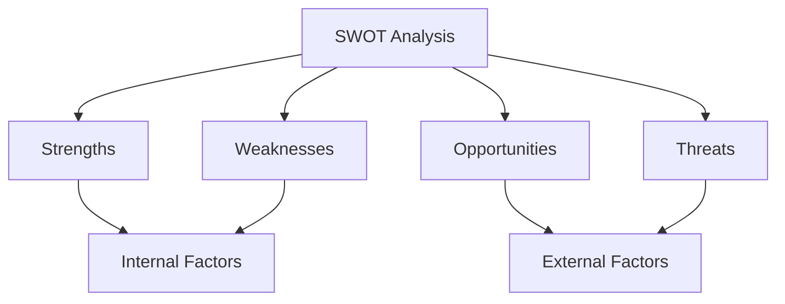

## 8.1.1 SWOT Analysis

### Introduction to SWOT Analysis

SWOT Analysis is a strategic planning tool used to identify and evaluate the Strengths, Weaknesses, Opportunities, and Threats involved in a project or business venture. This framework is crucial for Chartered Professional Accountants (CPAs) in Canada, as it aids in strategic decision-making and enhances the ability to navigate complex business environments. Understanding SWOT Analysis is not only vital for the CPA exam but also for practical application in the accounting profession.

### Understanding the Components of SWOT Analysis

#### Strengths

Strengths refer to the internal attributes and resources that an organization or individual can leverage to achieve its objectives. For CPAs, strengths might include a strong understanding of financial reporting standards, proficiency in data analysis, or a robust professional network. Identifying strengths allows accountants to capitalize on what they do best, enhancing their competitive advantage.

**Example:** A CPA firm with a team of highly skilled auditors and a reputation for integrity can leverage these strengths to attract more clients and secure larger contracts.

#### Weaknesses

Weaknesses are internal factors that may hinder an organization or individual's ability to achieve its goals. For CPAs, weaknesses might include a lack of expertise in emerging technologies, limited experience in certain industries, or inadequate resources for professional development. Recognizing weaknesses is crucial for developing strategies to mitigate them and improve overall performance.

**Example:** A CPA lacking proficiency in the latest accounting software may struggle to efficiently manage client accounts, leading to potential errors and decreased client satisfaction.

#### Opportunities

Opportunities are external factors that an organization or individual can exploit to its advantage. For CPAs, opportunities might include new regulatory changes, technological advancements, or emerging markets that require specialized accounting services. Identifying opportunities allows accountants to position themselves strategically and capitalize on favorable conditions.

**Example:** The increasing demand for sustainability reporting presents an opportunity for CPAs to offer specialized services in environmental accounting and reporting.

#### Threats

Threats are external factors that could negatively impact an organization or individual's ability to achieve its objectives. For CPAs, threats might include economic downturns, increased competition, or changes in tax legislation. Understanding threats is essential for developing contingency plans and minimizing potential risks.

**Example:** A new competitor entering the market with lower pricing could threaten a CPA firm's client base and profitability.

### Conducting a SWOT Analysis

Conducting a SWOT Analysis involves a systematic approach to identifying and evaluating each component. Here is a step-by-step guide for CPAs:

1. **Gather Information:** Collect data on the internal and external factors affecting the organization or individual. This may include financial statements, market research, industry reports, and feedback from stakeholders.

2. **Identify Strengths and Weaknesses:** Analyze internal resources, capabilities, and processes to determine strengths and weaknesses. Consider factors such as expertise, technology, financial resources, and organizational culture.

3. **Identify Opportunities and Threats:** Examine external factors such as market trends, regulatory changes, and competitive dynamics to identify opportunities and threats. Consider the broader economic, social, and technological environment.

4. **Develop Strategies:** Use the insights gained from the SWOT Analysis to develop strategic initiatives. Focus on leveraging strengths, addressing weaknesses, capitalizing on opportunities, and mitigating threats.

5. **Implement and Monitor:** Implement the strategies and continuously monitor the environment for changes. Adjust the strategies as needed to ensure ongoing alignment with organizational goals.

### Practical Applications of SWOT Analysis for CPAs

#### Strategic Planning

SWOT Analysis is a critical tool for strategic planning in accounting. It helps CPAs align their services with market demands, optimize resource allocation, and enhance competitive positioning. By understanding their strengths and weaknesses, CPAs can develop targeted strategies to improve service delivery and client satisfaction.

**Case Study:** A CPA firm conducted a SWOT Analysis and identified a growing demand for forensic accounting services. By leveraging their expertise in fraud detection and investigation, the firm expanded its service offerings and captured a new market segment.

#### Risk Management

SWOT Analysis aids in identifying potential risks and developing mitigation strategies. By understanding threats and weaknesses, CPAs can proactively address vulnerabilities and enhance organizational resilience.

**Example:** A CPA identified a threat from regulatory changes affecting tax compliance. By staying informed and adapting their services to meet new requirements, they minimized the impact on their clients and maintained compliance.

#### Performance Improvement

SWOT Analysis provides insights into areas for improvement, enabling CPAs to enhance their performance and achieve better outcomes. By addressing weaknesses and leveraging strengths, CPAs can optimize processes and deliver higher-quality services.

**Example:** A CPA firm identified a weakness in their client communication processes. By implementing new communication tools and training staff, they improved client engagement and satisfaction.

### SWOT Analysis in the Context of the CPA Exam

Understanding SWOT Analysis is essential for CPA candidates, as it is a key component of strategic management and decision-making. The CPA exam may test candidates' ability to conduct a SWOT Analysis, interpret its findings, and develop strategic recommendations.

#### Exam Preparation Tips

- **Familiarize Yourself with the Framework:** Understand the components of SWOT Analysis and how they interrelate. Practice identifying strengths, weaknesses, opportunities, and threats in various scenarios.

- **Apply Real-World Examples:** Use case studies and real-world examples to practice conducting SWOT Analyses. This will help you understand how to apply the framework in different contexts.

- **Develop Strategic Thinking Skills:** Practice developing strategic recommendations based on SWOT Analysis findings. Focus on creating actionable strategies that address identified issues and capitalize on opportunities.

- **Review CPA Canada Resources:** Utilize resources provided by CPA Canada, such as study guides and practice exams, to reinforce your understanding of SWOT Analysis and its application in the accounting profession.

### Conclusion

SWOT Analysis is a powerful tool for CPAs, enabling them to make informed strategic decisions and enhance their professional practice. By understanding and applying SWOT Analysis, CPAs can identify opportunities for growth, mitigate risks, and improve their overall performance. As a CPA candidate, mastering SWOT Analysis will not only help you succeed in the exam but also prepare you for a successful career in accounting.

### Visual Representation of SWOT Analysis

To further enhance your understanding, here is a visual representation of the SWOT Analysis framework:

### Best Practices for Conducting SWOT Analysis

- **Involve Key Stakeholders:** Engage team members and stakeholders in the SWOT Analysis process to gain diverse perspectives and insights.

- **Be Objective:** Maintain objectivity when identifying strengths and weaknesses. Avoid overestimating capabilities or underestimating challenges.

- **Prioritize Findings:** Focus on the most critical strengths, weaknesses, opportunities, and threats. Prioritize issues that have the greatest impact on strategic objectives.

- **Regularly Update the Analysis:** Conduct SWOT Analysis regularly to account for changes in the internal and external environment. This ensures that strategies remain relevant and effective.

### Common Pitfalls and How to Avoid Them

- **Overlooking External Factors:** Ensure that you thoroughly analyze external factors, as they can significantly impact strategic decisions.

- **Failing to Act on Findings:** Develop actionable strategies based on SWOT Analysis findings. Avoid conducting the analysis without implementing changes.

- **Being Too General:** Be specific when identifying strengths, weaknesses, opportunities, and threats. Vague or broad statements may not provide actionable insights.

### References and Additional Resources

- CPA Canada: [CPA Competency Map](https://www.cpacanada.ca/en/become-a-cpa/cpa-professional-education-program-becoming-a-cpa/cpa-competency-map)
- International Financial Reporting Standards (IFRS): [IFRS Foundation](https://www.ifrs.org/)
- Accounting Standards for Private Enterprises (ASPE): [CPA Canada ASPE](https://www.cpacanada.ca/en/business-and-accounting-resources/accounting-and-financial-reporting/aspe)

### Ready to Test Your Knowledge?

**Practice 10 Essential CPA Exam Questions to Master Your Certification**



### What does SWOT stand for in strategic planning?

- [x] Strengths, Weaknesses, Opportunities, Threats
- [ ] Strategy, Work, Objectives, Tactics
- [ ] Systems, Workflow, Operations, Targets
- [ ] Solutions, Weaknesses, Options, Trends

> **Explanation:** SWOT stands for Strengths, Weaknesses, Opportunities, and Threats, which are the key components of this strategic analysis tool.

### Which of the following is considered an internal factor in SWOT Analysis?

- [x] Strengths
- [x] Weaknesses
- [ ] Opportunities
- [ ] Threats

> **Explanation:** Strengths and weaknesses are internal factors, while opportunities and threats are external factors in SWOT Analysis.

### How can CPAs use SWOT Analysis in strategic planning?

- [x] To identify areas for improvement
- [x] To capitalize on market opportunities
- [ ] To ignore external threats
- [ ] To avoid addressing weaknesses

> **Explanation:** CPAs use SWOT Analysis to identify areas for improvement, capitalize on opportunities, and address weaknesses and threats.

### What is a common pitfall when conducting a SWOT Analysis?

- [x] Overlooking external factors
- [ ] Involving stakeholders
- [ ] Being specific
- [ ] Regularly updating the analysis

> **Explanation:** A common pitfall is overlooking external factors, which can significantly impact strategic decisions.

### Which of the following is an example of a threat in SWOT Analysis?

- [x] New competitor entering the market
- [ ] Strong brand reputation
- [ ] Skilled workforce
- [ ] Advanced technology

> **Explanation:** A new competitor entering the market is an external threat that could negatively impact an organization's objectives.

### Why is it important to prioritize findings in a SWOT Analysis?

- [x] To focus on the most critical issues
- [ ] To avoid making any changes
- [ ] To generalize the analysis
- [ ] To ignore stakeholder input

> **Explanation:** Prioritizing findings helps focus on the most critical issues that have the greatest impact on strategic objectives.

### How often should a SWOT Analysis be updated?

- [x] Regularly, to account for changes
- [ ] Once a year
- [ ] Only when problems arise
- [ ] Never, after the initial analysis

> **Explanation:** SWOT Analysis should be updated regularly to ensure strategies remain relevant and effective in a changing environment.

### What is the primary purpose of conducting a SWOT Analysis?

- [x] To develop strategic initiatives
- [ ] To eliminate all weaknesses
- [ ] To focus solely on strengths
- [ ] To ignore external opportunities

> **Explanation:** The primary purpose is to develop strategic initiatives by leveraging strengths, addressing weaknesses, capitalizing on opportunities, and mitigating threats.

### Which component of SWOT Analysis involves examining market trends?

- [ ] Strengths
- [ ] Weaknesses
- [x] Opportunities
- [ ] Threats

> **Explanation:** Opportunities involve examining external factors like market trends that can be exploited to an organization's advantage.

### True or False: SWOT Analysis is only useful for large organizations.

- [ ] True
- [x] False

> **Explanation:** False. SWOT Analysis is a versatile tool that can be used by organizations of all sizes and individuals for strategic planning.


