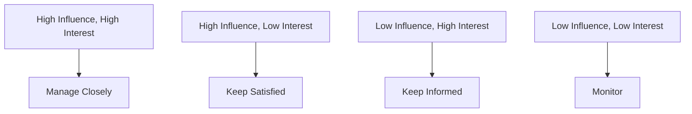

## 8.2.2 Stakeholder Management

In the realm of corporate governance, stakeholder management is a critical component that ensures the alignment of an organization's objectives with the interests of its stakeholders. As a Chartered Professional Accountant (CPA), understanding and managing these relationships is essential to fostering trust, ensuring compliance, and driving organizational success. This section delves into the intricacies of stakeholder management, providing you with the knowledge and tools needed to excel in this area.

### Understanding Stakeholders

Stakeholders are individuals or groups that have an interest or stake in the success and operations of an organization. They can be internal, such as employees and management, or external, such as investors, customers, suppliers, regulators, and the community. Each stakeholder group has unique interests and expectations, which can sometimes conflict with one another. Effective stakeholder management involves identifying these stakeholders, understanding their needs, and developing strategies to engage and communicate with them effectively.

#### Types of Stakeholders

1. **Internal Stakeholders:**
   - **Employees:** They seek job security, fair compensation, and a positive work environment.
   - **Management:** Focused on achieving organizational goals, profitability, and maintaining operational efficiency.

2. **External Stakeholders:**
   - **Investors and Shareholders:** Interested in financial returns, corporate governance, and transparency.
   - **Customers:** Demand quality products/services, fair pricing, and excellent customer service.
   - **Suppliers:** Seek long-term partnerships and timely payments.
   - **Regulators:** Ensure compliance with laws and regulations.
   - **Community and Society:** Concerned with corporate social responsibility and ethical practices.

### The Role of CPAs in Stakeholder Management

As a CPA, you play a pivotal role in stakeholder management by providing accurate financial information, ensuring compliance with accounting standards, and advising on strategic decisions. Your expertise in financial reporting, risk management, and ethical practices positions you as a trusted advisor to both internal and external stakeholders.

#### Key Responsibilities of CPAs in Stakeholder Management

- **Financial Reporting:** Delivering transparent and accurate financial statements that meet the needs of investors and regulators.
- **Risk Management:** Identifying and mitigating risks that could impact stakeholders.
- **Strategic Planning:** Assisting in the development of strategies that align with stakeholder interests.
- **Ethical Conduct:** Upholding ethical standards to build trust and credibility with stakeholders.

### Stakeholder Identification and Analysis

The first step in effective stakeholder management is identifying who your stakeholders are and understanding their influence and interest in the organization. This involves conducting a stakeholder analysis, which can be broken down into several key steps:

1. **Identify Stakeholders:** List all potential stakeholders, both internal and external.
2. **Assess Stakeholder Interests:** Understand what each stakeholder group wants from the organization.
3. **Evaluate Stakeholder Influence:** Determine the power and influence each stakeholder has over the organization.
4. **Prioritize Stakeholders:** Rank stakeholders based on their influence and interest to focus efforts on the most critical relationships.

#### Stakeholder Mapping

Stakeholder mapping is a visual tool that helps in categorizing stakeholders based on their level of interest and influence. This can be represented in a matrix format:

- **Manage Closely:** High influence and high interest stakeholders require active engagement and management.
- **Keep Satisfied:** High influence but low interest stakeholders should be kept satisfied to prevent them from becoming more interested.
- **Keep Informed:** Low influence but high interest stakeholders should be kept informed to maintain their support.
- **Monitor:** Low influence and low interest stakeholders require minimal effort but should be monitored for changes.

### Developing Stakeholder Engagement Strategies

Once stakeholders are identified and analyzed, the next step is to develop strategies for engaging with them. Effective engagement involves clear communication, building relationships, and addressing stakeholder concerns.

#### Communication Strategies

- **Tailored Messaging:** Customize communication based on stakeholder needs and preferences.
- **Regular Updates:** Provide consistent and timely updates on organizational performance and changes.
- **Feedback Mechanisms:** Establish channels for stakeholders to provide feedback and voice concerns.

#### Relationship Building

- **Trust and Transparency:** Foster trust through honest and transparent communication.
- **Collaboration:** Engage stakeholders in decision-making processes to build a sense of ownership and partnership.
- **Conflict Resolution:** Address conflicts promptly and fairly to maintain positive relationships.

### Case Studies and Real-World Applications

To illustrate the importance of stakeholder management, consider the following case studies:

#### Case Study 1: Managing Investor Relations

A Canadian manufacturing company faced declining investor confidence due to poor financial performance. The CPA team implemented a comprehensive stakeholder management strategy, including transparent financial reporting and regular investor briefings. By addressing investor concerns and demonstrating a clear path to profitability, the company restored investor trust and stabilized its stock price.

#### Case Study 2: Engaging with the Community

A large retail chain expanded into a new region, facing resistance from the local community concerned about environmental impact. The company engaged with community leaders, conducted environmental assessments, and implemented sustainable practices. By involving the community in the decision-making process, the company gained community support and enhanced its corporate social responsibility image.

### Best Practices in Stakeholder Management

- **Proactive Engagement:** Anticipate stakeholder needs and concerns before they arise.
- **Integrated Approach:** Align stakeholder management with overall business strategy and objectives.
- **Continuous Improvement:** Regularly assess and refine stakeholder management practices to adapt to changing environments.

### Challenges and Pitfalls

Stakeholder management is not without its challenges. Common pitfalls include:

- **Misalignment of Interests:** Conflicting stakeholder interests can lead to tension and conflict.
- **Lack of Communication:** Poor communication can result in misunderstandings and mistrust.
- **Inadequate Resources:** Insufficient resources can hinder effective stakeholder engagement.

### Strategies for Overcoming Challenges

- **Conflict Resolution Techniques:** Utilize negotiation and mediation skills to resolve stakeholder conflicts.
- **Enhanced Communication Channels:** Invest in technology and platforms that facilitate effective communication.
- **Resource Allocation:** Prioritize resources to focus on high-impact stakeholder relationships.

### Regulatory Considerations

In Canada, CPAs must adhere to various regulations and standards that impact stakeholder management. These include:

- **International Financial Reporting Standards (IFRS):** Ensure financial transparency and accountability.
- **Canadian Securities Administrators (CSA):** Compliance with securities regulations for investor protection.
- **CPA Code of Professional Conduct:** Uphold ethical standards in all stakeholder interactions.

### Conclusion

Stakeholder management is a vital aspect of corporate governance that requires a strategic and proactive approach. As a CPA, your role in managing stakeholder relationships is crucial to ensuring organizational success and sustainability. By understanding stakeholder needs, developing effective engagement strategies, and adhering to ethical and regulatory standards, you can build strong, trust-based relationships that drive positive outcomes for all parties involved.

---

## **Ready to Test Your Knowledge?**

**Practice 10 Essential CPA Exam Questions to Master Your Certification**



### Which of the following is an example of an internal stakeholder?

- [x] Employees
- [ ] Customers
- [ ] Suppliers
- [ ] Regulators

> **Explanation:** Employees are considered internal stakeholders as they are directly involved in the organization's operations.

### What is the primary interest of investors as stakeholders?

- [x] Financial returns
- [ ] Product quality
- [ ] Job security
- [ ] Environmental impact

> **Explanation:** Investors are primarily interested in financial returns and the financial health of the organization.

### In stakeholder mapping, which category requires the most active engagement?

- [x] High Influence, High Interest
- [ ] High Influence, Low Interest
- [ ] Low Influence, High Interest
- [ ] Low Influence, Low Interest

> **Explanation:** Stakeholders with high influence and high interest require active engagement to ensure their needs are met.

### What is a key responsibility of CPAs in stakeholder management?

- [x] Financial Reporting
- [ ] Product Development
- [ ] Marketing Strategies
- [ ] Human Resources

> **Explanation:** CPAs are responsible for financial reporting, which is crucial for transparency and stakeholder trust.

### Which of the following is a communication strategy for stakeholder engagement?

- [x] Tailored Messaging
- [ ] Ignoring Feedback
- [ ] Delayed Updates
- [ ] One-size-fits-all Communication

> **Explanation:** Tailored messaging ensures that communication is relevant and effective for each stakeholder group.

### What is a common pitfall in stakeholder management?

- [x] Misalignment of Interests
- [ ] Overcommunication
- [ ] Excessive Resources
- [ ] Unnecessary Transparency

> **Explanation:** Misalignment of interests can lead to conflicts and challenges in stakeholder management.

### Which regulatory body impacts stakeholder management in Canada?

- [x] Canadian Securities Administrators (CSA)
- [ ] Food and Drug Administration (FDA)
- [ ] Environmental Protection Agency (EPA)
- [ ] Federal Communications Commission (FCC)

> **Explanation:** The CSA regulates securities and impacts how organizations manage investor relations.

### What is a benefit of engaging stakeholders in decision-making?

- [x] Building a sense of ownership
- [ ] Increasing operational costs
- [ ] Reducing transparency
- [ ] Limiting feedback

> **Explanation:** Engaging stakeholders in decision-making fosters ownership and collaboration.

### Which of the following is a strategy for overcoming stakeholder management challenges?

- [x] Conflict Resolution Techniques
- [ ] Ignoring Stakeholder Concerns
- [ ] Reducing Communication
- [ ] Limiting Resources

> **Explanation:** Conflict resolution techniques help address and resolve stakeholder conflicts effectively.

### True or False: Stakeholder management is only concerned with external stakeholders.

- [ ] True
- [x] False

> **Explanation:** Stakeholder management involves both internal and external stakeholders, addressing their diverse needs and interests.


