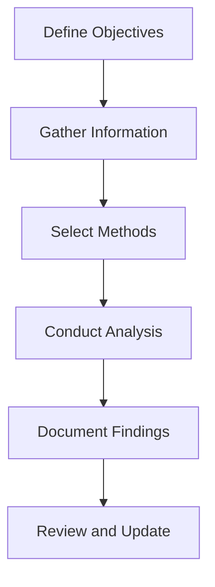

## 8.3.1 Identifying Risks

In the dynamic world of business, identifying risks is a crucial skill for Chartered Professional Accountants (CPAs). As a CPA candidate, understanding how to recognize potential risks in business operations is essential for both your exam success and your future career. This section will provide you with a comprehensive guide to identifying risks, covering various methodologies, practical examples, and real-world applications relevant to the Canadian accounting profession.

### Understanding Risk in Business Operations

Risk in business operations refers to the potential for events or conditions that could negatively impact an organization's ability to achieve its objectives. These risks can arise from various sources, including financial uncertainties, legal liabilities, strategic management errors, accidents, and natural disasters. Identifying these risks is the first step in managing them effectively.

#### Types of Risks

1. **Strategic Risks**: These are risks that affect an organization's long-term goals and strategy. They can arise from changes in the competitive landscape, technological advancements, or shifts in consumer preferences.

2. **Operational Risks**: These risks are associated with the day-to-day operations of a business. They can include supply chain disruptions, equipment failures, or human errors.

3. **Financial Risks**: Financial risks involve the potential for financial loss due to market fluctuations, credit risks, or liquidity issues.

4. **Compliance Risks**: These risks arise from the need to comply with laws, regulations, and standards. Non-compliance can lead to legal penalties and reputational damage.

5. **Reputational Risks**: These risks are related to the potential damage to an organization's reputation, which can affect customer trust and loyalty.

6. **Environmental Risks**: These involve the potential impact of environmental factors, such as natural disasters or changes in environmental regulations.

### Methods for Identifying Risks

Identifying risks involves a systematic approach to uncover potential threats to an organization's objectives. Here are some common methods used in risk identification:

#### 1. Brainstorming

Brainstorming sessions involve gathering a group of stakeholders to discuss potential risks. This method encourages creative thinking and can uncover risks that may not be immediately obvious. 

**Example**: A manufacturing company might hold a brainstorming session with its production team to identify risks related to equipment maintenance and supply chain disruptions.

#### 2. SWOT Analysis

SWOT (Strengths, Weaknesses, Opportunities, Threats) analysis is a strategic planning tool that helps identify internal and external factors that could impact an organization. 

**Example**: A retail company might use SWOT analysis to identify threats from new market entrants or changes in consumer behavior.

#### 3. Risk Checklists

Risk checklists are predefined lists of potential risks that can be used as a starting point for risk identification. They are particularly useful for ensuring that common risks are not overlooked.

**Example**: A financial institution might use a risk checklist to identify common financial risks such as credit defaults or interest rate fluctuations.

#### 4. Scenario Analysis

Scenario analysis involves envisioning different future scenarios and assessing the risks associated with each. This method helps organizations prepare for a range of possible outcomes.

**Example**: An energy company might conduct scenario analysis to assess risks related to fluctuating oil prices or regulatory changes.

#### 5. Interviews and Surveys

Conducting interviews and surveys with employees, customers, and other stakeholders can provide valuable insights into potential risks. This method allows for the collection of diverse perspectives.

**Example**: A healthcare provider might survey its staff to identify risks related to patient safety and data privacy.

#### 6. Historical Data Analysis

Analyzing historical data can help identify patterns and trends that indicate potential risks. This method is particularly useful for identifying recurring risks.

**Example**: An airline might analyze past incident reports to identify risks related to flight safety and maintenance.

#### 7. Expert Judgment

Consulting with experts in the field can provide valuable insights into potential risks. Experts can offer a deep understanding of industry-specific risks and emerging threats.

**Example**: A technology company might consult cybersecurity experts to identify risks related to data breaches and cyberattacks.

### Practical Examples and Case Studies

To illustrate the application of these risk identification methods, let's explore some practical examples and case studies relevant to the Canadian accounting profession.

#### Case Study 1: Identifying Financial Risks in a Canadian Bank

A major Canadian bank conducted a comprehensive risk identification exercise to uncover potential financial risks. The bank used a combination of historical data analysis and expert judgment to identify risks related to credit defaults, interest rate fluctuations, and foreign exchange volatility. By analyzing past financial data and consulting with financial analysts, the bank was able to develop a risk management strategy that included hedging against currency risks and diversifying its loan portfolio.

#### Case Study 2: Operational Risk Identification in a Manufacturing Company

A Canadian manufacturing company faced operational risks related to supply chain disruptions and equipment failures. The company held brainstorming sessions with its production team and used risk checklists to identify potential risks. By implementing preventive maintenance schedules and diversifying its supplier base, the company was able to mitigate these risks and ensure smooth operations.

#### Case Study 3: Compliance Risk Identification in a Healthcare Provider

A healthcare provider in Canada conducted interviews and surveys with its staff to identify compliance risks related to patient data privacy and healthcare regulations. The provider used the insights gained from these surveys to implement data protection measures and staff training programs, reducing the risk of non-compliance and enhancing patient trust.

### Real-World Applications and Regulatory Scenarios

In the Canadian accounting profession, identifying risks is not only crucial for exam preparation but also for real-world applications. CPAs play a vital role in helping organizations navigate complex regulatory environments and manage risks effectively.

#### Regulatory Compliance

CPAs must be well-versed in Canadian accounting standards and regulations, such as the International Financial Reporting Standards (IFRS) and Accounting Standards for Private Enterprises (ASPE). Identifying compliance risks involves staying up-to-date with changes in regulations and assessing their impact on financial reporting and business operations.

#### Financial Reporting

In financial reporting, CPAs must identify risks related to revenue recognition, asset valuation, and financial disclosures. Understanding these risks is essential for ensuring accurate and transparent financial statements.

#### Audit and Assurance

In audit and assurance engagements, CPAs must identify risks related to audit planning, evidence collection, and reporting. This involves assessing the risk of material misstatement and designing audit procedures to address these risks.

### Step-by-Step Guidance for Risk Identification

To effectively identify risks, follow these step-by-step guidelines:

1. **Define Objectives**: Clearly define the objectives of the risk identification process. Understand what you aim to achieve and the scope of the assessment.

2. **Gather Information**: Collect relevant information from various sources, including financial statements, operational reports, and stakeholder feedback.

3. **Select Methods**: Choose appropriate risk identification methods based on the organization's context and the nature of the risks.

4. **Conduct Analysis**: Use the selected methods to analyze potential risks. Consider both internal and external factors that could impact the organization.

5. **Document Findings**: Record the identified risks, including their potential impact and likelihood. Use risk registers or risk matrices to organize the information.

6. **Review and Update**: Regularly review and update the risk identification process to account for changes in the business environment and emerging risks.

### Diagrams and Visuals

To enhance your understanding of risk identification, consider the following diagram that illustrates the risk identification process:

### Best Practices and Common Pitfalls

**Best Practices**:

- **Engage Stakeholders**: Involve a diverse group of stakeholders in the risk identification process to gain multiple perspectives.
- **Use Multiple Methods**: Combine different risk identification methods to ensure a comprehensive assessment.
- **Stay Informed**: Keep up-to-date with industry trends and regulatory changes to identify emerging risks.

**Common Pitfalls**:

- **Overlooking External Risks**: Focusing solely on internal risks can lead to a narrow assessment. Consider external factors such as market trends and regulatory changes.
- **Neglecting Documentation**: Failing to document identified risks can hinder effective risk management. Maintain detailed records of the risk identification process.
- **Ignoring Low-Probability Risks**: Even low-probability risks can have significant impacts. Assess all potential risks, regardless of their likelihood.

### References and Additional Resources

For further exploration of risk identification, consider the following resources:

- **CPA Canada**: Offers guidance on risk management and compliance with Canadian accounting standards.
- **International Financial Reporting Standards (IFRS)**: Provides a framework for financial reporting and risk assessment.
- **Accounting Standards for Private Enterprises (ASPE)**: Offers guidelines for financial reporting in private enterprises.

### Summary

Identifying risks is a critical skill for CPAs, enabling them to help organizations navigate uncertainties and achieve their objectives. By understanding various risk identification methods and applying them in real-world scenarios, you can enhance your exam preparation and professional practice. Remember to engage stakeholders, use multiple methods, and stay informed about industry trends and regulations.

## **Ready to Test Your Knowledge?**

**Practice 10 Essential CPA Exam Questions to Master Your Certification**



### What is the primary purpose of risk identification in business operations?

- [x] To uncover potential threats to an organization's objectives
- [ ] To eliminate all risks from business operations
- [ ] To prioritize financial risks over other types of risks
- [ ] To focus solely on internal risks

> **Explanation:** The primary purpose of risk identification is to uncover potential threats to an organization's objectives, allowing for effective risk management.

### Which method involves gathering a group of stakeholders to discuss potential risks?

- [x] Brainstorming
- [ ] SWOT Analysis
- [ ] Scenario Analysis
- [ ] Historical Data Analysis

> **Explanation:** Brainstorming involves gathering a group of stakeholders to discuss potential risks, encouraging creative thinking and diverse perspectives.

### What does SWOT stand for in SWOT Analysis?

- [x] Strengths, Weaknesses, Opportunities, Threats
- [ ] Strategies, Weaknesses, Opportunities, Tactics
- [ ] Strengths, Weaknesses, Objectives, Tactics
- [ ] Strategies, Weaknesses, Objectives, Threats

> **Explanation:** SWOT stands for Strengths, Weaknesses, Opportunities, and Threats, which are key factors in strategic planning.

### Which method uses predefined lists of potential risks?

- [x] Risk Checklists
- [ ] Scenario Analysis
- [ ] Expert Judgment
- [ ] Interviews and Surveys

> **Explanation:** Risk checklists use predefined lists of potential risks, ensuring that common risks are not overlooked.

### What is the role of expert judgment in risk identification?

- [x] To provide insights into industry-specific risks and emerging threats
- [ ] To eliminate the need for other risk identification methods
- [ ] To focus solely on financial risks
- [ ] To prioritize internal risks over external risks

> **Explanation:** Expert judgment provides insights into industry-specific risks and emerging threats, offering valuable expertise in risk identification.

### Which type of risk is associated with day-to-day operations?

- [x] Operational Risks
- [ ] Strategic Risks
- [ ] Financial Risks
- [ ] Compliance Risks

> **Explanation:** Operational risks are associated with the day-to-day operations of a business, such as supply chain disruptions and equipment failures.

### What is a common pitfall in risk identification?

- [x] Overlooking external risks
- [ ] Engaging stakeholders
- [ ] Using multiple methods
- [ ] Staying informed about industry trends

> **Explanation:** A common pitfall in risk identification is overlooking external risks, which can lead to a narrow assessment.

### Which diagram best represents the risk identification process?

- [x] A flowchart illustrating the steps from defining objectives to reviewing and updating
- [ ] A pie chart showing the distribution of different types of risks
- [ ] A bar graph comparing risk likelihood and impact
- [ ] A scatter plot of risk factors

> **Explanation:** A flowchart illustrating the steps from defining objectives to reviewing and updating best represents the risk identification process.

### True or False: Identifying risks involves eliminating all potential risks.

- [ ] True
- [x] False

> **Explanation:** False. Identifying risks involves uncovering potential threats, not eliminating all risks, as some risks may be inherent and unavoidable.

### What is the benefit of using multiple risk identification methods?

- [x] To ensure a comprehensive assessment of potential risks
- [ ] To focus solely on financial risks
- [ ] To eliminate the need for stakeholder engagement
- [ ] To prioritize internal risks over external risks

> **Explanation:** Using multiple risk identification methods ensures a comprehensive assessment of potential risks, covering various perspectives and factors.


