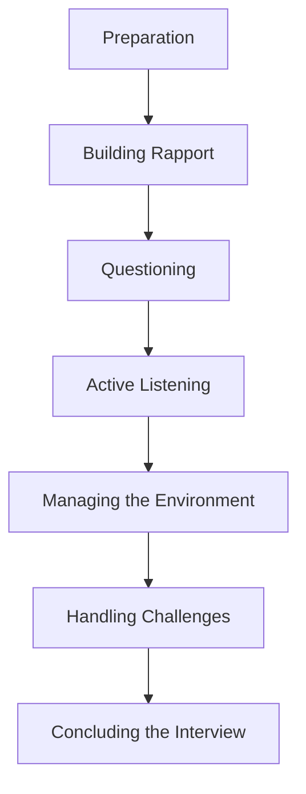

## 11.1 Principles of Effective Interviewing

In the realm of forensic accounting and fraud examination, interviewing is a critical skill that can significantly impact the outcome of an investigation. Effective interviewing requires a blend of technical knowledge, psychological insight, and communication skills. This section will explore the principles of effective interviewing, providing you with the tools and techniques necessary to conduct successful interviews in the context of forensic accounting.

### Understanding the Purpose of Interviews

Interviews in forensic accounting serve multiple purposes, including gathering information, assessing the credibility of witnesses, and obtaining admissions or confessions. The primary goal is to collect accurate and reliable information that can aid in the investigation and support the findings.

### Key Principles of Effective Interviewing

#### 1. Preparation and Planning

Preparation is the cornerstone of effective interviewing. Before conducting an interview, it is essential to:

- **Understand the Case Context:** Familiarize yourself with the details of the case, including the nature of the fraud, the individuals involved, and any relevant documents or evidence.
- **Set Clear Objectives:** Define the purpose of the interview and what you hope to achieve. This could include clarifying facts, obtaining explanations, or identifying inconsistencies.
- **Develop a Questioning Strategy:** Plan the sequence and type of questions you will ask. Consider using open-ended questions to encourage detailed responses and closed-ended questions for specific information.

#### 2. Building Rapport

Establishing a rapport with the interviewee is crucial for creating a comfortable environment where they feel safe to share information. Techniques for building rapport include:

- **Active Listening:** Show genuine interest in the interviewee's responses by maintaining eye contact, nodding, and providing verbal affirmations.
- **Empathy and Understanding:** Demonstrate empathy by acknowledging the interviewee's feelings and perspectives. This can help build trust and encourage openness.
- **Professionalism and Respect:** Treat the interviewee with respect and maintain a professional demeanor throughout the interview.

#### 3. Effective Questioning Techniques

The art of questioning is central to effective interviewing. Key techniques include:

- **Open-Ended Questions:** Encourage the interviewee to provide detailed responses and elaborate on their answers. For example, "Can you describe what happened on the day of the incident?"
- **Closed-Ended Questions:** Use these to obtain specific information or confirm details. For example, "Did you authorize this transaction?"
- **Probing Questions:** Follow up on initial responses to gain deeper insights. For example, "Can you explain why you felt that way?"
- **Clarifying Questions:** Ensure understanding by asking for clarification. For example, "When you say 'they,' who are you referring to?"

#### 4. Active Listening and Observation

Active listening involves fully concentrating on what the interviewee is saying, understanding their message, and responding appropriately. Key components include:

- **Listening for Content and Emotion:** Pay attention to both the factual content and the emotional tone of the interviewee's responses.
- **Observing Non-Verbal Cues:** Monitor body language, facial expressions, and gestures, as these can provide additional insights into the interviewee's feelings and truthfulness.

#### 5. Managing the Interview Environment

The physical and psychological environment can influence the success of an interview. Considerations include:

- **Location and Setting:** Choose a neutral, quiet, and comfortable location that minimizes distractions and interruptions.
- **Timing and Duration:** Schedule the interview at a convenient time for the interviewee and allow sufficient time to cover all necessary topics without rushing.
- **Privacy and Confidentiality:** Ensure the interviewee understands that the information shared will be treated confidentially, within the bounds of the investigation.

#### 6. Handling Difficult Interviewees

Interviewers may encounter challenging interviewees who are uncooperative, evasive, or hostile. Strategies for managing such situations include:

- **Remaining Calm and Composed:** Maintain a calm demeanor and avoid reacting emotionally to provocations.
- **Reframing Questions:** If an interviewee is evasive, rephrase questions to elicit more direct responses.
- **Using Silence Effectively:** Allow pauses in the conversation to encourage the interviewee to fill the silence with additional information.

#### 7. Ethical Considerations

Ethical conduct is paramount in forensic accounting interviews. Key ethical principles include:

- **Honesty and Integrity:** Be truthful and transparent about the purpose of the interview and the use of the information gathered.
- **Respect for Rights:** Respect the interviewee's rights, including their right to refuse to answer questions or to have legal representation.
- **Avoiding Coercion:** Do not use threats, intimidation, or coercion to obtain information.

### Practical Examples and Case Studies

To illustrate these principles, consider the following scenarios:

#### Example 1: Interviewing a Suspected Fraudster

In a case involving suspected embezzlement, the forensic accountant prepares by reviewing financial records and identifying discrepancies. During the interview, they build rapport by discussing the interviewee's role and responsibilities in the organization. By using open-ended questions, they encourage the interviewee to explain their actions and decisions, while observing non-verbal cues for signs of deception.

#### Example 2: Interviewing a Witness

In a case of financial statement fraud, a witness interview is conducted to gather information about the company's accounting practices. The interviewer prepares by understanding the witness's relationship to the case and the information they are likely to possess. Through effective questioning and active listening, the interviewer uncovers inconsistencies in the witness's account, leading to further investigation.

### Real-World Applications and Regulatory Scenarios

In Canada, forensic accountants must adhere to professional standards and guidelines set by organizations such as CPA Canada. Interviews must be conducted in compliance with legal and ethical standards, ensuring that the information gathered is admissible in court. Understanding the Canadian legal framework and privacy laws is essential for conducting interviews that withstand legal scrutiny.

### Step-by-Step Guidance for Conducting Interviews

1. **Preparation:**
   - Review all relevant case materials and evidence.
   - Identify the interviewee's role and potential information they may provide.
   - Develop a structured interview plan with key questions and objectives.

2. **Building Rapport:**
   - Begin the interview with introductions and a brief explanation of the interview's purpose.
   - Use small talk to ease tension and establish a connection with the interviewee.

3. **Questioning:**
   - Start with open-ended questions to gather broad information.
   - Use probing and clarifying questions to explore specific areas of interest.
   - Conclude with closed-ended questions to confirm key details.

4. **Active Listening:**
   - Focus on the interviewee's words and emotions.
   - Take notes to capture important points and follow up on inconsistencies.

5. **Managing the Environment:**
   - Ensure the interview setting is conducive to open communication.
   - Address any concerns the interviewee may have about confidentiality or the interview process.

6. **Handling Challenges:**
   - Stay composed in the face of difficult interviewees.
   - Use techniques such as silence and reframing to encourage cooperation.

7. **Concluding the Interview:**
   - Summarize the key points discussed and clarify any remaining questions.
   - Thank the interviewee for their time and cooperation.
   - Document the interview thoroughly, including observations and insights.

### Diagrams and Visual Aids

To enhance understanding, consider the following diagram illustrating the interview process:

### Best Practices, Common Pitfalls, and Strategies

**Best Practices:**

- **Maintain Objectivity:** Approach each interview without preconceived notions or biases.
- **Adaptability:** Be flexible in your questioning approach based on the interviewee's responses.
- **Documentation:** Keep detailed records of the interview, including notes on non-verbal cues and observations.

**Common Pitfalls:**

- **Leading Questions:** Avoid questions that suggest a particular answer or bias the interviewee's response.
- **Interruptions:** Allow the interviewee to complete their thoughts without interruption.
- **Overlooking Non-Verbal Cues:** Pay attention to body language and other non-verbal signals that may indicate deception or discomfort.

**Strategies to Overcome Challenges:**

- **Use Empathy:** Demonstrate understanding and empathy to build trust and encourage openness.
- **Reframe Questions:** If an interviewee is uncooperative, rephrase questions to elicit more information.
- **Silence as a Tool:** Use pauses strategically to prompt the interviewee to provide additional details.

### References and Additional Resources

- **CPA Canada:** Guidelines and standards for forensic accounting practices.
- **International Financial Reporting Standards (IFRS):** Relevant sections for understanding financial reporting and fraud detection.
- **Canadian Legal Framework:** Privacy laws and regulations affecting forensic accounting interviews.

### Encouragement and Exam Strategies

Effective interviewing is a skill that can be developed through practice and experience. As you prepare for the Canadian Accounting Exams, focus on mastering the principles outlined in this section. Practice conducting mock interviews, analyze case studies, and review relevant legal and ethical guidelines. Remember, effective interviewing is not just about asking questions—it's about listening, observing, and understanding the interviewee's perspective.

---

## **Ready to Test Your Knowledge?**



### Which of the following is a key principle of effective interviewing in forensic accounting?

- [x] Preparation and Planning
- [ ] Aggressive Questioning
- [ ] Ignoring Non-Verbal Cues
- [ ] Rushing the Interview

> **Explanation:** Preparation and planning are essential for conducting effective interviews, allowing the interviewer to set clear objectives and develop a questioning strategy.

### What is the primary goal of building rapport with an interviewee?

- [x] To create a comfortable environment for sharing information
- [ ] To intimidate the interviewee
- [ ] To establish dominance over the interviewee
- [ ] To confuse the interviewee

> **Explanation:** Building rapport helps create a comfortable environment where the interviewee feels safe to share information, fostering openness and trust.

### Which type of question is used to obtain specific information?

- [ ] Open-Ended Questions
- [x] Closed-Ended Questions
- [ ] Probing Questions
- [ ] Clarifying Questions

> **Explanation:** Closed-ended questions are used to obtain specific information or confirm details, often requiring a simple yes or no answer.

### Why is active listening important in interviews?

- [x] It helps understand both the content and emotion of the interviewee's responses
- [ ] It allows the interviewer to interrupt the interviewee
- [ ] It is only important for recording responses
- [ ] It helps the interviewer to dominate the conversation

> **Explanation:** Active listening involves understanding both the factual content and the emotional tone of the interviewee's responses, providing deeper insights into their perspective.

### How can an interviewer manage a difficult interviewee?

- [x] By remaining calm and composed
- [ ] By raising their voice
- [ ] By ignoring the interviewee's responses
- [ ] By ending the interview immediately

> **Explanation:** Remaining calm and composed helps manage difficult interviewees, allowing the interviewer to maintain control and encourage cooperation.

### What is a common pitfall to avoid during interviews?

- [x] Leading Questions
- [ ] Open-Ended Questions
- [ ] Active Listening
- [ ] Building Rapport

> **Explanation:** Leading questions suggest a particular answer or bias the interviewee's response, which can compromise the integrity of the information gathered.

### Which strategy can be used to encourage an uncooperative interviewee to provide more information?

- [x] Reframing Questions
- [ ] Ignoring the Interviewee
- [ ] Using Threats
- [ ] Ending the Interview

> **Explanation:** Reframing questions can help elicit more information from an uncooperative interviewee by presenting the question in a different way.

### What should be considered when managing the interview environment?

- [x] Location and Setting
- [ ] The Interviewer's Dominance
- [ ] The Interviewee's Weaknesses
- [ ] The Interviewer's Personal Preferences

> **Explanation:** The location and setting should be neutral, quiet, and comfortable to facilitate open communication and minimize distractions.

### Why is it important to document interviews thoroughly?

- [x] To capture important points and observations
- [ ] To intimidate the interviewee
- [ ] To confuse the interviewee
- [ ] To establish dominance over the interviewee

> **Explanation:** Thorough documentation captures important points and observations, ensuring that the information gathered is accurate and reliable for the investigation.

### True or False: Ethical considerations are not important in forensic accounting interviews.

- [ ] True
- [x] False

> **Explanation:** Ethical considerations are crucial in forensic accounting interviews, ensuring that the interview is conducted with honesty, integrity, and respect for the interviewee's rights.


